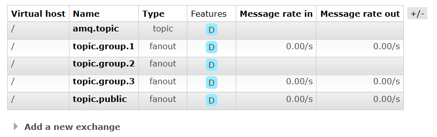
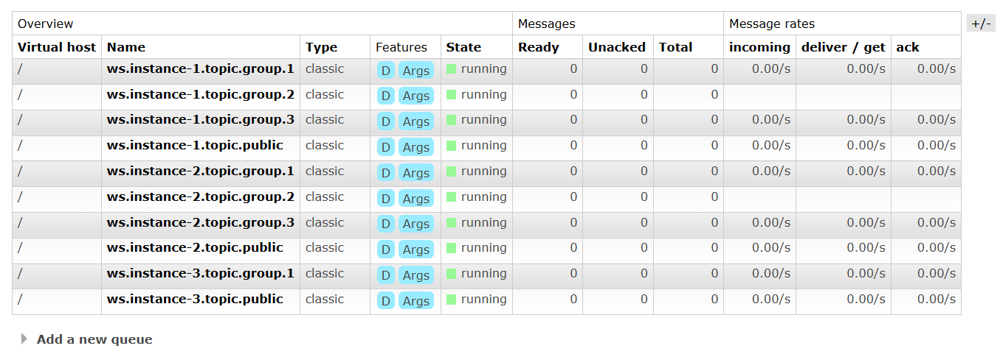

# Chat application

A simple chat application using Spring Boot + WebSocket

Ref:

- https://www.callicoder.com/spring-boot-websocket-chat-example/
- Cursor AI
- Github Copilot

I will mainly use Cursor editor (before 11/12/2025) or Github Copilot (after 11/12/2025) to help me to code, my main responsibilities are:

- Prompt
- Review code

## Local setup

After starting Postgres, should run DB migration first:

```sh
make db.migrate
```

### Not using docker (not recommended)

Requirements:

- Install Java 25
- Install PostgreSQL 18, start it, then create a new database `chatdb`
- Install Redis and start it
- Install RabbitMQ and start it

Copy FE to Spring Boot static resources:

```bash
cd chat-app-frontend
npm install
npm run build:spring
cd ..
```

Start BE: use one of these methods. I usually use both: first for instance1, and second for instance2:

1. Build and run spring app: `mvn spring-boot:run`
2. Build and run jar file:
   - Build jar first: `mvn clean package`
   - Then start multiple instance: [run-multiple-instances](#run-multiple-instances)

### Using docker for all for production

Start all in docker: `make start`

Stop all: `make stop`

### Using docker for infra only, and build static FE + run BE locally for development

We can start only infra services (Postgres, Redis, RabbitMQ) in docker, and start Chat App from IDE or terminal for debugging:

```sh
make start.deps
make build.fe
make run.local
```

Then access app at: http://localhost:9010

Stop all: `make stop`

### Using docker for infra only, and run both FE + BE locally for development

```sh
make start.deps
make run.be      # Terminal 1: start BE
make run.fe      # Terminal 2: start FE
```

Then access app at: http://localhost:3000

## Run Multiple Instances

Build the Application. This creates: target/chat-app-0.0.1-SNAPSHOT.jar

```sh
mvn clean package
```

Terminal 1 - Instance 1:

```bash
java -jar target/chat-app-0.0.1-SNAPSHOT.jar \
  --server.port=9010 \
  --spring.application.instance-id=instance-1
```

Terminal 2 - Instance 2:

```bash
java -jar target/chat-app-0.0.1-SNAPSHOT.jar \
  --server.port=9011 \
  --spring.application.instance-id=instance-2
```

Terminal 3 - Instance 3 (optional):

```bash
java -jar target/chat-app-0.0.1-SNAPSHOT.jar \
  --server.port=9012 \
  --spring.application.instance-id=instance-3
```

## Hybrid broker using RabbitMQ: Queue per instance, WebSocket per user

Stack: Single Spring Boot app (ChatAppApplication) using MVC + STOMP-over-WebSocket

Concepts:

- Các instance sẽ dùng chung exchange. Mỗi 1 destination sẽ có 1 exchange kiểu Fanout
- Mỗi 1 instance sẽ chỉ có 1 queue và 1 listener cho 1 destination.
- Queue chỉ liên quan đến instance, còn user chỉ liên quan đến WebSocket connection.
  - Do đó chỉ cần tạo queue khi user đầu tiên đến subscribe (gửi lệnh `StompCommand.SUBSCRIBE`) đến 1 destination nào đó
  - Các destination khác cũng vậy, user nào đến subscribe đầu tiên sẽ tạo queue tương ứng
  - Listener của queue KHÔNG quan tâm đến users, nó chỉ quan tâm đến destination của broker. Nó chỉ forward message tới destination đó, KHÔNG quan tâm ai có quyền xem message
  - Khi user subscribe 1 destination của broker, thì broker phải check user có trong nhóm không rồi mới cho phép subscribe (xem [phần 4 ở trên](#4-how-the-broker-knows-which-users-to-forward-to))
- Việc tạo exchange/queue sẽ chỉ được thực hiện khi user đầu tiên connect đến server và join group. Các user khác đến sau sẽ không tạo mới nữa

Flow đơn giản khi dùng RabbitMQ:

- Giả sử có 3 instance: 1,2,3. Chỉ có 1 exchange1 và 3 queue 1,2,3 cho mỗi instance
- Khi user1 gửi 1 message tới instance1, nó sẽ push vào exchange1 RabbitMQ
- exchange1 sẽ forward message tới cả 3 queue1, queue2, queue3
- Các listener1, listener2, listener3 nhận được message
- Các listener lại forward tới in-memory broker, trừ listener1 sẽ KHÔNG forward tới broker, vì listener1 check được message đó được gửi gửi instance1, nên nó sẽ skip
- In-memory broker của instance2 và instance3 forward message tới các WebSocket connection (tới từng user)

Luôn phải send message tới 2 chỗ:

- `messagingTemplate.convertAndSend(destination, response)`: gửi tới in-memory broker: các user khác kết nối tới cùng instance của sender sẽ nhận được message luôn
- `rabbitMQBrokerHandler.publishToRabbitMQ(destination, response)`: gửi tới RabbitMQ cho các user kết nối tới instance khác. Message sẽ phải đi qua RabbitMQ nên sẽ chậm hơn xíu

Phía Rabbit Lister sẽ phải gửi message tới in-memory broker để nó forward tới các user qua WebSocket:

- `messagingTemplate.convertAndSend(destination, response)`

Túm lại:

- User gửi message đến server (instance1)
- Nhảy vào controller của Spring boot
- Controller gửi message đến in-memory broker và RabbitMQ
- In-memory broker sẽ forward message tới các user đang connect tới instance1
- RabbitMQ sẽ gửi message tới exchange --> queue --> listener của các instance khác
- Listener sẽ gửi message đến in-memory broker
- In-memory broker sẽ forward message tới các user đang connect tới instance đó

### Test in local

- Run 3 instance ở 3 port 9010, 9011, 9012
- Dùng 3 account login vào từng instance: http://localhost:9010, http://localhost:9011, http://localhost:9012
- Sau đó mỗi account vào tất cả các group để nhắn tin. Hiện tại có 4 group
- 4 exchange được tạo như sau:

  

- Với mỗi instance, ta sẽ tạo 4 queue tương ứng cho từng exchange

  

- Ở hình trên, riêng user ở instance 3 mới vào 2 nhóm (public và group1, do đó nó mới chỉ tạo 2 queue)
- Dù có thêm bao nhiêu user thì số lượng exchange vào queue vẫn chỉ có vậy. Tối đa
  - `Số exchange = số group`
  - `Số queue = số group * số instance`

## Using `.env` file for running spring boot app

Example command in Makefile: `@export $$(cat .env 2>/dev/null | grep -v '^#' | xargs) && ./mvnw spring-boot:run`

**Breakdown:**

- `@` - Makefile syntax to suppress echoing the command
- `export` - Sets environment variables for the current shell session
- `$$(...)` - Double `$$` in Makefile becomes single `$` for command substitution
- `cat .env 2>/dev/null` - Reads .env file, suppressing errors if it doesn't exist
- `grep -v '^#'` - Filters out comment lines (starting with `#`)
- `xargs` - Converts the output into space-separated arguments for export
- `&&` - Only runs the next command if the previous succeeds
- `./mvnw spring-boot:run` - Executes the Maven wrapper to start Spring Boot

**Example:**

If .env contains:

```
# Database config
DB_HOST=localhost
DB_PORT=5432
```

The command effectively runs:

```bash
export DB_HOST=localhost DB_PORT=5432 && ./mvnw spring-boot:run
```

This makes those variables available to the Spring Boot application at runtime.

## TODO

Fix issue:

- Running 2 instance
- Open 2 tab in the same browser, each tab accesses each instance
- Login one tab, then the other will be logged out. Why?
