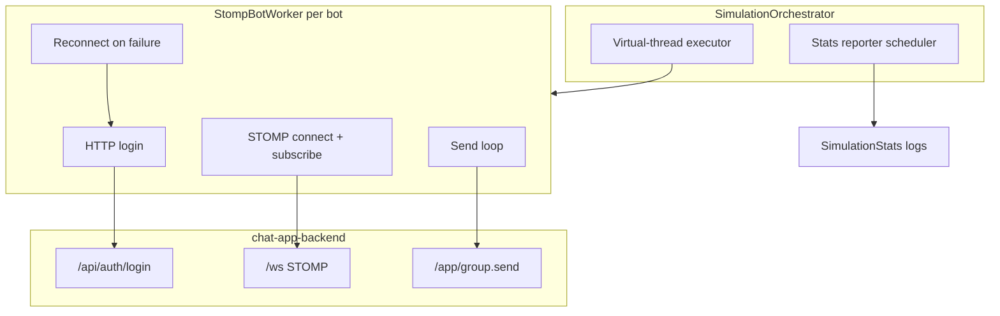

# Bot Simulator

Standalone Spring Boot application (`bot-simulator/`) that load-tests the chat backend by simulating many concurrent users over WebSocket STOMP.

## Design Overview



### Components

| Component                 | Role                                                                                                                       |
| ------------------------- | -------------------------------------------------------------------------------------------------------------------------- |
| `BotSimulatorApplication` | Spring Boot entry point; loads `SimulatorProperties`.                                                                      |
| `SimulationOrchestrator`  | Starts on boot: spawns one `StompBotWorker` per bot on a **virtual-thread** executor and schedules periodic stats logging. |
| `StompBotWorker`          | One simulated user: login, connect, subscribe, send messages in a loop, reconnect on errors.                               |
| `ChatHttpSessionClient`   | HTTP client for `/api/auth/login`; captures `JSESSIONID` for authenticated WebSocket handshake.                            |
| `WebSocketClientConfig`   | SockJS + STOMP client with Jackson converter and 10s heartbeats.                                                           |
| `SimulationStats`         | Counters for connected bots, sent/failed messages, and connect failures.                                                   |

### Scaling model

- **One bot = one virtual thread.** Default config targets up to 1000 bots (`u1`–`u1000`), which is practical because virtual threads are lightweight.
- **Startup spread** (`startup-spread-ms`) staggers bot connections so they do not all hit the backend at once.
- **Send jitter** (`send-jitter-ms`) randomizes inter-message delay to avoid perfectly synchronized bursts.

## How Bots Work

Each `StompBotWorker` runs this lifecycle until the process shuts down:

1. **Startup jitter** — random delay up to `startup-spread-ms`.
2. **HTTP login** — `POST /api/auth/login` with `{ username, password }`; store session cookie (`JSESSIONID`).
3. **STOMP connect** — open SockJS WebSocket at `{base-url}{ws-endpoint}` (default `http://localhost:9010/ws`) with the session cookie.
4. **Subscribe** — register no-op handlers on group and user-scoped topics (see below).
5. **Send loop** — repeatedly:
   - pick a random target group ID from `target-group-ids`
   - `SEND /app/group.send` with `{ groupId, content }`
   - sleep `send-interval-ms + random(0..send-jitter-ms)`
6. **Reconnect** — on connect/send failure, increment failure counters, disconnect if needed, sleep `reconnect-delay-ms`, then return to step 2.

Subscriptions are **no-op consumers**: the simulator generates outbound load; reading inbound frames is optional but keeps the client session realistic (same destinations a real chat client would use).

### Message payload

```json
{
  "groupId": 3,
  "content": "Load test message | bot=7 | <random faker content>"
}
```

### Message content generation

Each message body is built as:

```
{messagePrefix} | bot={n} | {topic content}
```

`StompBotWorker` uses [JavaFaker](https://github.com/DiUS/java-faker) to vary payload shape during load tests. For every send:

1. Pick one of **10 topics** at random.
2. Pick a random target length between **1 and 100** characters.
3. Generate phrases from the selected topic and concatenate until the target length is reached.
4. Truncate to the target length if the concatenated text is longer.

| Index | Topic                | Example shape              |
| ----- | -------------------- | -------------------------- |
| 0     | hacker               | ingverb + adjective + noun |
| 1     | lorem                | 3-word sentence            |
| 2     | company              | catch phrase               |
| 3     | book                 | title + author             |
| 4     | food                 | dish + ingredient          |
| 5     | music                | instrument + genre         |
| 6     | animal               | animal name                |
| 7     | cat                  | name + breed               |
| 8     | programming language | language name              |
| 9     | weather              | weather description        |

Constants live in `StompBotWorker`: `TOPIC_COUNT = 10`, `MAX_MESSAGE_LENGTH = 100`.

### Backend validation (why seeding matters)

`WebSocketController.sendGroupMessage` requires:

1. An authenticated user in the WebSocket session (from HTTP session at handshake).
2. The group exists.
3. The user is a **participant** of that group.

If any check fails, the send is rejected (`NotFoundException`, `ForbiddenException`, or auth error). Bots will log send/connect failures and keep retrying, but **no successful load is produced** without valid users, groups, and memberships.

## STOMP Destinations

### Subscriptions (per bot)

| Destination                            | Scope                                       | Purpose                                                                                 |
| -------------------------------------- | ------------------------------------------- | --------------------------------------------------------------------------------------- |
| `/topic/group.{groupId}`               | One per configured `target-group-ids` entry | Receives broadcast messages for that group chat (same as the frontend chat view).       |
| `/topic/user.{username}.group-updates` | One per bot                                 | Receives sidebar summary updates when any group the user belongs to gets a new message. |

Example for bot `u42` targeting groups `1` and `2`:

- `/topic/group.1`
- `/topic/group.2`
- `/topic/user.u42.group-updates`

### Outbound send

| Destination       | Payload                                  | Backend handler                                                                                                                               |
| ----------------- | ---------------------------------------- | --------------------------------------------------------------------------------------------------------------------------------------------- |
| `/app/group.send` | `{ "groupId": long, "content": string }` | `WebSocketController.sendGroupMessage` → persists message, publishes to `/topic/group.{id}` and fans out `/topic/user.{member}.group-updates` |

The simulator does **not** send to `/app/chat.send` or subscribe to `/topic/public`.

## Prerequisites: Seed Data First

**Seeding is mandatory.** The bot simulator does not create users or groups; it only logs in as existing users and sends to existing groups.

Run seeders in this order from `chat-app-backend` (see [chat-app-backend/src/main/java/com/hello/seed/README.md](../chat-app-backend/src/main/java/com/hello/seed/README.md)):

| Order | Seeder          | What it creates                                                     | Required for bots?                        |
| ----- | --------------- | ------------------------------------------------------------------- | ----------------------------------------- |
| 1     | `UserSeeder`    | `1000` users `u1`–`u1000`, password `5555`                          | **Yes** — bots log in as these users      |
| 2     | `GroupSeeder`   | `100` groups (`Group 1`–`Group 100`), **all users** as participants | **Yes** — bots need groups and membership |
| 3     | `MessageSeeder` | Sample messages in the first groups                                 | No — optional baseline chat history       |

### Alignment checklist

Before starting the simulator, verify:

- [ ] `chat-app-backend` is running and reachable at `simulator.base-url` (default `http://localhost:9010`).
- [ ] `UserSeeder` has been run (at least as many users as `bot-count`).
- [ ] `GroupSeeder` has been run (groups cover all `target-group-ids`).
- [ ] `bot-username-prefix` + index matches seeded usernames (default prefix `u` → `u1`, `u2`, …).
- [ ] `bot-password` matches seeded password (`5555` by default).
- [ ] Every target group ID exists and includes every bot user as a participant (`GroupSeeder` satisfies this when all users are added to all groups).

If `bot-count` exceeds seeded users, or `target-group-ids` reference missing groups, expect `connectFailures` and `failedMessages` in the stats log.

## Configuration

All settings live under the `simulator` prefix in `application.yaml` and can be overridden with environment variables.

| Property                  | Env var                       | Default                    | Description                           |
| ------------------------- | ----------------------------- | -------------------------- | ------------------------------------- |
| `base-url`                | `SIM_BASE_URL`                | `http://localhost:9010`    | Chat backend URL                      |
| `ws-endpoint`             | `SIM_WS_ENDPOINT`             | `/ws`                      | WebSocket STOMP endpoint path         |
| `bot-count`               | `SIM_BOT_COUNT`               | `10`                       | Number of bots (`u1`…`u{n}`)          |
| `bot-username-prefix`     | `SIM_BOT_USERNAME_PREFIX`     | `u`                        | Username prefix                       |
| `bot-password`            | `SIM_BOT_PASSWORD`            | `5555`                     | Login password for all bots           |
| `target-group-ids`        | `SIM_TARGET_GROUP_IDS`        | `1`–`30` (comma-separated) | Groups bots send to                   |
| `message-prefix`          | `SIM_MESSAGE_PREFIX`          | `Load test message`        | Prefix in message content             |
| `send-interval-ms`        | `SIM_SEND_INTERVAL_MS`        | `500`                      | Base delay between sends              |
| `send-jitter-ms`          | `SIM_SEND_JITTER_MS`          | `15500`                    | Random extra delay per send           |
| `startup-spread-ms`       | `SIM_STARTUP_SPREAD_MS`       | `15000`                    | Max random delay before first connect |
| `reconnect-delay-ms`      | `SIM_RECONNECT_DELAY_MS`      | `1500`                     | Delay before reconnect attempt        |
| `connect-timeout-seconds` | `SIM_CONNECT_TIMEOUT_SECONDS` | `10`                       | HTTP login and STOMP connect timeout  |
| `report-interval-seconds` | `SIM_REPORT_INTERVAL_SECONDS` | `5`                        | Stats log interval                    |

Example ramp-up run:

```bash
SIM_BOT_COUNT=100 \
SIM_TARGET_GROUP_IDS=1,2,3,4,5 \
SIM_SEND_INTERVAL_MS=300 \
./mvnw spring-boot:run
```

## Runtime Metrics

Every `report-interval-seconds`, the orchestrator logs:

```
[runtime=120s] connectedBots=98 sentMessages=15420 failedMessages=3 connectFailures=5
```

| Metric            | Meaning                                        |
| ----------------- | ---------------------------------------------- |
| `connectedBots`   | Bots with an active STOMP session right now    |
| `sentMessages`    | Total successful `/app/group.send` calls       |
| `failedMessages`  | Send errors while connected                    |
| `connectFailures` | Failed login/connect cycles (each bot retries) |

## Future Higher-Scale Path

- Drive `bot-count`, `target-group-ids`, and message length from scenario profiles (light / medium / stress).
- Make `TOPIC_COUNT` and `MAX_MESSAGE_LENGTH` configurable via `application.yaml` if load-test scenarios need different bounds.
- Add weighted topic distribution to stress specific content shapes (e.g. longer book titles vs short animal names).
- Optionally use `ChatHttpSessionClient.loginOrRegister` and group-creation APIs for environments without seed data (not used today).
- Export stats to Prometheus or structured JSON for dashboards alongside backend DB, Redis, and RabbitMQ metrics.
