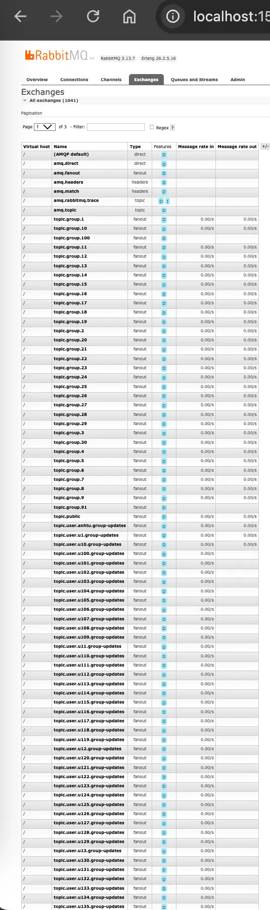
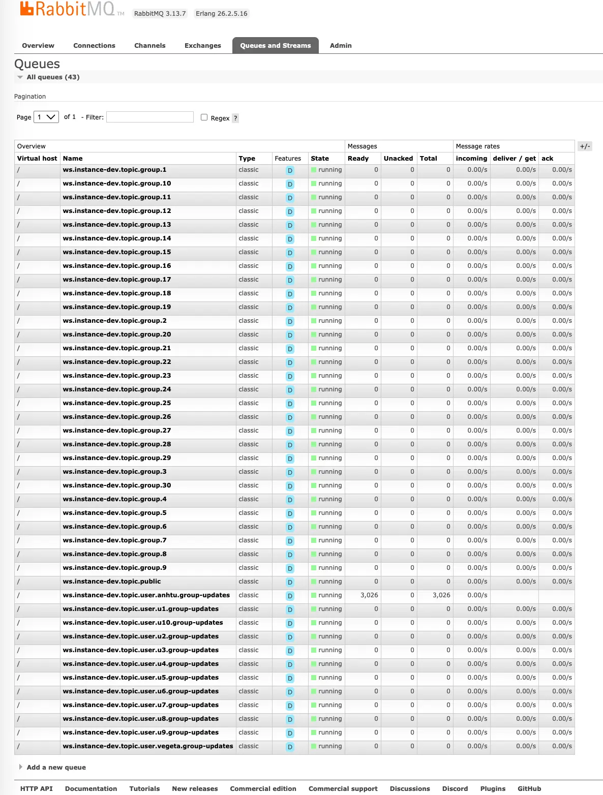

# RabbitMQ Topology Optimization

## Current Problem

The hybrid WebSocket broker uses **one RabbitMQ FanoutExchange per STOMP destination**, with **one durable queue per app instance per destination** (created on first local subscription, deleted on last local unsubscribe).

Mapping is 1:1:

| STOMP destination                 | RabbitMQ exchange                | Per-instance queue (example)                   |
| --------------------------------- | -------------------------------- | ---------------------------------------------- |
| `/topic/public`                   | `topic.public`                   | `ws.instance-1.topic.public`                   |
| `/topic/group.42`                 | `topic.group.42`                 | `ws.instance-1.topic.group.42`                 |
| `/topic/user.alice.group-updates` | `topic.user.alice.group-updates` | `ws.instance-1.topic.user.alice.group-updates` |

After adding per-user group-summary updates (`pushGroupSummaryUpdate` in `WebSocketController`), the destination count grows with **both groups and users**:

- **Exchanges (cumulative, never deleted):** `1 (public) + active_groups + active_users_with_updates`
- **Queues (active only):** `instances × destinations_with_≥1_local_subscriber`

Example with 3 instances, 100 groups, 1,000 users (all connected):

| Resource  | Naive upper bound                 | Realistic active bound                               |
| --------- | --------------------------------- | ---------------------------------------------------- |
| Exchanges | 1 + 100 + 1,000 = **1,101**       | Same (exchanges persist)                             |
| Queues    | 3 × (1 + 100 + 1,000) = **3,303** | 3 × (1 + ~concurrent_group_views + ~connected_users) |

Example with 1 instance, 100 groups, 1,000 users, here is the rabbitMQ exchanges and queues:





Important nuances:

1. **Queues scale with active subscriptions, not total entities.** Users subscribe to one group chat at a time, so group queues per instance ≈ users viewing different groups — not all 100 groups.
2. **Exchanges scale with lifetime activity and never get cleaned up.** `ensureExchangeExists()` declares on subscribe/publish; there is no `deleteExchange`. Idle exchanges from old groups/users remain forever.
3. **Group-updates multiply publish cost.** Each saved group message calls `publishToRabbitMQ()` once per member (`N` publishes for a group of size `N`), each targeting a distinct exchange.
4. **`declareExchange` runs on every publish** (known TODO in `CustomRabbitMQBrokerHandler`) — adds latency under load.
5. **One `SimpleMessageListenerContainer` per active destination per instance** — consumer threads and connection churn grow with active destinations.

For hundreds of groups and thousands of users, this is a **real scaling concern**, though not an immediate RabbitMQ crash. RabbitMQ handles thousands of objects, but this pattern causes:

- Management UI / metrics slowdown at 10k+ objects
- Metadata memory growth from orphan exchanges
- Higher publish latency (per-member fan-out + repeated `declareExchange`)
- Operational pain (debugging topology, migrations, exchange-type changes)

The group-updates feature made the exchange problem **worse** because it added **one exchange per user** on top of **one per group**.

## Possible Solutions

### 1. Consolidated Topic Exchange + dynamic bindings per instance

**How it works**

- Replace many FanoutExchanges with **2–3 fixed Topic exchanges**, e.g.:
  - `chat.public` — routing key `public`
  - `chat.groups` — routing key `group.{groupId}`
  - `chat.user-updates` — routing key `user.{username}.group-updates`
- Each app instance owns **one durable queue** (e.g. `ws.instance-1.inbound`).
- On STOMP SUBSCRIBE, add a **binding** from the instance queue to the topic exchange with the matching routing key.
- On UNSUBSCRIBE (ref-count to zero locally), remove the binding.
- Publisher sends once to the topic exchange with the routing key; only instances with bound subscribers receive the message.

**Pros**

- Exchange count is **O(1)** (2–3), regardless of groups/users.
- Queue count is **O(instances)**, not O(instances × destinations).
- Group-updates: **one publish per member** still happens at the app layer, but all go to the **same exchange** — no exchange proliferation.
- Preserves targeted delivery (instances without subscribers do not receive irrelevant messages).

**Cons**

- Requires refactoring `CustomRabbitMQBrokerHandler` (binding management instead of per-destination queue creation).
- Binding add/remove must be correct under concurrency and instance restarts.
- Topic exchange routing key design must be validated against RabbitMQ binding limits at very large scale.

**Recommendation for our problem:** **Yes** — best balance of correctness and scalability for the current architecture.

### 2. Single Fanout “envelope” exchange per traffic class

**How it works**

- One FanoutExchange per class: `chat.groups.fanout`, `chat.user-updates.fanout`.
- Each instance has **one queue** bound unconditionally at startup.
- Every message is wrapped: `{ "destination": "/topic/group.42", "payload": { ... } }`.
- `DynamicRabbitMQListener` parses the envelope and forwards only if the instance has local subscribers for that destination.

**Pros**

- Simplest topology: **1 exchange + 1 queue per instance** per traffic class.
- No dynamic binding management.
- Eliminates exchange proliferation entirely.

**Cons**

- **Every instance receives every message** in that class, even with zero local subscribers — wasted bandwidth and CPU on large clusters.
- Listener must filter; ref-count map for local subscriptions stays in app memory (already exists today).
- Does not scale well beyond a small number of instances (e.g. 3–5).

**Recommendation for our problem:** **Yes for MVP / small clusters** (≤5 instances). **No** as the long-term design for many instances.

### 3. Spring STOMP Broker Relay (RabbitMQ as STOMP relay)

**How it works**

- Replace the custom `CustomRabbitMQBrokerHandler` + `DynamicRabbitMQListener` with Spring’s built-in **StompBrokerRelay** (`enableStompBrokerRelay("/topic", "/queue")`).
- Spring AMQP relay uses a **standard, well-tested** RabbitMQ topology for STOMP destinations.
- User destinations (`/user/...`) are handled natively by the relay.

**Pros**

- Industry-standard pattern; less custom code to maintain.
- Built-in support for `/topic`, `/queue`, and `/user` routing.
- Could simplify group-updates to `/user/queue/group-updates` (per-user) without manual per-username exchange naming.

**Cons**

- Large migration: remove hybrid SimpleBroker + custom RabbitMQ sync.
- Requires RabbitMQ STOMP plugin or AMQP relay configuration.
- Learning curve and different operational model.
- Must re-validate security interceptors and subscription authorization.

**Recommendation for our problem:** **Yes** if willing to invest in a bigger refactor; **No** for a minimal incremental fix.

### 4. Redis Pub/Sub (or Redis Streams) instead of per-destination RabbitMQ

**How it works**

- Publish to Redis channels keyed by destination: `ws:/topic/group.42`, `ws:/topic/user.alice.group-updates`.
- Each instance subscribes via Redis pattern or per-channel subscriptions managed like today’s ref-count logic.

**Pros**

- Natural fit for fan-out pub/sub; no exchange/queue object explosion.
- Simpler mental model for “broadcast to subscribers.”
- Redis Streams add persistence/replay if needed later.

**Cons**

- Introduces a second broker (or replaces RabbitMQ entirely).
- No built-in STOMP integration — still need instance-level forwarding logic.
- Operational addition unless Redis is already in the stack.

**Recommendation for our problem:** **No** for now (adds infra); **consider** if the team already runs Redis and wants to drop custom RabbitMQ topology entirely.

### 5. Keep per-destination Fanout for groups; consolidate only group-updates

**How it works**

- Leave `/topic/group.{id}` and `/topic/public` as today (one fanout exchange per destination).
- Move group-updates to a **single** `chat.user-updates` Topic exchange with routing key `user.{username}`.
- Optionally switch group-updates publish to `convertAndSendToUser(username, "/queue/group-updates", update)` on the simple broker locally, and a single RabbitMQ path for cross-instance.

**Pros**

- Smallest diff targeting the **new** pain point (per-user exchanges).
- Group chat path unchanged — lower regression risk.

**Cons**

- Group exchanges still accumulate for every group that ever had traffic.
- Two different RabbitMQ patterns in one codebase.

**Recommendation for our problem:** **Yes** as a **phased first step** if a full refactor is too large.

### 6. Application-layer optimizations (complement any topology change)

**How it works**

- **Stop calling `declareExchange` on every publish** — declare once at subscribe time or cache declared exchanges in memory.
- **Async fan-out** for `pushGroupSummaryUpdate` (queue/event bus) so HTTP/WebSocket handler is not blocked on `N` RabbitMQ sends.
- **Delete or TTL idle exchanges** in dev/staging; document manual cleanup for production.
- **Debounce/batch** group-summary updates for burst traffic in large groups.

**Pros**

- Low risk, can ship independently.
- Addresses immediate latency even before topology redesign.

**Cons**

- Does not fix unbounded exchange growth by itself.

**Recommendation for our problem:** **Yes** — do these regardless of which structural solution is chosen.

## Recommendation

**Short term (low risk):** Solution **6** (declare cache, async fan-out) + Solution **5** (consolidate group-updates into one Topic exchange).

**Medium term (proper fix):** Solution **1** (fixed Topic exchanges + dynamic per-instance bindings) for all destination types.

**Long term (if custom broker code becomes a maintenance burden):** Evaluate Solution **3** (STOMP Broker Relay).

Avoid relying on Solution **2** (single fanout envelope) beyond a small fixed instance count.

## Chosen Solution

**Not implemented yet.** This document is analysis only.

When implementing, the recommended path is:

1. Phase 1: Consolidate `group-updates` onto one Topic exchange + binding-per-subscription; add declare cache and async fan-out.
2. Phase 2: Migrate `public` and `group.{id}` to the same Topic-exchange model.
3. Phase 3 (optional): Evaluate STOMP Broker Relay if custom code remains costly.

## Future Higher-Scale Path

| Scale                                         | Suggested approach                                                                          |
| --------------------------------------------- | ------------------------------------------------------------------------------------------- |
| &lt; 500 groups, &lt; 2k users, ≤ 5 instances | Phase 1 + 2 may be sufficient                                                               |
| Large groups (100+ members)                   | Async fan-out + debounce summary events                                                     |
| 10k+ users, many instances                    | STOMP Broker Relay or Redis Streams; avoid per-destination FanoutExchanges                  |
| Very large clusters                           | Dedicated messaging service; consider CQRS read models for sidebar instead of push-per-user |

### Target topology (Solution 1 — end state)

```text
Topic exchange: chat.groups
  routing key: group.42
  routing key: group.99
  ...

Topic exchange: chat.user-updates
  routing key: user.alice.group-updates
  routing key: user.bob.group-updates
  ...

Per instance (fixed):
  Queue: ws.instance-1.inbound
    bindings added/removed dynamically based on local STOMP subscriptions
```

### Migration / backward compatibility

- STOMP client destinations are unchanged, so frontend and bot clients do not need a protocol migration.
- The backend now publishes to the new fixed topic exchanges only.
- Run a one-time RabbitMQ cleanup for orphan old fanout exchanges and queues such as `topic.group.*`, `topic.user.*.group-updates`, and `ws.*.topic.*` after all instances are deployed.
- `source-instance-id` header skip logic in `DynamicRabbitMQListener` remains valid in all options.

### API / contract impacts

- **No STOMP client changes** required for Solutions 1, 2, 5, 6 — destinations stay `/topic/...`.
- Solution 3 may allow frontend to use `/user/queue/group-updates` instead of `/topic/user.{username}.group-updates` (optional cleanup).
