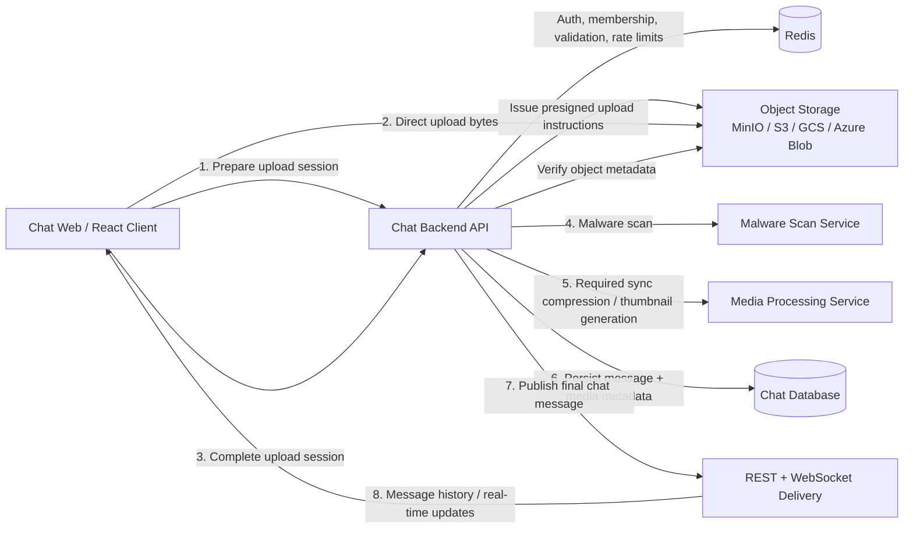

# Media Chat Support Draft Design

## Current Problem

The current chat system is still designed for **text-only messages**:

- `messages` stores a single `content` field for message body text
- `MessageRequest` accepts only `content` and `groupId`
- `MessageResponse` returns only text content and basic sender metadata
- There is no upload lifecycle, media metadata model, storage abstraction, or malware/processing pipeline

Supporting images, videos, audio, and arbitrary files requires more than just adding an upload endpoint. We need a design that covers:

- Message schema changes
- Secure object storage uploads
- Validation and abuse protection
- Asynchronous processing (scan, thumbnail, compression/transcode)
- Frontend upload UX and message rendering
- Local development with MinIO and cloud production on AWS/GCP/Azure

The main design goal is to support media messages without turning the backend into a file-transfer bottleneck, while keeping the message domain, security model, and future scale path clean.

## Functional Requirements

- Users can send these media types:
  - Image
  - Video
  - Audio
  - File
- Media support is required for both:
  - public chat
  - group chat
- Users can optionally add a caption/text body to any media message
- One message can contain:
  - multiple image attachments in a single message
  - exactly one attachment for video, audio, or generic file messages
- Mixed attachment types in one message are not required in the first version
- Users can upload large files with resumable or multipart upload behavior
- Frontend shows upload progress for large uploads
- Frontend renders thumbnails / previews when applicable
- Frontend supports inline playback for video and audio in phase 1
- Messages remain ordered in chat history alongside text messages
- Media messages can be loaded through existing message-history APIs with extra media metadata
- Download/view access remains limited to authorized chat participants
- Media messages become visible to other users only after:
  - upload completes
  - malware scan passes
  - required synchronous processing finishes
- Captions do not need post-send editing in phase 1
- Attachment deletion independent of message deletion is not required in phase 1
- Failed, canceled, or abandoned uploads do not create broken permanent messages

## Non-Functional Requirements

- Keep application servers out of the hot path for large binary transfer whenever possible
- Enforce file size limits:
  - Images: up to 10 MB
  - Audio: up to 50 MB
  - Video: up to 200 MB
  - Generic files: up to 20 MB
- There is no separate video-duration or audio-duration limit in phase 1; size limits are the only hard cap
- Validate both declared MIME type and server-detected content type
- Do not expose uploaded media to other users until malware scanning succeeds
- Perform required image/video compression synchronously before message delivery
- Rate limit upload initiation and completion to reduce abuse
- Use Redis-backed controls for upload rate limiting and abuse protection
- Support local object storage via MinIO and cloud object storage in production
- Allow optional asynchronous post-processing only for follow-up optimizations that are not required before delivery
- Make upload, scan, and processing failures visible and recoverable
- Keep storage/provider-specific details behind an abstraction layer
- Current retention assumption:
  - uploaded media is retained for at least 30 days
  - uploaded media is deleted after 60 days
- Preserve backward compatibility for existing text messages

## Possible Solutions

### 1. Upload Through Backend Application Servers

- Client uploads media bytes directly to the Spring backend
- Backend validates, scans, and writes the object to storage
- Backend then creates the chat message

**Pros**

- Simplest mental model
- Easier to enforce auth and validation in one place
- Works even if the frontend cannot use multipart object-storage APIs

**Cons**

- Backend becomes the bandwidth bottleneck
- Large-file uploads compete with chat API/WebSocket capacity
- Harder to scale economically
- Resume/chunk behavior becomes our responsibility
- Production architecture differs less cleanly between MinIO and cloud providers

**Recommendation for our problem:** No

**When I'd use it**

- Small internal app
- Strict network boundaries where clients cannot access object storage directly
- Very small file sizes and low traffic

### 2. Direct Upload to Object Storage via Presigned URLs With Backend-Controlled Metadata

- Backend issues a short-lived upload intent plus presigned URL(s)
- Client uploads directly to object storage
- Client calls a completion endpoint after successful upload
- Backend verifies uploaded object metadata and creates or finalizes the message
- Background workers handle malware scan, thumbnails, and optional compression/transcoding

**Pros**

- Best balance of scalability, security, and implementation effort
- Keeps large binary transfer off the app servers
- Maps well to MinIO locally and S3/GCS/Azure Blob in production
- Supports multipart/resumable upload cleanly
- Easy to add CDN and derivative assets later

**Cons**

- More moving parts than backend proxy upload
- Requires a clear upload lifecycle and cleanup of abandoned uploads
- Cloud providers differ slightly for multipart semantics and signed URL behavior

**Recommendation for our problem:** Yes

### 3. Managed Media Platform / CDN-Centric Media Service

- Use a higher-level media platform or specialized service for uploads, transcoding, thumbnails, and delivery
- Chat app stores references and metadata instead of owning the full pipeline

**Pros**

- Fastest route to advanced video/audio features
- Built-in transcoding and derivative generation
- Less operational burden for media processing

**Cons**

- Higher vendor lock-in
- More expensive
- Less control over security/compliance details
- Harder to preserve a provider-agnostic MinIO-local setup

**Recommendation for our problem:** No for initial rollout

## Recommendation

Recommendation path:

1. Phase 0: Lock the v1 product rules
   - confirm allowed message shapes:
     - image gallery message
     - single video message
     - single audio message
     - single generic file message
   - confirm media is supported in both public chat and group chat
   - confirm visibility rule: upload complete + malware scan pass + required synchronous processing complete before publish
   - confirm retention semantics, especially what users should see after day 60 deletion
2. Phase 1: Add storage-provider abstraction and environment configuration
   - define a storage contract that works with MinIO locally and cloud object storage later
   - add provider-specific config for buckets/prefixes, signed URL TTL, multipart threshold, and per-type size limits
   - keep provider details behind backend interfaces
3. Phase 2: Add data model and message contract changes
   - add `messageType` to `messages`
   - add `message_media` for attachment metadata
   - add `media_uploads` or equivalent upload-session tracking
   - extend message DTOs so history APIs can return media metadata safely
4. Phase 3: Add upload-session APIs
   - create upload-session preparation endpoint
   - support batch upload preparation for multi-image messages
   - support single-attachment preparation for video/audio/file
   - add multipart support for large uploads
5. Phase 4: Add upload completion and final message creation
   - verify uploaded objects exist and belong to the caller
   - run malware scan gate
   - run required synchronous image/video compression
   - create the final message only after all required checks pass
6. Phase 5: Add history and delivery contract updates
   - return media-aware message payloads from public and group message APIs
   - update latest-message preview behavior for non-text messages
   - ensure WebSocket-delivered messages use the same media contract as REST history
7. Phase 6: Deliver phase-1 UI capabilities
   - upload progress
   - image gallery rendering
   - inline video/audio playback
   - file download/open UI
   - sender-side placeholder and retry/cancel behavior before publish
8. Phase 7: Add abuse protection and operational hardening
   - Redis-based rate limiting
   - orphan upload cleanup
   - audit logging for upload, scan, and deletion events
   - failure observability and alerts
9. Phase 8: Add optional optimizations after v1 works end-to-end
   - better thumbnails and previews
   - asynchronous secondary derivatives
   - CDN-backed delivery for clean media
   - stronger moderation/reporting workflows

## High-Level Architecture

### Use cases

1. A user sends an image message in public chat or group chat
   - the message may contain multiple image attachments
   - the message may also include an optional caption
2. A user sends a video, audio, or generic file message in public chat or group chat
   - these message types allow exactly one attachment per message
   - the message may also include an optional caption
3. A sender sees local upload progress and pre-send placeholder state
   - uploading
   - scanning
   - compressing when required
   - success or failure
4. Other chat participants only receive the final message after:
   - upload completes
   - malware scan succeeds
   - required synchronous image/video compression completes
5. A recipient can consume approved media from chat history or real-time delivery
   - image gallery preview
   - inline video/audio playback
   - file download/open

### Component diagram

### Proposed Domain Model

#### 1. Add `messageType` to `messages`

Yes, the design should add a new column to the message table to identify message kind.

Suggested enum:

- `TEXT`
- `IMAGE`
- `VIDEO`
- `AUDIO`
- `FILE`
- `SYSTEM` (optional if we want to reserve room for future non-user messages, such as "User1 has been kicked out of the group by User2", "User3 has left the group", "User4 joined the group", etc.)

Why:

- Rendering logic depends on message type
- Validation rules depend on message type
- Sidebar/latest-message preview often differs by type, for example "Photo" or a filename instead of raw text
- Keeping type on the main `messages` row makes message history queries efficient

#### 2. Add a dedicated media metadata table

Do **not** overload `content` with storage metadata. Keep text/caption concerns separate from file metadata.

Suggested table: `message_media`

Relationship:

- one `messages` row can have zero media rows for `TEXT`
- one `messages` row can have multiple `message_media` rows for `IMAGE`
- one `messages` row can have exactly one `message_media` row for `VIDEO`, `AUDIO`, or `FILE`
- mixed-type attachments in one message are out of scope for phase 1

Suggested fields:

- `id`
- `message_id`
- `attachment_order`
- `storage_provider`
- `bucket`
- `object_key`
- `original_filename`
- `declared_mime_type`
- `detected_mime_type`
- `size_bytes`
- `checksum_sha256`
- `status` (`UPLOADING`, `PROCESSING`, `READY`, `FAILED`, `BLOCKED`, `DELETED`)
- `scan_status` (`PENDING`, `CLEAN`, `INFECTED`, `ERROR`)
- `width`, `height` for images/video when available
- `duration_ms` for audio/video when available
- `thumbnail_object_key` when available
- `preview_object_key` when available
- `transcoded_object_key` when available
- `created_at`, `updated_at`

Caption strategy:

- Keep `messages.content` for user-entered caption text
- For pure file-only messages, `content` may be null or empty

#### 3. Add an upload-tracking table

Suggested table: `media_uploads`

Purpose:

- Track presigned upload intents before a message exists
- Prevent orphaned or spoofed completion calls
- Support expiration, retries, and cleanup
- Support multi-image upload sessions before one final message is created

Suggested fields:

- `upload_id`
- `user_id`
- `chat_scope` (`PUBLIC`, `GROUP`)
- `group_id`
- `upload_session_id`
- `requested_message_type`
- `requested_filename`
- `requested_size_bytes`
- `requested_mime_type`
- `storage_provider`
- `bucket`
- `object_key`
- `multipart_upload_id` (nullable)
- `status` (`INITIATED`, `UPLOADED`, `COMPLETED`, `EXPIRED`, `CANCELED`, `FAILED`)
- `expires_at`

### Storage Abstraction

Create a storage-provider interface in the backend so business logic does not depend on MinIO/S3/GCS/Azure specifics.

Suggested responsibilities:

- Create upload intent / presigned URL(s)
- Complete multipart upload
- Abort multipart upload
- Generate short-lived signed download/view URLs
- Delete objects
- Read object metadata / HEAD

Suggested implementations:

- `MinioStorageProvider` for local development
- `S3StorageProvider` for AWS production
- Optional later:
  - `GcsStorageProvider`
  - `AzureBlobStorageProvider`

Recommendation:

- Keep a single internal contract and provider-specific adapters
- Avoid leaking provider-specific terminology into controller DTOs where possible

### API Draft

#### 1. Prepare a media message upload session

`POST /api/media/messages/prepare`

Purpose:

- create one upload session for one future chat message
- support both:
  - multi-image messages
  - single video/audio/file messages

Request fields:

- `chatScope` (`PUBLIC`, `GROUP`)
- `groupId` (required only for `GROUP`)
- `messageType`
- `caption` (optional)
- `attachments`:
  - `filename`
  - `sizeBytes`
  - `mimeType`

Validation rules:

- `IMAGE`: `attachments.length >= 1`
- `VIDEO`, `AUDIO`, `FILE`: `attachments.length == 1`
- all attachments in one request must match the requested `messageType`

Response fields:

- `uploadSessionId`
- `messageType`
- `chatScope`
- `expiresAt`
- `attachments`:
  - `attachmentId`
  - `objectKey`
  - `uploadStrategy` (`SINGLE_PART`, `MULTIPART`)
  - `presignedUrl` for single-part uploads
  - multipart instructions when required:
    - `multipartUploadId`
    - `recommendedPartSize`
    - `completeBy`
- `limits`:
  - `maxSizeBytes`
  - `maxAttachmentCount`

#### 2. Request multipart part URLs when needed

`POST /api/media/messages/upload-sessions/{uploadSessionId}/attachments/{attachmentId}/parts`

Purpose:

- issue presigned URLs for multipart chunks when the upload strategy is `MULTIPART`

Request fields:

- `partNumbers`

Response fields:

- `multipartUploadId`
- `parts`:
  - `partNumber`
  - `presignedUrl`

#### 3. Complete and publish the media message

`POST /api/media/messages/upload-sessions/{uploadSessionId}/complete`

Purpose:

- verify all uploaded attachments
- run malware-scan gating
- run required synchronous image/video compression
- create and publish the final message only after all required checks pass

Request fields:

- `attachments`:
  - `attachmentId`
  - `etag` or multipart completion metadata

Response:

- created `MessageResponse` with final media payload

Failure behavior:

- if any attachment fails verification, scan, or required processing, the message is not created
- sender receives a failure response and may retry with a new upload session

#### 4. Fetch/render media in chat history

Extend existing message-history responses for:

- `GET /api/messages/public`
- `GET /api/messages/groups/{groupId}`

Media messages should include:

- `messageType`
- `caption`
- `attachments`:
  - `attachmentId`
  - `status`
  - `originalFilename`
  - `mimeType`
  - `sizeBytes`
  - `thumbnailUrl` (short-lived signed URL when available)
  - `contentUrl` or `downloadUrl`
  - `width`
  - `height`
  - `durationMs`
  - `attachmentOrder`

#### 5. Refresh signed access URLs when needed

`POST /api/media/messages/{messageId}/attachments/{attachmentId}/access`

Purpose:

- issue a fresh short-lived signed URL when an existing media URL expires during playback or download

Response fields:

- `contentUrl` or `downloadUrl`
- `expiresAt`

### Upload Lifecycle

#### Recommended flow

1. User selects file in frontend
2. Frontend validates basic file type/size before starting
3. Frontend requests an upload session from backend
4. Backend validates auth, membership, limits, and rate limits
5. Client uploads directly to object storage
6. Client calls completion endpoint
7. Backend performs server-side verification:
   - object exists
   - size matches allowed limits
   - detected content type is acceptable
   - upload belongs to caller
8. Backend runs malware scan
9. Backend runs required synchronous image/video compression before publish
10. Backend creates message and media metadata
11. Backend publishes the final message
12. Frontend clears placeholder and shows the delivered message

#### Recommended visibility rule

Default recommendation:

- Sender sees a local optimistic placeholder while uploading
- Other users should not see the message until:
  - upload completes
  - malware scanning passes
  - required synchronous processing finishes
- If scan fails, mark the upload blocked and do not create a visible message
- If required synchronous processing fails, do not create a visible message

This is safer than publishing media immediately and trying to revoke it later.

### Validation and Security

#### Validation

- Validate allowed message type against requested MIME type
- Validate actual object metadata after upload, not only the client-declared MIME type
- Use content sniffing or provider metadata inspection server-side
- Enforce per-type size limits
- Reject zero-byte or truncated uploads
- Consider a restricted allowlist for risky file categories

#### Content Security

- Use short-lived signed URLs for download/view access
- Do not expose raw object keys publicly
- Store objects under opaque keys, not user-provided filenames
- Sanitize displayed filenames in the UI
- Set safe download headers where needed
- Strip dangerous inline rendering for unsupported formats

#### Malware Scanning

Recommended approach:

- Upload into a temporary/quarantine prefix
- Run malware scan before message creation and delivery
- Promote to a clean/serving prefix only after scan passes, or mark the media blocked
- Do not publish the message if any required attachment fails scan

### Upload Rate Limiting

Yes, Redis is a good fit for upload rate limiting.

Recommended controls:

- limit upload intent creation per user per minute
- limit total uploaded bytes per user per time window
- limit concurrent active uploads per user
- optional group-level abuse limits

Why not only request count:

- 100 MB files and 100 KB files create very different costs

Suggested Redis keys:

- `rate:media:intent:user:{userId}`
- `rate:media:bytes:user:{userId}`
- `rate:media:active:user:{userId}`

### Media Processing

#### Images

- generate at least one thumbnail size
- compress oversized images before message delivery when required
- preserve original image for download when required
- consider EXIF stripping and orientation normalization

#### Video

- generate poster thumbnail
- perform required synchronous compression before message delivery
- capture duration, width, and height metadata

#### Audio

- capture duration and codec metadata
- support inline playback in phase 1
- keep optional transcoding as a later optimization, not a phase-1 requirement
- optionally generate waveform data later

#### Generic files

- no transcoding
- keep filename, MIME type, and size metadata
- use download-focused UI

Recommendation:

- Keep required image/video compression synchronous because the current product rule says the final delivered message should already reference processed media
- Keep optional secondary derivatives asynchronous where they are not required for phase-1 delivery
- Do not expand phase 1 into advanced streaming/transcoding beyond what is necessary for inline playback

### Frontend UX

- Show optimistic local placeholder for upload in progress
- Show upload progress percentage
- Support cancel/retry for failed uploads
- Use multipart upload for large video/audio/file payloads
- Lazy-load thumbnails and large media
- Render clear states:
  - uploading
  - scanning
  - compressing
  - ready
  - failed
  - blocked
- For image/video, prefer preview cards
- For audio, show compact inline player in phase 1
- For generic files, show filename, size, icon, and download/open action

### Media Caching

Recommended approach:

- Cache derived thumbnails/previews aggressively
- Keep signed full-content URLs short-lived
- Add CDN in production later for clean media only
- Avoid caching blocked or processing assets in public layers

For local development:

- direct MinIO access or signed URLs are sufficient

### Other Important Considerations

- **Orphan cleanup:** unfinished uploads must expire and be deleted
- **Deletion semantics:** define whether deleting a message hard-deletes, soft-deletes, or tombstones media
- **Quota management:** decide whether users or groups have total storage quotas
- **Auditability:** log upload intent, completion, scan result, and deletion events
- **Moderation:** consider future admin review for reported media
- **Accessibility:** captions/alt text are likely not phase 1 requirements, but should stay possible
- **Search/indexing:** filenames and captions may later become searchable
- **Privacy/compliance:** current requirement says media is retained for at least 30 days and deleted after 60 days; confirm whether chat history should show a tombstone, broken attachment state, or hard-delete behavior after that expiry
- **Cost controls:** video storage and egress can dominate costs quickly

### API / Contract / Config Impacts

- New message-response contract for media metadata
- New upload APIs and DTOs
- New background processing components
- New configuration for:
  - storage provider selection
  - buckets/prefixes
  - signed URL TTL
  - max file sizes by message type
  - allowed MIME types
  - multipart threshold
  - rate limiting thresholds
  - malware scanner integration

### Backward Compatibility and Rollout Notes

- Existing text messages remain valid with `messageType = TEXT`
- New database fields should be nullable or have safe defaults during rollout
- Older clients should fail safely when receiving unknown message types
- Group latest-message preview logic may need a type-aware summary, for example:
  - image -> "Photo"
  - video -> "Video"
  - audio -> "Audio"
  - file -> filename or "File"

## Chosen Solution + Implementation

Status: **draft only, not implemented**

Use **direct client upload to object storage via backend-issued upload intents**. Keep message persistence in the chat backend, but keep large binary transfer out of the app servers.

## Future Higher-Scale Path

- Move derivative generation and scanning to dedicated worker queues
- Add CDN in front of clean-media delivery
- Add adaptive video streaming derivatives if in-app playback becomes important
- Add deduplication by checksum for repeated uploads
- Add organization/group storage quotas
- Add stronger moderation workflows and abuse review queues
- Add cross-region storage and residency policies if the product grows internationally
