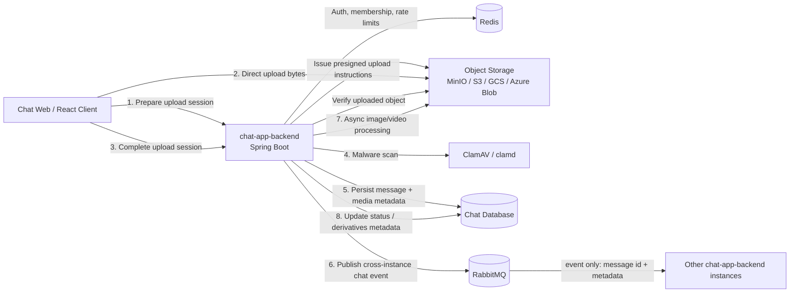
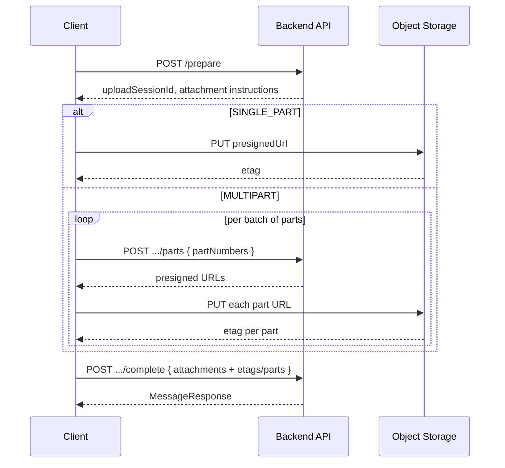

# Media Chat Support Draft Design

By: GPT 5.4, medium reasoning

## Current Problem

The current chat system is still designed for **text-only messages**:

- `messages` stores a single `content` field for message body text
- `MessageRequest` accepts only `content` and `groupId`
- `MessageResponse` returns only text content and basic sender metadata
- There is no upload lifecycle, media metadata model, storage abstraction, or malware/processing pipeline

Supporting images, videos, audio, and arbitrary files requires more than just adding an upload endpoint. We need a design that covers:

- Message schema changes
- Secure object storage uploads
- Validation and abuse protection
- Media security checks and processing (scan, thumbnail, compression/transcode)
- Frontend upload UX and message rendering
- Local development with MinIO and cloud production on AWS/GCP/Azure

The main design goal is to support media messages without turning the backend into a file-transfer bottleneck, while keeping the message domain, security model, and future scale path clean.

## Functional Requirements

- Users can send these media types:
  - Image
  - Video
  - Audio
  - File
- Media support is required for both:
  - public chat
  - group chat
- One message can contain:
  - multiple image attachments in a single message
  - exactly one attachment for video, audio, or generic file messages
- Maximum number of images in one image message is 50
- Mixed attachment types in one message are not required in the first version
- A media message must not contain text content
- If the frontend lets a user compose text plus media together, it must split them into two separate messages:
  - one text message
  - one media message
- Users can upload large files with resumable or multipart upload behavior
- Frontend shows upload progress for large uploads
- Frontend renders thumbnails / previews when applicable
- Frontend supports inline playback for video and audio in phase 1
- Messages remain ordered in chat history alongside text messages
- Media messages can be loaded through existing message-history APIs with extra media metadata
- Download/view access remains limited to authorized chat participants
- Media messages become visible to other users only after:
  - upload completes
  - malware scan passes
  - required post-upload verification finishes
- Image and video messages may remain visible in a processing state while async media processing continues
- Attachment deletion independent of message deletion is not required in phase 1
- Failed, canceled, or abandoned uploads do not create broken permanent messages

## Non-Functional Requirements

- Keep application servers out of the hot path for large binary transfer whenever possible
- Enforce file size limits:
  - Images: up to 10 MB
  - Audio: up to 50 MB
  - Video: up to 200 MB
  - Generic files: up to 20 MB
- Keep the per-type size limits configurable in `application.yml`
- There is no separate video-duration or audio-duration limit in phase 1; size limits are the only hard cap
- Validate both declared MIME type and server-detected content type
- Do not expose uploaded media to other users until malware scanning succeeds
- Run image/video compression asynchronously after the message becomes visible
- Rate limit upload initiation and completion to reduce abuse
- Use Redis-backed controls for upload rate limiting and abuse protection
- Support local object storage via MinIO and cloud object storage in production
- Keep media retention configurable in `application.yml`
- Make upload, scan, and processing failures visible and recoverable
- Keep storage/provider-specific details behind an abstraction layer
- Hard-delete media files from object storage after the configured retention period expires
- Default retention target:
  - hard-delete media files after 60 days
  - allow future extension to longer periods such as 6 months or 5 years through configuration
- Preserve backward compatibility for existing text messages

## Possible Solutions

### 1. Upload Through Backend Application Servers

- Client uploads media bytes directly to the Spring backend
- Backend validates, scans, and writes the object to storage
- Backend then creates the chat message

**Pros**

- Simplest mental model
- Easier to enforce auth and validation in one place
- Works even if the frontend cannot use multipart object-storage APIs

**Cons**

- Backend becomes the bandwidth bottleneck
- Large-file uploads compete with chat API/WebSocket capacity
- Harder to scale economically
- Resume/chunk behavior becomes our responsibility
- Production architecture differs less cleanly between MinIO and cloud providers

**Recommendation for our problem:** No

**When I'd use it**

- Small internal app
- Strict network boundaries where clients cannot access object storage directly
- Very small file sizes and low traffic

### 2. Direct Upload to Object Storage via Presigned URLs With Backend-Controlled Metadata

- Backend issues a short-lived upload intent plus presigned URL(s)
- Client uploads directly to object storage
- Client calls a completion endpoint after successful upload
- Backend verifies uploaded object metadata and creates or finalizes the message
- Backend runs malware scan as the publish gate, then background jobs handle thumbnails and optional compression/transcoding

**Pros**

- Best balance of scalability, security, and implementation effort
- Keeps large binary transfer off the app servers
- Maps well to MinIO locally and S3/GCS/Azure Blob in production
- Supports multipart/resumable upload cleanly
- Easy to add CDN and derivative assets later

**Cons**

- More moving parts than backend proxy upload
- Requires a clear upload lifecycle and cleanup of abandoned uploads
- Cloud providers differ slightly for multipart semantics and signed URL behavior

**Recommendation for our problem:** Yes

### 3. Managed Media Platform / CDN-Centric Media Service

- Use a higher-level media platform or specialized service for uploads, transcoding, thumbnails, and delivery
- Chat app stores references and metadata instead of owning the full pipeline

**Pros**

- Fastest route to advanced video/audio features
- Built-in transcoding and derivative generation
- Less operational burden for media processing

**Cons**

- Higher vendor lock-in
- More expensive
- Less control over security/compliance details
- Harder to preserve a provider-agnostic MinIO-local setup

**Recommendation for our problem:** No for initial rollout

## High-Level Architecture

### Use cases

1. A user sends an image message in public chat or group chat
   - the message may contain multiple image attachments
   - maximum number of images is 50
2. A user sends a video, audio, or generic file message in public chat or group chat
   - these message types allow exactly one attachment per message
3. A sender sees local upload progress and pre-send placeholder state
   - `UPLOAD_IN_PROGRESS`
   - `SCAN_PENDING`
   - `PROCESSING_PENDING`
   - `MEDIA_READY`
   - `UPLOAD_FAILED`
4. Other chat participants only receive the final message after:
   - upload completes
   - malware scan succeeds
   - required upload verification succeeds
5. Image and video messages may continue async processing after publish
   - recipients can see a processing indicator while thumbnails or compressed derivatives are still being prepared
   - users can leave the chat, switch groups, and continue using the app while processing continues
6. A recipient can consume approved media from chat history or real-time delivery
   - image gallery preview
   - inline video/audio playback
   - file download/open

### Component diagram



### Component placement

Phase-1 recommendation:

- implement upload orchestration, malware-scan coordination, and media-processing logic inside the existing `chat-app-backend`
- do not create two new Spring Boot applications in the first rollout
- treat malware scanning and media processing as backend modules / jobs, not separate deployable services yet

Future extraction path:

- if scan/processing load becomes heavy, or if we need stronger isolation and independent scaling, extract those modules into separate worker services later

### RabbitMQ role

Recommended phase-1 role for RabbitMQ:

- use RabbitMQ for cross-instance real-time message delivery only
- do not send media bytes through RabbitMQ
- do not make RabbitMQ the first background-job queue for scan or media processing

Why:

- this codebase already uses RabbitMQ for cross-instance fan-out, so media messages should reuse that path
- file processing is a different workload from real-time chat fan-out
- the first rollout already keeps scan/processing logic inside `chat-app-backend`, so adding a second RabbitMQ job topology immediately would add operational complexity before it is necessary

Future option:

- if async processing load grows, RabbitMQ can later be introduced as a lightweight job queue
- if that happens, queue messages should carry only job identifiers and metadata pointers, never binary file content

### Cross-instance media delivery

When a media message is delivered across instances:

- do not forward the whole file through RabbitMQ
- do not forward signed URLs through RabbitMQ, because they are short-lived and should be generated close to delivery/read time
- forward only lightweight message metadata, such as:
  - `messageId`
  - `chatScope`
  - `groupId` when applicable
  - `messageType`
  - sender summary
  - attachment ids
  - filenames
  - MIME types
  - sizes
  - media status
  - width/height/duration when available
  - storage references such as object keys when needed internally

Recommended event shape:

- prefer a message-domain event that contains `messageId` plus enough immutable metadata for receivers
- receiving instances may either:
  - hydrate the full message from the database, or
  - use the event payload plus locally generated signed URLs when constructing the outgoing WebSocket payload

### Malware scanning approach

Recommended phase-1 technique:

- use `ClamAV` with `clamd` as the malware scanning engine
- run it as an infrastructure dependency, for example a local container in development and an equivalent deployment in production
- let `chat-app-backend` orchestrate scan requests and status updates

Suggested backend flow:

1. upload completes to object storage
2. backend streams or downloads the uploaded object for scanning
3. backend sends the bytes to `clamd`
4. if the result is clean, continue message creation
5. if the result is infected or scan fails, move the media to a blocked/failed state and do not publish the message

Why this is a good fit:

- simple and well-known first step
- works without introducing another Spring Boot application
- keeps the malware engine separate from application code, while still letting the main backend own workflow orchestration

### Proposed Domain Model

#### 1. Add `messageType` to `messages`

Yes, the design should add a new column to the message table to identify message kind.

Suggested enum:

- `TEXT`
- `IMAGE`
- `VIDEO`
- `AUDIO`
- `FILE`
- `SYSTEM` (optional if we want to reserve room for future non-user messages, such as "User1 has been kicked out of the group by User2", "User3 has left the group", "User4 joined the group", etc.)

Why:

- Rendering logic depends on message type
- Validation rules depend on message type
- Sidebar/latest-message preview often differs by type, for example "Photo" or a filename instead of raw text
- Keeping type on the main `messages` row makes message history queries efficient

#### 2. Add a dedicated media metadata table

Do **not** overload `content` with storage metadata. Keep text-only messages separate from file metadata.

Suggested table: `message_media`

Relationship:

- one `messages` row can have zero media rows for `TEXT`
- one `messages` row can have multiple `message_media` rows for `IMAGE`
- one `messages` row can have exactly one `message_media` row for `VIDEO`, `AUDIO`, or `FILE`
- mixed-type attachments in one message are out of scope for phase 1

Suggested fields:

- `id`
- `message_id`
- `attachment_order`
- `storage_provider`
- `bucket`
- `object_key`
- `original_filename`
- `declared_mime_type`
- `detected_mime_type`
- `size_bytes`
- `checksum_sha256`
- `status` (`UPLOAD_COMPLETED`, `SCAN_PENDING`, `SCAN_PASSED`, `PROCESSING_PENDING`, `PROCESSING_IN_PROGRESS`, `MEDIA_READY`, `PROCESSING_FAILED`, `SCAN_BLOCKED`, `HARD_DELETED`)
- `scan_status` (`SCAN_PENDING`, `SCAN_PASSED`, `SCAN_BLOCKED`, `SCAN_FAILED`)
- `width`, `height` for images/video when available
- `duration_ms` for audio/video when available
- `thumbnail_object_key` when available
- `preview_object_key` when available
- `transcoded_object_key` when available
- `created_at`, `updated_at`

Text/media separation strategy:

- `messages.content` is used only for text messages
- media messages should keep `messages.content` null or empty
- if the user composes text plus media together, the frontend splits that into separate text and media messages

#### 3. Add an upload-tracking table

Suggested table: `media_uploads`

Purpose:

- Track presigned upload intents before a message exists
- Prevent orphaned or spoofed completion calls
- Support expiration, retries, and cleanup
- Support multi-image upload sessions before one final message is created

Suggested fields:

- `upload_id`
- `user_id`
- `chat_scope` (`PUBLIC`, `GROUP`)
- `group_id`
- `upload_session_id`
- `requested_message_type`
- `requested_filename`
- `requested_size_bytes`
- `requested_mime_type`
- `storage_provider`
- `bucket`
- `object_key`
- `multipart_upload_id` (nullable)
- `status` (`UPLOAD_INITIATED`, `UPLOAD_IN_PROGRESS`, `UPLOAD_COMPLETED`, `UPLOAD_SESSION_COMPLETED`, `UPLOAD_SESSION_EXPIRED`, `UPLOAD_CANCELED`, `UPLOAD_FAILED`)
- `expires_at`

#### 4. Status modeling recommendation

Do not manage these transitions with an ad-hoc shared hashmap spread across the codebase.

Recommended approach:

- create separate enums per entity / workflow, for example:
  - `MediaStatus`
  - `MediaScanStatus`
  - `UploadSessionStatus`
- keep allowed transitions in one explicit transition policy per enum or workflow
- validate transitions in service-layer methods so invalid jumps are rejected consistently
- if the workflow grows more complex, promote that transition policy into a small state-machine helper instead of scattering `if` checks everywhere

Recommendation for naming:

- keep enum values in `UPPER_CASE_WITH_UNDERSCORE`
- do not add entity prefixes to every enum value when the enum type already scopes them
- example:
  - prefer `SCAN_PENDING` inside `MediaStatus`
  - instead of `MEDIA_SCAN_PENDING`

When prefixes are useful:

- external queue event names
- metrics/logging dimensions shared across multiple workflows
- database values shared by more than one entity type

### Storage Abstraction

Create a storage-provider interface in the backend so business logic does not depend on MinIO/S3/GCS/Azure specifics.

Suggested responsibilities:

- Create upload intent / presigned URL(s)
- Complete multipart upload
- Abort multipart upload
- Generate short-lived signed download/view URLs
- Delete objects
- Read object metadata / HEAD

Suggested implementations:

- `MinioStorageProvider` for local development
- `S3StorageProvider` for AWS production
- Optional later:
  - `GcsStorageProvider`
  - `AzureBlobStorageProvider`

Recommendation:

- Keep a single internal contract and provider-specific adapters
- Avoid leaking provider-specific terminology into controller DTOs where possible
- Configure retention days and per-type max upload sizes in `application.yml`
- Mirror environment-backed media settings in `chat-app-backend/.env.example`

Suggested `application.yml` settings:

- `chat.media.max-size.image-bytes`
- `chat.media.max-size.audio-bytes`
- `chat.media.max-size.video-bytes`
- `chat.media.max-size.file-bytes`
- `chat.media.max-image-count`
- `chat.media.retention-days`
- `chat.media.multipart-threshold-bytes`

Environment alignment note:

- if these values are sourced from environment variables in local/dev deployments, mirror them in `chat-app-backend/.env.example`
- recommended environment-variable counterparts:
  - `CHAT_MEDIA_MAX_SIZE_IMAGE_BYTES`
  - `CHAT_MEDIA_MAX_SIZE_AUDIO_BYTES`
  - `CHAT_MEDIA_MAX_SIZE_VIDEO_BYTES`
  - `CHAT_MEDIA_MAX_SIZE_FILE_BYTES`
  - `CHAT_MEDIA_MAX_IMAGE_COUNT`
  - `CHAT_MEDIA_RETENTION_DAYS`
  - `CHAT_MEDIA_MULTIPART_THRESHOLD_BYTES`

### API Draft

#### 1. Prepare a media message upload session

`POST /api/media/messages/prepare`

Purpose:

- create one upload session for one future chat message
- support both:
  - multi-image messages
  - single video/audio/file messages

Request fields:

- `chatScope` (`PUBLIC`, `GROUP`)
- `groupId` (required only for `GROUP`)
- `messageType`
- `attachments`:
  - `filename`
  - `sizeBytes`
  - `mimeType`

Validation rules:

- `IMAGE`: `1 <= attachments.length <= 50`
- `VIDEO`, `AUDIO`, `FILE`: `attachments.length == 1`
- all attachments in one request must match the requested `messageType`

Response fields:

- `uploadSessionId`
- `messageType`
- `chatScope`
- `expiresAt`
- `retentionDays`
- `attachments`:
  - `attachmentId`
  - `objectKey`
  - `uploadStrategy` (`SINGLE_PART`, `MULTIPART`)
  - `presignedUrl` for single-part uploads
  - multipart instructions when required:
    - `multipartUploadId`
    - `recommendedPartSize`
    - `completeBy`
- `limits`:
  - `maxSizeBytes`
  - `maxAttachmentCount`

#### 2. Request multipart part URLs when needed

`POST /api/media/messages/upload-sessions/{uploadSessionId}/attachments/{attachmentId}/parts`

Purpose:

- issue presigned URLs for multipart chunks when the upload strategy is `MULTIPART`

Request fields:

- `partNumbers`

Response fields:

- `multipartUploadId`
- `parts`:
  - `partNumber`
  - `presignedUrl`

#### 3. Complete and publish the media message

`POST /api/media/messages/upload-sessions/{uploadSessionId}/complete`

Purpose:

- verify all uploaded attachments
- run malware-scan gating
- create and publish the final message only after all required checks pass
- enqueue async image/video processing work when needed

Request fields:

- `attachments`:
  - `attachmentId`
  - `etag` or multipart completion metadata

Response:

- created `MessageResponse` with final media payload

Failure behavior:

- if any attachment fails verification or scan, the message is not created
- sender receives a failure response and may retry with a new upload session

#### 4. Fetch/render media in chat history

Extend existing message-history responses for:

- `GET /api/messages/public`
- `GET /api/messages/groups/{groupId}`

Media messages should include:

- `messageType`
- `attachments`:
  - `attachmentId`
  - `status`
  - `originalFilename`
  - `mimeType`
  - `sizeBytes`
  - `thumbnailUrl` (short-lived signed URL when available)
  - `contentUrl` or `downloadUrl`
  - `width`
  - `height`
  - `durationMs`
  - `attachmentOrder`

#### 5. Refresh signed access URLs when needed

`POST /api/media/messages/{messageId}/attachments/{attachmentId}/access`

Purpose:

- issue a fresh short-lived signed URL when an existing media URL expires during playback or download

Response fields:

- `contentUrl` or `downloadUrl`
- `expiresAt`

### Upload Lifecycle

#### Recommended flow

1. User selects file in frontend
2. Frontend validates basic file type/size before starting
3. Frontend requests an upload session from backend
4. Backend validates auth, membership, limits, and rate limits
5. Client uploads directly to object storage
6. Client calls completion endpoint
7. Backend performs server-side verification:
   - object exists
   - size matches allowed limits
   - detected content type is acceptable
   - upload belongs to caller
8. Backend runs malware scan
9. Backend creates message and media metadata
10. Backend publishes the final message
11. Backend schedules async image/video processing when needed
12. Frontend clears the pre-send placeholder and shows the delivered message with current media status

#### Recommended visibility rule

Default recommendation:

- Sender sees a local optimistic placeholder while uploading
- Other users should not see the message until:
  - upload completes
  - malware scanning passes
  - required upload verification finishes
- After publish:
  - image/video may remain in `PROCESSING_PENDING` or `PROCESSING_IN_PROGRESS`
  - audio/file can usually move directly to `MEDIA_READY`
- If scan fails, mark the upload `SCAN_BLOCKED` and do not create a visible message
- If async processing fails, keep the message visible and move the media to `PROCESSING_FAILED`

This is safer than publishing media immediately and trying to revoke it later.

### Validation and Security

#### Validation

- Validate allowed message type against requested MIME type
- Validate actual object metadata after upload, not only the client-declared MIME type
- Use content sniffing or provider metadata inspection server-side
- Enforce per-type size limits
- Reject zero-byte or truncated uploads
- Consider a restricted allowlist for risky file categories

#### Content Security

- Use short-lived signed URLs for download/view access
- Do not expose raw object keys publicly
- Store objects under opaque keys, not user-provided filenames
- Sanitize displayed filenames in the UI
- Set safe download headers where needed
- Strip dangerous inline rendering for unsupported formats

#### Malware Scanning

Recommended approach:

- Upload into a temporary/quarantine prefix
- Run malware scan before message creation and delivery
- Promote to a clean/serving prefix only after scan passes, or mark the media `SCAN_BLOCKED`
- Do not publish the message if any required attachment fails scan

### Upload Rate Limiting

Yes, Redis is a good fit for upload rate limiting.

Recommended controls:

- limit upload intent creation per user per minute
- limit total uploaded bytes per user per time window
- limit concurrent active uploads per user
- optional group-level abuse limits

Why not only request count:

- 100 MB files and 100 KB files create very different costs

Suggested Redis keys:

- `rate:media:intent:user:{userId}`
- `rate:media:bytes:user:{userId}`
- `rate:media:active:user:{userId}`

### Media Processing

#### Images

- generate at least one thumbnail size
- compress oversized images asynchronously after publish
- preserve original image for download when required
- consider EXIF stripping and orientation normalization

#### Video

- generate poster thumbnail
- perform compression asynchronously after publish
- capture duration, width, and height metadata

#### Audio

- capture duration and codec metadata
- support inline playback in phase 1
- keep optional transcoding as a later optimization, not a phase-1 requirement
- optionally generate waveform data later

#### Generic files

- no transcoding
- keep filename, MIME type, and size metadata
- use download-focused UI

Recommendation:

- Keep malware scan synchronous as the publish gate
- Keep image/video compression asynchronous so users can continue chatting while processing finishes
- Update media status as async processing progresses and finishes
- Do not expand phase 1 into advanced streaming/transcoding beyond what is necessary for inline playback

### Frontend UX

- Show optimistic local placeholder for upload in progress
- Show upload progress percentage
- Support cancel/retry for failed uploads
- Use multipart upload for large video/audio/file payloads
- Lazy-load thumbnails and large media
- Render clear states:
  - `UPLOAD_IN_PROGRESS`
  - `SCAN_PENDING`
  - `PROCESSING_PENDING`
  - `PROCESSING_IN_PROGRESS`
  - `MEDIA_READY`
  - `PROCESSING_FAILED`
  - `SCAN_BLOCKED`
- For image/video, prefer preview cards
- For audio, show compact inline player in phase 1
- For generic files, show filename, size, icon, and download/open action

### Media Caching

Recommended approach:

- Cache derived thumbnails/previews aggressively
- Keep signed full-content URLs short-lived
- Add CDN in production later for clean media only
- Avoid caching blocked or processing assets in public layers

For local development:

- direct MinIO access or signed URLs are sufficient

### Other Important Considerations

- **Orphan cleanup:** unfinished uploads must expire and be deleted
- **Deletion semantics:** define whether deleting a message hard-deletes, soft-deletes, or tombstones media
- **Quota management:** decide whether users or groups have total storage quotas
- **Auditability:** log upload intent, completion, scan result, and deletion events
- **Moderation:** consider future admin review for reported media
- **Accessibility:** captions/alt text are likely not phase 1 requirements, but should stay possible
- **Search/indexing:** filenames may later become searchable; if media captions are added in a future phase, index them separately from the current phase-1 design
- **Expiry behavior:** hard-delete files from storage after the configured retention period expires, and decide whether message rows remain with unavailable attachments or whether related metadata is also removed
- **Cost controls:** video storage and egress can dominate costs quickly

### API / Contract / Config Impacts

- New message-response contract for media metadata
- New upload APIs and DTOs
- New background processing components
- New configuration for:
  - storage provider selection
  - buckets/prefixes
  - signed URL TTL
  - max file sizes by message type
  - max image count
  - media retention days
  - allowed MIME types
  - multipart threshold
  - rate limiting thresholds
  - malware scanner integration
- Suggested property families in `application.yml`:
  - `chat.media.max-size.*`
  - `chat.media.max-image-count`
  - `chat.media.retention-days`
  - `chat.media.multipart-threshold-bytes`
- Mirror relevant media settings in `chat-app-backend/.env.example` when they are environment-backed

### Backward Compatibility and Rollout Notes

- Existing text messages remain valid with `messageType = TEXT`
- New database fields should be nullable or have safe defaults during rollout
- Older clients should fail safely when receiving unknown message types
- Group latest-message preview logic may need a type-aware summary, for example:
  - image -> "Photo"
  - video -> "Video"
  - audio -> "Audio"
  - file -> filename or "File"

## Recommendation

Recommendation path:

1. Phase 1: Add storage-provider abstraction and environment configuration
   - define a storage contract that works with MinIO locally and cloud object storage later
   - add provider-specific config for buckets/prefixes, signed URL TTL, multipart threshold, per-type size limits, and retention period
   - keep provider details behind backend interfaces
2. Phase 2: Add data model and message contract changes
   - add `messageType` to `messages`
   - add `message_media` for attachment metadata
   - add `media_uploads` or equivalent upload-session tracking
   - extend message DTOs so history APIs can return media metadata safely
   - ensure media messages carry no text payload in `messages.content`
3. Phase 3: Add upload-session APIs
   - create upload-session preparation endpoint
   - support batch upload preparation for multi-image messages
   - support single-attachment preparation for video/audio/file
   - add multipart support for large uploads
4. Phase 4: Add upload completion and final message creation
   - verify uploaded objects exist and belong to the caller
   - run malware scan gate
   - create the final message only after all required checks pass
   - publish image/video messages with processing metadata when async processing is still ongoing
5. Phase 5: Add async media processing inside `chat-app-backend`
   - implement malware-scan orchestration and media-processing workers/modules inside the existing backend first
   - generate thumbnails and compressed derivatives asynchronously for image/video
   - update message media status as processing progresses
   - do not introduce separate Spring Boot apps in the first rollout
6. Phase 6: Add history and delivery contract updates
   - return media-aware message payloads from public and group message APIs
   - update latest-message preview behavior for non-text messages
   - ensure WebSocket-delivered messages use the same media contract as REST history
7. Phase 7: Deliver phase-1 UI capabilities
   - upload progress
   - image gallery rendering
   - inline video/audio playback
   - file download/open UI
   - sender-side placeholder and retry/cancel behavior before publish
   - visible processing indicator for image/video messages after publish
8. Phase 8: Add abuse protection and operational hardening
   - Redis-based rate limiting
   - orphan upload cleanup
   - audit logging for upload, scan, and deletion events
   - scheduled hard-delete of expired files and related metadata cleanup
   - failure observability and alerts
9. Phase 9: Add optional optimizations after v1 works end-to-end
   - better thumbnails and previews
   - asynchronous secondary derivatives
   - CDN-backed delivery for clean media
   - stronger moderation/reporting workflows

## Chosen Solution + Implementation

Status:

- Phase 1 completed
- Phase 2 completed
- Phase 3 completed
- Phase 4 completed
- Phases 5-9 not implemented yet

Use **direct client upload to object storage via backend-issued upload intents**. Keep message persistence in the chat backend, but keep large binary transfer out of the app servers.

### Phase 1 - Storage-provider abstraction and environment configuration

Implemented in `chat-app-backend`:

- Added typed media/storage configuration binding via `MediaStorageProperties`
- Added `ObjectStorageProvider` abstraction with provider descriptors
- Added concrete phase-1 provider scaffolding for:
  - `MINIO`
  - `S3`
- Added `ObjectStorageProviderRegistry` to resolve the active configured provider
- Added media configuration defaults in `application.yaml`
- Mirrored environment-backed media settings in `chat-app-backend/.env.example`
- Added a focused backend test for provider selection and missing-provider validation

Configuration currently covers:

- active storage provider
- per-type file-size limits
- max image count
- retention days
- multipart threshold
- MinIO connection/bucket settings
- S3 bucket/region/endpoint settings

What Phase 1 intentionally does **not** implement yet:

- real upload APIs
- actual MinIO/S3 SDK integration
- presigned URL generation
- object metadata fetch/delete operations
- malware scanning workflow
- async media-processing jobs
- media message persistence / DTO changes

Phase-1 implementation note:

- the backend now has the config and abstraction scaffolding needed for later phases, but storage operations remain intentionally unimplemented until Phase 3+ when upload and delivery flows are added

### Phase 2 - Data model and message contract changes

Implemented in `chat-app-backend`:

- Added message/media-related enums:
  - `MessageType`
  - `ChatScope`
  - `MediaStatus`
  - `MediaScanStatus`
  - `UploadSessionStatus`
- Extended `Message` with:
  - `messageType`
  - nullable `content` so media-only messages are possible later
  - ordered attachment collection
- Added `MessageMedia` entity for persisted attachment metadata
- Added `MediaUpload` entity for upload-session tracking metadata
- Added repository scaffolding for:
  - `MessageMediaRepository`
  - `MediaUploadRepository`
- Added `MessageAttachmentResponse`
- Extended `MessageResponse` to include:
  - `messageType`
  - `attachments`
- Added Flyway migration `V7__add_media_message_support_phase2.sql`
- Added a focused DTO test that verifies media-aware response mapping

Phase-2 schema/model coverage:

- existing text messages default to `TEXT`
- `messages.content` can now be null for future media-only messages
- one message can own multiple media rows for future image-gallery support
- upload-session metadata now has a dedicated persistence model

What Phase 2 intentionally does **not** implement yet:

- media upload endpoints
- upload-session creation/completion flow
- media message send flow from WebSocket or REST
- provider-backed file operations
- signed URL generation
- malware scan execution
- async processing orchestration
- latest-message preview changes for media types

Phase-2 implementation note:

- the backend schema and DTO layer are now ready for media-aware persistence and response payloads, but actual upload and delivery behavior still starts in Phase 3+

### Phase 3 - Upload-session APIs

Implemented in `chat-app-backend`:

- Added `MediaController` REST endpoints for:
  - `POST /api/media/messages/prepare`
  - `POST /api/media/messages/upload-sessions/{uploadSessionId}/attachments/{attachmentId}/parts`
- Added upload-session request/response DTOs for:
  - media-message preparation
  - prepared attachment upload plans
  - multipart part-url requests
  - multipart part-url responses
- Added `UploadStrategy` enum with:
  - `SINGLE_PART`
  - `MULTIPART`
- Added `MediaUploadSessionService` for:
  - session-based user authentication checks
  - public/group scope validation
  - group-membership validation
  - media-type validation
  - per-type size-limit validation
  - max-image-count validation
  - upload-session persistence
  - multipart part request handling
- Added upload-session TTL configuration in:
  - `application.yaml`
  - `chat-app-backend/.env.example`
- Made `Message.attachments` explicitly `LAZY`
- Added rollback migration `down/U7__drop_media_message_support_phase2.sql`

Phase-3 API behavior currently covers:

- create one upload session for one future media message
- support:
  - `IMAGE` with 1..50 attachments
  - `VIDEO`, `AUDIO`, `FILE` with exactly 1 attachment
- persist one `media_uploads` row per prepared attachment
- generate stable `uploadSessionId` and `attachmentId` values
- choose `SINGLE_PART` vs `MULTIPART` based on configured threshold
- issue multipart part-upload plans for prepared multipart attachments

Current Phase-3 limitation:

- the returned `presignedUrl` fields are currently provider-derived upload target URLs, not true signed URLs yet
- actual object-storage signing / SDK-backed upload authorization is still deferred to the next phase of provider-backed file operations

What Phase 3 intentionally does **not** implement yet:

- upload completion endpoint
- final message creation after upload
- malware scan execution
- async media-processing orchestration
- object existence verification
- persisted message/media linking after upload completes
- real signed URL generation backed by storage SDKs

Phase-3 implementation note:

- the backend now has working upload-session persistence and validation APIs, but the secure direct-upload step is still incomplete until provider-backed signing and completion flow are added in later phases

### Phase 4 - Upload completion and final message creation

Implemented in `chat-app-backend`:

- Added `POST /api/media/messages/upload-sessions/{uploadSessionId}/complete`
- Added completion request DTOs for:
  - per-attachment completion metadata
  - completed multipart part metadata
- Extended `MediaUploadSessionService` to:
  - load all uploads for a session
  - verify ownership and expiry
  - validate completion metadata for single-part vs multipart uploads
  - mark upload rows completed
  - create the final `Message`
  - create linked `MessageMedia` rows
  - publish the final message to:
    - `/topic/public`, or
    - `/topic/group.{groupId}`
- Added a temporary `MalwareScanService` abstraction
- Added `NoOpMalwareScanService` as a placeholder scan gate until real ClamAV integration is added
- Extended `MessageService` with media-message save flows for:
  - public media messages
  - group media messages
- Added basic latest-message preview generation for media group messages

Phase-4 behavior currently covers:

- complete a prepared upload session
- turn prepared `media_uploads` rows into a persisted final chat message
- persist attachment metadata into `message_media`
- set initial media states:
  - `IMAGE` / `VIDEO` -> `PROCESSING_PENDING`
  - `AUDIO` / `FILE` -> `MEDIA_READY`
- mark upload-session rows as `UPLOAD_SESSION_COMPLETED`
- publish the created media message through the existing real-time topic path

#### Call order for Single-part (≤ 5 MB default)

```
prepareUploadSession
  → PUT file to presignedUrl (client → storage)
  → completeUploadSession
```

`requestMultipartPartUrls` is **not** used.

#### Call order for Multipart (> 5 MB default)

```
prepareUploadSession
  → requestMultipartPartUrls (possibly multiple times, per attachment)
  → PUT each part to its presignedUrl (client → storage), collect etags
  → completeUploadSession (with parts metadata)
```

#### Call order for Multi-image message

For each attachment, follow single-part or multipart flow **independently**, then **one** `complete` with all attachments.



Current Phase-4 limitations:

- uploaded-object existence is still validated only by completion metadata and upload-session ownership, not by provider SDK `HEAD`/object checks yet
- malware scanning is currently a no-op placeholder service, not real ClamAV execution yet
- multipart completion metadata is validated structurally, but not yet finalized against a real storage-provider multipart-complete API

What Phase 4 intentionally does **not** implement yet:

- real storage-provider object verification
- true presigned upload completion with SDK-backed multipart finalize
- real malware scan integration
- async media-processing workers
- derivative generation / thumbnail generation
- signed read/download URL refresh APIs

Phase-4 implementation note:

- the backend can now prepare uploads, accept completion metadata, persist final media messages, and publish them, but the storage-verification and malware-scan steps are still placeholders until the next phases replace them with real provider/scanner integrations

## Future Higher-Scale Path

- Move derivative generation and scanning to dedicated worker queues
- Add CDN in front of clean-media delivery
- Add adaptive video streaming derivatives if in-app playback becomes important
- Add deduplication by checksum for repeated uploads
- Add organization/group storage quotas
- Add stronger moderation workflows and abuse review queues
- Add cross-region storage and residency policies if the product grows internationally
