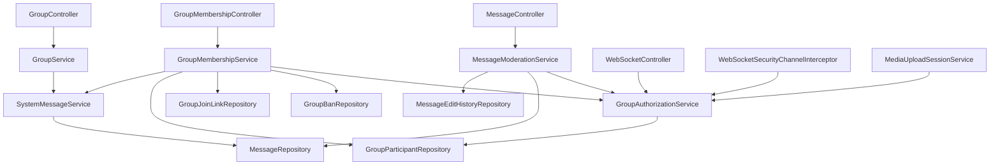

# Group Roles And Permissions

## Intro

This feature adds role-based permissions to each chat group. Today, the backend only knows whether a user is a participant in a group; after this change, each participant will have a deterministic group role that controls moderation, membership management, group settings, and message actions.

The initial static roles are `LEADER`, `CO_LEADER`, `ELDER`, and `MEMBER`. The design should allow more static roles later without moving to user-defined custom roles.

## Functional Requirements

### Roles And Hierarchy

- `LEADER`: exactly one per group. The group creator becomes leader when the group is created.
- `CO_LEADER`: high-trust moderator role with almost the same permissions as leader, except leadership transfer and leader management.
- `ELDER`: trusted member role that can invite/add members and kick allowed targets.
- `MEMBER`: default role for newly joined users.

Role hierarchy:

| Role        | Rank | Notes                                                                      |
| ----------- | ---- | -------------------------------------------------------------------------- |
| `LEADER`    | 1    | Highest role. Exactly one active leader per group.                         |
| `CO_LEADER` | 2    | Can manage users at the same or lower rank, but cannot manage the leader.  |
| `ELDER`     | 3    | Can add members and kick users at the same or lower rank if policy allows. |
| `MEMBER`    | 4    | Default role. Can send messages and manage own messages.                   |

Lower rank number means higher privilege. For future static roles, the backend should define the rank and permissions in code so behavior remains deterministic.

### Permission Matrix

| Action                                      | Leader                | Co-Leader      | Elder          | Member         |
| ------------------------------------------- | --------------------- | -------------- | -------------- | -------------- |
| Read group messages                         | Yes                   | Yes            | Yes            | Yes            |
| Send group messages                         | Yes                   | Yes            | Yes            | Yes            |
| Edit own text message                       | Yes                   | Yes            | Yes            | Yes            |
| Delete own text or media message            | Yes                   | Yes            | Yes            | Yes            |
| Edit another user's text message            | Yes                   | Yes            | No             | No             |
| Edit media message                          | No                    | No             | No             | No             |
| Delete another user's text or media message | Yes                   | Yes            | No             | No             |
| Create/share group join link                | Yes                   | Yes            | Yes            | No             |
| Self-join from valid link                   | Yes, as member        | Yes, as member | Yes, as member | Yes, as member |
| Add members directly                        | Yes                   | Yes            | Yes            | No             |
| Kick members                                | Yes                   | Yes            | Yes            | No             |
| Ban members                                 | Yes                   | Yes            | No             | No             |
| Unban members                               | Yes                   | Yes            | No             | No             |
| Promote/demote roles                        | Yes                   | Yes            | No             | No             |
| Update group name/description               | Yes                   | Yes            | No             | No             |
| Transfer leadership                         | Yes                   | No             | No             | No             |
| Leave group                                 | Yes, with constraints | Yes            | Yes            | Yes            |

Target-role rules:

- A user can only kick, ban, promote, or demote another user with the same role rank or a lower role rank, except that no one can kick, ban, promote, or demote the leader.
- The leader can transfer leadership to any current group member.
- `CO_LEADER` cannot transfer leadership.
- A user cannot kick, ban, promote, or demote themselves. A leader stepping down must use the leadership-transfer flow.
- A banned user cannot rejoin the group until manually unbanned.
- A kicked user can rejoin if they receive or still have a valid join path and are not banned.
- Ban = block, unban = unblock, kick = remove.

### Group Creation And Membership

- When a user creates a group, the creator is inserted into `group_participants` with role `LEADER`.
- Each group must have exactly one active leader.
- Initial invited participants and self-joined participants are inserted with role `MEMBER`.
- Users can self-join a group only through a valid join link.
- Only `LEADER`, `CO_LEADER`, and `ELDER` can create or send a join link.
- A join link must not allow banned users to rejoin.
- Bans are permanent until a privileged user manually unbans the banned user.

### Leadership And Account Lifecycle

- Only the current `LEADER` can transfer leadership.
- The leader can transfer leadership to any current group member.
- A leader cannot leave, delete their account, or become inactive unless they transfer leadership first.
- If the leader is the last member, the group should be archived instead of hard deleted.
- There is no automatic inactive-user process today.
- If automatic inactivity is added later, the fallback should promote the oldest eligible member to leader.

### Group Archive Policy

Use archive/soft-delete instead of hard delete when the last member leaves.

Recommended behavior:

- Keep the group row, participant history, messages, media references, and moderation audit records.
- Mark the group as archived with fields such as `archived_at`, `archived_by`, and `archive_reason`.
- Exclude archived groups from normal active group lists.
- Keep archived group history available only through explicit history/admin/audit flows if the product needs it.

This is better than hard delete because message history, media references, unread/read state, and system events remain consistent. It is also clearer than only "soft delete" because the group did exist and may still be useful for historical/audit reads.

### Message Editing And Deletion

- Active (non-banned) members can edit their own text messages.
- Active (non-banned) members can delete their own text or media messages.
- Kicked or banned users cannot edit or delete their old group messages (membership is required even for own-message actions).
- Public chat messages can still be edited/deleted by their owner without a group membership check.
- `LEADER` and `CO_LEADER` can edit another user's text messages.
- `LEADER` and `CO_LEADER` can delete another user's text or media messages.
- No role can edit media messages. Media messages can only be deleted.
- Message edits must save edit history.
- Message deletion should be soft delete so history, pagination, media references, latest-message behavior, and audit trails remain safe.
- If a privileged user edits someone else's message, the response should include enough metadata for the frontend to show who edited it. The editor's role can be inferred from `updated_by` when needed.

### System Events

Membership and group-management events should appear in chat history as system messages.

Events that should create system messages include:

- User joined the group.
- User left the group.
- User was kicked.
- User was banned.
- User was unbanned, if visible history is desired.
- User was promoted.
- User was demoted.
- Leadership was transferred.
- Group name was updated.
- Group description was updated.
- Group was archived.

System messages should be stored as structured events, not as pre-rendered human text such as `"User1 has been kicked out of the group by User2"`.

Recommended approach:

- Store a `messages` row with `message_type = SYSTEM`.
- Store a stable `SystemEventType` enum value in `messages.content`, not a pre-rendered sentence. The application can use that enum value to infer and render the final user-facing system text.
- Let the application/frontend infer localized display text from the event type and metadata.

### Backend Authorization

- Existing binary membership checks must become permission checks.
- Permission checks should be centralized in a backend service, not repeated ad hoc in controllers and interceptors.
- The authorization service must check both actor permissions and target-role rules.
- WebSocket send, WebSocket subscribe, media upload, group history, mark-read, member management, role management, group settings, and message moderation must all use the same authorization rules.

## Non-Functional Requirements

- **Consistency:** Leadership transfer, role updates, kicks, bans, and archive operations must run in transactions.
- **Race safety:** Exactly-one-leader must be enforced by the database and service logic, not only by application checks.
- **Auditability:** Role changes, membership changes, group updates, message edits, and message deletes must preserve enough metadata for history and investigation.
- **Backward compatibility:** Existing groups must be migrated safely. Existing creators become `LEADER`; other participants become `MEMBER`.
- **Determinism:** Roles are static and code-defined. Future static roles can be added by defining rank and permissions in code.
- **Security:** Banned users must be blocked from direct add, self-join, WebSocket access, media upload, and message history.
- **Frontend support:** Responses should include current user role and enough permissions/role data for role-aware UI gating.
- **Localization readiness:** System messages should be stored as structured events so text can be rendered by the application.

## Use Cases

- Create a group and make the creator the leader.
- Invite initial participants as members.
- Generate/share a join link as leader, co-leader, or elder.
- Self-join a group from a valid join link.
- Add a user directly as leader, co-leader, or elder.
- Kick a user with the same or lower role rank.
- Ban a user with the same or lower role rank and prevent future rejoin.
- Unban a user manually.
- Promote a member to elder or co-leader.
- Demote a co-leader or elder.
- Transfer leadership from the current leader to any member.
- Leave a group.
- Archive the group when the last member leaves.
- Update group name or description.
- Send text and media messages.
- Edit own text message.
- Delete own text or media message.
- Edit another user's text message as leader or co-leader.
- Delete another user's text or media message as leader or co-leader.
- Show structured system events in message history.
- Show role-aware member lists and controls in the frontend.

## Possible Solutions

### 1. How to represent roles and permissions?

#### 1.1. Add Role To `group_participants` And Centralize Permission Checks

- How it works
  - Add a `role` column to `group_participants`.
  - Backfill existing group creators as `LEADER`; backfill all other participants as `MEMBER`.
  - Add a Java enum such as `GroupRole` with explicit rank and permission methods.
  - Add a service such as `GroupAuthorizationService` that evaluates both permissions and target-role rules.
  - Replace direct `existsByGroupAndUser` authorization checks with permission-specific checks.
- Pros
  - Smallest schema change for the current backend.
  - Keeps each user's role scoped to a specific group.
  - Works naturally with the current `GroupParticipant` entity.
  - Supports future static roles by adding enum values, ranks, and permissions in code.
- Cons
  - Permission changes require deployment.
  - Requires careful migration and transaction handling to guarantee exactly one leader.
  - Direct repository membership checks must be replaced consistently to avoid bypasses.
- Recommendation for our problem: Yes

#### 1.2. Add Role And Permission Tables

- How it works
  - Add tables such as `group_roles`, `group_permissions`, and `group_role_permissions`.
  - Store role-to-permission mappings in the database.
  - Assign each participant a role ID.
  - Evaluate permissions by joining role and permission tables.
- Pros
  - More flexible if admins need custom roles or runtime permission changes later.
  - Permission matrix can be inspected or changed without code changes.
- Cons
  - Larger design than the current requirements need.
  - Requires admin UX and stronger validation around editable role definitions.
  - Increases query and caching complexity.
- Recommendation for our problem: No
- When I'd use it
  - Use this only if custom user-defined roles become a product requirement.

#### 1.3. Treat `groups.created_by` As Implicit Leader

- How it works
  - Keep creator in `groups.created_by`.
  - Assign non-leader roles in `group_participants`.
  - Infer leader permissions from `groups.created_by`.
- Pros
  - Avoids an initial creator-role backfill.
- Cons
  - Makes leadership transfer awkward because `created_by` stops meaning "creator".
  - Splits authorization state across `groups` and `group_participants`.
  - Makes the exactly-one-leader invariant less clear.
- Recommendation for our problem: No
- When I'd use it
  - Only for a system where leadership can never transfer.

### 2. How to store visible system events?

#### 2.1. Store Structured `SYSTEM` Messages

- How it works
  - Insert a `messages` row with `message_type = SYSTEM`.
  - Store structured metadata for the event.
  - Render display text in the application layer.
- Pros
  - System events naturally appear in chronological message history.
  - Keeps localization and wording flexible.
  - Avoids storing generated English sentences as source data.
  - Aligns with the existing `SYSTEM` message type reserved in the media-message design.
- Cons
  - Requires `MessageResponse` and frontend rendering changes.
  - Requires a schema decision for event metadata.
- Recommendation for our problem: Yes

#### 2.2. Store Rendered Text In `messages.content`

- How it works
  - Insert a `SYSTEM` message whose `content` is the final display sentence.
- Pros
  - Simple to render.
  - Minimal frontend logic.
- Cons
  - Hard to localize or reword later.
  - User names and role names become baked into historical text.
  - Harder to build filters/audit views from structured event data.
- Recommendation for our problem: No

### 3. How to remove a group when the last member leaves?

#### 3.1. Archive The Group

- How it works
  - Keep the group and messages.
  - Mark the group as archived.
  - Hide archived groups from normal group lists.
- Pros
  - Preserves message history and audit events.
  - Avoids broken references from messages, media, and edit history.
  - Allows future admin/history views.
- Cons
  - Requires active-vs-archived filtering in queries.
  - Requires clear behavior for archived group WebSocket topics and joins.
- Recommendation for our problem: Yes

#### 3.2. Hard Delete The Group

- How it works
  - Delete the group row and cascade or manually delete related rows.
- Pros
  - Removes old data aggressively.
- Cons
  - Conflicts with keeping messages.
  - Can break message history, media references, unread state, and audit trails.
- Recommendation for our problem: No

## High level Architecture/Design

### Component Diagram



### Core entities/models

- `Group`: existing group metadata. Add group description and archive fields if needed:
  - `description`
  - `archived_at`
  - `archived_by`
  - `archive_reason`
- `GroupParticipant`: existing membership row. Add:
  - `role`
  - When a user leaves or is kicked from a group, delete the `group_participants` relationship row instead of preserving an inactive membership row.
- `GroupRole`: enum values `LEADER`, `CO_LEADER`, `ELDER`, `MEMBER`; includes rank and static permission mapping.
- `GroupPermission`: enum values such as `READ_MESSAGES`, `SEND_MESSAGES`, `CREATE_JOIN_LINK`, `ADD_MEMBERS`, `KICK_MEMBERS`, `BAN_MEMBERS`, `MANAGE_ROLES`, `MANAGE_GROUP_DETAILS`, `EDIT_ANY_TEXT_MESSAGE`, `DELETE_ANY_MESSAGE`, `TRANSFER_LEADERSHIP`.
- TODO since GroupRole and GroupPermission are static, we can store them in a static variable as cache and load them from the database during startup.
- `GroupBan`: records permanent bans:
  - `group_id`
  - `user_id`
  - `banned_by`
  - `reason`
  - `banned_at`
  - unique `(group_id, user_id)`
- `GroupJoinLink`: join links generated by privileged users:
  - `group_id`
  - `token_hash`
  - `created_by`
  - `created_at`
  - optional `expires_at`
  - optional `revoked_at`
- `Message`: add moderation/system fields as needed:
  - `updated_by`
  - `updated_at`
  - `deleted_by`
  - `deleted_at`
  - For `SYSTEM` messages, store the `SystemEventType` enum value in `content`.
- `MessageEditHistory`: records text edits:
  - `message_id`
  - `old_content`
  - `updated_by`
  - `updated_at`

Prefer `EnumType.STRING` for persisted enum values. Do not store role weights as integers in the database unless there is a strong reason; keep rank behavior in code.

### API Draft

Groups:

- `POST /api/groups`
  - Create group.
  - Creator becomes `LEADER`.
  - Accept optional `description`.
  - Initial participants become `MEMBER`.
- `GET /api/groups`
  - Return active groups for current user.
  - Include `currentUserRole` (omit `currentUserPermissions`; derive from role or load via details).
- `GET /api/groups/{groupId}`
  - Return group details for the current member.
  - Include `currentUserRole` and `currentUserPermissions`.
- `PATCH /api/groups/{groupId}`
  - Update group name and description.
  - Requires `MANAGE_GROUP_DETAILS`.
  - Creates a structured `SYSTEM` message.
- `GET /api/groups/{groupId}/members`
  - List members with roles.
  - Requires membership.
  - Supports pagination via `page` (default `0`) and `size` (default `100`, max `100`).
  - Supports optional search via `q` against member `username` and `fullname` (case-insensitive substring).
  - Returns a page payload: `content`, `page`, `size`, `totalElements`, `totalPages`, `hasNext`.

Join links:

- `GET /api/groups/{groupId}/join-links`
  - List join links for the group (metadata only; `token` is null because only the hash is stored).
  - Requires `CREATE_JOIN_LINK`.
- `POST /api/groups/{groupId}/join-links`
  - Create a join link.
  - Requires `CREATE_JOIN_LINK`.
  - Returns the raw `token` once at creation time.
- `POST /api/groups/join-links/{token}/join`
  - Self-join from a valid link.
  - Adds user as `MEMBER`.
  - Rejects banned users and archived groups.
- `DELETE /api/groups/{groupId}/join-links/{joinLinkId}`
  - Revoke a join link.
  - Requires `CREATE_JOIN_LINK`.

Membership:

- `GET /api/groups/{groupId}/addable-users`
  - List users who can be added to the group (not already members, not banned).
  - Requires `ADD_MEMBERS`.
  - Optional search via `q` against `username` and `fullname` (case-insensitive substring).
  - Returns at most 500 users (no pagination); refine `q` to narrow further.
  - Used by the add-member dialog; prefer this over `GET /api/groups/users` for that flow.
- `POST /api/groups/{groupId}/members`
  - Add a user directly as `MEMBER`.
  - Requires `ADD_MEMBERS`.
  - Rejects banned users and archived groups.
- `DELETE /api/groups/{groupId}/members/{userId}`
  - Kick a user.
  - Requires `KICK_MEMBERS`.
  - Requires actor to be allowed to manage the target role.
  - Creates a structured `SYSTEM` message.
- `POST /api/groups/{groupId}/bans`
  - Ban a user and delete their participant row if present.
  - Requires `BAN_MEMBERS`.
  - Requires actor to be allowed to manage the target role.
  - Creates a structured `SYSTEM` message.
- `GET /api/groups/{groupId}/bans`
  - List banned users for the group.
  - Requires `UNBAN_MEMBERS`.
- `DELETE /api/groups/{groupId}/bans/{userId}`
  - Manually unban a user.
  - Requires `UNBAN_MEMBERS`.
  - Creates a structured `SYSTEM` message.
- `PATCH /api/groups/{groupId}/members/{userId}/role`
  - Promote or demote a participant.
  - Requires `MANAGE_ROLES`.
  - Requires actor to be allowed to manage the target role.
  - Creates a structured `SYSTEM` message.
- `POST /api/groups/{groupId}/leadership-transfer`
  - Transfer leadership from current leader to another participant.
  - Requires current user to be `LEADER`.
  - Creates a structured `SYSTEM` message.
- `DELETE /api/groups/{groupId}/members/me`
  - Leave group.
  - If current user is leader and not last member, reject with "transfer leadership first".
  - If current user is the last member, archive the group.
  - Creates a structured `SYSTEM` message.

Messages:

- `PATCH /api/messages/{messageId}`
  - Edit a text message.
  - Sender can edit own text message.
  - Leader/co-leader can edit another user's text message.
  - Reject media messages.
  - Save edit history.
- `DELETE /api/messages/{messageId}`
  - Soft-delete a text or media message.
  - Sender can delete own message.
  - Leader/co-leader can delete another user's message.
- `GET /api/messages/groups/{groupId}`
  - Include `SYSTEM` messages in chronological history.
  - Return structured system-event `content` for application-level rendering.

WebSocket:

- `/group.send`
  - Requires `SEND_MESSAGES`.
- `/topic/group.{groupId}`
  - Subscribe requires `READ_MESSAGES`.
- `/topic/user.{username}.group-updates`
  - Subscribe must validate authenticated username matches the topic username.
- Group membership, role, and system-message events should be published so online clients update without refresh.

### Backend Enforcement Points

Replace direct authorization uses of `existsByGroupAndUser` outside repositories with `GroupAuthorizationService`.

Known enforcement points:

- `MessageController.getGroupMessages`: require `READ_MESSAGES`.
- `WebSocketController.sendGroupMessage`: require `SEND_MESSAGES`.
- `WebSocketSecurityChannelInterceptor.validateSubscription`: require `READ_MESSAGES` for group topics.
- `MediaUploadSessionService.validateScopeAndMembership`: require `SEND_MESSAGES`.
- `GroupService.markGroupAsRead`: require membership/read access.
- `GroupSummaryUpdatePublisher`: ensure removed or banned users stop receiving personal updates.
- New join-link endpoints: require `CREATE_JOIN_LINK` for link creation and ban/archive checks for joining.
- New member-management endpoints: require action-specific permissions and target-role checks.
- New group update endpoints: require `MANAGE_GROUP_DETAILS`.
- New message edit/delete endpoints: require own-message permission or moderation permission.

## Recommendation

Recommendation path:

1. Phase 1: Add role, ban, archive, join-link, and system-event schema with safe backfill.
2. Phase 2: Add centralized group authorization service and replace existing membership checks.
3. Phase 3: Add member list, join-link, self-join, add member, kick, ban, unban, promote, demote, leave, and transfer-leadership APIs.
4. Phase 4: Add group details update APIs and response DTO changes for role-aware UI.
5. Phase 5: Add structured system messages for membership, role, and group-profile events.
6. Phase 6: Add text edit and text/media delete moderation APIs, edit history, soft delete, and response DTO updates.
7. Phase 7: Build group details/settings UI on top of `GET /api/groups`, `GET /api/groups/{groupId}`, and `PATCH /api/groups/{groupId}`.
8. Phase 8: Build member-list and role-visibility UI on top of `GET /api/groups/{groupId}/members` and the role/permission DTO fields from Phase 4.
9. Phase 9: Build membership-management UI for add, kick, ban, unban, promote, demote, transfer-leadership, and leave-group flows from the Phase 3 APIs.
10. Phase 10: Build join-link management and self-join UI on top of the Phase 3 join-link APIs.
11. Phase 11: Build message moderation UI for edit/delete on top of `PATCH /api/messages/{messageId}` and `DELETE /api/messages/{messageId}`.
12. Phase 12: Re-introduce real-time notifications only after the above UI exists and can be manually exercised, split into membership, role, profile, moderation, access-revocation, and archived-group tasks.
13. Phase 13: Add integration/E2E tests for the role matrix, edge cases, UI flows, and realtime behavior.

## Implementation details

Phases 1, 2, 3, 4, 5, 6, and 7 have been implemented. Later phases are still draft-only.

Planned implementation is Solution 1: add role to `group_participants`, add `group_bans`, add join links, archive groups instead of hard deleting them, store structured system events as `SYSTEM` messages, and centralize permissions in a backend authorization service.

### Phase 1: Schema And Entity Changes

Status: Implemented.

What changed:

- Added Flyway migration `V8__add_group_roles_and_permissions_phase1.sql`.
- Added rollback migration `down/U8__drop_group_roles_and_permissions_phase1.sql`.
- Added `role varchar(32) not null default 'MEMBER'` to `group_participants`.
- Backfilled each existing group's creator participant row as `LEADER`.
- Backfilled all other existing participants as `MEMBER`.
- Updated group creation so new group creators are stored as `LEADER`.
- Added a partial unique index to enforce one leader per group:

```sql
CREATE UNIQUE INDEX ux_group_participants_one_leader
ON public.group_participants (group_id)
WHERE role = 'LEADER';
```

- Added `group_bans` with unique `(group_id, user_id)`.
- Added `group_join_links` for future self-join links.
- Added group `description`, `archived_at`, `archived_by`, and `archive_reason` fields.
- Added message edit/delete audit fields to `messages`.
- System messages now use `message_type = SYSTEM` and store the `SystemEventType` enum value in `messages.content`, without extra system-event columns.
- Added `message_edit_history`.
- Added Java enum `GroupRole`.
- Added JPA entities `GroupBan`, `GroupJoinLink`, and `MessageEditHistory`.
- Updated `Group`, `GroupParticipant`, and `Message` entities for the new columns.

Why it changed:

- Phase 1 creates the data foundation for later authorization, membership management, join links, group archive, message moderation, and structured system events.
- The creator-as-leader write path was included now so new groups created after the migration do not start without a leader.

API/contract/config impacts:

- No new public API is available yet.
- Existing group creation now writes the creator's participant role as `LEADER`.
- Existing responses do not yet expose role, archive, moderation, or system-event metadata.
- Flyway migration must be applied before running the backend with Hibernate schema validation.

Rollout, migration, and backward-compatibility notes:

- Existing group creators are backfilled as `LEADER`.
- Existing non-creator participants remain `MEMBER`.
- Existing groups are not archived by default.
- Existing messages keep null edit/delete/system-event metadata.
- Rollback removes the Phase 1 tables, indexes, and columns, including role data.

### Phase 2: Authorization Service

Status: Implemented.

What changed:

- Added `GroupRole` and `GroupPermission` enums.
- Added `GroupAuthorizationService`.
- Added `GroupBanRepository` so the authorization layer can reject banned users centrally.
- Encoded current static role permissions in code for `LEADER`, `CO_LEADER`, `ELDER`, and `MEMBER`.
- Implemented these authorization methods:
  - `requireMember(user, groupId)`
  - `requirePermission(user, groupId, permission)`
  - `requireCanManageTarget(actor, groupId, target, permission)`
  - `requireCanEditMessage(user, message)` / `requireCanDeleteMessage(user, message)`: for group messages, require active (non-banned) membership even when the actor owns the message; public messages remain owner-only.
  - `requireNotBanned(user, groupId)`
  - `requireUserTopicAccess(user, topicUsername)`
- Replaced direct membership checks with `GroupAuthorizationService` in:
  - `MessageController`
  - `WebSocketController`
  - `WebSocketSecurityChannelInterceptor`
  - `MediaUploadSessionService`
  - `GroupService.markGroupAsRead`
- Added unit tests for `GroupAuthorizationService`.

Why it changed:

- Authorization rules now live in one place instead of being duplicated across controllers, services, and WebSocket code.
- This reduces drift and creates a single service that later phases can reuse for join links, member management, role changes, and moderation APIs.

API/contract/config impacts:

- No new public API endpoints were added in Phase 2.
- Existing read/send/upload/mark-read behavior now goes through permission checks rather than raw membership checks.
- Personal topic subscriptions `/topic/user.{username}.group-updates` are now validated against the authenticated username.
- Protected group access now resolves membership directly from `group_participants`, **so invalid `groupId` and non-membership are treated the same** unless a later feature explicitly needs a separate existence check.

Rollout, migration, and backward-compatibility notes:

- No schema changes were needed for Phase 2 beyond the Phase 1 schema foundation.
- Current permission behavior for existing features remains effectively the same because all current roles can read/send, while higher-privilege permissions are now encoded for future phases.

### Phase 3: Membership Management

Status: Implemented.

What changed:

- Added request/response DTOs for member, role, ban, join-link, and leadership-transfer APIs.
- Added `GroupJoinLinkRepository`.
- Expanded `GroupParticipantRepository` with group member list, participant lookup, and participant count queries.
- Added `GroupMembershipService`.
- Added `GroupMembershipController` as the single controller for member management and join-link operations.
- Implemented:
  - member list
  - direct add member
  - join-link creation
  - self-join by token
  - join-link revocation
  - kick member
  - ban member
  - unban member
  - promote/demote member role
  - leave group
  - leadership transfer
- Rejects banned users in direct add and self-join flows.
- Rejects membership changes for archived groups.
- Archives a group when the last member leaves.
- Serializes last-member leave/archive against concurrent `addMember` / `joinByToken` with a pessimistic lock on the group row (`findByIdForUpdate`) so a join cannot land in a group that is being archived.
- Membership/role mutations acquire that same group lock **before** authorization so a concurrent demotion cannot leave a former privileged member authorized to mutate; join-by-token also revalidates the link under the lock so concurrent revocation cannot admit a member from stale token state (see [24_MEMBERSHIP_MUTATION_AUTH_LOCK_ORDER.md](./24_MEMBERSHIP_MUTATION_AUTH_LOCK_ORDER.md)).
- Deletes the `group_participants` relationship when a user leaves, is kicked, or is banned.
- Ensures transfer leadership updates the old leader to `MEMBER` before assigning `LEADER` to the new leader.
- Ensures kick, ban, promote, and demote checks compare actor and target role ranks.

Why it changed:

- This phase exposes the role and membership lifecycle APIs that the frontend needs for group moderation.
- `GroupMembershipController` owns join-link endpoints too, so the API surface stays grouped around membership instead of splitting into a separate join controller.

API/contract/config impacts:

- Added `GET /api/groups/{groupId}/members`.
- Added `POST /api/groups/{groupId}/members`.
- Added `DELETE /api/groups/{groupId}/members/{userId}`.
- Added `DELETE /api/groups/{groupId}/members/me`.
- Added `PATCH /api/groups/{groupId}/members/{userId}/role`.
- Added `POST /api/groups/{groupId}/bans`.
- Added `GET /api/groups/{groupId}/bans`.
- Added `DELETE /api/groups/{groupId}/bans/{userId}`.
- Added `POST /api/groups/{groupId}/leadership-transfer`.
- Added `POST /api/groups/{groupId}/join-links`.
- Added `GET /api/groups/{groupId}/join-links`.
- Added `DELETE /api/groups/{groupId}/join-links/{joinLinkId}`.
- Added `POST /api/groups/join-links/{token}/join`.
- Join links return the raw token only when created; only `token_hash` is stored.

Rollout, migration, and backward-compatibility notes:

- No additional schema migration was needed beyond Phase 1.
- Phase 3 does not emit `SYSTEM` messages yet. Visible membership and role-change system messages are still planned for Phase 5.

### Phase 4: Group Details And DTOs

Status: Implemented.

What changed:

- Extended `CreateGroupRequest` so new groups can include an optional `description`.
- Added `UpdateGroupRequest`.
- Extended `GroupResponse` with:
  - `description`
  - `currentUserRole`
  - `currentUserPermissions`
- Added `GET /api/groups/{groupId}` for member-scoped group details.
- Added `PATCH /api/groups/{groupId}` for name/description updates.
- Updated group creation, group list, and group detail responses to include role-aware frontend gating data.
- Filtered archived groups out of the normal `GET /api/groups` list query.
- Kept member list responses returning role, joined time, and user summary fields introduced in Phase 3.
- Slimmed `PATCH /api/groups/{groupId}` so it returns group metadata only (no `unreadCount`, `currentUserRole`, or `currentUserPermissions` refresh); those values are unchanged by name/description edits and the client keeps its existing copies.
- Slimmed `GET /api/groups` so list items include `currentUserRole` and unread counts but omit `currentUserPermissions` (permissions are role-derived and returned by `GET /api/groups/{groupId}` when needed).
- Slimmed `GET /api/groups/{groupId}` so it returns role/permissions for the details UI but does not load or return authoritative `unreadCount` (unread stays on the sidebar list / realtime path).

Why it changed:

- The frontend needs the current user’s role and permissions on each group payload so it can show or hide moderation and settings controls without extra round trips.
- Group metadata now needs a dedicated read/update path beyond the basic list response.
- Archived groups should not appear in the normal active group list.
- Recomputing unread/role/permission fields on every group-profile edit is redundant work for fields this mutation does not change.
- Expanding the full permission list on every sidebar group is redundant with `currentUserRole` and wastes work for a surface that does not need permission chips.
- Detail view is opened from an already-selected chat, so recomputing unread there is unnecessary.

API/contract/config impacts:

- `POST /api/groups` now accepts optional `description`.
- Added `GET /api/groups/{groupId}`.
- Added `PATCH /api/groups/{groupId}`.
- `GroupResponse` now includes `description`, `currentUserRole`, and `currentUserPermissions`.
- `GET /api/groups` now returns only active (non-archived) groups.
- `GET /api/groups` returns `currentUserRole` but leaves `currentUserPermissions` empty; use `GET /api/groups/{groupId}` for the permission list.
- `GET /api/groups/{groupId}` returns role/permissions; treat `unreadCount` on that response as unset (defaults to `0`) and keep the list/sidebar value.
- `PATCH /api/groups/{groupId}` still uses `GroupResponse`, but callers should treat role/permission/unread fields on that response as unset and preserve prior client state.

Rollout, migration, and backward-compatibility notes:

- No new schema migration was needed because `groups.description` and archive fields were already added in Phase 1.
- Existing clients that ignore new JSON fields remain compatible.
- Clients that blindly replace local group state from the PATCH body should stop overwriting unread/role/permission fields from that response.

### Phase 5: Structured System Messages

Status: Implemented.

What changed:

- Added `SystemMessageService`.
- Persisted `SYSTEM` messages for:
  - join
  - leave
  - kick
  - ban
  - unban
  - promote
  - demote
  - leadership transfer
  - group name update
  - group description update
  - group archive
- Kept `messages.content` as the stable `SystemEventType` value.
- Exposed system-message metadata in `MessageResponse` / `MessageResponseMapper` so the frontend can render inferred text.
- Updated the frontend chat message model/rendering to use structured system-event metadata when available.

Why it changed:

- Membership and group-profile actions should appear in chat history as durable events.
- The frontend needs structured event metadata instead of pre-rendered English sentences in persisted message rows.

API/contract/config impacts:

- Group message history now includes persisted `SYSTEM` messages for membership and group-profile events.
- `MessageResponse` now includes `systemEventType` and `systemEventActor` for structured system-event rendering.
- Group latest-message summaries now use derived system previews like `Member joined` or `Group archived`.

Rollout, migration, and backward-compatibility notes:

- No new schema migration was needed because Phase 1 already reserved `SYSTEM` messages and audit fields.
- Legacy transient `[SYSTEM] ...` WebSocket notifications still work; the frontend now prefers structured metadata when present.

### Phase 6: Message Moderation

Status: Implemented.

What changed:

- Added `PATCH /api/messages/{messageId}` for text-message edits.
- Added `DELETE /api/messages/{messageId}` for soft delete.
- Added `MessageModerationService`.
- Added `MessageEditHistoryRepository`.
- Persisted a `MessageEditHistory` row for every successful text edit.
- Extended `MessageResponse` / `MessageResponseMapper` with:
  - `updatedBy`
  - `updatedAt`
  - `deletedBy`
  - `deletedAt`
- Hid deleted message content and attachments from API responses while keeping the row for history/audit purposes.
- Refreshed group latest-message summaries after edits/deletes via `MessageService.refreshGroupLatestMessage` so `groups.latest_message*` stays coherent (see `docs/05_GROUP_LATEST_MESSAGE_UPDATE_STRATEGY.md`). This updates the DB only; realtime sidebar fan-out for other clients is Task 12.4.
- Updated frontend chat message rendering to show deleted placeholders and edited markers.

Why it changed:

- Message edits and deletes need permission-aware moderation behavior without losing chronology or audit history.
- Soft delete keeps pagination, ordering, and message history stable while preventing deleted content/media from being re-served to clients.

API/contract/config impacts:

- Added `PATCH /api/messages/{messageId}`.
- Added `DELETE /api/messages/{messageId}`.
- `MessageResponse` now includes edit/delete metadata.
- Deleted messages now return null content and no attachments, plus `deletedBy` / `deletedAt`.

Rollout, migration, and backward-compatibility notes:

- No new schema migration was needed because Phase 1 already added message moderation audit fields and `message_edit_history`.
- Older clients that ignore the new response fields remain compatible, but they will not show edit/delete state unless updated.

### Phase 7: Group Details And Settings UI

Status: Implemented.

What changed:

- Added a small group details/settings dialog for the currently selected group chat.
- The dialog now shows:
  - group name
  - group description
  - current user role
  - current user permissions
- Added frontend API helpers for:
  - `GET /api/groups`
  - `GET /api/groups/{groupId}`
  - `PATCH /api/groups/{groupId}`
- Wired role-aware edit affordances from `currentUserRole` / `currentUserPermissions`.
- Added name/description edit UI for users who have `MANAGE_GROUP_DETAILS`.
- Kept this phase intentionally small: it does not include member actions, join links, or moderation controls yet.

Why it changed:

- Phase 4 already exposed the data and API contracts needed for a basic settings UI.
- The product needed a real UI entry point to manually exercise role-aware group metadata before moving on to member-management, moderation, or realtime work.

API/contract/config impacts:

- The frontend now consumes `GET /api/groups/{groupId}` directly for the selected group's details dialog.
- The frontend now consumes `PATCH /api/groups/{groupId}` for group name/description edits.
- No backend schema or contract changes were required beyond the Phase 4 DTO/API work that was already implemented.

Rollout, migration, and backward-compatibility notes:

- No schema migration was needed.
- Older clients remain compatible; they just will not show the new group-details/settings surface until updated.

### Phase 8: Member List And Role Visibility UI

Status: Implemented.

What changed:

- Added frontend API helper for `GET /api/groups/{groupId}/members`.
- Extended the members API with pagination (`page`, `size`; default/max size `100`) and optional search (`q` on username/fullname).
- Added `GroupMemberPageResponse` so the API returns a stable page payload instead of a bare list.
- Added `GroupMember` / `GroupRole` / `GroupMemberPage` types and small role-rank helpers for UI gating previews.
- Extended the group details dialog with three distinct sections (top to bottom):
  - group name/description profile
  - current-user role, permissions, and visible-control previews
  - searchable/paginated member roster
- Added member-list search and infinite scroll so the UI loads members page by page as the user scrolls.
- Styled the dialog and sections with app theme CSS variables so light and dark themes both apply.
- Kept this phase read-only: no kick/ban/promote/leave/join-link mutation controls yet.

Why it changed:

- The product needed a low-risk UI slice to inspect roles and membership state before wiring Phase 9 mutations.
- This also validates the Phase 3 member DTOs and Phase 4 permission data in the real group-details surface.
- Pagination and search keep the roster usable as groups grow without loading every member up front.

API/contract/config impacts:

- The frontend now consumes `GET /api/groups/{groupId}/members` from the group details dialog.
- `GET /api/groups/{groupId}/members` now returns a page object instead of a raw array.
- Query params: `q` (optional), `page` (default `0`), `size` (default `100`, capped at `100`).
- No new DB indexes were added for username/fullname search. Username already has a unique index; this endpoint always filters by `group_id` first (covered by `uk_group_participants_group_user`). Substring `LIKE '%term%'` would not use a plain B-tree on `fullname` anyway.

Rollout, migration, and backward-compatibility notes:

- No schema migration was needed.
- Clients that expected a bare JSON array from `/members` must switch to the page payload's `content` field.
- Older clients remain compatible for the settings surface; they just will not show the member roster until updated.

### Phase 9: Membership Management UI

Status: Implemented.

What should change:

- Add role-aware controls for the Phase 3 membership APIs, split into four smaller tasks.
- Make sure UI gating follows the backend permission matrix instead of duplicating custom frontend-only rules.
- Add confirmation/error UX for destructive actions where needed.

Tasks:

#### Task 9.1: Add And Remove Member

Status: Implemented.

What changed:

- Added frontend API helpers for `POST /api/groups/{groupId}/members` and `DELETE /api/groups/{groupId}/members/{userId}`.
- Added `GET /api/groups/{groupId}/addable-users` so the add-member picker only shows users who are not already members and not banned (requires `ADD_MEMBERS`).
- `addable-users` supports optional `q` search (username/fullname) and caps results at 500 with no pagination.
- Added an Add Members dialog in the group details member section for users with `ADD_MEMBERS`; it uses `addable-users` instead of `GET /api/groups/users`.
- Added a remove/kick action on manageable roster rows with confirmation.
- Refreshes or updates the local roster after a successful add/kick.
- Removed Phase 8 "Manageable" / "Out of reach" preview chips in favor of real actions.

#### Task 9.2: Ban And Unban

Status: Implemented.

What changed:

- Added `GET /api/groups/{groupId}/bans` (requires `UNBAN_MEMBERS`) so the UI can show who is banned.
- Added frontend API helpers for ban, list bans, and unban.
- Added a Ban action on manageable roster rows with confirmation and optional reason (`BAN_MEMBERS` + target-role rules).
- Added a Banned users section in group details with Unban + confirmation (`UNBAN_MEMBERS`).
- Icon-only ban/kick/unban controls expose `title` and `aria-label` for hover/accessibility.

#### Task 9.3: Leave Group

Status: Implemented.

What changed:

- Added frontend API helper for `DELETE /api/groups/{groupId}/members/me`.
- Added a Leave group section in group details with confirmation.
- Leaders with other members remaining are blocked in the confirm dialog (must transfer first); last-member leave warns that the group will be archived.
- After a successful leave, closes group details, removes the group from the sidebar, and navigates to public chat.

#### Task 9.4: Update Role And Leadership Transfer

Status: Implemented.

What changed:

- Added frontend API helpers for `PATCH /api/groups/{groupId}/members/{userId}/role` and `POST /api/groups/{groupId}/leadership-transfer`.
- Added Change role on manageable roster rows (`MANAGE_ROLES` + target-role rules); assignable roles exclude `LEADER` and stay at/below the actor's privilege.
- Added Transfer leadership on other members for the current leader (`TRANSFER_LEADERSHIP`), with confirmation.
- After transfer, refreshes group details so the former leader's role/permissions update in the UI.
- Icon-only role/transfer controls expose `title` and `aria-label`.

Out of scope for Phase 9:

- Join-link create/revoke/self-join stays in Phase 10

Why this phase exists:

- Phase 3 already built the core group-management APIs, but they are not product-usable until the UI can call them.
- Splitting these actions from the member-list phase keeps the rollout small and easier to debug.
- Four smaller tasks keep add/kick, ban/unban, leave, and role/leadership changes independently reviewable.

### Phase 10: Join Link Management And Self-Join UI

Status: Implemented.

What should change:

- Add role-aware join-link UI on top of the Phase 3 join-link APIs, split into two smaller tasks.
- Show expiry/revocation state clearly when the UI exposes join-link history.
- Keep self-join as a separate journey from link creation/management.

Tasks:

#### Task 10.1: Create And Manage Join Links

Status: Implemented.

What changed:

- Added `GET /api/groups/{groupId}/join-links` (requires `CREATE_JOIN_LINK`) for join-link history metadata; raw `token` remains create-only because only the hash is stored.
- Added frontend helpers for list/create/revoke join links.
- Added a Join links section in group details for users with `CREATE_JOIN_LINK`: optional expiry, create, copy token, revoke active links, and active/expired/revoked status.
- Join-link `expiresAt` is an absolute UTC instant end-to-end (`timestamptz` / `Instant` / ISO-8601 with `Z`) so browser-local wall-clock values cannot disagree with server `Instant.now()` validation.
- Icon-only copy/revoke controls expose `title` and `aria-label`.

Rollout / migration notes:

- Flyway `V9__join_link_expires_at_timestamptz.sql` converts `group_join_links.expires_at` to `timestamptz`, treating existing naive timestamps as UTC.

#### Task 10.2: Join Group Via Link

Status: Implemented.

What changed:

- Join response now includes `groupId` / `groupName` so the UI can open the joined group.
- Added `joinGroupByToken` FE helper for `POST /api/groups/join-links/{token}/join`.
- Added `/join` and `/join/:token` entry points with paste-token UX; unauthenticated users are sent to login with a safe redirect back to the join URL.
- Sidebar “Join with link” opens the join screen; successful joins navigate to `/group/{groupId}`.
- Create/manage join links now copy a full `/join/{token}` share URL.
- Error bodies for banned/expired/revoked/archived cases are shown in the join UI.

Why this phase exists:

- Join links are a distinct user journey from direct member management and deserve their own small UI phase.
- Splitting create/manage from self-join keeps each task independently reviewable.
- It also gives us a focused place to verify banned/archive join rejection behavior before realtime is added.

### Phase 11: Message Moderation UI

Status: Implemented.

What changed:

- Added message action UI on chat bubbles for:
  - edit own text messages
  - delete own text or media messages
  - leader/co-leader moderation via `EDIT_ANY_TEXT_MESSAGE` / `DELETE_ANY_MESSAGE`
- Added inline edit UX with save/cancel and error feedback.
- Added delete confirmation before soft-deleting a message.
- After successful edit/delete, locally updates the open message list and refreshes the group latest-message sidebar preview when the moderated message is current/latest.
- Shows `(edited)` / `(edited by …)` markers using existing Phase 6 response metadata.

Why it changed:

- Phase 6 already exposed the moderation APIs; the product needed a normal UI path to exercise edit/delete before realtime work.

API/contract/config impacts:

- Frontend now calls `PATCH /api/messages/{messageId}` and `DELETE /api/messages/{messageId}` from the chat message menu.
- No backend contract changes were required beyond Phase 6.

Rollout, migration, and backward-compatibility notes:

- No schema migration was needed.
- Older clients remain compatible; they simply will not show message action menus until updated.

### Phase 12: Real-Time Notifications

Status: Planned.

What should change:

- Re-introduce WebSocket updates for the finished UI flows from Phases 7-11, split into smaller tasks by event domain.
- Keep the implementation intentionally smaller than the reverted attempt: only add the realtime paths needed by those finished UI flows.
- Prefer publishing after the existing REST/service mutations succeed, so each task can be manually exercised from the current UI.
- Personal topic subscription validation (`/topic/user.{username}.group-updates` must match the authenticated username) was already added in Phase 2; Phase 12 should rely on that rather than rebuild it.

Tasks:

#### Task 12.1: Membership Change Notifications

Status: Implemented.

What changed:

- Added `GroupMembershipRealtimePublisher` to publish membership events **after commit**:
  - structured `SYSTEM` `MessageResponse` to `/topic/group.{groupId}` (local + RabbitMQ)
  - sidebar `GroupSummaryUpdate` fan-out to remaining members (includes group `name` + System latest preview)
  - immediate personal `removed` update to kicked/banned/leaving users via new `GroupSummaryUpdatePublisher.publishToUser`
- Wired membership mutations in `GroupMembershipService`:
  - add member
  - join via link (new join only)
  - kick
  - ban / unban
  - leave (including last-member `GROUP_ARCHIVED` system line)
- Frontend `GroupSummaryUpdate` now accepts `removed`, `name`, and related fields.
- `ChatPage` sidebar handler:
  - drops groups on `removed` and navigates to public when that chat is open
  - inserts unknown groups on add/join summary updates so the joiner sidebar updates without refresh
- Open group chats already upsert incoming topic messages, so membership `SYSTEM` lines appear live once published.

Why it changed:

- Phase 9/10 membership UI already mutated state over REST; online peers still needed WebSocket delivery for chat lines and sidebar membership presence.

API/contract/config impacts:

- No new REST endpoints.
- Personal topic payload may now include `removed=true` and `name` for membership-driven summary updates.

Rollout, migration, and backward-compatibility notes:

- Older clients that ignore unknown `GroupSummaryUpdate` fields remain compatible; they simply will not drop/insert sidebar rows until updated.
- Force-closing an already-open `/topic/group.{id}` subscription for removed users remains Task 12.5.

#### Task 12.2: Role Change Notifications

Status: Planned.

What should change:

- Publish realtime updates when roles change:
  - promote / demote (`PATCH .../role`)
  - leadership transfer
- Online clients should update without refresh:
  - member-role visibility where the roster is open
  - current-user role/permissions when the actor or target is affected
  - open group chat when the corresponding structured `SYSTEM` message is created

#### Task 12.3: Group Profile Change Notifications

Status: Planned.

What should change:

- Publish realtime updates when group profile metadata changes:
  - group name
  - group description
  - archive (when triggered by last-member leave or explicit archive paths already in the product)
- Online clients should update without refresh:
  - sidebar group name / ordering cues where relevant
  - open group details / header
  - open group chat when the corresponding structured `SYSTEM` message is created

#### Task 12.4: Message Moderation Notifications

Status: Planned.

What should change:

- Publish realtime updates for Phase 11 moderation actions:
  - text message edit (`PATCH /api/messages/{messageId}`)
  - soft delete (`DELETE /api/messages/{messageId}`)
- Online clients in the open chat should upsert the moderated message (edited state or deleted placeholder) without refresh.
- When the moderated message is the group's latest message, fan out an updated group-summary preview on the personal topic path.

#### Task 12.5: Access Revocation For Removed Or Banned Users

Status: Planned.

What should change:

- Ensure kicked or banned users stop receiving:
  - personal group-summary updates for that group
  - further useful realtime delivery on `/topic/group.{groupId}` for that group
- Validate subscribe/send authorization continues to reject removed/banned users via `GroupAuthorizationService`.
- Validate message edit/delete authorization rejects removed/banned users even for their own old group messages (`requireCanEditMessage` / `requireCanDeleteMessage` require membership).
- Keep this task focused on revocation semantics so Tasks 12.1-12.4 can reuse one clear rule instead of ad hoc per-event cleanup.

#### Task 12.6: Archived Group Realtime Guards

Status: Planned.

What should change:

- Ensure archived groups no longer accept:
  - WebSocket sends
  - WebSocket subscriptions to the group topic
  - joins that would re-open active realtime participation
- Align archived-group rejection behavior with the existing REST/join guards so REST and realtime stay consistent.

Out of scope for Phase 12:

- Broad redesign of group-summary fan-out scaling (see `11_GROUP_SUMMARY_UPDATE_FANOUT_SCALING.md`)
- Full E2E/realtime matrix coverage (Phase 13)
- Rebuilding personal-topic username validation already delivered in Phase 2

Why this phase exists:

- Realtime is much easier to validate once each underlying action already has a working UI path.
- Splitting by membership, roles, profile, moderation, revocation, and archive guards keeps each task independently reviewable and reduces the risk of rebuilding the previously reverted large realtime layer all at once.

### Phase 13: Tests

Status: Planned.

What should change:

- Test group creator becomes leader.
- Test new participants and self-joined users become members.
- Test exactly-one-leader invariant and leadership transfer to any member.
- Test co-leader cannot transfer leadership or manage leader.
- Test role matrix for join links, add, kick, ban, unban, promote, demote, group update, send message, edit message, and delete message.
- Test actor can manage only same-rank or lower-rank target roles, excluding leader.
- Test kicked users can rejoin when invited or using a valid join link.
- Test banned users cannot rejoin or be added until manually unbanned.
- Test elder can create join links, add members, and kick allowed targets.
- Test leader cannot leave/delete account without transfer unless last member.
- Test last-member leave archives the group and preserves messages.
- Test structured system messages are returned in group history.
- Test WebSocket subscribe/send checks.
- Test media upload respects `SEND_MESSAGES`.
- Add UI/E2E coverage for the new frontend phases:
  - group settings edit flow
  - member-list visibility by role
  - membership-management actions
  - join-link creation/revocation/join
  - message edit/delete actions
  - realtime sidebar/chat updates after Phase 12 lands

## Future Higher-Scale Path

- Add a dedicated audit/event table for all membership and moderation actions if system messages are not enough for admin investigation.
- Add more static roles by extending `GroupRole` rank and permission mappings in code.
- Move from hard-coded roles to configurable role-permission tables only if custom roles become a product requirement.
- Cache group roles/permissions for hot WebSocket paths if database checks become too expensive.
- Revisit per-user group summary fan-out from `11_GROUP_SUMMARY_UPDATE_FANOUT_SCALING.md` before supporting very large groups.
