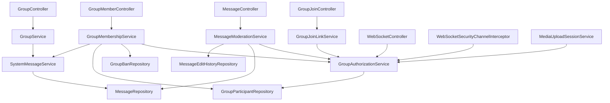

# Group Roles And Permissions

## Intro

This feature adds role-based permissions to each chat group. Today, the backend only knows whether a user is a participant in a group; after this change, each participant will have a deterministic group role that controls moderation, membership management, group settings, and message actions.

The initial static roles are `LEADER`, `CO_LEADER`, `ELDER`, and `MEMBER`. The design should allow more static roles later without moving to user-defined custom roles.

## Functional Requirements

### Roles And Hierarchy

- `LEADER`: exactly one per group. The group creator becomes leader when the group is created.
- `CO_LEADER`: high-trust moderator role with almost the same permissions as leader, except leadership transfer and leader management.
- `ELDER`: trusted member role that can invite/add members and kick allowed targets.
- `MEMBER`: default role for newly joined users.

Role hierarchy:

| Role        | Rank | Notes                                                                      |
| ----------- | ---- | -------------------------------------------------------------------------- |
| `LEADER`    | 1    | Highest role. Exactly one active leader per group.                         |
| `CO_LEADER` | 2    | Can manage users at the same or lower rank, but cannot manage the leader.  |
| `ELDER`     | 3    | Can add members and kick users at the same or lower rank if policy allows. |
| `MEMBER`    | 4    | Default role. Can send messages and manage own messages.                   |

Lower rank number means higher privilege. For future static roles, the backend should define the rank and permissions in code so behavior remains deterministic.

### Permission Matrix

| Action                                      | Leader                | Co-Leader      | Elder          | Member         |
| ------------------------------------------- | --------------------- | -------------- | -------------- | -------------- |
| Read group messages                         | Yes                   | Yes            | Yes            | Yes            |
| Send group messages                         | Yes                   | Yes            | Yes            | Yes            |
| Edit own text message                       | Yes                   | Yes            | Yes            | Yes            |
| Delete own text or media message            | Yes                   | Yes            | Yes            | Yes            |
| Edit another user's text message            | Yes                   | Yes            | No             | No             |
| Edit media message                          | No                    | No             | No             | No             |
| Delete another user's text or media message | Yes                   | Yes            | No             | No             |
| Create/share group join link                | Yes                   | Yes            | Yes            | No             |
| Self-join from valid link                   | Yes, as member        | Yes, as member | Yes, as member | Yes, as member |
| Add members directly                        | Yes                   | Yes            | Yes            | No             |
| Kick members                                | Yes                   | Yes            | Yes            | No             |
| Ban members                                 | Yes                   | Yes            | No             | No             |
| Unban members                               | Yes                   | Yes            | No             | No             |
| Promote/demote roles                        | Yes                   | Yes            | No             | No             |
| Update group name/description               | Yes                   | Yes            | No             | No             |
| Transfer leadership                         | Yes                   | No             | No             | No             |
| Leave group                                 | Yes, with constraints | Yes            | Yes            | Yes            |

Target-role rules:

- A user can only kick, ban, promote, or demote another user with the same role rank or a lower role rank, except that no one can kick, ban, promote, or demote the leader.
- The leader can transfer leadership to any current group member.
- `CO_LEADER` cannot transfer leadership.
- A user cannot kick, ban, promote, or demote themselves. A leader stepping down must use the leadership-transfer flow.
- A banned user cannot rejoin the group until manually unbanned.
- A kicked user can rejoin if they receive or still have a valid join path and are not banned.

### Group Creation And Membership

- When a user creates a group, the creator is inserted into `group_participants` with role `LEADER`.
- Each group must have exactly one active leader.
- Initial invited participants and self-joined participants are inserted with role `MEMBER`.
- Users can self-join a group only through a valid join link.
- Only `LEADER`, `CO_LEADER`, and `ELDER` can create or send a join link.
- A join link must not allow banned users to rejoin.
- Bans are permanent until a privileged user manually unbans the banned user.

### Leadership And Account Lifecycle

- Only the current `LEADER` can transfer leadership.
- The leader can transfer leadership to any current group member.
- A leader cannot leave, delete their account, or become inactive unless they transfer leadership first.
- If the leader is the last member, the group should be archived instead of hard deleted.
- There is no automatic inactive-user process today.
- If automatic inactivity is added later, the fallback should promote the oldest eligible member to leader.

### Group Archive Policy

Use archive/soft-delete instead of hard delete when the last member leaves.

Recommended behavior:

- Keep the group row, participant history, messages, media references, and moderation audit records.
- Mark the group as archived with fields such as `archived_at`, `archived_by`, and `archive_reason`.
- Exclude archived groups from normal active group lists.
- Keep archived group history available only through explicit history/admin/audit flows if the product needs it.

This is better than hard delete because message history, media references, unread/read state, and system events remain consistent. It is also clearer than only "soft delete" because the group did exist and may still be useful for historical/audit reads.

### Message Editing And Deletion

- All roles can edit their own text messages.
- All roles can delete their own text or media messages.
- `LEADER` and `CO_LEADER` can edit another user's text messages.
- `LEADER` and `CO_LEADER` can delete another user's text or media messages.
- No role can edit media messages. Media messages can only be deleted.
- Message edits must save edit history.
- Message deletion should be soft delete so history, pagination, media references, latest-message behavior, and audit trails remain safe.
- If a privileged user edits someone else's message, the response should include enough metadata for the frontend to show who edited it. The editor's role can be inferred from `updated_by` when needed.

### System Events

Membership and group-management events should appear in chat history as system messages.

Events that should create system messages include:

- User joined the group.
- User left the group.
- User was kicked.
- User was banned.
- User was unbanned, if visible history is desired.
- User was promoted.
- User was demoted.
- Leadership was transferred.
- Group name was updated.
- Group description was updated.
- Group was archived.

System messages should be stored as structured events, not as pre-rendered human text such as `"User1 has been kicked out of the group by User2"`.

Recommended approach:

- Store a `messages` row with `message_type = SYSTEM`.
- Store a stable `SystemEventType` enum value in `messages.content`, not a pre-rendered sentence. The application can use that enum value to infer and render the final user-facing system text.
- Let the application/frontend infer localized display text from the event type and metadata.

### Backend Authorization

- Existing binary membership checks must become permission checks.
- Permission checks should be centralized in a backend service, not repeated ad hoc in controllers and interceptors.
- The authorization service must check both actor permissions and target-role rules.
- WebSocket send, WebSocket subscribe, media upload, group history, mark-read, member management, role management, group settings, and message moderation must all use the same authorization rules.

## Non-Functional Requirements

- **Consistency:** Leadership transfer, role updates, kicks, bans, and archive operations must run in transactions.
- **Race safety:** Exactly-one-leader must be enforced by the database and service logic, not only by application checks.
- **Auditability:** Role changes, membership changes, group updates, message edits, and message deletes must preserve enough metadata for history and investigation.
- **Backward compatibility:** Existing groups must be migrated safely. Existing creators become `LEADER`; other participants become `MEMBER`.
- **Determinism:** Roles are static and code-defined. Future static roles can be added by defining rank and permissions in code.
- **Security:** Banned users must be blocked from direct add, self-join, WebSocket access, media upload, and message history.
- **Frontend support:** Responses should include current user role and enough permissions/role data for role-aware UI gating.
- **Localization readiness:** System messages should be stored as structured events so text can be rendered by the application.

## Use Cases

- Create a group and make the creator the leader.
- Invite initial participants as members.
- Generate/share a join link as leader, co-leader, or elder.
- Self-join a group from a valid join link.
- Add a user directly as leader, co-leader, or elder.
- Kick a user with the same or lower role rank.
- Ban a user with the same or lower role rank and prevent future rejoin.
- Unban a user manually.
- Promote a member to elder or co-leader.
- Demote a co-leader or elder.
- Transfer leadership from the current leader to any member.
- Leave a group.
- Archive the group when the last member leaves.
- Update group name or description.
- Send text and media messages.
- Edit own text message.
- Delete own text or media message.
- Edit another user's text message as leader or co-leader.
- Delete another user's text or media message as leader or co-leader.
- Show structured system events in message history.
- Show role-aware member lists and controls in the frontend.

## Possible Solutions

### 1. How to represent roles and permissions?

#### 1.1. Add Role To `group_participants` And Centralize Permission Checks

- How it works
  - Add a `role` column to `group_participants`.
  - Backfill existing group creators as `LEADER`; backfill all other participants as `MEMBER`.
  - Add a Java enum such as `GroupRole` with explicit rank and permission methods.
  - Add a service such as `GroupAuthorizationService` that evaluates both permissions and target-role rules.
  - Replace direct `existsByGroupAndUser` authorization checks with permission-specific checks.
- Pros
  - Smallest schema change for the current backend.
  - Keeps each user's role scoped to a specific group.
  - Works naturally with the current `GroupParticipant` entity.
  - Supports future static roles by adding enum values, ranks, and permissions in code.
- Cons
  - Permission changes require deployment.
  - Requires careful migration and transaction handling to guarantee exactly one leader.
  - Direct repository membership checks must be replaced consistently to avoid bypasses.
- Recommendation for our problem: Yes

#### 1.2. Add Role And Permission Tables

- How it works
  - Add tables such as `group_roles`, `group_permissions`, and `group_role_permissions`.
  - Store role-to-permission mappings in the database.
  - Assign each participant a role ID.
  - Evaluate permissions by joining role and permission tables.
- Pros
  - More flexible if admins need custom roles or runtime permission changes later.
  - Permission matrix can be inspected or changed without code changes.
- Cons
  - Larger design than the current requirements need.
  - Requires admin UX and stronger validation around editable role definitions.
  - Increases query and caching complexity.
- Recommendation for our problem: No
- When I'd use it
  - Use this only if custom user-defined roles become a product requirement.

#### 1.3. Treat `groups.created_by` As Implicit Leader

- How it works
  - Keep creator in `groups.created_by`.
  - Assign non-leader roles in `group_participants`.
  - Infer leader permissions from `groups.created_by`.
- Pros
  - Avoids an initial creator-role backfill.
- Cons
  - Makes leadership transfer awkward because `created_by` stops meaning "creator".
  - Splits authorization state across `groups` and `group_participants`.
  - Makes the exactly-one-leader invariant less clear.
- Recommendation for our problem: No
- When I'd use it
  - Only for a system where leadership can never transfer.

### 2. How to store visible system events?

#### 2.1. Store Structured `SYSTEM` Messages

- How it works
  - Insert a `messages` row with `message_type = SYSTEM`.
  - Store structured metadata for the event.
  - Render display text in the application layer.
- Pros
  - System events naturally appear in chronological message history.
  - Keeps localization and wording flexible.
  - Avoids storing generated English sentences as source data.
  - Aligns with the existing `SYSTEM` message type reserved in the media-message design.
- Cons
  - Requires `MessageResponse` and frontend rendering changes.
  - Requires a schema decision for event metadata.
- Recommendation for our problem: Yes

#### 2.2. Store Rendered Text In `messages.content`

- How it works
  - Insert a `SYSTEM` message whose `content` is the final display sentence.
- Pros
  - Simple to render.
  - Minimal frontend logic.
- Cons
  - Hard to localize or reword later.
  - User names and role names become baked into historical text.
  - Harder to build filters/audit views from structured event data.
- Recommendation for our problem: No

### 3. How to remove a group when the last member leaves?

#### 3.1. Archive The Group

- How it works
  - Keep the group and messages.
  - Mark the group as archived.
  - Hide archived groups from normal group lists.
- Pros
  - Preserves message history and audit events.
  - Avoids broken references from messages, media, and edit history.
  - Allows future admin/history views.
- Cons
  - Requires active-vs-archived filtering in queries.
  - Requires clear behavior for archived group WebSocket topics and joins.
- Recommendation for our problem: Yes

#### 3.2. Hard Delete The Group

- How it works
  - Delete the group row and cascade or manually delete related rows.
- Pros
  - Removes old data aggressively.
- Cons
  - Conflicts with keeping messages.
  - Can break message history, media references, unread state, and audit trails.
- Recommendation for our problem: No

## High level Architecture/Design

### Component Diagram



### Core entities/models

- `Group`: existing group metadata. Add group description and archive fields if needed:
  - `description`
  - `archived_at`
  - `archived_by`
  - `archive_reason`
- `GroupParticipant`: existing membership row. Add:
  - `role`
  - When a user leaves or is kicked from a group, delete the `group_participants` relationship row instead of preserving an inactive membership row.
- `GroupRole`: enum values `LEADER`, `CO_LEADER`, `ELDER`, `MEMBER`; includes rank and static permission mapping.
- `GroupPermission`: enum values such as `READ_MESSAGES`, `SEND_MESSAGES`, `CREATE_JOIN_LINK`, `ADD_MEMBERS`, `KICK_MEMBERS`, `BAN_MEMBERS`, `MANAGE_ROLES`, `MANAGE_GROUP_DETAILS`, `EDIT_ANY_TEXT_MESSAGE`, `DELETE_ANY_MESSAGE`, `TRANSFER_LEADERSHIP`.
- TODO since GroupRole and GroupPermission are static, we can store them in a static variable as cache and load them from the database during startup.
- `GroupBan`: records permanent bans:
  - `group_id`
  - `user_id`
  - `banned_by`
  - `reason`
  - `banned_at`
  - unique `(group_id, user_id)`
- `GroupJoinLink`: join links generated by privileged users:
  - `group_id`
  - `token_hash`
  - `created_by`
  - `created_at`
  - optional `expires_at`
  - optional `revoked_at`
- `Message`: add moderation/system fields as needed:
  - `updated_by`
  - `updated_at`
  - `deleted_by`
  - `deleted_at`
  - For `SYSTEM` messages, store the `SystemEventType` enum value in `content`.
- `MessageEditHistory`: records text edits:
  - `message_id`
  - `old_content`
  - `updated_by`
  - `updated_at`

Prefer `EnumType.STRING` for persisted enum values. Do not store role weights as integers in the database unless there is a strong reason; keep rank behavior in code.

### API Draft

Groups:

- `POST /api/groups`
  - Create group.
  - Creator becomes `LEADER`.
  - Initial participants become `MEMBER`.
- `GET /api/groups`
  - Return active groups for current user.
  - Include `currentUserRole` and optionally `currentUserPermissions`.
- `PATCH /api/groups/{groupId}`
  - Update group name and description.
  - Requires `MANAGE_GROUP_DETAILS`.
  - Creates a structured `SYSTEM` message.
- `GET /api/groups/{groupId}/members`
  - List members with roles.
  - Requires membership.

Join links:

- `POST /api/groups/{groupId}/join-links`
  - Create a join link.
  - Requires `CREATE_JOIN_LINK`.
- `POST /api/groups/join-links/{token}/join`
  - Self-join from a valid link.
  - Adds user as `MEMBER`.
  - Rejects banned users and archived groups.
- `DELETE /api/groups/{groupId}/join-links/{joinLinkId}`
  - Revoke a join link.
  - Requires `CREATE_JOIN_LINK` or stronger group-management permission.

Membership:

- `POST /api/groups/{groupId}/members`
  - Add a user directly as `MEMBER`.
  - Requires `ADD_MEMBERS`.
  - Rejects banned users and archived groups.
- `DELETE /api/groups/{groupId}/members/{userId}`
  - Kick a user.
  - Requires `KICK_MEMBERS`.
  - Requires actor to be allowed to manage the target role.
  - Creates a structured `SYSTEM` message.
- `POST /api/groups/{groupId}/bans`
  - Ban a user and delete their participant row if present.
  - Requires `BAN_MEMBERS`.
  - Requires actor to be allowed to manage the target role.
  - Creates a structured `SYSTEM` message.
- `DELETE /api/groups/{groupId}/bans/{userId}`
  - Manually unban a user.
  - Requires `BAN_MEMBERS`.
- `PATCH /api/groups/{groupId}/members/{userId}/role`
  - Promote or demote a participant.
  - Requires `MANAGE_ROLES`.
  - Requires actor to be allowed to manage the target role.
  - Creates a structured `SYSTEM` message.
- `POST /api/groups/{groupId}/leadership-transfer`
  - Transfer leadership from current leader to another participant.
  - Requires current user to be `LEADER`.
  - Creates a structured `SYSTEM` message.
- `DELETE /api/groups/{groupId}/members/me`
  - Leave group.
  - If current user is leader and not last member, reject with "transfer leadership first".
  - If current user is the last member, archive the group.
  - Creates a structured `SYSTEM` message.

Messages:

- `PATCH /api/messages/{messageId}`
  - Edit a text message.
  - Sender can edit own text message.
  - Leader/co-leader can edit another user's text message.
  - Reject media messages.
  - Save edit history.
- `DELETE /api/messages/{messageId}`
  - Soft-delete a text or media message.
  - Sender can delete own message.
  - Leader/co-leader can delete another user's message.
- `GET /api/messages/groups/{groupId}`
  - Include `SYSTEM` messages in chronological history.
  - Return structured system-event `content` for application-level rendering.

WebSocket:

- `/group.send`
  - Requires `SEND_MESSAGES`.
- `/topic/group.{groupId}`
  - Subscribe requires `READ_MESSAGES`.
- `/topic/user.{username}.group-updates`
  - Subscribe must validate authenticated username matches the topic username.
- Group membership, role, and system-message events should be published so online clients update without refresh.

### Backend Enforcement Points

Replace direct authorization uses of `existsByGroupAndUser` outside repositories with `GroupAuthorizationService`.

Known enforcement points:

- `MessageController.getGroupMessages`: require `READ_MESSAGES`.
- `WebSocketController.sendGroupMessage`: require `SEND_MESSAGES`.
- `WebSocketSecurityChannelInterceptor.validateSubscription`: require `READ_MESSAGES` for group topics.
- `MediaUploadSessionService.validateScopeAndMembership`: require `SEND_MESSAGES`.
- `GroupService.markGroupAsRead`: require membership/read access.
- `GroupSummaryUpdatePublisher`: ensure removed or banned users stop receiving personal updates.
- New join-link endpoints: require `CREATE_JOIN_LINK` for link creation and ban/archive checks for joining.
- New member-management endpoints: require action-specific permissions and target-role checks.
- New group update endpoints: require `MANAGE_GROUP_DETAILS`.
- New message edit/delete endpoints: require own-message permission or moderation permission.

## Recommendation

Recommendation path:

1. Phase 1: Add role, ban, archive, join-link, and system-event schema with safe backfill.
2. Phase 2: Add centralized group authorization service and replace existing membership checks.
3. Phase 3: Add member list, join-link, self-join, add member, kick, ban, unban, promote, demote, leave, and transfer-leadership APIs.
4. Phase 4: Add group details update APIs and response DTO changes for role-aware UI.
5. Phase 5: Add structured system messages for membership, role, and group-profile events.
6. Phase 6: Add text edit and text/media delete moderation APIs, edit history, soft delete, and response DTO updates.
7. Phase 7: Add WebSocket updates for role/member/system-message changes.
8. Phase 8: Add integration tests for the role matrix, edge cases, and concurrency.

## Implementation details

Phase 1 has been implemented. Later phases are still draft-only.

Planned implementation is Solution 1: add role to `group_participants`, add `group_bans`, add join links, archive groups instead of hard deleting them, store structured system events as `SYSTEM` messages, and centralize permissions in a backend authorization service.

### Phase 1: Schema And Entity Changes

Status: Implemented.

What changed:

- Added Flyway migration `V8__add_group_roles_and_permissions_phase1.sql`.
- Added rollback migration `down/U8__drop_group_roles_and_permissions_phase1.sql`.
- Added `role varchar(32) not null default 'MEMBER'` to `group_participants`.
- Backfilled each existing group's creator participant row as `LEADER`.
- Backfilled all other existing participants as `MEMBER`.
- Updated group creation so new group creators are stored as `LEADER`.
- Added a partial unique index to enforce one leader per group:

```sql
CREATE UNIQUE INDEX ux_group_participants_one_leader
ON public.group_participants (group_id)
WHERE role = 'LEADER';
```

- Added `group_bans` with unique `(group_id, user_id)`.
- Added `group_join_links` for future self-join links.
- Added group `description`, `archived_at`, `archived_by`, and `archive_reason` fields.
- Added message edit/delete audit fields to `messages`.
- System messages now use `message_type = SYSTEM` and store the `SystemEventType` enum value in `messages.content`, without extra system-event columns.
- Added `message_edit_history`.
- Added Java enum `GroupRole`.
- Added JPA entities `GroupBan`, `GroupJoinLink`, and `MessageEditHistory`.
- Updated `Group`, `GroupParticipant`, and `Message` entities for the new columns.

Why it changed:

- Phase 1 creates the data foundation for later authorization, membership management, join links, group archive, message moderation, and structured system events.
- The creator-as-leader write path was included now so new groups created after the migration do not start without a leader.

API/contract/config impacts:

- No new public API is available yet.
- Existing group creation now writes the creator's participant role as `LEADER`.
- Existing responses do not yet expose role, archive, moderation, or system-event metadata.
- Flyway migration must be applied before running the backend with Hibernate schema validation.

Rollout, migration, and backward-compatibility notes:

- Existing group creators are backfilled as `LEADER`.
- Existing non-creator participants remain `MEMBER`.
- Existing groups are not archived by default.
- Existing messages keep null edit/delete/system-event metadata.
- Rollback removes the Phase 1 tables, indexes, and columns, including role data.

### Phase 2: Authorization Service

- Add `GroupRole` and `GroupPermission` enums.
- Encode role rank and static permissions in code.
- Add `GroupAuthorizationService`.
- Provide methods such as:
  - `requireMember(user, groupId)`
  - `requirePermission(user, groupId, permission)`
  - `requireCanManageTarget(actor, target, action)`
  - `requireCanEditMessage(user, message)`
  - `requireCanDeleteMessage(user, message)`
  - `requireNotBanned(user, groupId)`
- Replace direct authorization uses of `existsByGroupAndUser` outside repositories.

### Phase 3: Membership Management

- Add request/response DTOs for members, roles, bans, join links, and leadership transfer.
- Add controllers such as `GroupMemberController` and `GroupJoinController`.
- Add `GroupMembershipService` and `GroupJoinLinkService`.
- Implement join-link creation, self-join, direct add, kick, ban, unban, promote, demote, leave, and transfer leadership.
- Reject banned users in add/self-join flows.
- Reject membership changes for archived groups.
- Ensure transfer leadership updates old leader and new leader in one transaction.
- Ensure kick/ban/promote/demote checks compare actor and target role ranks.

### Phase 4: Group Details And DTOs

- Add `description` to `groups`.
- Add archive filtering to group-list queries.
- Add `currentUserRole` and optionally `currentUserPermissions` to `GroupResponse`.
- Add member list response with role, joined time, and user summary.
- Update group list and group details endpoints to include enough role data for frontend gating.

### Phase 5: Structured System Messages

- Add `SystemMessageService`.
- Insert `SYSTEM` messages for join, leave, kick, ban, unban if visible, promote, demote, leadership transfer, group name update, group description update, and group archive.
- Store event metadata, not final rendered text.
- Update `MessageResponse` so frontend can render localized/inferred system text.

### Phase 6: Message Moderation

- Add edit message endpoint for text messages only.
- Persist `MessageEditHistory` for every edit.
- Add delete message endpoint using soft delete.
- Support deletion for both text and media messages.
- Include edit/delete metadata in `MessageResponse`.
- Infer editor/deleter role from `updated_by` or `deleted_by` if the UI needs role labels.

### Phase 7: Real-Time Notifications

- Publish role/member/group/system-message changes to affected group and user topics.
- Ensure kicked or banned users stop receiving group summary updates.
- Validate personal WebSocket topic subscription by authenticated username.
- Ensure archived groups no longer accept sends, joins, or subscriptions.

### Phase 8: Tests

- Test group creator becomes leader.
- Test new participants and self-joined users become members.
- Test exactly-one-leader invariant and leadership transfer to any member.
- Test co-leader cannot transfer leadership or manage leader.
- Test role matrix for join links, add, kick, ban, unban, promote, demote, group update, send message, edit message, and delete message.
- Test actor can manage only same-rank or lower-rank target roles, excluding leader.
- Test kicked users can rejoin when invited or using a valid join link.
- Test banned users cannot rejoin or be added until manually unbanned.
- Test elder can create join links, add members, and kick allowed targets.
- Test leader cannot leave/delete account without transfer unless last member.
- Test last-member leave archives the group and preserves messages.
- Test structured system messages are returned in group history.
- Test WebSocket subscribe/send checks.
- Test media upload respects `SEND_MESSAGES`.

## Future Higher-Scale Path

- Add a dedicated audit/event table for all membership and moderation actions if system messages are not enough for admin investigation.
- Add more static roles by extending `GroupRole` rank and permission mappings in code.
- Move from hard-coded roles to configurable role-permission tables only if custom roles become a product requirement.
- Cache group roles/permissions for hot WebSocket paths if database checks become too expensive.
- Revisit per-user group summary fan-out from `11_GROUP_SUMMARY_UPDATE_FANOUT_SCALING.md` before supporting very large groups.
