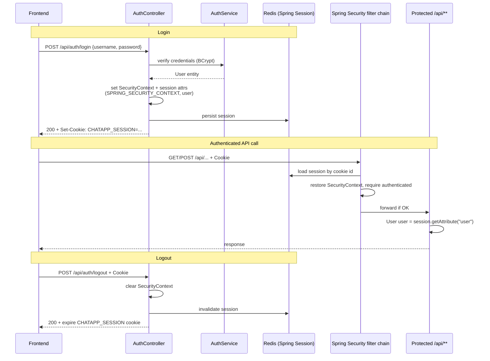
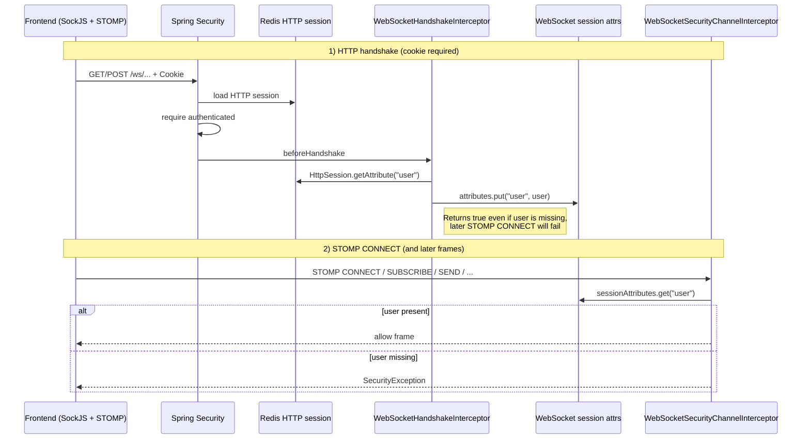

# Auth Flow (Session-Based)

## Intro

Auth in this app is **server-side HTTP sessions** backed by **Redis** (Spring Session), not JWT. The browser holds only an **opaque session cookie** (`CHATAPP_SESSION` by default in this app); Spring Security restores the principal from that session on each HTTP request.

Failed login/register is **4xx JSON** (`ErrorResponse`), not `AuthResponse`. See [`36_API_ERROR_RESPONSE.md`](./36_API_ERROR_RESPONSE.md).

This doc covers **login auth** for HTTP APIs and WebSocket/STOMP. It does **not** cover group roles/permissions in depth (see [`15_GROUP_ROLES_AND_PERMISSIONS.md`](./15_GROUP_ROLES_AND_PERMISSIONS.md)).

## Summary

- Opaque session cookie (not JWT); session data in Redis via Spring Session
- Cookie name is configured as `CHATAPP_SESSION` in `application.yaml`
- Login sets `SecurityContext` + session attrs (`SPRING_SECURITY_CONTEXT`, `user`)
- FE sends the cookie (`credentials: "include"`); Spring Security restores auth and requires `.authenticated()` on `/api/**` and `/ws/**`
- Single app role `ROLE_USER` is assigned but not checked with `hasRole`
- HTTP controllers resolve the current user from `session.getAttribute("user")`
- WebSocket auth is a **handshake-time snapshot** of that same `user`, then checked from **WebSocket session attributes** on each STOMP command — not re-validated against Redis on every frame

## HTTP high-level flow

## What lives where

| Location                | Contents                                                               |
| ----------------------- | ---------------------------------------------------------------------- |
| Browser cookie          | `CHATAPP_SESSION` opaque session id only (not JWT, no claims)          |
| Redis HTTP session      | `SPRING_SECURITY_CONTEXT`, `user`, other session attrs                 |
| Request thread (HTTP)   | `SecurityContextHolder` (restored per request by Spring Security)      |
| WebSocket session attrs | Copy of `user` taken at handshake (independent of Redis after connect) |

## WebSocket auth

WebSocket uses **STOMP over SockJS** at endpoint `/ws`. Auth is **not** the same as HTTP on every message: the HTTP session cookie is used **once at connect**, then identity lives in the **WebSocket session**.

### Layers

| When                                 | What checks                                       | What it looks at                                               |
| ------------------------------------ | ------------------------------------------------- | -------------------------------------------------------------- |
| 1. SockJS/HTTP handshake to `/ws/**` | Spring Security (`SecurityConfig`)                | HTTP session cookie → must be `.authenticated()`               |
| 2. Handshake interceptor             | `WebSocketHandshakeInterceptor`                   | Copies `user` from HTTP session → WebSocket session attributes |
| 3. Every inbound STOMP command       | `WebSocketSecurityChannelInterceptor`             | WebSocket session attr `"user"` must exist                     |
| 4. `@MessageMapping` handlers        | `WebSocketController.getUserFromSession`          | Same WebSocket session attr `"user"` (defense in depth)        |
| 5. `SUBSCRIBE` only                  | Channel interceptor + `GroupAuthorizationService` | Topic access (group membership / personal topic) — see doc 15  |

There is **no** JWT, no STOMP login/passcode header, and **no** per-frame Redis session lookup after the socket is up.

### Connect flow

Note: the interceptor calls `validateAuthentication`: WebSocket session attributes must contain "user". If missing → `SecurityException` (“Please login and reconnect.”).

### Authorization on WebSocket (beyond “logged in”)

- **App role**: still only “is there a `user`?” — no `ROLE_USER` check on STOMP frames.
- **SUBSCRIBE** destinations get extra checks in the channel interceptor (group topic / personal group-updates topic).

### Critical difference vs HTTP

|                                         | HTTP `/api/**`                                | WebSocket STOMP                                       |
| --------------------------------------- | --------------------------------------------- | ----------------------------------------------------- |
| Credential each time                    | Cookie → Redis session every request          | Cookie only at handshake                              |
| Identity source                         | Redis HTTP session (`user` / SecurityContext) | **Snapshot** in WebSocket session attrs               |
| If Redis session deleted mid-connection | Next HTTP call fails                          | **Existing socket can keep working** until disconnect |

### Logout / disconnect — not the same as HTTP logout

**HTTP logout** (`POST /api/auth/logout`):

1. Clears `SecurityContextHolder`
2. `session.invalidate()` → Redis HTTP session gone
3. Spring Session expires the `CHATAPP_SESSION` cookie in the response

It does **not**:

- close active WebSocket connections on the server
- clear WebSocket session attributes on those connections
- re-run handshake auth

**WebSocket disconnect** (client `deactivate()`, network drop, tab close):

1. Spring fires `SessionDisconnectEvent`
2. `WebSocketEventListener` cleans RabbitMQ subscription tracking for that WS session id and may broadcast `[SYSTEM] … disconnected`
3. Does **not** invalidate the HTTP/Redis session (user can still call REST until HTTP logout or timeout)

**Frontend behavior today** (`WebSocketProvider`):

- Connects once on provider mount (wraps the whole app, including login)
- On logout, `username` becomes `null` → unsubscribes personal group-updates topic
- `disconnectWebSocket()` runs only when the provider **unmounts**, not automatically on every logout navigation
- So logout + stay in SPA may leave the socket open with the pre-logout `user` snapshot until something else disconnects it

Practical implication: **HTTP logout ≠ WebSocket session clear**. To fully end WS auth you need an explicit client disconnect (and ideally server-side close of sessions tied to that user/session id — not implemented as part of logout today). Planning / proposed fix: [`18_LOGOUT_WEBSOCKET_SESSION_LIFECYCLE.md`](./18_LOGOUT_WEBSOCKET_SESSION_LIFECYCLE.md).

### Code map

| Piece                                 | Role                                                       |
| ------------------------------------- | ---------------------------------------------------------- |
| `SecurityConfig`                      | `/ws/**` → `.authenticated()` at HTTP handshake            |
| `AuthController.logout()`             | Clears `SecurityContextHolder` and invalidates HTTP session |
| `WebSocketConfig`                     | `/ws` + SockJS; registers handshake + channel interceptors |
| `WebSocketHandshakeInterceptor`       | HTTP session `user` → WS session attrs                     |
| `WebSocketSecurityChannelInterceptor` | Auth on inbound STOMP; subscription ACL                    |
| `WebSocketController`                 | Resolve sender from WS attrs; send-path group permission   |
| `WebSocketEventListener`              | Disconnect cleanup / system notice (not HTTP logout)       |
| `chat-app-frontend/.../websocket.ts`  | SockJS + STOMP client                                      |
| `WebSocketProvider`                   | One connection for the app; connect/disconnect lifecycle   |
