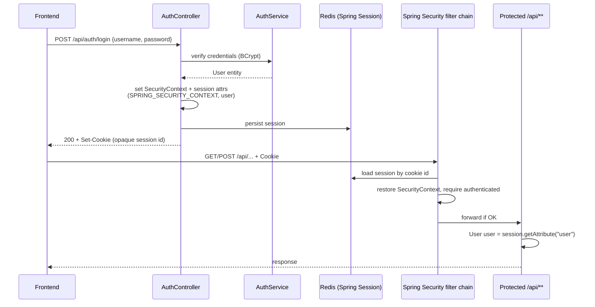

# Auth Login Flow (Session-Based)

## Intro

Login auth in this app is **server-side HTTP sessions** backed by **Redis** (Spring Session), not JWT. The browser holds only an **opaque session cookie**; Spring Security restores the principal from that session on each request.

This doc covers **user login auth only** (not group roles/permissions).

## Confirmation (your mental model)

| Claim                                                     | Verdict | Notes                                                            |
| --------------------------------------------------------- | ------- | ---------------------------------------------------------------- |
| Session stored in Redis; token is opaque (not JWT)        | **Yes** | `spring-session-data-redis`; cookie value is a random session id |
| Login sets `SecurityContext` in `AuthController`          | **Yes** | Also writes `SPRING_SECURITY_CONTEXT` + `user` into the session  |
| FE sends cookie on API calls                              | **Yes** | `credentials: "include"` in `api.ts`                             |
| Spring Security validates via that cookie                 | **Yes** | Loads session → restores `SecurityContext` → enforces rules      |
| Single app role: `ROLE_USER`                              | **Yes** | Assigned at login; **not** checked with `hasRole`                |
| Protected APIs require authenticated, not a specific role | **Yes** | `.authenticated()` only in `SecurityConfig`                      |

## High-level flow



## Login (create session)

1. FE calls `POST /api/auth/login` with `credentials: "include"`.
2. `AuthService.login` loads the user and checks password with `BCryptPasswordEncoder` (not Spring `AuthenticationManager`).
3. `AuthController.authenticateUser`:
   - builds `UsernamePasswordAuthenticationToken(username, null, [ROLE_USER])`
   - sets it on `SecurityContextHolder`
   - stores that `SecurityContext` under `SPRING_SECURITY_CONTEXT_KEY` in the HTTP session
   - stores the `User` entity as session attribute `"user"`
4. Spring Session writes the session to Redis and the response sets an opaque session cookie.
5. Session timeout: `server.servlet.session.timeout: 1800` (30 minutes).

`/api/auth/**` is `permitAll` (login/register/check/logout do not require a prior session).

## Subsequent API calls (restore session)

1. Browser sends the session cookie automatically (`credentials: "include"`).
2. Spring Session resolves the session id → loads session data from Redis.
3. Spring Security’s `HttpSessionSecurityContextRepository` restores `SecurityContext` into `SecurityContextHolder`.
4. `SecurityConfig` allows the request if `.authenticated()` (for `/api/**` and `/ws/**`).
5. Controllers typically do **not** use `SecurityContextHolder` for identity; they use:

```java
User user = (User) session.getAttribute("user");
```

So gatekeeping is Spring Security; “who is this user?” is usually the session `user` object.

## Authorization at the HTTP layer

From `SecurityConfig`:

- Public: `/api/auth/**`, SPA static routes
- Must be authenticated: `/api/**`, `/ws/**`
- No `hasRole("USER")` / `hasAuthority(...)` checks for app login roles

`ROLE_USER` is present on the authentication object but unused for URL authorization today.

## Logout

`POST /api/auth/logout`:

1. `SecurityContextHolder.clearContext()`
2. `session.invalidate()` (removes Redis session)
3. Cookie cleared (browser stops sending a valid session id)

## WebSocket (brief)

Handshake is still an HTTP request with the same session cookie. `WebSocketHandshakeInterceptor` copies `"user"` from the HTTP session into WebSocket session attributes. Later STOMP messages rely on that attribute (plus `/ws/**` requiring authentication at connect time).

## What lives where

| Location       | Contents                                                          |
| -------------- | ----------------------------------------------------------------- |
| Browser cookie | Opaque session id only (not JWT, no claims)                       |
| Redis session  | `SPRING_SECURITY_CONTEXT`, `user`, other session attrs            |
| Request thread | `SecurityContextHolder` (restored per request by Spring Security) |
