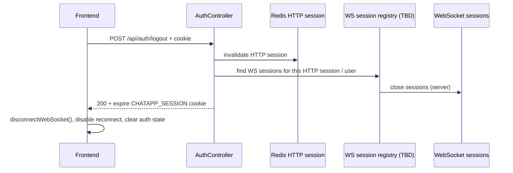

# Logout / WebSocket Session Lifecycle

## Intro

Planning doc only — **not implemented yet**. Review and refine before coding.

HTTP logout today invalidates the Redis session and clears auth for subsequent REST calls, but the **WebSocket connection can keep working** with a handshake-time `user` snapshot. Sliding Redis TTL renewal is expected and is **not** the primary security gap (see [`01_SPRING_SESSION_EXPLANATION.md`](./01_SPRING_SESSION_EXPLANATION.md)). The gap is **logout / expiry vs WebSocket lifecycle**.

Related: [`16_AUTH_FLOW.md`](./16_AUTH_FLOW.md).

## Current Problem

### What works today

1. `POST /api/auth/logout` clears `SecurityContextHolder`, calls `session.invalidate()`, Redis session is removed.
2. Later HTTP `/api/**` calls without a valid session fail auth as expected.
3. WebSocket auth at **connect** requires an authenticated HTTP session; STOMP frames then trust WebSocket session attributes (`user`).

### Gaps

| Gap                                                                                                                      | Why it matters                                                                   |
| ------------------------------------------------------------------------------------------------------------------------ | -------------------------------------------------------------------------------- |
| HTTP logout does **not** close active WebSocket sessions on the server                                                   | After “logout”, an already-open socket can still SEND/SUBSCRIBE until disconnect |
| Frontend `disconnectWebSocket()` runs mainly on `WebSocketProvider` **unmount**, not reliably on every logout navigation | SPA can stay mounted; socket may remain open with pre-logout `user`              |
| Redis HTTP session expiry does **not** tear down an existing WebSocket                                                   | Idle timeout stops REST; live WS may continue with the snapshot principal        |
| No server-side map from HTTP session id → WebSocket session ids                                                          | Cannot force-close sockets belonging to a logged-out session                     |

### Threat / abuse sketch

1. User clicks Logout → Redis session gone → UI shows login.
2. WebSocket (same tab or delayed disconnect) still has `user` in WS attrs.
3. Client (or attacker with that open socket) can still publish/subscribe until the socket drops.

Same class of issue if the HTTP session expires in Redis while the tab keeps a long-lived SockJS/WebSocket connection.

## Functional Requirements (target)

1. Logout ends **both** HTTP session auth and all WebSocket connections for that login.
2. After logout, no STOMP SEND/SUBSCRIBE succeeds with the previous principal.
3. Frontend always disconnects (and does not auto-reconnect as the old user) when auth becomes logged-out.
4. Optionally: when Redis/HTTP session expires, associated WebSockets are closed (or fail the next frame after re-validation).
5. Logout clears the real session cookie name used in this app (`CHATAPP_SESSION`).

## Non-Functional Requirements

- Prefer a small, reviewable change set; avoid rewriting the whole auth stack (no JWT migration required for this fix).
- Multi-instance safe: if we track WS sessions, prefer a registry that works across instances or a broadcast “logout user/session” signal (Redis pub/sub / RabbitMQ) — exact approach TBD in review.
- Do not break reconnect-on-network-blip for **still-authenticated** users.

## Use cases

1. User clicks Logout → immediately cannot send/receive chat over WS; must log in again to reconnect.
2. HTTP session expires while tab is open → WS should not remain a privileged channel indefinitely.
3. User logs out in tab A → tab B’s socket for the same session should also die (if we support multi-tab; scope TBD).
4. Network flap while still logged in → reconnect with valid cookie still works.

## Possible Solutions

### 1. How to end WebSocket auth on logout?

#### 1.1. Client-only disconnect on logout

- How it works: On logout success (and when `username` becomes `null`), call `disconnectWebSocket()` / `deactivate()`, clear STOMP client, disable reconnect until next login.
- Pros: Small FE change; fixes the common SPA path quickly.
- Cons: Malicious or buggy client can ignore it; server still trusts open sockets; other tabs untouched.
- Recommendation for our problem: **Yes** as a **minimum** first step, not sufficient alone.

#### 1.2. Server closes WebSockets on HTTP logout

- How it works: On logout, look up WebSocket sessions tied to this HTTP session (or user) and close them; channel interceptor rejects frames if WS attrs were cleared.
- Pros: Enforced server-side; matches security expectation of logout.
- Cons: Needs a registry (in-memory per node vs shared); multi-instance needs fan-out.
- Recommendation for our problem: **Yes** — pair with 1.1.

#### 1.3. Re-validate HTTP/Redis session on every STOMP command

- How it works: Channel interceptor loads Redis session (or SecurityContext) per frame / periodically; reject if missing.
- Pros: Strong consistency with HTTP auth.
- Cons: Extra Redis load; latency on hot path; still need disconnect UX.
- Recommendation for our problem: **No** as default; optional later if we need continuous binding.
- When I’d use it: High-assurance deployments or short-lived sessions with strict policy.

#### 1.4. Bind WebSocket lifecycle to Spring Session events (indexed Redis repo)

- How it works: Switch to `spring.session.redis.repository-type=indexed`, enable keyspace notifications, close WS on session destroyed/expired events.
- Pros: Expiry and logout can share one “session dead → close WS” path.
- Cons: Ops complexity (Redis notify-keyspace-events); more moving parts than we may need now.
- Recommendation for our problem: **Maybe later**; not required for a first logout fix.

### 2. Cookie name on logout

#### 2.1. Keep controller-owned logout and explicit app cookie name

- How it works: `AuthController.logout()` invalidates the HTTP session, and Spring Session expires the configured `CHATAPP_SESSION` cookie automatically.
- Pros: One clear logout owner; cookie name is app-specific and avoids cross-app confusion on shared hosts like `localhost`.
- Cons: None meaningful.
- Recommendation for our problem: **Already implemented**.

## High level Architecture/Design

### Target logout flow (draft)

### Notes for multi-instance (TBD in review)

- Local `SimpUserRegistry` alone is not enough if logout hits instance A and the socket lives on instance B.
- Options: sticky sessions + local close only; or publish `LogoutEvent(sessionId|userId)` over Redis/RabbitMQ and each node closes local WS matches.

## Recommendation

1. **Phase A (FE):** On logout / auth→logged-out, fully disconnect STOMP/SockJS and do not reconnect until a successful login.
2. **Phase B (BE):** On logout, server-side close of WebSocket sessions for that user/HTTP session.
3. **Phase C (optional):** Session-expiry → close WS (session events or periodic re-check); multi-tab / multi-instance fan-out.
4. Keep sliding inactivity timeout; do **not** treat TTL renewal as a bug. Absolute max session age remains a separate optional hardening item.

Do not implement in this doc — refine after review.

## Implementation details

_(Empty while planning. Fill in after implementation phases land.)_

## Future Higher-Scale Path

- Shared WS registry or logout broadcast across instances.
- Optional absolute session max age separate from inactivity timeout.
- Production cookie flags (`Secure`, `SameSite`) and CSRF strategy for cookie-based APIs — related hardening, out of scope for the core logout/WS fix unless bundled deliberately.
