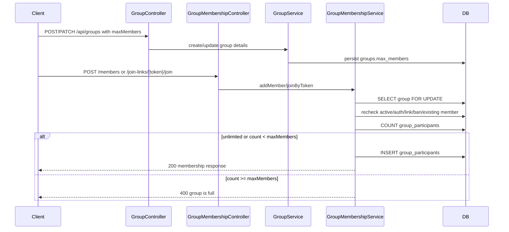

## Intro

Group member limitation lets a group owner set an optional maximum number of active members in a group. When the limit is `NULL` or `0`, the group has no size cap. When the limit is greater than `0`, direct add and join-link flows must reject any **new** membership insert that would run while the current participant count is already at or above that limit.

The important part is not the column itself; it is enforcing the limit under concurrency. If a group has `maxMembers = 100` and 200 users try to join through the same link at the same time, exactly enough requests should succeed to reach 100 active participants, and the rest should fail with a clear "group is full" response.

## Functional Requirements

- A group creator can optionally set `maxMembers` during group creation.
- `LEADER` and `CO_LEADER` can update `maxMembers` through the group update API because they already have `MANAGE_GROUP_DETAILS`.
- Stored `NULL` and `0` mean "unlimited". Persist only after rejecting any value below `0`; do not normalize negatives into unlimited.
- Positive values mean the configured capacity used by the **insertion rule** below.
- The creator counts as a member.
- Initial invited participants during group creation count toward the limit.
- Direct add (`POST /api/groups/{groupId}/members`) must reject when the group is full under the insertion rule.
- Join by link (`POST /api/groups/join-links/{token}/join`) must reject when the group is full under the insertion rule.
- Existing members using a join link should remain idempotent: if they are already in the group, return their current membership and do not fail because the group is full.
- Reducing the limit below the current member count is allowed. That creates a temporary **over-limit** state: existing members stay, and the group remains valid. Enforcement is an **insertion rule** only: a new `group_participants` row may commit only when `maxMembers` is unlimited, or when the current count is strictly below `maxMembers`. While over-limit, all new adds/joins fail until membership decreases enough that `count < maxMembers`.
- Kicking, banning, leaving, or archiving a group does not need special member-limit behavior beyond reducing the active participant count.
- Banned users are still rejected before a new membership insert.
- Archived groups are still rejected before a new membership insert.

## Non-Functional Requirements

- **Race safety:** concurrent direct adds and join-link joins must obey the insertion rule so a new membership cannot commit when the current count is already at or above a positive `maxMembers`. After a limit is lowered below the current count, the over-limit state is allowed until membership decreases; the invariant is not "count always ≤ maxMembers".
- **Database-backed correctness:** correctness must hold across multiple backend instances.
- **Short critical section:** the lock should cover only validate/count/insert and existing membership side effects already in the transaction.
- **Backward compatibility:** existing groups should default to unlimited.
- **Simple UX:** clients should receive a stable validation error when a group is full.
- **Observability:** tests should cover concurrent joins/adds because this feature is easy to break with a future refactor.

## Use Cases

- Create a new unlimited group.
- Create a new group with `maxMembers = 100`.
- Update a group from unlimited to `maxMembers = 100`.
- Update a group from `maxMembers = 100` to unlimited by sending `null` or `0`.
- PATCH omit `maxMembers` and leave the current limit unchanged.
- Add one user directly while the group has room (`count < maxMembers`).
- Reject direct add when the group is at or over the limit (`count >= maxMembers`).
- Join by valid join link while the group has room.
- Reject join by valid join link when the group is at or over the limit.
- Let an existing member open/use a join link without producing a duplicate insert or "full" error.
- Reduce `maxMembers` below the current member count (over-limit state), keep existing members, and block new additions until `count < maxMembers` again.

## Possible Solutions

### 1. How To Enforce The Limit Under Concurrent Adds And Joins?

#### 1.1. Pessimistic Group Row Lock

- How it works: every membership insert path first locks the `groups` row with `SELECT ... FOR UPDATE` through the existing `GroupRepository.findByIdForUpdate`. While holding that lock, the service checks active group state, validates permissions/link state, checks whether the target user is already a member, counts current participants, applies the insertion rule against `maxMembers`, and only then inserts the participant.
- Pros:
  - Fits the current architecture: membership mutations already serialize on the group row via `lockActiveGroup`.
  - Correct across multiple application instances because the lock is held by the database.
  - Easy to reason about: all membership capacity decisions are made in one serialized critical section.
  - No retry loop is needed for normal full-group rejection.
  - Reuses the same lock-order rule documented in [24_MEMBERSHIP_MUTATION_AUTH_LOCK_ORDER.md](./24_MEMBERSHIP_MUTATION_AUTH_LOCK_ORDER.md).
- Cons:
  - A very busy group join spike serializes through one row lock.
  - Transactions must stay short; avoid doing slow external work while holding the lock.
  - Counting participants on every add/join is fine at current scale but can become expensive for very large groups.
- Recommendation for our problem: Yes. This is the best first implementation because the current service already uses the same lock to prevent archive, role, and join-link races.

#### 1.2. Optimistic Locking With `@Version`

- How it works: add a `@Version` field to `Group`, read the group and member count, attempt the membership insert, and rely on version conflicts when concurrent writers update the same group. The service would need to bump the group version for every capacity-affecting membership change.
- Pros:
  - Avoids waiting on a row lock in the common case.
  - Can perform well when conflicts are rare.
- Cons:
  - High-contention join spikes create many retries or user-facing failures.
  - Easy to implement incorrectly because inserting into `group_participants` does not automatically update the `groups` row version.
  - The service must remember to touch/version the group for every add, join, leave, kick, and ban path that changes membership count.
  - This repo already chose a pessimistic group-row lock for membership lifecycle races, so optimistic locking would introduce a second concurrency model for the same domain.
- Recommendation for our problem: No for the first version. It is more complex than needed and weaker under exactly the scenario we care about: many simultaneous joins.
- When I would use it: if group membership changes were extremely frequent, conflicts were rare, and we wanted non-blocking writes with a well-tested retry policy.

#### 1.3. Redis Distributed Lock

- How it works: acquire a Redis lock keyed by group id, then count/insert while holding the Redis lock.
- Pros:
  - Can serialize work before reaching the database.
  - Useful for workflows that need to coordinate multiple external resources outside one database transaction.
- Cons:
  - Adds lock expiry, ownership token, retry, and failure-mode complexity.
  - The database is still the source of truth, so DB constraints and transactions remain necessary.
  - A Redis lock plus DB transaction can create more operational edge cases than a single DB row lock.
  - If Redis is unavailable or lock expiry is too short, correctness depends on careful fallback behavior.
- Recommendation for our problem: No for the main capacity invariant.
- When I would use it: only if future work needs to rate-limit or queue massive join bursts before they hit the database. Even then, keep the DB check as the final source of truth.

#### 1.4. Atomic Counter On `groups`

- How it works: add a denormalized `member_count` column and update it with a single conditional SQL statement such as `UPDATE groups SET member_count = member_count + 1 WHERE id = ? AND (max_members IS NULL OR max_members = 0 OR member_count < max_members)`. Insert the participant only if the counter update succeeds. Request validation still rejects values below `0` before any persistence; stored values are only `NULL`, `0`, or positive.
- Pros:
  - Very efficient: no `COUNT(*)` on every add/join.
  - Can enforce the insertion rule with one atomic conditional update.
  - Better long-term path for very large groups or very high join throughput.
- Cons:
  - Requires keeping `member_count` correct across add, join, leave, kick, ban, archive, and any data repair.
  - Needs careful compensation if the counter increments but the participant insert fails.
  - More migration and backfill work.
- Recommendation for our problem: Not for the first version, but this is the best higher-scale path.

## High Level Architecture/Design

### Component Diagram / Flowchart / Sequence Diagram



### Core Entities/Models

- `Group`: add nullable `maxMembers` mapped to `groups.max_members`.
- `GroupParticipant`: remains the source of truth for active membership. A row counts toward capacity.
- `CreateGroupRequest`: add optional `maxMembers`.
- `UpdateGroupRequest` (or a PATCH wrapper around it): must distinguish **omitted** `maxMembers` from **explicitly set** `null`. A plain nullable `Integer maxMembers` is not enough for Jackson/JSON PATCH semantics, because omitted and `"maxMembers": null` both deserialize to `null`. Use a presence-aware field (for example `Optional<Integer>`, `JsonNullable<Integer>`, or a small wrapper with `isPresent` / `getValue`) so omission leaves the current limit unchanged while explicit `null`, `0`, and positive values keep their documented behavior.
- `GroupResponse`: add `maxMembers` so clients can display and edit the current limit.
- `GroupRepository`: reuse `findByIdForUpdate` for membership capacity enforcement.
- `GroupParticipantRepository`: reuse `countByGroupId`; optionally add a method name/comment that clarifies it counts active participants because there is no soft-delete participant state today.

### API Draft

#### Create Group

`POST /api/groups`

Request:

```json
{
  "name": "Study Group",
  "description": "Daily Java practice",
  "participantIds": [2, 3, 4],
  "maxMembers": 100
}
```

Behavior:

- `maxMembers` missing, `null`, or `0`: unlimited. Only `null` and `0` normalize to unlimited; never treat negative values as unlimited.
- `maxMembers > 0`: capacity limit.
- `maxMembers < 0`: reject with validation error **before persistence**.
- `GroupService.createGroup` must accept and persist `maxMembers`, then validate the distinct set of `{creator} ∪ participantIds` against that limit **before** inserting any `group_participants` rows. If the distinct initial membership would exceed a positive limit, reject the whole create request (no partial membership inserts).
- `GroupSeeder` remains setup-only and creates unlimited groups (`max_members` null). If seed data ever targets capped groups, apply the same distinct-membership capacity validation before inserting participants.

#### Update Group Details

`PATCH /api/groups/{groupId}`

Request examples:

```json
{
  "name": "Study Group",
  "description": "Daily Java practice",
  "maxMembers": 100
}
```

```json
{
  "maxMembers": null
}
```

```json
{
  "name": "Study Group"
}
```

Behavior:

- Only users with `MANAGE_GROUP_DETAILS` can update it.
- The PATCH model must preserve whether `maxMembers` was omitted or explicitly set. Omission leaves the current limit unchanged.
- Explicit `maxMembers: null` or `maxMembers: 0` means unlimited (normalize only those two cases).
- Explicit `maxMembers > 0` sets the capacity limit.
- Explicit `maxMembers < 0` is invalid and must be rejected before persistence.
- Reducing below current member count is allowed and creates an over-limit state. Existing members remain. New add/join operations fail until `count < maxMembers`.

#### Add Member

`POST /api/groups/{groupId}/members`

Behavior:

- Lock active group.
- Authorize `ADD_MEMBERS`.
- Reject banned target.
- If target is already a member, keep existing "already a member" behavior.
- Check capacity under the lock using the insertion rule.
- Insert member only when unlimited or current count is strictly below `maxMembers`.

#### Join Link

`POST /api/groups/join-links/{token}/join`

Behavior:

- Load and pre-validate join link as a fail-fast optimization.
- Lock active group.
- Refresh and revalidate the join link under the lock.
- Reject banned user.
- If the user is already a member, return the existing membership without applying the capacity check.
- Check capacity under the lock using the insertion rule.
- Insert member only when unlimited or current count is strictly below `maxMembers`.

## Recommendation

Use a nullable `groups.max_members` column and enforce capacity with an **insertion rule** inside the existing pessimistic group-row lock used by membership mutations.

Recommended rules:

- Normalize only `null` and `0` to unlimited in service logic after successful validation.
- Reject any value below `0` at the API/service boundary before persistence; do not coerce negatives to unlimited.
- Reuse `lockActiveGroup` before any capacity decision in `addMember` and `joinByToken`.
- Allow over-limit after lowering `maxMembers`; do not force member removal. Block only new inserts while `count >= maxMembers`.
- Check existing membership before capacity in `joinByToken` so already-member retries stay idempotent even if the group is full or over-limit.
- Make the PATCH DTO/wrapper presence-aware so omitted `maxMembers` is distinct from explicit `null`.
- Keep Redis out of the correctness path for the first version.

## Implementation Plan

### Phase 1. Schema And DTO Surface

- Add nullable `max_members` to `groups`.
- Add `maxMembers` to `Group`.
- Add optional `maxMembers` to `CreateGroupRequest` and `GroupResponse`.
- Update `UpdateGroupRequest` (or a PATCH wrapper) to track field presence for `maxMembers` so omission, explicit `null`, `0`, and positive values are distinguishable.
- Add validation: values below `0` are rejected before persistence; only `null` and `0` mean unlimited.
- Backward compatibility: existing rows stay `NULL`, so all existing groups remain unlimited.

### Phase 2. Create And Update Behavior

- Update `GroupService.createGroup` to accept and persist `maxMembers`.
- Before inserting any participant rows, compute the distinct set of creator plus `participantIds` and reject the create if that set size exceeds a positive limit.
- Keep `GroupSeeder` setup-only with unlimited groups, or apply the same capacity validation if it ever creates capped groups.
- `updateGroupDetails` accepts presence-aware `maxMembers` as a patchable field.
- Allow lowering below current member count (over-limit state); do not remove members.
- Record a system event for limit changes only if the product wants visible audit history in chat. TODO: confirm whether max-member changes should create a system message like group name/description updates.

### Phase 3. Capacity Enforcement In Membership Writes

- Add a helper in `GroupMembershipService`, for example `ensureGroupHasCapacityForNewMember(Group group)`.
- Call it in `addMember` after the duplicate-member check and before saving `GroupParticipant`.
- Call it in `joinByToken` after existing-member idempotency check and before saving `GroupParticipant`.
- The helper runs while the transaction holds `findByIdForUpdate` on the group row.
- The helper uses `groupParticipantRepository.countByGroupId(group.getId())` and applies the insertion rule: reject when `maxMembers > 0` and `currentCount >= maxMembers`.

### Phase 4. Error Contract And Frontend UX

- Return a clear API error message such as `Group member limit has been reached`.
- In the group settings UI, show an optional numeric field for maximum members.
- In add-member UI, optionally disable add actions when current member count is known to be at or above the limit, but keep backend enforcement authoritative.
- In join-link UI, show the backend error if the group is full.

### Phase 5. Tests

- Unit or integration test: create group with `maxMembers = null` and `0` remains unlimited.
- Unit or integration test: create/update rejects `maxMembers < 0` before persistence.
- Integration test: create group rejects initial distinct membership above limit and inserts no partial participant rows.
- Integration test: update limit as leader/co-leader succeeds; non-privileged member fails.
- Integration / DTO tests for PATCH `maxMembers`:
  - omitted → current limit unchanged
  - explicit `null` → unlimited
  - `0` → unlimited
  - positive value → sets limit
  - negative value → rejected
- Integration test: lowering `maxMembers` below current count leaves existing members and blocks new inserts until `count < maxMembers`.
- Integration test: direct add succeeds when `count < maxMembers` and fails when `count >= maxMembers`.
- Integration test: join by link succeeds when `count < maxMembers` and fails when `count >= maxMembers`.
- Idempotency test: existing member using join link succeeds even when group is full or over-limit.
- Concurrency test: many simultaneous join-link requests for a group with `maxMembers = N` never create more than `N` participants when starting from below the limit.
- Concurrency test: mixed direct adds and join-link joins serialize correctly and obey the insertion rule.

## Concurrency Notes

The member-limit rule is an **insertion rule**, not a permanent `COUNT <= maxMembers` database invariant. After a leader/co-leader lowers `maxMembers` below the current participant count, the group may temporarily satisfy:

```text
maxMembers > 0 AND COUNT(group_participants WHERE group_id = group.id) > maxMembers
```

That over-limit state is allowed. Existing members stay. What must never happen is committing a **new** membership row while the group is already at or above a positive limit:

```text
When maxMembers > 0, a new group_participants insert may commit only if:
COUNT(group_participants WHERE group_id = group.id) < maxMembers

When maxMembers IS NULL or maxMembers = 0:
inserts are not limited by capacity
```

For the first implementation, the insertion rule is protected by the same lock already used for membership lifecycle state:

```text
transaction starts
SELECT groups WHERE id = ? FOR UPDATE
recheck active group / auth / join-link state / ban state
if user is not already a member:
    currentCount = COUNT(group_participants WHERE group_id = ?)
    if maxMembers > 0 and currentCount >= maxMembers:
        reject
    insert group_participants row
transaction commits
```

This works because all capacity-affecting insert paths wait on the same group row. If 200 users join concurrently and only 10 seats remain, the first 10 transactions that acquire the lock and insert will succeed. Every later transaction will re-count after those commits and fail.

The same rule also covers over-limit groups: if `maxMembers` was lowered to 50 while 80 members remain, every new insert sees `currentCount >= maxMembers` and is rejected until enough members leave/are removed that `count < maxMembers`.

The count must happen after acquiring the lock. An unlocked pre-count is only a hint and cannot be used for correctness.

## Implementation details

### Phase 1. Schema And DTO Surface

#### What changed

- Added nullable `groups.max_members` (Flyway `V11`) with a non-negative check constraint.
- Mapped `Group.maxMembers` and included it on `CreateGroupRequest`, `UpdateGroupRequest`, and `GroupResponse`.
- `UpdateGroupRequest` tracks whether JSON included `maxMembers`, so omitted stays unchanged later while explicit `null`, `0`, and positives remain distinct.
- Bean Validation rejects `maxMembers < 0` on create and update requests.

#### Rollout, migration, or backward-compatibility notes

- Existing rows keep `max_members = NULL` (unlimited).

## Future Higher-Scale Path

If capacity checks become hot, add a denormalized `groups.member_count` column and enforce the insertion rule with atomic conditional updates. The database can then accept or reject a new seat without scanning/counting participants every time.

Possible future design (assumes request validation already rejected values below `0`, so stored `max_members` is only `NULL`, `0`, or positive):

```sql
UPDATE groups
SET member_count = member_count + 1
WHERE id = :groupId
  AND archived_at IS NULL
  AND (
    max_members IS NULL
    OR max_members = 0
    OR member_count < max_members
  );
```

Only insert the participant if the update affects one row. Leave/kick/ban decrements the counter in the same transaction. This is more scalable, but it requires a careful backfill, repair job, and compensation strategy if any membership insert fails after the counter increments.

Redis can still help later for traffic shaping, queueing, or rate limiting, but the database should remain the final source of truth for capacity.
