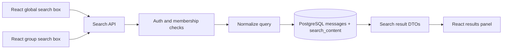
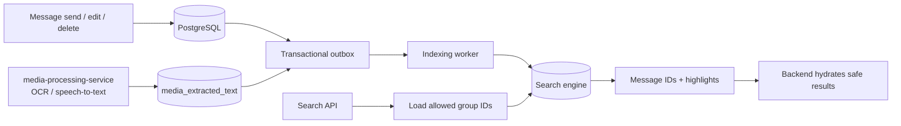

# Search Feature

## Intro

This document designs message search for the chat app. The feature should let users search messages across every group they belong to, or search only inside one selected group.

The first version should search text messages efficiently and support Vietnamese queries with or without diacritics, plus case-insensitive matching. Later versions should also search text extracted by `media-processing-service` from images, video frames, and spoken audio in videos.

Current state:

- `messages.content` stores message text as a nullable `VARCHAR(1000)`.
- There is no search-specific index for `messages.content`.
- A query like `LIKE '%search_text%'` would require scanning many message rows and becomes inefficient as message volume grows.

## Functional Requirements

- Support global search.
- Global search returns matching messages from all groups that the current user is allowed to access.
- Support local group search.
- Local search returns matching messages only from one specific group.
- Frontend should expose two search boxes:
  - one global search box outside a specific group context
  - one local search box inside the selected group conversation
- Search must be case-insensitive.
- Search must support Vietnamese text with and without diacritics.
- Example: query `ban dang lam gi the` should match:
  - `bạn đang làm gì thế`
  - `bạn dang làm gi the`
  - other mixed-diacritic variants with the same normalized text
- Search results must not include messages from groups the user is not a member of.
- Search results should not expose soft-deleted message content.
- Search should return enough context for the UI to navigate to the message inside the group conversation.
- Search should support pagination or cursor-based loading.
- Search should allow filtering by group for local search.
- Search should be ready to expand to media-derived text:
  - OCR text extracted from images
  - transcript text extracted from video or audio speech
  - OCR text extracted from video frames
- Media-derived text should be produced by the Micronaut `media-processing-service` described in `docs/29_MEDIA_PROCESSING_SERVICE.md`.
- Searching text inside images and videos is not required for MVP.

## Non-Functional Requirements

- Avoid full table scans on `messages.content` for normal search traffic.
- Keep global search bounded by the user's group membership.
- Keep search result latency acceptable for chat UX:
  - target under 300 ms for common local searches
  - target under 700 ms for common global searches at moderate scale
- Search indexing should not block sending a message.
- Search results can be eventually consistent if a dedicated index is used.
- Newly sent text messages should usually become searchable within a few seconds.
- The design should preserve a future path to switch database engines, even if the first implementation uses PostgreSQL-specific optimizations.
- The design should avoid sending full message bodies through RabbitMQ unless RabbitMQ is intentionally chosen as a search-indexing queue later.
- Search indexing and media text extraction must be retryable and idempotent.
- Search indexing should be observable:
  - index lag
  - failed indexing jobs
  - OCR or speech-to-text failures
  - search latency
- Search must respect existing authorization rules even if the index contains messages from many groups.
- Search should degrade safely if the search index is temporarily unavailable.
- Search should not require Kafka for MVP.

## Use Cases

1. User searches globally from the sidebar or top-level search screen.
   - The backend searches only messages from groups where the user is a member.
   - The UI shows matching message snippets grouped or labeled by group.

2. User searches inside a selected group.
   - The backend searches only messages from that group.
   - The backend verifies that the user is still a member of that group.
   - The UI lets the user jump to the message in the conversation.

3. User searches Vietnamese without diacritics.
   - Query `ban dang lam gi the` matches stored content such as `bạn đang làm gì thế`.
   - Query matching is case-insensitive.

4. User searches a word that appears in an image.
   - Not MVP.
   - `media-processing-service` extracts text from image attachments and stores/indexes it as searchable text linked to the original message.

5. User searches a phrase spoken in a video.
   - Not MVP.
   - `media-processing-service` creates transcript segments linked to the message and media attachment.

6. User searches text visible in a video frame.
   - Not MVP.
   - `media-processing-service` samples frames, extracts visible text, and indexes it with timestamps if needed.

## Possible Solutions

### 1. How should text search be implemented?

#### 1.1. B-tree Index on `messages.content`

- How it works:
  - Add a normal B-tree index on `messages.content`.
  - Query the column with equality, prefix matching, or range-like conditions.
- Pros:
  - Simple.
  - Portable across most relational databases.
  - Useful for exact match or prefix search such as `content LIKE 'hello%'`.
- Cons:
  - Does not help much for `LIKE '%hello%'`.
  - Does not solve Vietnamese accent-insensitive matching by itself.
  - Does not solve ranking, tokenization, typo tolerance, or fuzzy matching.
  - Large text columns can make the index less useful and more expensive.
- Recommendation for our problem: No.
- When I'd use it:
  - Exact or prefix-only search on a short normalized field.

#### 1.2. Lowercase and Accent-Folded Shadow Column With Simple `LIKE`

- How it works:
  - Store a normalized version of searchable message text, for example `search_content`.
  - Normalization happens in application code:
    - lowercase
    - remove Vietnamese diacritics
    - normalize whitespace
  - Search normalizes the query the same way.
  - Query uses `search_content LIKE '%normalized_query%'`.
- Pros:
  - Database portable.
  - Easy to understand.
  - Correctly handles case-insensitive and accent-insensitive matching if normalization is consistent.
- Cons:
  - Still inefficient for leading-wildcard substring search without an additional index strategy.
  - Duplicates message text in the database.
  - Does not provide strong ranking.
- Recommendation for our problem: No as the only search solution.
- When I'd use it:
  - Very small datasets.
  - Temporary implementation before adding a real index.
  - As a normalization source for a more advanced indexing strategy.

#### 1.3. PostgreSQL `unaccent` Plus `pg_trgm`

- How it works:
  - PostgreSQL `unaccent` removes diacritics.
  - PostgreSQL `pg_trgm` creates trigram indexes that can speed up substring and fuzzy text matching.
  - Queries normalize both stored content and search text before matching.
  - Common production shape:
    - normalize in application code into a `search_content` column
    - add a PostgreSQL GIN trigram index on `search_content`
- Pros:
  - Very good fit for chat substring search.
  - Handles `LIKE '%query%'` much better than B-tree.
  - Supports case-insensitive and accent-insensitive matching.
  - Lower operational complexity than Elasticsearch.
  - Good MVP path because the app already runs PostgreSQL in Docker.
- Cons:
  - PostgreSQL-specific.
  - Not portable to MySQL, SQL Server, or other engines without rework.
  - Relevance ranking is limited compared with a dedicated search engine.
  - Needs careful migration and backfill for existing messages.
- Recommendation for our problem: Yes for a PostgreSQL-first MVP.
- Portability note:
  - This does not prevent a future database switch, but search would need a new adapter or a dedicated search engine before switching away from PostgreSQL.

#### 1.4. Database Full-Text Search

- How it works:
  - Use the database's full-text search features to tokenize message content and query terms.
  - PostgreSQL uses `tsvector` and `tsquery`.
  - MySQL, SQL Server, and other databases have different full-text search implementations.
- Pros:
  - Better semantic text search than raw `LIKE`.
  - Can rank results by relevance.
  - Efficient for word-based search.
  - Can support language-specific tokenization and stop words depending on the database.
- Cons:
  - Full-text search is usually token-based, not arbitrary substring based.
  - Vietnamese support may need validation. Tokenization, accents, and mixed diacritics can vary by engine.
  - Cross-database behavior is not consistent.
  - PostgreSQL full-text search works best for lexeme-based search, but chat users often expect partial phrase and substring matching.
- Recommendation for our problem: Maybe later, not the best MVP default.
- When I'd use it:
  - Search becomes more document-like, with ranking, phrase search, stemming, and advanced filters.
  - We accept database-specific search behavior.

#### 1.5. Portable N-gram Search Table in the Main Database

- How it works:
  - Application code normalizes content.
  - It then writes generated n-grams into a separate table such as `message_search_ngrams`.
  - Search normalizes the query, generates query n-grams, and joins against the n-gram table to find candidate messages.
- Pros:
  - More portable than PostgreSQL `pg_trgm`.
  - Can support accent-insensitive and case-insensitive substring search.
  - Keeps all data in the main database.
- Cons:
  - More custom code.
  - Significant write amplification.
  - More complex ranking and deduplication.
  - Table size can grow quickly.
  - Harder to tune than a native trigram index.
- Recommendation for our problem: No for MVP.
- When I'd use it:
  - Database portability is mandatory from day one.
  - A dedicated search engine is not allowed.

#### 1.6. Dedicated Search Engine

- How it works:
  - Store canonical messages in PostgreSQL.
  - Maintain a separate search index in Elasticsearch, OpenSearch, Meilisearch, Typesense, or a similar engine.
  - Search queries go to the search engine.
  - Message writes publish or persist an indexing event after the database transaction commits.
- Pros:
  - Best long-term search capability.
  - Database engine independent.
  - Better relevance scoring, highlighting, typo tolerance, filtering, and ranking.
  - Clean place to index media-derived text from OCR and speech-to-text.
  - Avoids putting search-specific complexity into the primary database.
- Cons:
  - More infrastructure.
  - Eventual consistency.
  - Requires index backfill, reindexing, monitoring, retry, and dead-letter handling.
  - Authorization must still be enforced carefully.
  - Elasticsearch/OpenSearch can be operationally heavy for a small app.
- Recommendation for our problem: Yes for the higher-scale path, but not required for MVP.
- Candidate engines:
  - Elasticsearch or OpenSearch: powerful and mature, best for complex search and large scale.
  - Meilisearch: simpler operations, great developer experience, good typo tolerance.
  - Typesense: simple and fast, good for structured filters.

### 2. How should Vietnamese accent-insensitive search be handled?

#### 2.1. Normalize in Application Code

- How it works:
  - Add a shared normalizer used by both indexing and query parsing.
  - The normalizer lowercases text, removes Vietnamese diacritics, normalizes Unicode forms, and collapses whitespace.
  - Example:
    - raw text: `Bạn Đang Làm Gì Thế`
    - normalized text: `ban dang lam gi the`
- Pros:
  - Works across databases and search engines.
  - Testable in Java.
  - Keeps behavior consistent between PostgreSQL MVP and a future search engine.
- Cons:
  - Needs careful Vietnamese character mapping.
  - Must handle Unicode normalization consistently.
  - Existing messages need a backfill.
- Recommendation for our problem: Yes.

#### 2.2. Rely on Database Functions Such as PostgreSQL `unaccent`

- How it works:
  - Use `unaccent(lower(content))` or an indexed generated/search column based on unaccented text.
- Pros:
  - Less application code.
  - Good fit if PostgreSQL is guaranteed.
- Cons:
  - PostgreSQL-specific.
  - Can be harder to keep portable.
  - Expression indexes around `unaccent` need care because function volatility can affect index usage.
- Recommendation for our problem: No as the only normalization strategy.
- When I'd use it:
  - PostgreSQL is a committed long-term dependency.

#### 2.3. Search Engine Analyzer

- How it works:
  - Configure the search engine analyzer to lowercase and ASCII-fold Vietnamese text.
  - Index both raw and normalized forms if needed.
- Pros:
  - Strong fit for dedicated search engines.
  - Supports ranking and highlighting better than a database-only approach.
- Cons:
  - Engine-specific configuration.
  - Still useful to keep application-level normalization tests for predictable behavior.
- Recommendation for our problem: Yes when moving to a dedicated search engine.

### 3. How should global search enforce authorization?

#### 3.1. Join Through Current Membership Tables at Query Time

- How it works:
  - Local search filters by `group_id`.
  - Global search joins messages to group membership and filters by the current user.
- Pros:
  - Strong authorization.
  - Uses the source of truth.
  - No stale membership permissions in the search index.
- Cons:
  - Can be slower for global search if the query scans many messages first.
  - Requires good indexes on membership and message group/timestamp fields.
- Recommendation for our problem: Yes for database-backed MVP.

#### 3.2. Filter by Allowed Group IDs in the Search Query

- How it works:
  - Backend loads the user's group IDs.
  - Backend sends `groupId IN (...)` as a filter to the database or search engine.
- Pros:
  - Works for both database search and dedicated search engines.
  - Keeps authorization decision in the backend.
- Cons:
  - Large group lists may create large filters.
  - Must handle membership changes carefully.
- Recommendation for our problem: Yes for the search engine path.

#### 3.3. Store User Access Lists Inside the Search Index

- How it works:
  - Index each message with the users who can read it.
  - Search filters by the current user ID.
- Pros:
  - Fast search-time filtering.
- Cons:
  - Bad fit for group chat.
  - High reindexing cost when membership changes.
  - Easy to leak data if the index is stale.
- Recommendation for our problem: No.

### 4. How should the search index be synced?

#### 4.1. Synchronous Index Update Inside Message Send

- How it works:
  - When a message is saved, the backend immediately writes to the search index before returning success.
- Pros:
  - Simple.
  - Search is immediately consistent.
- Cons:
  - Message sending depends on search availability.
  - Search outages break chat writes.
  - Adds latency to the message send path.
- Recommendation for our problem: No.

#### 4.2. After-Commit Index Event From `chat-app-backend`

- How it works:
  - Message is saved in PostgreSQL.
  - After the transaction commits, `chat-app-backend` records or publishes a search indexing event.
  - A worker consumes the event and updates the search index.
- Pros:
  - Does not block message writes on indexing.
  - Avoids publishing events before the message row is committed.
  - Can start inside the existing backend process.
  - Can later be extracted into a separate service.
- Cons:
  - Eventually consistent.
  - Needs retry and dead-letter handling.
- Recommendation for our problem: Yes.

#### 4.3. Transactional Outbox Table

- How it works:
  - Save the message and an outbox row in the same database transaction.
  - A background publisher reads unsent outbox rows and sends them to a queue or directly indexes them.
- Pros:
  - Strong reliability.
  - Avoids losing indexing events if the process crashes after commit.
  - Works well before introducing Kafka.
- Cons:
  - More tables and worker logic.
  - Requires cleanup and monitoring.
- Recommendation for our problem: Yes if we build a dedicated search index or media extraction pipeline.

#### 4.4. Change Data Capture

- How it works:
  - Use Debezium or a similar CDC tool to read committed database changes and feed the search index.
- Pros:
  - Very reliable at scale.
  - Decouples indexing from application write code.
  - Common with Kafka.
- Cons:
  - Operationally complex.
  - Usually overkill for the first search implementation.
  - Often introduces Kafka or another durable log.
- Recommendation for our problem: No for MVP.
- When I'd use it:
  - High message volume.
  - Multiple downstream consumers.
  - Dedicated platform ownership for Kafka or CDC.

### 5. Do we need a new service, RabbitMQ, or Kafka?

#### 5.1. Keep Search Orchestration Inside `chat-app-backend` First

- How it works:
  - Add search APIs, normalization, and indexing orchestration inside the existing Spring Boot app.
  - If using PostgreSQL `pg_trgm`, queries stay entirely inside the backend and database.
  - If using a search engine later, indexing workers can initially run as backend-managed scheduled/background jobs.
- Pros:
  - Lowest operational overhead.
  - Fits current app size.
  - Avoids premature service boundaries.
- Cons:
  - Backend process owns more responsibilities.
  - Heavy indexing or OCR work may compete with request handling unless isolated carefully.
- Recommendation for our problem: Yes for MVP.

#### 5.2. Add a Separate Search Indexer Service

- How it works:
  - `chat-app-backend` writes messages and emits durable indexing events.
  - A separate service consumes events and updates the search engine.
- Pros:
  - Independent scaling.
  - Cleaner ownership once search grows.
  - Better isolation from chat APIs.
- Cons:
  - More deployment and monitoring work.
  - Requires a reliable event pipeline.
- Recommendation for our problem: Later, when using a dedicated search engine or heavy media extraction.

#### 5.3. Use RabbitMQ as the Indexing Queue

- How it works:
  - Backend publishes message-index events to RabbitMQ after commit.
  - Indexing worker consumes events and updates the search index.
- Pros:
  - RabbitMQ already exists in this project.
  - Good enough for background jobs with retries and dead-letter queues.
  - Simpler than Kafka.
- Cons:
  - Current RabbitMQ usage is primarily real-time cross-instance fan-out.
  - Need separate durable queues, retry policy, and idempotent consumers for indexing.
  - RabbitMQ is not a replayable event log like Kafka.
- Recommendation for our problem: Maybe for phase 2, not required for PostgreSQL-only MVP.

#### 5.4. Use Kafka

- How it works:
  - Backend writes events to Kafka.
  - Search indexer, OCR worker, analytics, and other consumers read from Kafka topics.
- Pros:
  - Durable event log.
  - Strong replay and backfill story.
  - Good when many services need the same message events.
- Cons:
  - Operationally heavy.
  - Not currently part of this app.
  - Overkill for a first search feature.
- Recommendation for our problem: No for MVP.
- When I'd use it:
  - High traffic.
  - Many downstream consumers.
  - Need replayable event streams for search, analytics, moderation, and ML pipelines.

### 6. How should image and video text search work?

#### 6.1. OCR for Images

- How it works:
  - When an image attachment is accepted, an OCR worker extracts visible text.
  - Extracted text is stored as media-derived searchable text linked to the message and attachment.
  - The search index includes both message text and OCR text.
- Pros:
  - Natural extension of message search.
  - Users can find images by visible text.
- Cons:
  - OCR can be slow and imperfect.
  - Vietnamese OCR quality depends heavily on engine/model choice and image quality.
  - Requires background processing, retries, and status tracking.
- Recommendation for our problem: Yes after text search MVP.

#### 6.2. Build OCR From Scratch

- How it works:
  - Train and operate our own OCR models.
- Pros:
  - Maximum control.
  - Can optimize for app-specific media over time.
- Cons:
  - Very high engineering and ML cost.
  - Requires labeled data, model evaluation, deployment, and monitoring.
  - Not justified for this app's initial needs.
- Recommendation for our problem: No.

#### 6.3. Use Existing OCR Tools or Managed OCR

- How it works:
  - Use tools such as Tesseract/EasyOCR for self-hosted OCR, or managed services such as Google Cloud Vision, AWS Textract/Rekognition, or Azure AI Vision.
- Pros:
  - Much faster to ship.
  - Better accuracy than building from scratch.
  - Managed services reduce operations.
- Cons:
  - Self-hosted OCR still needs CPU/GPU capacity and tuning.
  - Managed OCR adds cost and vendor dependency.
  - Media privacy and data retention must be reviewed.
- Recommendation for our problem: Yes.
- Suggested path:
  - Start with a managed OCR service if product value is high and traffic is low.
  - Consider self-hosted OCR later if cost or privacy requires it.

#### 6.4. Speech-to-Text for Video or Audio

- How it works:
  - Extract audio from video/audio attachments.
  - Send audio to a speech-to-text engine.
  - Store transcript segments linked to the message and timestamps.
  - Search transcript text like normal message text.
- Pros:
  - Supports searching for spoken phrases.
  - Timestamped results can jump to the relevant video time.
- Cons:
  - More expensive than text search.
  - Accuracy varies by audio quality, speaker accent, and background noise.
  - Needs async processing and failure states.
- Recommendation for our problem: Later.

#### 6.5. Video OCR

- How it works:
  - Sample video frames at intervals or detect scene changes.
  - Run OCR on selected frames.
  - Store extracted text with message ID, attachment ID, and timestamp.
- Pros:
  - Supports finding text shown in screen recordings, slides, signs, and captions.
- Cons:
  - Can be expensive.
  - Naive frame sampling misses short-lived text or wastes processing on duplicate frames.
  - Needs deduplication and confidence thresholds.
- Recommendation for our problem: Future higher-scale feature.

## High Level Architecture/Design

### Recommended MVP Flow



### Future Dedicated Search Flow



### Core Entities/Models

- `Message`
  - Source of truth for chat messages.
  - Existing `content` stores text for text messages.
  - Search should ignore or carefully handle system-message content because system messages store stable event names instead of final human-readable text.

- `MessageSearchDocument` or `message_search_documents`
  - Future abstraction representing searchable text for one message.
  - Can include normalized message text and media-derived text.
  - Useful if we move to a dedicated search engine or want separate DB search state.

- `MessageMedia`
  - Source of media attachment metadata.
  - Future OCR and speech-to-text output should link to media attachments and messages.

- `MediaExtractedText`
  - Future table for OCR and transcript results produced by `media-processing-service`.
  - Suggested fields:
    - `id`
    - `message_id`
    - `media_id`
    - `source_type`: `IMAGE_OCR`, `VIDEO_OCR`, `SPEECH_TO_TEXT`
    - `raw_text`
    - `normalized_text`
    - `language`
    - `confidence`
    - `start_ms`
    - `end_ms`
    - `processor_name`
    - `processor_version`
    - `status`
    - `created_at`
    - `updated_at`

- `SearchOutbox`
  - Future durable event table for indexing and media-derived text updates.
  - Useful before adopting Kafka.

### API Draft

#### Global Search

```http
GET /api/search/messages?q=ban%20dang%20lam%20gi%20the&cursor=...&limit=20
```

Response shape:

```json
{
  "items": [
    {
      "messageId": 123,
      "groupId": 45,
      "groupName": "Study Group",
      "senderId": 7,
      "senderUsername": "an",
      "messageType": "TEXT",
      "snippet": "bạn đang làm gì thế",
      "matchedSource": "MESSAGE_CONTENT",
      "timestamp": "2026-08-07T00:00:00"
    }
  ],
  "nextCursor": "..."
}
```

#### Local Group Search

```http
GET /api/groups/{groupId}/search/messages?q=ban%20dang%20lam%20gi%20the&cursor=...&limit=20
```

Response can match the global response shape, but `groupId` is already implied by the route.

#### Future Search Filters

Possible query parameters:

- `fromUserId`
- `messageType`
- `from`
- `to`
- `source`: `MESSAGE_CONTENT`, `IMAGE_OCR`, `VIDEO_OCR`, `SPEECH_TO_TEXT`
- `mediaId` or attachment id when navigating directly to a media match

### Frontend UX Draft

- Global search box:
  - Place in the sidebar, header, or a dedicated search screen.
  - Searches across all groups the user belongs to.
  - Results should show group name, sender, snippet, and timestamp.
  - Selecting a result opens the group and scrolls/jumps to the message.

- Local group search box:
  - Place inside the active group conversation UI.
  - Searches only the selected group.
  - Results can be shown in a side panel, dropdown, or search result list.
  - Selecting a result jumps to the message in the current group.

- Query behavior:
  - Debounce typing.
  - Do not search empty or very short queries unless product chooses to support it.
  - Show loading, no-results, and error states.
  - Keep local and global query state separate.

## Recommendation

Recommended phased path:

1. MVP: implement database-backed text search using application-level normalization plus PostgreSQL `pg_trgm` on a normalized `search_content` column.
2. Keep search APIs inside `chat-app-backend`.
3. Enforce authorization in the backend through current group membership.
4. Do not use Kafka for MVP.
5. Do not create a new search service for MVP.
6. Add a transactional outbox before introducing a dedicated search engine or media extraction pipeline.
7. Use `media-processing-service` as the owner of OCR/transcript generation; search should consume stored `media_extracted_text` rows or media-text-extracted events, not run OCR inside request handlers.
8. Move to Elasticsearch, OpenSearch, Meilisearch, or Typesense when search needs richer ranking, highlighting, typo tolerance, media-derived text, or database portability.

This path gives the app a practical first search feature without locking the domain model to PostgreSQL forever. The key is to keep normalization, search request handling, and authorization in backend code behind a search service abstraction so the storage/index implementation can change later.

## Future Higher-Scale Path

- Add a durable `SearchOutbox` table for message-created, message-edited, message-deleted, and media-text-extracted events.
- Add a separate search indexer worker once the dedicated index exists.
- Consume `MEDIA_TEXT_EXTRACTED` events from `media-processing-service` after OCR/transcript rows are committed.
- Introduce RabbitMQ job queues if we need background processing before Kafka.
- Introduce Kafka only when multiple consumers need replayable message events.
- Move search reads to a dedicated search engine.
- Store search documents with:
  - message ID
  - group ID
  - sender ID
  - timestamp
  - raw text fields
  - normalized text fields
  - source type
  - media timestamps for video/audio matches
- Add OCR for images.
- Add speech-to-text for audio and videos.
- Add video OCR using sampled frames or scene-change detection.
- Include source type and media timestamps in search result snippets so users can jump to the right attachment or time range.
- Add result highlighting.
- Add typo tolerance.
- Add advanced filters.
- Add index rebuild tooling.
- Add index-lag dashboards and alerts.

## Open Questions

- Should system messages be searchable by their rendered human-readable text, or excluded from MVP search?
- What is the minimum query length for search?
- Should global search sort only by newest first, or combine recency with relevance?
- Should the UI group global results by group, or show one chronological result stream?
- How long can search be eventually consistent after sending or editing a message?
- Which OCR and speech-to-text provider is acceptable from a privacy and cost perspective?
- Do we need Vietnamese-specific ranking beyond accent-insensitive matching?
