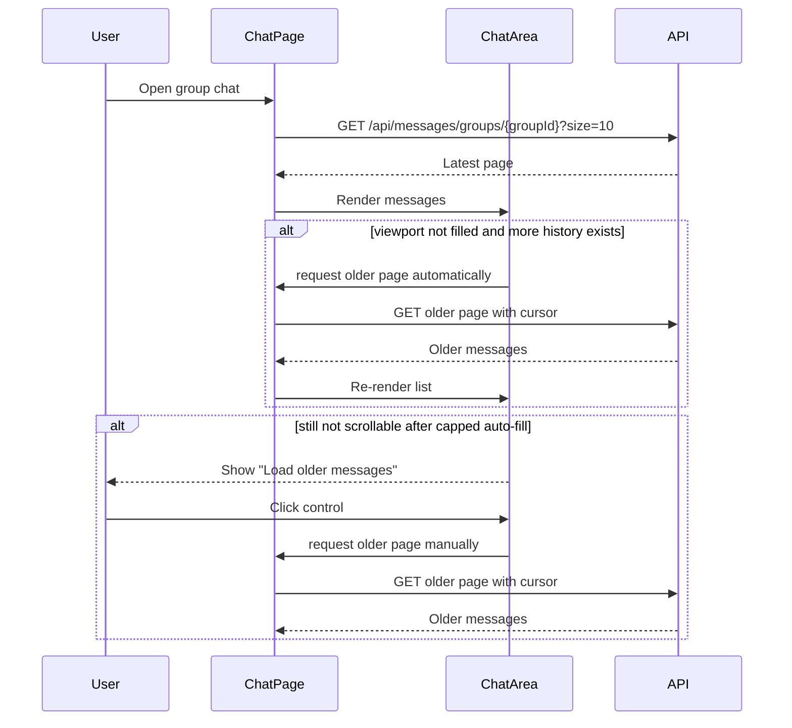

## Current Problem

Group chat history currently loads the latest fixed-size page only once when a user opens a group. In the current frontend flow:

- `ChatPage` calls `getGroupMessages(..., { size: GROUP_PAGE_SIZE })` for the initial group load.
- `getGroupMessages` defaults to `size = 10`.
- `ChatArea` fetches older messages only from `handleMessagesScroll`, and only when the message container is already near the top (`scrollTop <= 40`).

This creates a UX gap on tall screens or low-density conversations:

- the first 10 messages may not fill the viewport
- the container never becomes scrollable
- the user cannot scroll upward to trigger older-page loading
- older messages remain inaccessible unless the user resizes the window or the product exposes another trigger

The issue is specific to group history because public chat does not use the same cursor-based "load older" flow.

## Possible Solutions

### 1. Auto-fill the viewport after the initial load

- How it works:
  - After the first page renders, measure the message container.
  - If `scrollHeight <= clientHeight` and `hasMoreMessages` is `true`, automatically fetch the next older page.
  - Repeat until one of these conditions is reached:
    - the container becomes scrollable
    - the backend reports there are no more messages
    - an auto-fill safety cap is reached, for example 2-5 extra pages
  - Preserve the current visible content so the user still lands near the newest messages.
- Pros:
  - Solves the exact bug without requiring any manual action.
  - Keeps the current pagination API and cursor model.
  - Works for all screen sizes, browser zoom levels, and message-height mixes.
  - Minimal product change: users still experience normal infinite scroll.
- Cons:
  - Can trigger multiple requests when a user first opens a sparse conversation.
  - Requires careful stop conditions to avoid accidental request loops.
  - Slightly increases initial render complexity because layout measurement must happen after DOM paint.
- Recommendation for our problem: Yes. This is the best default fix because it preserves the current UX and addresses the tall-viewport failure directly.

### 2. Adaptive initial page size based on viewport height

- How it works:
  - Estimate how many messages are needed to fill the visible chat area.
  - Request a larger first page for tall screens, for example:
    - `10` for small/normal viewports
    - `20` or `30` for tall viewports
  - Keep older-page loading behavior the same after the first fetch.
- Pros:
  - May solve the problem in a single request.
  - Keeps the scroll-trigger behavior simple after initial load.
  - Can reduce extra round trips compared with repeated auto-fill fetches.
- Cons:
  - Message height is highly variable because of text length, images, reply UI, moderation banners, and timestamps, so any estimate is approximate.
  - Still fails when a few very short messages do not fill a very large screen.
  - Couples page size to client layout rather than data needs.
  - Larger first pages can slow initial chat-open latency on average.
- Recommendation for our problem: No as the primary fix.
- When I'd use it:
  - As an optimization later, combined with viewport auto-fill, to reduce the number of follow-up requests.

### 3. Manual "Load older messages" button

- How it works:
  - Show a button, link, or banner at the top of the conversation when `hasMoreMessages` is `true`.
  - Clicking it fetches the next older page even if the container is not scrollable.
  - The button may remain visible permanently, or only appear when the container has no scrollbar.
- Pros:
  - Very simple and explicit.
  - Easy fallback when auto-loading is undesirable.
  - Gives users a deterministic recovery path even if auto-detection fails.
- Cons:
  - Adds friction to a flow that is normally expected to be automatic.
  - Can feel inconsistent with infinite-scroll behavior in the same view.
  - Requires extra UI space in an already dense chat layout.
- Recommendation for our problem: Yes as a fallback, but not as the only fix.

### 4. Hybrid approach: auto-fill first, button fallback second

- How it works:
  - Try viewport auto-fill on initial load.
  - Stop after a small request cap.
  - If the container is still not scrollable and `hasMoreMessages` is still `true`, show a top-level "Load older messages" control.
- Pros:
  - Best resilience across real-world cases.
  - Preserves automatic behavior for most users.
  - Prevents unbounded background fetching in extremely long but sparse histories.
  - Gives a visible escape hatch if measurement, layout timing, or unusual content heights prevent auto-fill from finishing the job.
- Cons:
  - More moving parts than either solution alone.
  - Requires a small amount of product/UI work in addition to the fetch logic.
- Recommendation for our problem: Yes. This is the best overall product choice.

### 5. Top sentinel with `IntersectionObserver`

- How it works:
  - Add a sentinel element at the top of the message list.
  - When the sentinel becomes visible, fetch older messages automatically.
  - Replace or supplement the manual `onScroll` threshold check.
- Pros:
  - Cleaner trigger than polling `scrollTop`.
  - Often easier to reason about than pixel thresholds.
  - Can improve behavior in nested scroll containers.
- Cons:
  - Does not solve the empty-scrollbar case by itself, because the sentinel may already be visible immediately on first render.
  - Still needs guard logic to avoid repeated fetch loops.
  - Adds observer lifecycle complexity.
- Recommendation for our problem: No as a standalone fix.
- When I'd use it:
  - If we later refactor the chat list infrastructure and want a more robust trigger mechanism together with viewport auto-fill.

## High level Architecture/Design

### Component Diagram / Flowchart / Sequence Diagram

### Affected frontend responsibilities

- `ChatPage`
  - still owns cursor-based group history pagination
  - may expose a "load older" result that lets the UI know whether another page was appended
- `ChatArea`
  - continues to own scroll-container measurement
  - should decide when the viewport is not yet filled
  - should optionally render a visible top control when automatic loading stops early
- `getGroupMessages`
  - can remain unchanged for the recommended first fix
  - may later accept a larger initial `size` if adaptive first-page loading is added

## Recommendation

Implement the hybrid approach:

1. Keep the current cursor-based paging model.
2. After the initial group page renders, auto-fetch older pages until the message container becomes scrollable, history is exhausted, or a small safety cap is reached.
3. If the cap is reached and the viewport is still not scrollable, show a manual "Load older messages" control at the top.

Why this path:

- It fixes the actual bug instead of working around it indirectly.
- It preserves the existing mental model of infinite scroll.
- It limits network cost better than unbounded auto-fetching.
- It gives the product a graceful fallback for unusual layouts and sparse histories.

## Implementation details

## Lesson (look back here)

- A scroll-triggered pagination design should not assume the viewport is always smaller than the first page of content.
- For chat UIs, "can fetch more" and "user can physically trigger fetch more" are different conditions and should both be designed explicitly.

## Future Higher-Scale Path

- If group histories grow significantly and open-chat latency becomes more important, combine the recommended hybrid approach with an adaptive first-page size so most users fill the viewport in one request.
- If the chat list is later virtualized, move the top-reached detection to a sentinel or virtualization callback while keeping the same viewport auto-fill rule.
- If analytics are available, instrument:
  - number of auto-fill requests per chat open
  - percentage of opens that still needed manual fallback
  - time to first scrollable state
