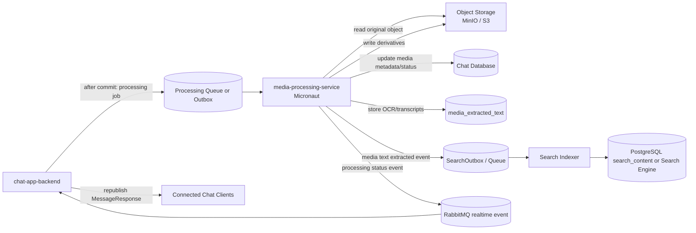

# Media Processing Service

## Intro

The media processing service is a new Micronaut worker service for CPU- and I/O-heavy media work that should not run inside `chat-app-backend`.

The service processes accepted chat media after the final media message is created. It generates media derivatives, extracts technical metadata, and prepares media-derived searchable text so future search can find words inside images, video frames, and spoken audio.

The main goal is to keep `chat-app-backend` responsible for chat-domain workflow while moving long-running thumbnail, transcode, OCR, and transcription work into an independently scalable service.

## Functional Requirements

- Run as a separate `media-processing-service` using Micronaut.
- Consume media-processing jobs only after `chat-app-backend` commits the final message and media rows.
- Process these message types:
  - `IMAGE`
  - `VIDEO`
  - later `AUDIO` when speech-to-text is added
- Generate image derivatives:
  - thumbnail
  - preview image
  - optional compressed display copy
- Generate video derivatives:
  - poster thumbnail
  - optional transcoded preview
- Extract technical metadata:
  - detected MIME type
  - width
  - height
  - duration for video/audio
  - codec/container details if needed later
- Extract media-derived searchable text:
  - OCR text from images
  - OCR text from sampled video frames
  - speech-to-text transcript from video/audio
- Store media-derived searchable text in a structured DB model linked to:
  - message id
  - media attachment id
  - source type
  - optional media timestamp range
- Emit or persist a search-indexing event when extracted text changes.
- Update media status as processing progresses:
  - `PROCESSING_PENDING`
  - `PROCESSING_IN_PROGRESS`
  - `MEDIA_READY`
  - `PROCESSING_FAILED`
- Make processing jobs retryable and idempotent.
- Never receive user-facing chat requests directly.

## Non-Functional Requirements

- Processing must not block chat message creation, WebSocket delivery, or history loading.
- Jobs must be safe to run more than once.
- The service must not receive media bytes through RabbitMQ.
- Queue/event payloads should contain identifiers and storage pointers only.
- The service must use service credentials to read/write object storage.
- The service should have bounded worker concurrency to protect CPU, memory, object storage, and database load.
- Processing failures should be observable with logs, metrics, and dead-letter/failure state.
- OCR/transcription output must respect media retention and deletion policies.
- OCR/transcription provider choice must consider privacy, cost, and Vietnamese-language quality.
- Search indexing from extracted media text can be eventually consistent.

## Use Cases

1. Image thumbnail and preview generation
   - User sends an image message.
   - `chat-app-backend` creates the message with media status `PROCESSING_PENDING`.
   - `media-processing-service` generates thumbnail/preview objects.
   - The service updates media rows to `MEDIA_READY`.
   - Chat clients receive a refreshed message payload through the existing realtime path.

2. Video poster and metadata extraction
   - User sends a video message.
   - The service extracts width, height, duration, and a poster thumbnail.
   - The service optionally writes a lightweight preview/transcoded object later.
   - Chat clients can render a better video card after processing finishes.

3. Search text in images
   - User sends an image containing visible text.
   - The service runs OCR after upload approval.
   - Extracted text is stored as `IMAGE_OCR` text linked to the message attachment.
   - Search can later match the image message by visible text.

4. Search text in video frames
   - User sends a video containing slides, captions, signs, or screen-recorded text.
   - The service samples selected frames and runs OCR.
   - Extracted text is stored as `VIDEO_OCR` with timestamp ranges when available.

5. Search spoken words in video or audio
   - The service extracts audio from a video/audio object.
   - Speech-to-text creates transcript segments.
   - Transcript text is stored as `SPEECH_TO_TEXT` with timestamp ranges.

## Possible Solutions

### 1. How should media processing be deployed?

#### 1.1. Keep Processing Inside `chat-app-backend`

- How it works
  - Spring async workers in `chat-app-backend` handle thumbnails, metadata, OCR, and transcription.
- Pros
  - Lowest initial service count.
  - Simple access to existing repositories and DTO mapping.
- Cons
  - Heavy processing can compete with chat APIs and WebSocket delivery.
  - Harder to scale independently.
  - FFmpeg/OCR dependencies increase the backend runtime footprint.
  - Failures or resource spikes in processing can affect chat behavior.
- Recommendation for our problem: No, except as the temporary Phase 5 placeholder already implemented.

#### 1.2. Dedicated Micronaut Worker Service

- How it works
  - `chat-app-backend` emits processing jobs after commit.
  - A Micronaut worker consumes jobs, reads originals from object storage, writes derivatives, updates status/metadata, and emits processing/search events.
- Pros
  - Isolates CPU-heavy work from chat request handling.
  - Can scale and deploy independently.
  - Good fit for a worker service with lower memory overhead and fast startup.
  - Cleaner place for FFmpeg, OCR, and speech-to-text dependencies.
- Cons
  - Adds a deployable service and service-to-service auth.
  - Requires clear ownership of DB writes and event contracts.
  - Requires job retry/dead-letter handling.
- Recommendation for our problem: Yes.

#### 1.3. Managed Media Platform

- How it works
  - Use a third-party platform for media transforms, OCR, transcription, and delivery.
- Pros
  - Fast path to advanced media features.
  - Less custom processing infrastructure.
- Cons
  - Vendor lock-in.
  - Higher cost.
  - More privacy/compliance review.
  - Less aligned with local MinIO development.
- Recommendation for our problem: No for initial implementation.

### 2. How should extracted text connect to search?

#### 2.1. Store Extracted Text in Chat Database First

- How it works
  - The media service stores OCR/transcript rows in a table such as `media_extracted_text`.
  - Search reads these rows directly in the database-backed search phase or indexes them later.
- Pros
  - Simple source of truth.
  - Works before a dedicated search engine exists.
  - Supports backfill and reindexing.
- Cons
  - PostgreSQL search can become limited at larger scale.
  - Requires DB schema and cleanup with media retention/deletion.
- Recommendation for our problem: Yes.

#### 2.2. Send Extracted Text Directly to Search Engine

- How it works
  - The media service writes OCR/transcripts straight into Elasticsearch/OpenSearch/Meilisearch/Typesense.
- Pros
  - Good query performance and highlighting.
  - Avoids expanding relational query complexity.
- Cons
  - Requires a search engine before media extraction is useful.
  - Harder to rebuild if extracted text is not also stored in the DB.
- Recommendation for our problem: Later.

#### 2.3. Store Text in DB and Emit Search Events

- How it works
  - The media service stores extracted text in DB and records a `MEDIA_TEXT_EXTRACTED` outbox/search event.
  - Search indexing workers update the search index asynchronously.
- Pros
  - Durable source of truth plus scalable index path.
  - Good backfill and replay story.
  - Keeps extraction and indexing loosely coupled.
- Cons
  - More moving parts than DB-only search.
- Recommendation for our problem: Yes as the long-term path.

## High Level Architecture/Design

### Component Diagram / Flowchart / Sequence Diagram

### Core Entities/Models

- `MediaProcessingJob`
  - Durable job identity for one message or attachment processing request.
  - Suggested fields:
    - `id`
    - `message_id`
    - `media_id`
    - `job_type`
    - `status`
    - `attempt_count`
    - `next_attempt_at`
    - `last_error`
    - `created_at`
    - `updated_at`

- `MessageMedia`
  - Existing attachment metadata row.
  - The service updates derivative keys, detected MIME type, width, height, duration, and processing status.

- `MediaExtractedText`
  - New table for OCR/transcription output.
  - Suggested fields:
    - `id`
    - `message_id`
    - `media_id`
    - `source_type`: `IMAGE_OCR`, `VIDEO_OCR`, `SPEECH_TO_TEXT`
    - `raw_text`
    - `normalized_text`
    - `language`
    - `confidence`
    - `start_ms`
    - `end_ms`
    - `processor_name`
    - `processor_version`
    - `created_at`
    - `updated_at`

- `SearchOutbox`
  - Durable event source for search indexing.
  - Includes `MEDIA_TEXT_EXTRACTED` events so search can index OCR/transcript content asynchronously.

### API Draft

The service should primarily be queue/outbox driven. User-facing APIs stay in `chat-app-backend`.

#### Processing Job Message

Payload fields:

- `jobId`
- `messageId`
- `mediaId`
- `messageType`
- `storageProvider`
- `bucket`
- `objectKey`
- `requestedMimeType`
- `processingTargets`
  - `THUMBNAIL`
  - `PREVIEW`
  - `TRANSCODE`
  - `METADATA`
  - `IMAGE_OCR`
  - `VIDEO_OCR`
  - `SPEECH_TO_TEXT`

#### Processing Status Event

Payload fields:

- `messageId`
- `mediaId`
- `status`
- `changedFields`
- `errorCode`
- `occurredAt`

#### Search Text Extracted Event

Payload fields:

- `messageId`
- `mediaId`
- `sourceType`
- `textRowIds`
- `occurredAt`

## Recommendation

Recommended path:

1. Keep Phase 5 in-process media processing as a temporary placeholder only.
2. Add real multipart upload before large media processing so videos/files can enter the pipeline reliably.
3. Create `media-processing-service` with Micronaut as Phase 10.
4. Start with image/video thumbnails, metadata extraction, and status updates.
5. Add `media_extracted_text` before enabling OCR/transcription search.
6. Add image OCR first, then video frame OCR, then speech-to-text.
7. Store extracted text in the DB first and emit search-indexing events for `docs/27_SEARCH_FEATURE.md`.
8. Move to a dedicated search engine when media-derived text makes database search too limited.

## Implementation details

Planned phases:

### Phase 1 - Service Scaffold

- What changed
  - Create a new Micronaut service module named `media-processing-service`.
  - Add config for database access, object storage credentials, queue/outbox consumption, worker concurrency, and processing feature flags.
  - Add health checks and basic metrics.
- Why it changed
  - Establish the service boundary before moving real processing out of `chat-app-backend`.

### Phase 2 - Job Contract and Idempotency

- What changed
  - Define processing job payloads and status events.
  - Add idempotency rules keyed by `jobId` and/or `(mediaId, jobType)`.
  - Add retry/backoff and dead-letter/failure behavior.
- Why it changed
  - Processing jobs may be retried or redelivered, so repeated execution must not corrupt media metadata.

### Phase 3 - Metadata and Derivative Generation

- What changed
  - Extract MIME type, width, height, and duration.
  - Generate image thumbnails/previews.
  - Generate video poster thumbnails.
  - Write derivative object keys back to `message_media`.
- Why it changed
  - Replaces placeholder derivative metadata in `chat-app-backend` with real generated files.

### Phase 4 - Realtime Status Refresh

- What changed
  - Emit processing status events after media rows change.
  - Let `chat-app-backend` hydrate and republish the updated `MessageResponse`.
- Why it changed
  - Keeps client-facing DTOs and WebSocket delivery owned by the chat backend.

### Phase 5 - Image OCR for Search

- What changed
  - Run OCR on image attachments.
  - Store extracted rows in `media_extracted_text` with `source_type = IMAGE_OCR`.
  - Emit `MEDIA_TEXT_EXTRACTED` for search indexing.
- Why it changed
  - Enables future search results for text visible inside image messages.

### Phase 6 - Video OCR

- What changed
  - Sample video frames by interval or scene-change detection.
  - Run OCR on selected frames.
  - Store `VIDEO_OCR` rows with timestamp ranges when available.
- Why it changed
  - Supports searching screen recordings, slides, captions, signs, and other visible text in videos.

### Phase 7 - Speech-to-Text

- What changed
  - Extract audio from video/audio attachments.
  - Generate transcript segments.
  - Store `SPEECH_TO_TEXT` rows with timestamp ranges.
- Why it changed
  - Supports searching spoken content in media messages.

### Phase 8 - Search Engine Integration

- What changed
  - Index media-derived text into the search system described in `docs/27_SEARCH_FEATURE.md`.
  - Include source type and media timestamp metadata in search results.
- Why it changed
  - Allows search to return image/video/audio matches without coupling search queries directly to processing internals.

## Future Higher-Scale Path

- Add GPU-capable worker pools if OCR/transcription throughput requires it.
- Add provider-specific managed OCR/transcription integrations when accuracy or operational cost justifies it.
- Add adaptive video streaming outputs.
- Add per-group or per-user processing quotas.
- Add media-processing dashboards:
  - queue depth
  - processing latency
  - failure rate
  - OCR/transcription provider cost
- Add backfill tooling for old media attachments.
- Add model/provider version tracking so OCR/transcript output can be reprocessed after engine upgrades.
