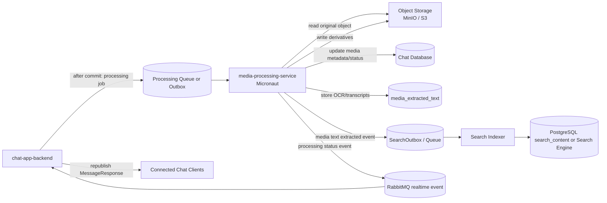
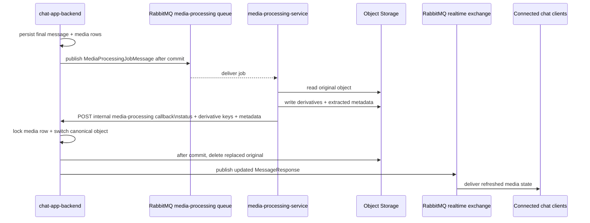

# Media Processing Service

## Intro

The media processing service is a new Micronaut **worker service** for CPU- and I/O-heavy media work that should not run inside `chat-app-backend`.

- Đây chỉ là 1 worker service, consume message từ RabbitMQ để xử lý.
- Nó KHÔNG là 1 job framework, 1 job scheduler như Quartz / JobRunr.

The service processes accepted chat media after the final media message is created. It generates media derivatives, extracts technical metadata, and prepares media-derived searchable text so future search can find words inside images, video frames, and spoken audio.

Current priority:

- video processing comes first
- the first production goal is to turn uploaded videos into chat-friendly playback assets
- image OCR, video OCR, and speech-to-text remain important, but they should follow the first usable video pipeline

The main goal is to keep `chat-app-backend` responsible for chat-domain workflow while moving long-running thumbnail, transcode, OCR, and transcription work into an independently scalable service.

## Functional Requirements

- Run as a separate `media-processing-service` using Micronaut.
- Consume media-processing jobs only after `chat-app-backend` commits the final message and media rows.
- Process these message types:
  - `IMAGE`
  - `VIDEO`
  - later `AUDIO` when speech-to-text is added
- Accept only these video containers for chat video messages:
  - MP4 (`video/mp4`)
  - MOV (`video/quicktime`)
  - WebM (`video/webm`)
- Reject other video containers at upload validation using server-detected type, not only the client-declared MIME type.
- Generate image derivatives:
  - thumbnail
  - preview image
  - optional compressed display copy
- Generate video derivatives:
  - poster thumbnail
  - one normalized transcoded playback/download asset (MP4 / H.264 + AAC)
- After a verified transcode succeeds, use that asset for both inline playback and download, then delete the original video object to save storage.
- Extract technical metadata:
  - detected MIME type
  - width
  - height
  - duration for video/audio
  - codec/container details if needed later
- Extract media-derived searchable text:
  - OCR text from images
  - OCR text from sampled video frames
  - speech-to-text transcript from video/audio
- Store media-derived searchable text in a structured DB model linked to:
  - message id
  - media attachment id
  - source type
  - optional media timestamp range
- Emit or persist a search-indexing event when extracted text changes.
- Update media status as processing progresses:
  - `PROCESSING_PENDING`
  - `PROCESSING_IN_PROGRESS`
  - `MEDIA_READY`
  - `PROCESSING_FAILED`
- Make processing jobs retryable and idempotent.
- Never receive user-facing chat requests directly.

## Non-Functional Requirements

- Processing must not block chat message creation, WebSocket delivery, or history loading.
- Jobs must be safe to run more than once.
- The service must not receive media bytes through RabbitMQ.
- Queue/event payloads should contain identifiers and storage pointers only.
- The service must use service credentials to read/write object storage.
- The service should have bounded worker concurrency to protect CPU, memory, object storage, and database load.
- Processing failures should be observable with logs, metrics, and dead-letter/failure state.
- Do not delete the original video until the transcoded object exists, probes successfully, and `chat-app-backend` has switched client URLs to it.
- If transcode fails, keep the original object and mark media `PROCESSING_FAILED`.
- OCR/transcription output must respect media retention and deletion policies.
- OCR/transcription provider choice must consider privacy, cost, and Vietnamese-language quality.
- Search indexing from extracted media text can be eventually consistent.

## Use Cases

1. Video poster and metadata extraction
   - User sends a video message.
   - The service extracts width, height, duration, and a poster thumbnail.
   - The service optionally writes a lightweight preview/transcoded object later.
   - Chat clients can render a better video card after processing finishes.

2. Video playback optimization
   - User sends an MP4, MOV, or WebM video.
   - The service writes one chat-friendly MP4 (H.264 + AAC).
   - After that object is verified, clients play and download it; the original upload is deleted.
   - Later the service can emit multiple renditions for adaptive playback.

3. Image thumbnail and preview generation
   - User sends an image message.
   - `chat-app-backend` creates the message with media status `PROCESSING_PENDING`.
   - `media-processing-service` generates thumbnail/preview objects.
   - The service updates media rows to `MEDIA_READY`.
   - Chat clients receive a refreshed message payload through the existing realtime path.

4. Search text in images
   - User sends an image containing visible text.
   - The service runs OCR after upload approval.
   - Extracted text is stored as `IMAGE_OCR` text linked to the message attachment.
   - Search can later match the image message by visible text.

5. Search text in video frames
   - User sends a video containing slides, captions, signs, or screen-recorded text.
   - The service samples selected frames and runs OCR.
   - Extracted text is stored as `VIDEO_OCR` with timestamp ranges when available.

6. Search spoken words in video or audio
   - The service extracts audio from a video/audio object.
   - Speech-to-text creates transcript segments.
   - Transcript text is stored as `SPEECH_TO_TEXT` with timestamp ranges.

## Possible Solutions

### 1. How should media processing be deployed?

#### 1.1. Keep Processing Inside `chat-app-backend`

- How it works
  - Spring async workers in `chat-app-backend` handle thumbnails, metadata, OCR, and transcription.
- Pros
  - Lowest initial service count.
  - Simple access to existing repositories and DTO mapping.
- Cons
  - Heavy processing can compete with chat APIs and WebSocket delivery.
  - Harder to scale independently.
  - FFmpeg/OCR dependencies increase the backend runtime footprint.
  - Failures or resource spikes in processing can affect chat behavior.
- Recommendation for our problem: No, except as the temporary Phase 5 placeholder already implemented.

#### 1.2. Dedicated Micronaut Worker Service

- How it works
  - `chat-app-backend` emits processing jobs after commit.
  - A Micronaut worker consumes jobs, reads originals from object storage, writes derivatives, updates status/metadata, and emits processing/search events.
- Pros
  - Isolates CPU-heavy work from chat request handling.
  - Can scale and deploy independently.
  - Good fit for a worker service with lower memory overhead and fast startup.
  - Cleaner place for FFmpeg, OCR, and speech-to-text dependencies.
- Cons
  - Adds a deployable service and service-to-service auth.
  - Requires clear ownership of DB writes and event contracts.
  - Requires job retry/dead-letter handling.
- Recommendation for our problem: Yes.

#### 1.3. Managed Media Platform

- How it works
  - Use a third-party platform for media transforms, OCR, transcription, and delivery.
- Pros
  - Fast path to advanced media features.
  - Less custom processing infrastructure.
- Cons
  - Vendor lock-in.
  - Higher cost.
  - More privacy/compliance review.
  - Less aligned with local MinIO development.
- Recommendation for our problem: No for initial implementation.

### 2. How should extracted text connect to search?

#### 2.1. Store Extracted Text in Chat Database First

- How it works
  - The media service stores OCR/transcript rows in a table such as `media_extracted_text`.
  - Search reads these rows directly in the database-backed search phase or indexes them later.
- Pros
  - Simple source of truth.
  - Works before a dedicated search engine exists.
  - Supports backfill and reindexing.
- Cons
  - PostgreSQL search can become limited at larger scale.
  - Requires DB schema and cleanup with media retention/deletion.
- Recommendation for our problem: Yes.

#### 2.2. Send Extracted Text Directly to Search Engine

- How it works
  - The media service writes OCR/transcripts straight into Elasticsearch/OpenSearch/Meilisearch/Typesense.
- Pros
  - Good query performance and highlighting.
  - Avoids expanding relational query complexity.
- Cons
  - Requires a search engine before media extraction is useful.
  - Harder to rebuild if extracted text is not also stored in the DB.
- Recommendation for our problem: Later.

#### 2.3. Store Text in DB and Emit Search Events

- How it works
  - The media service stores extracted text in DB and records a `MEDIA_TEXT_EXTRACTED` outbox/search event.
  - Search indexing workers update the search index asynchronously.
- Pros
  - Durable source of truth plus scalable index path.
  - Good backfill and replay story.
  - Keeps extraction and indexing loosely coupled.
- Cons
  - More moving parts than DB-only search.
- Recommendation for our problem: Yes as the long-term path.

### 3. Should the original video be kept after transcode?

#### 3.1. Keep original as download/fallback forever

- How it works
  - Clients play `transcodedUrl` and download/fallback via `contentUrl` pointing at the original upload.
- Pros
  - Highest fidelity for users who want the camera/HEVC/VP9 original.
  - If transcode quality is poor, download still has the source.
- Cons
  - Stores two full videos per message until retention expiry.
  - Chat download of MOV/WebM/HEVC is worse for recipients than a normalized MP4.
- Recommendation for our problem: No.

#### 3.2. Replace original with the transcoded MP4 after success

- How it works
  - Worker writes and probes one H.264 + AAC MP4.
  - `chat-app-backend` switches play and download URLs to that object.
  - Then the original object is deleted.
  - If the source is already H.264 + AAC MP4, skip a second copy and keep that object as the canonical file.
  - If transcode fails, keep the original and set `PROCESSING_FAILED`.
- Pros
  - One video blob per message after processing (plus a small poster).
  - Recipients always get a chat-friendly file.
- Cons
  - Lossy re-encode vs HEVC/VP9 originals.
  - Jobs must be ordered: verify transcode → switch pointers → delete original; retries must not require a deleted source.
- Recommendation for our problem: Yes.

### 4. How should processing jobs be run?

This is a **cross-service work queue**: `chat-app-backend` publishes after the media message commits, and `media-processing-service` consumes on another process. That is a different problem from in-app cron or “run this method later in the same cluster.”

#### 4.1. Quartz

- How it works
  - A scheduler (often in-process, optionally JDBC-clustered) fires jobs on a clock or a simple trigger, using a thread pool in the app that hosts Quartz.
- Pros
  - Familiar for recurring cleanup and delayed in-app tasks.
  - JDBC job store can survive a single JVM restart.
- Cons
  - Built for time-based schedules, not “another service, process this MinIO object.”
  - Long FFmpeg jobs occupy scheduler threads and fight timeout/misfire settings.
  - Independent scaling of media workers is awkward compared with queue consumers.
  - Adds a scheduler runtime next to RabbitMQ, which the chat stack already uses.
- Recommendation for our problem: No for media-processing handoff.
- When I’d use it: nightly orphan-upload purge or similar cron inside one service, not video transcode dispatch.

#### 4.2. JobRunr

- How it works
  - Enqueue Java lambdas/jobs into JobRunr’s SQL or Redis store; JobRunr servers execute them with retries and a dashboard.
- Pros
  - Real background-job features: retries, delayed jobs, dashboard.
  - Less custom retry code than a from-scratch scheduler.
- Cons
  - Pulls work into **one JobRunr cluster** and a **second persistence backend**, while chat already has RabbitMQ.
  - Poor fit for a dedicated Micronaut worker that must not share the chat JVM.
  - Still does not replace object-storage I/O, FFmpeg, or the chat-domain callback contract.
- Recommendation for our problem: No for media-processing handoff.
- When I’d use it: delayed/retryable work **inside** a single service (for example a callback retry or a sweeper) after the queue path is stable.

#### 4.3. RabbitMQ work queue (current choice)

- How it works
  - After commit, `chat-app-backend` publishes a `MediaProcessingJobMessage` (identifiers and storage pointers only).
  - `media-processing-service` consumes with Micronaut RabbitMQ, bounded concurrency, and handler-level idempotency.
- Pros
  - Matches the two-service architecture.
  - Reuses the existing broker.
  - Workers scale by adding consumers.
  - Payloads stay small; media bytes stay in object storage.
- Cons
  - Publish after commit can still lose a job if the process dies before the broker ack (no durable outbox yet).
  - Phase 2 dedup is in-memory, so it is not multi-instance safe.
  - Broker retries are weaker for inspectable backoff than a job row (`attempt_count`, `next_attempt_at`).
- Recommendation for our problem: Yes for the first pipeline (Phase 2).
- Follow-up: add a durable `MediaProcessingJob` (or outbox) row later if lost jobs, cross-pod dedup, or operational redrive matter. That complements RabbitMQ; it does not replace it with Quartz or JobRunr.

## High Level Architecture/Design

### Component Diagram / Flowchart / Sequence Diagram

### Planned Backend / Worker Communication

Recommended communication split:

- Keep **processing jobs** on a dedicated RabbitMQ processing exchange/queue.
- Keep **real-time chat delivery** on the existing RabbitMQ real-time exchange.
- Let `media-processing-service` report completion/failure back through a narrow internal API in `chat-app-backend` rather than publishing directly to clients.
- Keep `chat-app-backend` as the only service that transforms processing results into updated `MessageResponse` payloads.

### Core Entities/Models

- `MediaProcessingJob`
  - Durable job identity for one message or attachment processing request.
  - Not required for the first video pipeline. Phase 2 delivers jobs via RabbitMQ; this table is a later, low-priority hardening step (Phase 13).
  - Client-visible processing state stays on `MessageMedia`. This row is for enqueue, retry, claim/dedup, and recovery.
  - Suggested fields:
    - `id`
    - `message_id`
    - `media_id`
    - `job_type`
    - `status`
    - `attempt_count`
    - `next_attempt_at`
    - `last_error`
    - `created_at`
    - `updated_at`

- `MessageMedia`
  - Existing attachment metadata row.
  - The service updates derivative keys, detected MIME type, width, height, duration, and processing status.

- `MediaExtractedText`
  - New table for OCR/transcription output.
  - Suggested fields:
    - `id`
    - `message_id`
    - `media_id`
    - `source_type`: `IMAGE_OCR`, `VIDEO_OCR`, `SPEECH_TO_TEXT`
    - `raw_text`
    - `normalized_text`
    - `language`
    - `confidence`
    - `start_ms`
    - `end_ms`
    - `processor_name`
    - `processor_version`
    - `created_at`
    - `updated_at`

- `SearchOutbox`
  - Durable event source for search indexing.
  - Includes `MEDIA_TEXT_EXTRACTED` events so search can index OCR/transcript content asynchronously.

### API Draft

The service should primarily be queue/outbox driven. User-facing APIs stay in `chat-app-backend`.

#### Liveness

- `GET /health`
  - Unauthenticated process-up check
  - Response: `{"status":"UP"}`

#### Processing Job Message

Payload fields:

- `jobId`
- `messageId`
- `mediaId`
- `messageType`
- `storageProvider`
- `bucket`
- `objectKey`
- `requestedMimeType`
- `processingTargets`
  - `THUMBNAIL`
  - `PREVIEW`
  - `TRANSCODE`
  - `METADATA`
  - `IMAGE_OCR`
  - `VIDEO_OCR`
  - `SPEECH_TO_TEXT`

#### Internal Processing Result Callback

- `POST /api/internal/media-processing/results`
- Header: `X-Media-Processing-Token`
- Enabled only when `chat.media.processing.enabled=true`.
- Payload fields:

- `jobId`
- `messageId`
- `mediaId`
- `status`
- `videoMetadata`
- `completedTargets`
- `pendingTargets`
- `originalObjectKey`
- `transcodedObjectKey`
- `canonicalObjectSize`
- `reusedOriginalObject`
- Successful response: HTTP `204`.
- The endpoint locks the `MessageMedia` row, validates the stable `jobId` (`media-{mediaId}`) and source key, and applies callbacks idempotently.
- `MEDIA_READY` requires the canonical object to exist before the row is switched.
- This is a service-authenticated internal endpoint, not a user-facing API.

#### Search Text Extracted Event

Payload fields:

- `messageId`
- `mediaId`
- `sourceType`
- `textRowIds`
- `occurredAt`

## Recommendation

Recommended path:

1. Keep Phase 5 in-process media processing as a temporary placeholder only.
2. Treat the new `media-processing/` Micronaut project as the service scaffold that Phase 1 already established.
3. Prioritize video processing before broader media-search enrichment.
4. Build the first usable video pipeline in this order:
   - accept only MP4, MOV, and WebM uploads
   - consume post-commit processing jobs
   - extract video metadata
   - generate poster thumbnails
   - write a normalized/transcoded playback-and-download asset (MP4 / H.264 + AAC)
   - switch client URLs to that asset, then delete the original unless it already was that asset
   - expose derivative URLs/status back to `chat-app-backend`
5. After the first usable video pipeline works, add the contract needed for a better frontend video player in `docs/12_MEDIA_CHAT_SUPPORT_DRAFT.md`.
6. Add adaptive video outputs later:
   - lower-resolution renditions
   - mobile-friendly playback defaults
   - optional HLS/adaptive streaming
7. Add `media_extracted_text` before enabling OCR/transcription search.
8. Add video OCR and speech-to-text before image OCR only if search value for video is more urgent than image search.
9. Store extracted text in the DB first and emit search-indexing events for `docs/27_SEARCH_FEATURE.md`.
10. Move to a dedicated search engine when media-derived text makes database search too limited.
11. Keep media-processing handoff on RabbitMQ. Do not introduce Quartz or JobRunr for transcode dispatch. Add a durable `MediaProcessingJob` table only later (low priority) if lost jobs or multi-instance recovery become operationally important.

## Implementation details

### Phase 1 - Service Scaffold - **Done**

- `media-processing/` has been initialized as a Micronaut project.
- Current scaffold evidence in the repo:
  - `media-processing/pom.xml`
  - `media-processing/mvnw`
  - `media-processing/src/main/java/com/hello/mediaprocessing/Application.java`
  - `media-processing/src/main/resources/application.properties`
  - `media-processing/README.md`
- No object-storage integration or video pipeline is implemented yet.

### Phase 2 - Processing job contract and worker wiring - **Done**

- Initial handoff mechanism chosen: RabbitMQ (not Quartz or JobRunr).
- No `MediaProcessingJob` table in this phase; durable job persistence is deferred to Phase 13.
- Added job contract types for:
  - message type
  - processing targets
  - handoff mode
  - worker status
  - processing job payload
- Added worker configuration for:
  - enabled/disabled worker mode
  - handoff mode
  - queue name
  - consumer concurrency
  - retry count
  - feature flags for video/image processing steps
- Added first worker-side handler flow with basic status transitions:
  - `RECEIVED`
  - `VALIDATED`
  - `DISPATCHED`
  - `SKIPPED_DUPLICATE`
  - `DEFERRED_NO_ENABLED_TARGETS`
  - `REJECTED_INVALID`
- Added a RabbitMQ consumer bean for processing jobs.
- Added an in-memory deduplication store as the first local idempotency layer.
- Added focused tests for:
  - valid job dispatch
  - duplicate job skip
  - disabled-target deferral
- Worker consumer is disabled by default until queue/broker wiring is explicitly enabled in configuration.
- No actual media processing work happens yet; this phase only establishes the contract and worker entrypoint for future phases.

### Phase 3 - Object storage and video source loading - **Done**

- Added MinIO object-storage integration in `media-processing-service`.
- Added service-side storage configuration for:
  - storage provider
  - MinIO endpoint
  - MinIO access key
  - MinIO secret key
  - MinIO region
  - path-style access
- Source objects are now loaded with service credentials through the MinIO SDK, not via user-facing signed URLs.
- Added a temp workspace strategy:
  - one per-job workspace directory under a configurable base temp directory
  - source object downloaded into that workspace using the original object filename
- Added cleanup behavior:
  - workspace is cleaned on successful completion of the current load step
  - workspace is also cleaned when source download fails
  - cleanup can be disabled via configuration for debugging if needed
- Added typed failure handling for source loading:
  - `SOURCE_MISSING`
  - `SOURCE_UNREADABLE`
  - `SOURCE_CORRUPTED`
  - `TEMP_FILE_PREPARATION_FAILED`
- Worker flow now marks source-load failures as `PROCESSING_FAILED` with the failure reason logged in the transition detail.
- Current corruption detection is intentionally conservative:
  - zero-byte source objects are treated as corrupted
  - deeper decoder-level corruption validation is deferred to Phase 4 metadata extraction
- Added Javadocs to the Java classes and non-boilerplate methods introduced across implemented Phases 1 through 3.
- Added `.cursor/rules/java-javadocs.instructions.mdc` so future Java work keeps the same documentation baseline.

### Phase 4 - Video metadata extraction - **Done**

- Added ffprobe-based video metadata extraction against the downloaded local source file.
- Added configurable metadata-probe settings for:
  - ffprobe binary path
  - ffprobe timeout
- Extracted and normalized these fields:
  - duration in milliseconds
  - width
  - height
  - detected MIME type
  - container format
  - video codec
  - audio codec
- Added a normalized `MediaProcessingResult` payload so metadata now has a defined handoff shape for later backend integration.
- Added a temporary logging result sink for Phase 4:
  - metadata is assembled into the result payload now
  - Phase 7 will replace the logging sink with a real callback/API integration back into `chat-app-backend`
- Worker status flow is now defined and exercised in code:
  - `PROCESSING_PENDING` still belongs to `chat-app-backend` before the worker starts
  - worker transitions through `PROCESSING_IN_PROGRESS`
  - metadata-only jobs can now reach `MEDIA_READY`
  - source-load or metadata-extraction failures reach `PROCESSING_FAILED`
- Partial progress is also represented cleanly:
  - if `METADATA` finishes but later-phase targets like thumbnail/transcode remain pending, the worker stays in `PROCESSING_IN_PROGRESS`
- Added focused tests for:
  - ffprobe JSON mapping
  - metadata-only ready state
  - metadata-plus-pending-target partial progress
  - failure propagation to `PROCESSING_FAILED`
- Aligned Java package layout with `.cursor/rules/java-package-types.instructions.mdc`:
  - enums moved to `constant`
  - service-layer data records moved to `model` (`MediaProcessingJobMessage`, `MediaProcessingResult`, `VideoMetadata`, `ObjectStorageDownloadResult`)
  - behavior stays in `service` / `storage` / `messaging` (`LoadedMediaSource` remains in `service` because it owns workspace cleanup)

### Phase 5 - Video poster thumbnail generation - **Done**

- What changed:
  - `media-processing-service` now implements the `THUMBNAIL` target for video jobs.
  - The worker uses ffmpeg to capture a single JPEG poster near the start of the video, clamped by video duration.
  - Poster files are uploaded to object storage under `{stem}.thumbnail.jpg`.
  - `MediaProcessingResult` / backend callback payloads now include `thumbnailObjectKey`.
  - `chat-app-backend` persists `thumbnailObjectKey` onto `MessageMedia`, so `thumbnailUrl` / `posterUrl` can be exposed to the frontend.
  - Default local-trigger and backend-published video jobs now request `METADATA`, `THUMBNAIL`, and `TRANSCODE`.
- Why it changed:
  - Phase 8's frontend contract needs a stable poster image before the richer video-player UX can start.
- Manual test without `chat-app-backend`:
  - Put an MP4, MOV, or WebM object in MinIO (default bucket `chat-media`).
  - Start the worker with ffmpeg/ffprobe on `PATH`. RabbitMQ is not required while `media-processing.worker.enabled=false`.
  - Enable the local trigger: `media-processing.local-trigger.enabled=true` (keep this off outside local testing).
  - `POST http://localhost:9020/local/media-processing/jobs` with `{"objectKey":"path/to/video.mov"}`.
  - Response includes worker `status` plus `thumbnailObjectKey` and `transcodedObjectKey` when the sink emitted a result.
  - Confirm the derived poster in MinIO as `{stem}.thumbnail.jpg`.
- Phase 6 (transcode) was still implemented first so canonical playback could land before poster polish.

### Phase 6 - First usable transcoded playback asset - **Done**

- What changed:
  - Worker can complete the `TRANSCODE` target independently of poster generation.
  - Input allowlist is enforced at transcode time: MP4, MOV, WebM only.
  - `VideoTranscodePlanner` chooses reuse, remux, or re-encode:
    - reuse the original object when it is already H.264 + AAC MP4
    - remux to MP4 when codecs are already chat-friendly but the container is not
    - otherwise re-encode to one H.264 + AAC MP4 via ffmpeg (`libx264`, AAC, `+faststart`)
  - Derived files are uploaded to MinIO under `{stem}.transcoded.mp4` and reported on `MediaProcessingResult.transcodedObjectKey`.
  - Stateless key derivation lives in `util.VideoTranscodeObjectKeys`.
  - ffmpeg settings are configurable (`ffmpeg-path`, timeout, CRF, preset, audio bitrate).
  - `video-transcode` feature flag is enabled in `application.properties`.
  - Original objects are **not** deleted in this phase; pointer switch + delete remain Phase 7.
- Manual test without `chat-app-backend`:
  - Put an MP4, MOV, or WebM object in MinIO (default bucket `chat-media`).
  - Start the worker with ffmpeg/ffprobe on `PATH`. RabbitMQ is not required while `media-processing.worker.enabled=false`.
  - Enable the local trigger: `media-processing.local-trigger.enabled=true` (keep this off outside local testing).
  - `POST http://localhost:9020/local/media-processing/jobs` with `{"objectKey":"path/to/video.mov"}`.
  - Optional body fields: `bucket`, `requestedMimeType`, `processingTargets`, `jobId`, `messageId`, `mediaId`.
  - Response includes worker `status` plus `transcodedObjectKey` when the sink emitted a result.
  - Confirm the derived object in MinIO (`{stem}.transcoded.mp4`) unless the source was already H.264 + AAC MP4 (reuse).
  - This endpoint is not a user-facing chat API.

### Phase 7 - Chat-backend integration contract - **Done**

- What changed in `chat-app-backend`:
  - Replaced the temporary in-process `AsyncMediaProcessingService` placeholder with `RabbitMediaProcessingService`.
  - After the final message transaction commits, the existing `MediaProcessingService.enqueueProcessing(messageId)` hook now publishes one `MediaProcessingJobMessage` per video attachment.
  - Added durable RabbitMQ topology:
    - exchange: `media.processing`
    - queue: `media.processing.jobs`
    - routing key: `media.processing.video`
  - Job ids are stable per attachment (`media-{mediaId}`) for handler idempotency.
  - Jobs now request `METADATA`, `THUMBNAIL`, and `TRANSCODE`.
  - Only video is queued in this rollout. Images are published as `MEDIA_READY` using their original object until Phase 12 adds real image derivatives.
  - Added service-authenticated `POST /api/internal/media-processing/results`.
  - Callback updates remain owned by `chat-app-backend`; the worker does not write the chat database.
  - The callback takes a pessimistic lock on `MessageMedia`, updates duration/width/height/status, and verifies the canonical object exists before switching keys.
  - On success, `objectKey` and `transcodedObjectKey` both identify the canonical MP4, so `contentUrl` and `transcodedUrl` resolve to the same file.
  - The replaced original is deleted from MinIO only after the DB transaction commits. Cleanup failure is logged and leaves an orphan rather than breaking the canonical media row.
  - Duplicate callbacks for an attachment already at `MEDIA_READY` return successfully without deleting or downgrading it. This handles a lost HTTP response followed by RabbitMQ redelivery after the original was deleted.
  - The updated `MessageResponse` is republished through the existing realtime path after commit.
- What changed in `media-processing-service`:
  - Added `ChatBackendMediaProcessingResultSink`, enabled by `media-processing.callback.enabled=true`.
  - The sink calls the backend synchronously with the shared token; callback transport failures escape the handler so RabbitMQ can redeliver.
  - `MediaProcessingResult` now includes source key, poster key, canonical object size, canonical key, metadata, and reuse status.
  - Processing failures are also reported to the callback so the backend can set `PROCESSING_FAILED`.
  - The logging/local-test sink remains active when callback integration is disabled.
- Configuration:
  - Backend: `MEDIA_PROCESSING_ENABLED=true` and a non-default `MEDIA_PROCESSING_CALLBACK_TOKEN`.
  - Worker: `MEDIA_PROCESSING_WORKER_ENABLED=true`, `MEDIA_PROCESSING_CALLBACK_ENABLED=true`, matching `MEDIA_PROCESSING_CALLBACK_TOKEN`, `CHAT_APP_BACKEND_URL`, and `RABBITMQ_URI`.
  - Integration and the local manual trigger are disabled by default.
- Current limitation:
  - MinIO supports original deletion. The repository's S3 provider is still a placeholder and does not implement deletion.
  - RabbitMQ publish is after commit but has no transactional outbox; the low-priority durable job/outbox work remains Phase 13.

### Phase 8 - Frontend video-player dependency contract - **Done**

- Define the minimum processed video outputs required before frontend player work starts:
  - poster thumbnail
  - duration metadata
  - transcoded playback asset
- Align this phase with `docs/12_MEDIA_CHAT_SUPPORT_DRAFT.md` Phase 11.
- Keep this phase focused on the contract and payload shape, not on implementing the player UI inside this service.
- Contract additions:
  - attachment `posterUrl`: preferred pre-play still image for video cards
  - attachment `playbackUrl`: canonical URL the player should open first
  - attachment `downloadUrl`: canonical file recipients should download
  - attachment `durationMs`, `width`, and `height`: minimum metadata for pre-play layout/copy
  - existing `contentUrl`, `thumbnailUrl`, and `transcodedUrl` remain for backward compatibility during rollout
- What changed:
  - `chat-app-backend` now includes `posterUrl`, `playbackUrl`, and `downloadUrl` in `MessageAttachmentResponse`.
  - Frontend attachment types now explicitly model `durationMs`, `width`, `height`, `posterUrl`, `playbackUrl`, and `downloadUrl`.
  - The current inline video component prefers `playbackUrl`, applies `posterUrl` when available, and shows duration/size metadata without introducing the Phase 11 player redesign yet.
- Contract rules:
  - before poster generation succeeds for a given asset, `posterUrl` may be `null`
  - before transcode finishes, `playbackUrl` may be `null` or may fall back to `contentUrl`
  - after Phase 7 video success, `contentUrl` and `downloadUrl` point at the canonical MP4
  - after Phase 7 video success, `playbackUrl` resolves to the canonical MP4 (`transcodedUrl` when distinct, otherwise `contentUrl`)
  - the frontend should stop inferring “best playable URL” from raw storage fields once `playbackUrl` is available

### Phase 9 - Adaptive/mobile-friendly video outputs

- This phase should be split into smaller tasks. Keep it focused on additional MP4 renditions only.
- Do **not** add HLS in this phase; HLS stays Phase 10.
- Suggested order:
  1. Define the first rendition strategy - **Done**
     - v1 will produce exactly one additional mobile-friendly MP4 rendition: `480p`
     - do not add `240p` or `720p` in the first rollout; one smaller rendition keeps Phase 9 narrow and easier to validate
     - keep the existing canonical MP4 as the stable download/fallback asset
     - encoding profile for the first smaller rendition:
       - container: MP4
       - video codec: H.264
       - audio codec: AAC when the source has audio
       - max height: `480`
       - width: scale proportionally, preserve aspect ratio, never upscale
       - playback compatibility goals stay aligned with the existing canonical MP4 (`yuv420p`, fast-start headers)
     - skip the smaller rendition when:
       - the source or canonical MP4 is already `<= 480p`
       - metadata is missing or too incomplete to scale safely
       - the source is so short/small that the extra rendition would add complexity without meaningful bandwidth savings
     - naming direction for the later implementation step:
       - keep the current canonical MP4 untouched
       - add one sibling derived object for the mobile rendition, for example `{stem}.480p.mp4`
  2. Produce secondary renditions in `media-processing-service`
     - generate the chosen MP4 renditions after the canonical transcode succeeds
     - store them with predictable object keys and metadata
     - keep failures isolated so the canonical MP4 can still be `MEDIA_READY` even if a smaller secondary rendition fails
  3. Extend the backend/frontend contract for multiple sources
     - keep `playbackUrl` as the default source for simple clients
     - add an optional structured list of video sources/renditions for smarter clients
     - include enough metadata per rendition for selection, such as resolution and approximate bitrate or file size
  4. Add frontend default-selection rules
     - decide how the client chooses a lower-resolution source on mobile or poor networks
     - start with simple heuristics and no manual quality switch if that keeps scope smaller
     - keep fallback behavior straightforward: if rendition selection is unavailable, play `playbackUrl`
- Exit criteria for this phase:
  - the worker can produce at least one smaller MP4 rendition
  - the backend can expose that rendition without breaking old clients
  - the frontend can prefer a smaller source when conditions call for it

### Phase 10 - Adaptive streaming

- Add HLS/adaptive streaming if video size and playback quality require it.
- Produce playlist/manifests and segment outputs.
- Decide how `chat-app-backend` exposes adaptive playback URLs to the frontend.
- Keep the single canonical MP4 (and later a simple MP4 rendition) as download/fallback for clients that cannot use HLS.

### Phase 11 - Video search enrichment

- Add video OCR on sampled frames when video search becomes important enough.
- Add speech-to-text transcript extraction for video audio.
- Store extracted rows in `media_extracted_text`.
- Emit `MEDIA_TEXT_EXTRACTED` events for the search pipeline in `docs/27_SEARCH_FEATURE.md`.
- Keep OCR/transcription behind feature flags until cost, privacy, and quality are validated.

### Phase 12 - Image processing and image OCR

- After the first usable video pipeline is stable, add image-specific processing here:
  - thumbnails
  - previews
  - optional compression
- Add image OCR after the video-first priorities are under control.
- Reuse the same persistence/event patterns established for video.

### Phase 13 - Durable `MediaProcessingJob` table (low priority)

- Priority: **low**. Do this only after the first usable video pipeline (Phases 5–7) works in production-like conditions, and only if RabbitMQ-only handoff is losing jobs, hiding retries, or failing across worker instances.
- What this phase is for:
  - persist a `MediaProcessingJob` row as durable job identity (see Core Entities)
  - write that row in the **same transaction** as the final message / media commit (outbox-style), then publish to RabbitMQ after commit
  - replace in-memory dedup with a DB claim on `job id` / `media_id` so two worker pods cannot both complete the same job
  - record `status`, `attempt_count`, `next_attempt_at`, and `last_error` for inspectable backoff and redrive
  - add a sweeper that re-enqueues rows still pending or stuck in progress after a broker wipe or worker crash
- What this phase is not:
  - a replacement for RabbitMQ (the queue stays the delivery path)
  - a reason to adopt Quartz or JobRunr for transcode dispatch
  - a change to client-visible media status, which remains on `MessageMedia`
- Until this phase exists, `PROCESSING_PENDING` on `MessageMedia` plus the queue payload is enough for the first pipeline.

## Future Higher-Scale Path

- Add GPU-capable worker pools if OCR/transcription throughput requires it.
- Add provider-specific managed OCR/transcription integrations when accuracy or operational cost justifies it.
- Add adaptive video streaming outputs.
- Add per-group or per-user processing quotas.
- Add media-processing dashboards:
  - queue depth
  - processing latency
  - failure rate
  - OCR/transcription provider cost
- Add backfill tooling for old media attachments.
- Add model/provider version tracking so OCR/transcript output can be reprocessed after engine upgrades.
