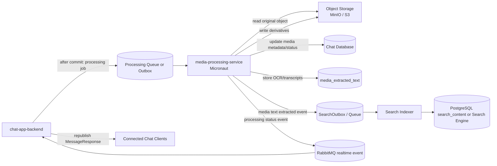

# Media Processing Service

## Intro

The media processing service is a new Micronaut worker service for CPU- and I/O-heavy media work that should not run inside `chat-app-backend`.

The service processes accepted chat media after the final media message is created. It generates media derivatives, extracts technical metadata, and prepares media-derived searchable text so future search can find words inside images, video frames, and spoken audio.

Current priority:

- video processing comes first
- the first production goal is to turn uploaded videos into chat-friendly playback assets
- image OCR, video OCR, and speech-to-text remain important, but they should follow the first usable video pipeline

The main goal is to keep `chat-app-backend` responsible for chat-domain workflow while moving long-running thumbnail, transcode, OCR, and transcription work into an independently scalable service.

## Functional Requirements

- Run as a separate `media-processing-service` using Micronaut.
- Consume media-processing jobs only after `chat-app-backend` commits the final message and media rows.
- Process these message types:
  - `IMAGE`
  - `VIDEO`
  - later `AUDIO` when speech-to-text is added
- Generate image derivatives:
  - thumbnail
  - preview image
  - optional compressed display copy
- Generate video derivatives:
  - poster thumbnail
  - optional transcoded preview
- Extract technical metadata:
  - detected MIME type
  - width
  - height
  - duration for video/audio
  - codec/container details if needed later
- Extract media-derived searchable text:
  - OCR text from images
  - OCR text from sampled video frames
  - speech-to-text transcript from video/audio
- Store media-derived searchable text in a structured DB model linked to:
  - message id
  - media attachment id
  - source type
  - optional media timestamp range
- Emit or persist a search-indexing event when extracted text changes.
- Update media status as processing progresses:
  - `PROCESSING_PENDING`
  - `PROCESSING_IN_PROGRESS`
  - `MEDIA_READY`
  - `PROCESSING_FAILED`
- Make processing jobs retryable and idempotent.
- Never receive user-facing chat requests directly.

## Non-Functional Requirements

- Processing must not block chat message creation, WebSocket delivery, or history loading.
- Jobs must be safe to run more than once.
- The service must not receive media bytes through RabbitMQ.
- Queue/event payloads should contain identifiers and storage pointers only.
- The service must use service credentials to read/write object storage.
- The service should have bounded worker concurrency to protect CPU, memory, object storage, and database load.
- Processing failures should be observable with logs, metrics, and dead-letter/failure state.
- OCR/transcription output must respect media retention and deletion policies.
- OCR/transcription provider choice must consider privacy, cost, and Vietnamese-language quality.
- Search indexing from extracted media text can be eventually consistent.

## Use Cases

1. Video poster and metadata extraction
   - User sends a video message.
   - The service extracts width, height, duration, and a poster thumbnail.
   - The service optionally writes a lightweight preview/transcoded object later.
   - Chat clients can render a better video card after processing finishes.

2. Video playback optimization
   - User sends a large video.
   - The service writes a chat-friendly playback asset with lower bitrate and more predictable codec/container choices.
   - Later the service can emit multiple renditions for adaptive playback.

3. Image thumbnail and preview generation
   - User sends an image message.
   - `chat-app-backend` creates the message with media status `PROCESSING_PENDING`.
   - `media-processing-service` generates thumbnail/preview objects.
   - The service updates media rows to `MEDIA_READY`.
   - Chat clients receive a refreshed message payload through the existing realtime path.

4. Search text in images
   - User sends an image containing visible text.
   - The service runs OCR after upload approval.
   - Extracted text is stored as `IMAGE_OCR` text linked to the message attachment.
   - Search can later match the image message by visible text.

5. Search text in video frames
   - User sends a video containing slides, captions, signs, or screen-recorded text.
   - The service samples selected frames and runs OCR.
   - Extracted text is stored as `VIDEO_OCR` with timestamp ranges when available.

6. Search spoken words in video or audio
   - The service extracts audio from a video/audio object.
   - Speech-to-text creates transcript segments.
   - Transcript text is stored as `SPEECH_TO_TEXT` with timestamp ranges.

## Possible Solutions

### 1. How should media processing be deployed?

#### 1.1. Keep Processing Inside `chat-app-backend`

- How it works
  - Spring async workers in `chat-app-backend` handle thumbnails, metadata, OCR, and transcription.
- Pros
  - Lowest initial service count.
  - Simple access to existing repositories and DTO mapping.
- Cons
  - Heavy processing can compete with chat APIs and WebSocket delivery.
  - Harder to scale independently.
  - FFmpeg/OCR dependencies increase the backend runtime footprint.
  - Failures or resource spikes in processing can affect chat behavior.
- Recommendation for our problem: No, except as the temporary Phase 5 placeholder already implemented.

#### 1.2. Dedicated Micronaut Worker Service

- How it works
  - `chat-app-backend` emits processing jobs after commit.
  - A Micronaut worker consumes jobs, reads originals from object storage, writes derivatives, updates status/metadata, and emits processing/search events.
- Pros
  - Isolates CPU-heavy work from chat request handling.
  - Can scale and deploy independently.
  - Good fit for a worker service with lower memory overhead and fast startup.
  - Cleaner place for FFmpeg, OCR, and speech-to-text dependencies.
- Cons
  - Adds a deployable service and service-to-service auth.
  - Requires clear ownership of DB writes and event contracts.
  - Requires job retry/dead-letter handling.
- Recommendation for our problem: Yes.

#### 1.3. Managed Media Platform

- How it works
  - Use a third-party platform for media transforms, OCR, transcription, and delivery.
- Pros
  - Fast path to advanced media features.
  - Less custom processing infrastructure.
- Cons
  - Vendor lock-in.
  - Higher cost.
  - More privacy/compliance review.
  - Less aligned with local MinIO development.
- Recommendation for our problem: No for initial implementation.

### 2. How should extracted text connect to search?

#### 2.1. Store Extracted Text in Chat Database First

- How it works
  - The media service stores OCR/transcript rows in a table such as `media_extracted_text`.
  - Search reads these rows directly in the database-backed search phase or indexes them later.
- Pros
  - Simple source of truth.
  - Works before a dedicated search engine exists.
  - Supports backfill and reindexing.
- Cons
  - PostgreSQL search can become limited at larger scale.
  - Requires DB schema and cleanup with media retention/deletion.
- Recommendation for our problem: Yes.

#### 2.2. Send Extracted Text Directly to Search Engine

- How it works
  - The media service writes OCR/transcripts straight into Elasticsearch/OpenSearch/Meilisearch/Typesense.
- Pros
  - Good query performance and highlighting.
  - Avoids expanding relational query complexity.
- Cons
  - Requires a search engine before media extraction is useful.
  - Harder to rebuild if extracted text is not also stored in the DB.
- Recommendation for our problem: Later.

#### 2.3. Store Text in DB and Emit Search Events

- How it works
  - The media service stores extracted text in DB and records a `MEDIA_TEXT_EXTRACTED` outbox/search event.
  - Search indexing workers update the search index asynchronously.
- Pros
  - Durable source of truth plus scalable index path.
  - Good backfill and replay story.
  - Keeps extraction and indexing loosely coupled.
- Cons
  - More moving parts than DB-only search.
- Recommendation for our problem: Yes as the long-term path.

## High Level Architecture/Design

### Component Diagram / Flowchart / Sequence Diagram

### Core Entities/Models

- `MediaProcessingJob`
  - Durable job identity for one message or attachment processing request.
  - Suggested fields:
    - `id`
    - `message_id`
    - `media_id`
    - `job_type`
    - `status`
    - `attempt_count`
    - `next_attempt_at`
    - `last_error`
    - `created_at`
    - `updated_at`

- `MessageMedia`
  - Existing attachment metadata row.
  - The service updates derivative keys, detected MIME type, width, height, duration, and processing status.

- `MediaExtractedText`
  - New table for OCR/transcription output.
  - Suggested fields:
    - `id`
    - `message_id`
    - `media_id`
    - `source_type`: `IMAGE_OCR`, `VIDEO_OCR`, `SPEECH_TO_TEXT`
    - `raw_text`
    - `normalized_text`
    - `language`
    - `confidence`
    - `start_ms`
    - `end_ms`
    - `processor_name`
    - `processor_version`
    - `created_at`
    - `updated_at`

- `SearchOutbox`
  - Durable event source for search indexing.
  - Includes `MEDIA_TEXT_EXTRACTED` events so search can index OCR/transcript content asynchronously.

### API Draft

The service should primarily be queue/outbox driven. User-facing APIs stay in `chat-app-backend`.

#### Processing Job Message

Payload fields:

- `jobId`
- `messageId`
- `mediaId`
- `messageType`
- `storageProvider`
- `bucket`
- `objectKey`
- `requestedMimeType`
- `processingTargets`
  - `THUMBNAIL`
  - `PREVIEW`
  - `TRANSCODE`
  - `METADATA`
  - `IMAGE_OCR`
  - `VIDEO_OCR`
  - `SPEECH_TO_TEXT`

#### Processing Status Event

Payload fields:

- `messageId`
- `mediaId`
- `status`
- `changedFields`
- `errorCode`
- `occurredAt`

#### Search Text Extracted Event

Payload fields:

- `messageId`
- `mediaId`
- `sourceType`
- `textRowIds`
- `occurredAt`

## Recommendation

Recommended path:

1. Keep Phase 5 in-process media processing as a temporary placeholder only.
2. Treat the new `media-processing/` Micronaut project as the service scaffold that Phase 1 already established.
3. Prioritize video processing before broader media-search enrichment.
4. Build the first usable video pipeline in this order:
   - consume post-commit processing jobs
   - extract video metadata
   - generate poster thumbnails
   - write a normalized/transcoded playback asset
   - expose derivative URLs/status back to `chat-app-backend`
5. After the first usable video pipeline works, add the contract needed for a better frontend video player in `docs/12_MEDIA_CHAT_SUPPORT_DRAFT.md`.
6. Add adaptive video outputs later:
   - lower-resolution renditions
   - mobile-friendly playback defaults
   - optional HLS/adaptive streaming
7. Add `media_extracted_text` before enabling OCR/transcription search.
8. Add video OCR and speech-to-text before image OCR only if search value for video is more urgent than image search.
9. Store extracted text in the DB first and emit search-indexing events for `docs/27_SEARCH_FEATURE.md`.
10. Move to a dedicated search engine when media-derived text makes database search too limited.

## Implementation details

### Phase 1 - Service Scaffold

- `media-processing/` has been initialized as a Micronaut project.
- Current scaffold evidence in the repo:
  - `media-processing/pom.xml`
  - `media-processing/mvnw`
  - `media-processing/src/main/java/com/hello/mediaprocessing/Application.java`
  - `media-processing/src/main/resources/application.properties`
  - `media-processing/README.md`
- No object-storage integration or video pipeline is implemented yet.

### Phase 2 - Processing job contract and worker wiring

- Initial handoff mechanism chosen: RabbitMQ.
- Added job contract types for:
  - message type
  - processing targets
  - handoff mode
  - worker status
  - processing job payload
- Added worker configuration for:
  - enabled/disabled worker mode
  - handoff mode
  - queue name
  - consumer concurrency
  - retry count
  - feature flags for video/image processing steps
- Added first worker-side handler flow with basic status transitions:
  - `RECEIVED`
  - `VALIDATED`
  - `DISPATCHED`
  - `SKIPPED_DUPLICATE`
  - `DEFERRED_NO_ENABLED_TARGETS`
  - `REJECTED_INVALID`
- Added a RabbitMQ consumer bean for processing jobs.
- Added an in-memory deduplication store as the first local idempotency layer.
- Added focused tests for:
  - valid job dispatch
  - duplicate job skip
  - disabled-target deferral
- Worker consumer is disabled by default until queue/broker wiring is explicitly enabled in configuration.
- No actual media processing work happens yet; this phase only establishes the contract and worker entrypoint for future phases.

### Phase 3 - Object storage and video source loading

- Added MinIO object-storage integration in `media-processing-service`.
- Added service-side storage configuration for:
  - storage provider
  - MinIO endpoint
  - MinIO access key
  - MinIO secret key
  - MinIO region
  - path-style access
- Source objects are now loaded with service credentials through the MinIO SDK, not via user-facing signed URLs.
- Added a temp workspace strategy:
  - one per-job workspace directory under a configurable base temp directory
  - source object downloaded into that workspace using the original object filename
- Added cleanup behavior:
  - workspace is cleaned on successful completion of the current load step
  - workspace is also cleaned when source download fails
  - cleanup can be disabled via configuration for debugging if needed
- Added typed failure handling for source loading:
  - `SOURCE_MISSING`
  - `SOURCE_UNREADABLE`
  - `SOURCE_CORRUPTED`
  - `TEMP_FILE_PREPARATION_FAILED`
- Worker flow now marks source-load failures as `PROCESSING_FAILED` with the failure reason logged in the transition detail.
- Current corruption detection is intentionally conservative:
  - zero-byte source objects are treated as corrupted
  - deeper decoder-level corruption validation is deferred to Phase 4 metadata extraction
- Added Javadocs to the Java classes and non-boilerplate methods introduced across implemented Phases 1 through 3.
- Added `.cursor/rules/java-javadocs.instructions.mdc` so future Java work keeps the same documentation baseline.

### Phase 4 - Video metadata extraction

- Extract video metadata from the original upload:
  - duration
  - width
  - height
  - detected MIME type
  - codec/container details if needed
- Define where this metadata is written so `chat-app-backend` can include it in media DTOs later.
- Define how processing status moves from:
  - `PROCESSING_PENDING`
  - `PROCESSING_IN_PROGRESS`
  - `MEDIA_READY`
  - `PROCESSING_FAILED`

### Phase 5 - Video poster thumbnail generation

- Generate a poster thumbnail for each processed video.
- Decide thumbnail capture rules:
  - first usable frame
  - fixed timestamp
  - or heuristic based on black-frame avoidance
- Write poster object metadata and storage pointers back to the shared persistence/API boundary.
- Ensure `chat-app-backend` can later expose this poster to the frontend as the default pre-play preview.

### Phase 6 - First usable transcoded playback asset

- Produce a normalized/transcoded playback asset for chat video playback.
- Choose the initial output target:
  - one normalized MP4/H.264 + AAC file
- Optimize for:
  - reliable browser playback
  - smaller bandwidth than the original upload
  - acceptable startup time for chat use
- Store the derived playback object and expose a field that `chat-app-backend` can map to `transcodedUrl`.
- Keep the original object available as fallback/download until deletion/retention rules say otherwise.

### Phase 7 - Chat-backend integration contract

- Define how `media-processing-service` reports completed outputs back to the chat system.
- Decide whether the worker:
  - writes directly to the shared database
  - or calls a narrow internal API in `chat-app-backend`
- Update the shared contract so `chat-app-backend` can republish message updates after video processing finishes.
- Ensure the backend can expose these fields to the frontend:
  - poster thumbnail URL
  - transcoded playback URL
  - duration
  - width
  - height
  - processing status

### Phase 8 - Frontend video-player dependency contract

- Define the minimum processed video outputs required before frontend player work starts:
  - poster thumbnail
  - duration metadata
  - transcoded playback asset
- Align this phase with `docs/12_MEDIA_CHAT_SUPPORT_DRAFT.md` Phase 11.
- Keep this phase focused on the contract and payload shape, not on implementing the player UI inside this service.

### Phase 9 - Adaptive/mobile-friendly video outputs

- Add lower-resolution renditions for constrained networks and mobile devices.
- Decide whether the next step is:
  - multiple MP4 renditions first
  - or HLS directly
- Define the initial rendition ladder, for example:
  - 240p
  - 480p
  - 720p
- Decide how the frontend should choose low-resolution playback by default on mobile or poor networks.

### Phase 10 - Adaptive streaming

- Add HLS/adaptive streaming if video size and playback quality require it.
- Produce playlist/manifests and segment outputs.
- Decide how `chat-app-backend` exposes adaptive playback URLs to the frontend.
- Keep original download and simpler fallback playback available for unsupported clients.

### Phase 11 - Video search enrichment

- Add video OCR on sampled frames when video search becomes important enough.
- Add speech-to-text transcript extraction for video audio.
- Store extracted rows in `media_extracted_text`.
- Emit `MEDIA_TEXT_EXTRACTED` events for the search pipeline in `docs/27_SEARCH_FEATURE.md`.
- Keep OCR/transcription behind feature flags until cost, privacy, and quality are validated.

### Phase 12 - Image processing and image OCR

- After the first usable video pipeline is stable, add image-specific processing here:
  - thumbnails
  - previews
  - optional compression
- Add image OCR after the video-first priorities are under control.
- Reuse the same persistence/event patterns established for video.

## Future Higher-Scale Path

- Add GPU-capable worker pools if OCR/transcription throughput requires it.
- Add provider-specific managed OCR/transcription integrations when accuracy or operational cost justifies it.
- Add adaptive video streaming outputs.
- Add per-group or per-user processing quotas.
- Add media-processing dashboards:
  - queue depth
  - processing latency
  - failure rate
  - OCR/transcription provider cost
- Add backfill tooling for old media attachments.
- Add model/provider version tracking so OCR/transcript output can be reprocessed after engine upgrades.
