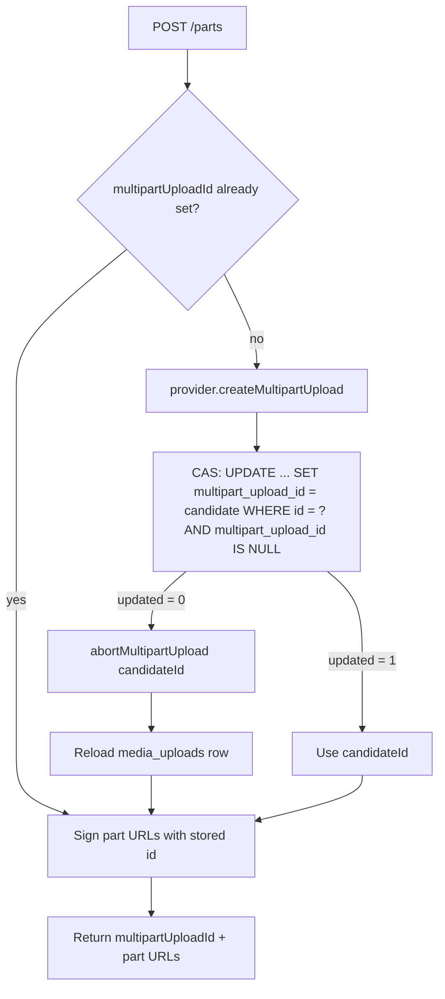

# Multipart Upload ID Init Race

## Current Problem

`MediaUploadSessionService.ensureMultipartUploadInitialized` is check-then-act on `media_uploads.multipart_upload_id`:

1. Read the row (unlocked).
2. If `multipartUploadId` is null/blank, call `provider.createMultipartUpload(objectKey)`.
3. Set the provider id on the entity and rely on the surrounding `@Transactional` flush/commit.

Concurrent `POST .../attachments/{attachmentId}/parts` calls (duplicate tab, retry, overlapping first batches) can both observe null, both create **different** MinIO/S3 multipart upload ids, and both try to persist. Last writer wins in the DB; the other provider multipart upload is orphaned. Part URLs may also be signed against mismatched ids, so later `complete` can fail or leave junk in object storage.

This is TOCTOU / unlocked RMW on the **same** `media_uploads` row, with an external side effect (provider create) that does not roll back with the DB.

Related code:

- `MediaUploadSessionService.requestMultipartPartUrls` / `ensureMultipartUploadInitialized`
- `MediaUpload.multipartUploadId`
- `ObjectStorageProvider.createMultipartUpload` / `abortMultipartUpload`

Related but different races:

| Doc                                                   | Race                                        | Why not the same                                                           |
| ----------------------------------------------------- | ------------------------------------------- | -------------------------------------------------------------------------- |
| [19](./19_MESSAGE_MODERATION_OPTIMISTIC_LOCKING.md)   | Concurrent edits on the same `messages` row | Same-row concurrent mutation family, but DB-only; no provider create/abort |
| [21](./21_LAST_MEMBER_LEAVE_CONCURRENT_JOIN.md)       | Leave/archive vs join                       | Group lifecycle check-then-act; different resource                         |
| [23](./23_MESSAGE_MODERATION_MEMBERSHIP_AUTH_RACE.md) | Moderation vs kick/ban                      | Cross-table auth TOCTOU                                                    |
| [24](./24_MEMBERSHIP_MUTATION_AUTH_LOCK_ORDER.md)     | Auth before group lock                      | Membership auth ordering                                                   |

## Possible Solutions

### 1. Conditional update / CAS on `multipart_upload_id` (chosen)

- How it works:
  1. If the loaded row already has `multipartUploadId`, use it.
  2. Otherwise `createMultipartUpload` on the provider → `candidateId`.
  3. Atomic claim: `UPDATE media_uploads SET multipart_upload_id = :candidateId, … WHERE id = :id AND multipart_upload_id IS NULL` (optionally also require status still `UPLOAD_INITIATED`).
  4. If update count is `1` → this request won; keep `candidateId`.
  5. If update count is `0` → another request won: **abort** `candidateId` on the provider, **reload** the row, use the winner’s `multipartUploadId`, continue signing part URLs.
- Pros: No row lock held across MinIO RTT; natural fit for one-way NULL → value init; loser path is local (abort + reload), not a client HTTP retry; works across app instances.
- Cons: Losing requests may briefly create a provider multipart upload that must be aborted; must not forget the abort/reload branch; JPA entity in memory must be refreshed after a lost CAS (do not keep signing with `candidateId`).
- Recommendation for our problem: **Yes**.

On CAS failure: **do not retry create/CAS**. Another request already initialized the id. Abort the orphaned provider upload, reload, continue. Retry only if reload still shows null (should not happen in normal operation — treat as a bug/invariant failure).

### 2. Pessimistic lock (`SELECT … FOR UPDATE`) on the `media_uploads` row

- How it works: Load the attachment with `FOR UPDATE` inside `requestMultipartPartUrls`. Under the lock, re-check `multipartUploadId`; only the lock holder creates the provider upload and sets the column. Others wait, then see the id already set.
- Pros: Simple mental model; if create runs **while holding the lock**, only one provider upload is created — no abort branch for losers.
- Cons: Holds a DB row lock for the whole critical section, including provider network latency; worse under slow MinIO/S3 or many concurrent first `/parts` calls on the same attachment.
- Recommendation for our problem: **No** as primary approach.
- When I’d use it: Prefer if we want zero orphan creates and are fine locking through a short storage RTT, or as a temporary hardening before CAS + abort exists.

### 3. Create multipart upload at prepare time

- How it works: Call `createMultipartUpload` during `prepareUploadSession` for `MULTIPART` attachments and persist `multipartUploadId` before returning prepare.
- Pros: Removes the lazy-init race on `/parts` entirely; prepare response could expose the id again if desired.
- Cons: Creates provider state even if the user never uploads; more orphans on abandoned prepares; couples prepare latency to storage; contradicts the current lazy-init design (id assigned on first `/parts`).
- Recommendation for our problem: **No** for this race alone.
- When I’d use it: If product wants the upload id known at prepare and accepts cleanup for unused prepares.

### 4. Application / distributed lock per `attachmentId`

- How it works: Redis `SET NX` (or similar) keyed by upload/attachment id around init.
- Pros: Serializes init without `FOR UPDATE`; can span the provider call.
- Cons: Extra infra; must handle lock TTL vs slow storage; DB can still diverge if a path bypasses the lock; overkill for a single nullable column claim.
- Recommendation for our problem: **No**.
- When I’d use it: Broader multi-step workflows that need a distributed mutex beyond one CAS column.

### 5. JPA `@Version` on `MediaUpload`

- How it works: Optimistic lock on the whole staging row; loser gets `OptimisticLockException` and retries.
- Pros: Standard JPA conflict detection for any concurrent field updates.
- Cons: Forces a **retry loop** (re-read, maybe recreate/abort) instead of a single NULL-claim CAS; conflates multipart init with unrelated row updates; still needs provider abort rules on retry.
- Recommendation for our problem: **No** for init specifically (CAS on `multipart_upload_id IS NULL` is narrower and clearer).
- When I’d use it: Broader concurrent mutations of `media_uploads` beyond this one column.

### 6. Accept the race (status quo)

- How it works: Document that concurrent first `/parts` is unsupported; rely on the normal FE sequential batching.
- Pros: Zero code.
- Cons: Real under retries/duplicate clients; orphaned multipart uploads and flaky complete.
- Recommendation for our problem: **No**.

## High level Architecture/Design

### Flowchart (CAS)

### Why CAS fits better than `FOR UPDATE` here

Membership races (docs 21/24) use a group row lock as a **shared mutex for many different mutations**. Multipart init is a **single one-shot claim**: NULL → provider id. That is the textbook CAS shape.

- Winner: one `UPDATE … WHERE multipart_upload_id IS NULL`.
- Loser: no client retry; abort orphaned provider upload; reload winner id; continue.

`FOR UPDATE` would also be correct, but it serializes on a DB lock during storage RTT. CAS keeps the DB critical section to one conditional update and handles the rare conflict in-process.

## Recommendation

1. Add a repository CAS method, e.g. `claimMultipartUploadId(id, candidateId)` → rows updated.
2. Change `ensureMultipartUploadInitialized` to create → claim → on loss abort + reload (no create retry loop).
3. Keep signing part URLs only with the **persisted** winning `multipartUploadId`.
4. Add a concurrency-focused unit/integration test: two overlapping first `/parts` → one DB id, loser aborts, both responses use the same id.
5. Defer implementation; this doc is the design placeholder until the fix lands. Update **Implementation details** after coding — do not rewrite **Recommendation**.

## Implementation details

(Planned — not implemented yet.)

## Lesson (look back here)

Lazy init of an external resource id is check-then-act unless the DB claim is atomic. Prefer CAS when the write is “set once if empty”; use row locks when many mutation kinds need one shared mutex. A lost CAS here means **abort + reload**, not “ignore and keep the local candidate,” and not a user-visible retry.

## Future Higher-Scale Path

- Scheduled cleanup of abandoned multipart uploads (expired sessions, orphaned provider ids after crash between create and CAS).
- Metrics/alerts on CAS-loss + abort count (should stay rare).
- If `/parts` contention becomes common, revisit prepare-time create or a short-lived distributed lock — unlikely for chat attach flows.
