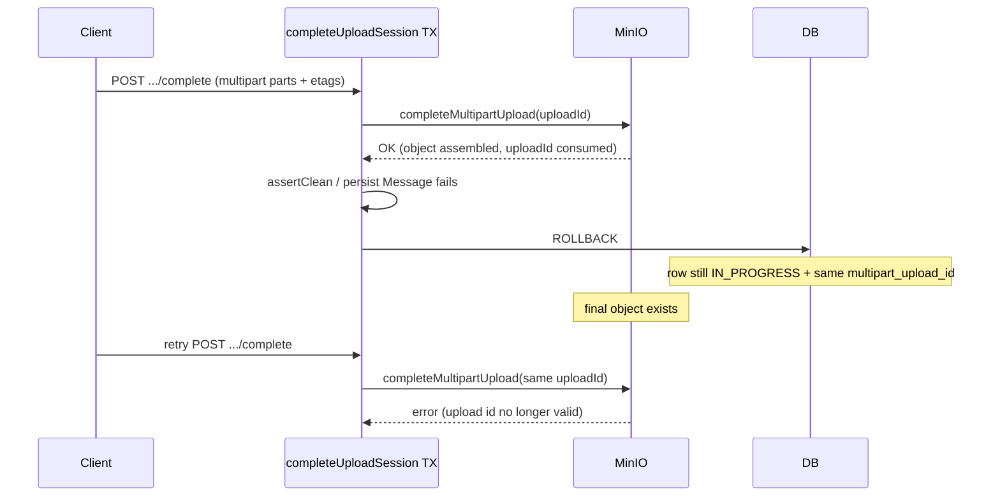
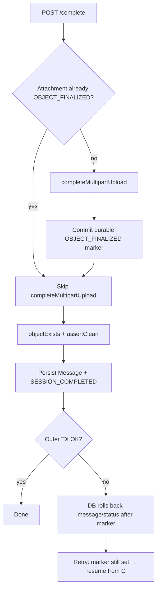

# Multipart Complete vs DB Transaction Compensation

## Current Problem

`MediaUploadSessionService.completeUploadSession` runs as one `@Transactional` method. For multipart attachments, `finalizeAndVerifyUploadedObject` calls `provider.completeMultipartUpload(...)` **inside** that transaction, then continues with `malwareScanService.assertClean`, message persistence, and status updates.

```text
validate → completeMultipartUpload (MinIO/S3) → objectExists → assertClean
        → set UPLOAD_COMPLETED → persist Message → UPLOAD_SESSION_COMPLETED → commit
```

`completeMultipartUpload` is an **irreversible provider side effect**:

- Parts are assembled into the final object.
- That `multipartUploadId` is **consumed** (a second complete with the same id typically fails with `NoSuchUpload` / invalid upload id).
- Spring transaction rollback **does not** undo MinIO/S3.

If anything after provider complete fails (scan, DB constraint, kick mid-flight, process crash before commit), the DB rolls back to a pre-complete looking row (e.g. still `UPLOAD_IN_PROGRESS` with the same `multipart_upload_id`), while storage already holds a finalized object.

A client **retry** of `/complete` then reuses the invalid multipart upload id → hard failure, even though the bytes may already be in the bucket. Orphan object without a `Message` is also possible.

Single-part is milder: the object was already PUT before `/complete`, so retry mainly re-verifies existence. Multipart **complete** is the dangerous step. Details:

- Single-part
  1. `/prepare` → backend returns a presigned **PUT** URL
  2. Browser **PUT**s the whole file to MinIO → object exists at `objectKey`
  3. `/complete` → backend mainly checks `objectExists`, runs scan, persists the message. So `/complete` does **not** assemble or create the object. A retry after a failed `/complete` can usually just re-check that the object is still there and finish DB work. The object was never tied to a one-shot “complete multipart” id.

- Multipart
  1. `/prepare` → strategy `MULTIPART`, no full-object PUT URL
  2. `/parts` + PUT each part → parts live under a `multipartUploadId`
  3. `/complete` → backend calls **`completeMultipartUpload`**, which **assembles** those parts into the final object and **consumes** that upload id. That’s the irreversible step. If the DB TX rolls back after it, retry cannot safely call `completeMultipartUpload` again with the same id — unlike single-part, where the object was already written in step 2.

Related code:

- `MediaUploadSessionService.completeUploadSession`
- `finalizeAndVerifyUploadedObject`
- `MalwareScanService.assertClean`
- `ObjectStorageProvider.completeMultipartUpload`
- `UploadSessionStatus` (`UPLOAD_COMPLETED` is set only after finalize in the same TX, so rollback erases it)

Related but different issues:

| Doc                                                                                                                                                                                                               | Issue                                                            | Why not the same                                                            |
| ----------------------------------------------------------------------------------------------------------------------------------------------------------------------------------------------------------------- | ---------------------------------------------------------------- | --------------------------------------------------------------------------- |
| [31](./31_MEDIA_MULTIPART_UPLOAD_ID_INIT_RACE.md)                                                                                                                                                                 | Concurrent first `/parts` claiming different provider upload ids | Init race on create; this doc is complete-time non-rollbackable side effect |
| [19](./19_MESSAGE_MODERATION_OPTIMISTIC_LOCKING.md) / [21](./21_LAST_MEMBER_LEAVE_CONCURRENT_JOIN.md) / [23](./23_MESSAGE_MODERATION_MEMBERSHIP_AUTH_RACE.md) / [24](./24_MEMBERSHIP_MUTATION_AUTH_LOCK_ORDER.md) | Same-row or auth TOCTOU                                          | DB concurrency; no consumed multipart id                                    |

Same family as “irreversible side effect inside a DB transaction” in `.cursor/rules/avoid-race-conditions.instructions.mdc` (side effects that outlive rollback).

## Possible Solutions

### 1. Persist a recoverable “object finalized” state, then skip provider complete on retry (chosen)

- How it works:
  1. On `/complete`, if the attachment is already marked finalized (new status or flag), **skip** `completeMultipartUpload`; only `objectExists` (and later scan/persist).
  2. Otherwise call `completeMultipartUpload`, then **commit a durable marker** that the object was finalized (must be visible even if the outer complete TX later rolls back).
  3. Continue scan → persist message → `UPLOAD_SESSION_COMPLETED` in the main TX.
  4. Retry of `/complete` sees the marker → resume without reusing the multipart upload id.
- How to make the marker survive outer rollback (pick one when implementing):
  - **A.** `REQUIRES_NEW` (or separate committed TX) right after successful provider complete: update status / flag, commit, then continue outer work.
  - **B.** Split API phases (finalize-storage vs publish-message) — heavier API change; not needed if A is enough.
- Marker shape (TBD in implementation): new `UploadSessionStatus` value (e.g. `OBJECT_FINALIZED`) and/or a boolean / timestamp column on `media_uploads`. Prefer a status the complete flow already understands.
- Pros: Retries are safe; user bytes kept; matches “persist recoverable completion state before finishing”; no need to delete a good object on transient DB failure.
- Cons: Need a committed step around provider complete; orphan objects possible until a later complete succeeds or a cleanup job runs; must define idempotent complete for multi-attachment sessions (some attachments finalized, others not).
- Recommendation for our problem: **Yes**.

On retry after marker is set: **do not** call `completeMultipartUpload` again. Verify object, run scan/persist. Do not invent a new multipart upload id for the same attachment.

### 2. Compensate: delete finalized object if later steps fail

- How it works: After provider complete, if scan/persist fails, delete the object (and clear/fail the upload row). Client must start a **new** upload session (re-PUT / re-multipart).
- Pros: DB and storage stay aligned on failure; no “half finalized” resume path.
- Cons: Throws away successfully uploaded bytes on transient failures; multi-attachment sessions get awkward (delete only the failed attachment’s object? already-finalized siblings?); delete itself can fail → still need recovery; worse UX than resume.
- Recommendation for our problem: **No** as primary approach.
- When I’d use it: Hard fail paths (malware blocked) where the object must not remain readable, or as cleanup for abandoned finalized rows past TTL.

### 3. Move provider complete outside / after the main DB transaction

- How it works: Commit “intent to complete” (parts metadata stored) first; after commit, call `completeMultipartUpload`; then a second TX creates the message. Or invert: complete storage first in a non-TX service method, then open a TX only for DB writes (still need durable marker before returning success to the client if message persist can fail).
- Pros: Clear separation of storage vs DB.
- Cons: Easy to get wrong without a durable marker anyway; two-phase API or more complex orchestration; still needs retry/idempotency rules.
- Recommendation for our problem: **No** as a standalone fix (overlaps Solution 1’s nested commit). Acceptable as a refactor once markers exist.
- When I’d use it: If we split complete into explicit “finalize storage” and “publish message” endpoints for product reasons.

### 4. Accept status quo

- How it works: Document that `/complete` must not be retried after a 5xx once multipart finalize may have run; tell users to re-upload.
- Pros: Zero code.
- Cons: FE already retries; network blips and scan/DB failures leave broken sessions and orphan objects; review finding stands.
- Recommendation for our problem: **No**.

### 5. Pessimistic lock on `media_uploads` during complete only

- How it works: `SELECT … FOR UPDATE` so two concurrent `/complete` calls serialize.
- Pros: Reduces double-complete races between two in-flight requests.
- Cons: Does **not** fix rollback-after-provider-complete; loser/retry after rollback still hits a consumed multipart id. Necessary concurrency hygiene maybe later, not sufficient.
- Recommendation for our problem: **No** as the fix for this issue.
- When I’d use it: Alongside Solution 1, to serialize concurrent completes on the same session.

## High level Architecture/Design

### Failure mode today



### Target resume flow (Solution 1)



### Multi-attachment sessions

One `/complete` may finalize several attachments. Each attachment should carry its own finalized marker. Retry must:

- Skip provider complete only for attachments already marked finalized.
- Still run provider complete for attachments not yet finalized.
- Require the request to include every prepared attachment (existing rule).

### Hard failures vs retryable failures

| Outcome                             | Suggested behavior                                                                                            |
| ----------------------------------- | ------------------------------------------------------------------------------------------------------------- |
| Transient DB / crash after finalize | Resume via marker (Solution 1)                                                                                |
| Malware blocked                     | Do **not** publish message; compensate (delete object / mark `UPLOAD_FAILED`) so content is not left readable |
| Session expired                     | Existing expiry rules; cleanup job for leftover objects                                                       |

## Recommendation

1. Add a durable per-attachment “object finalized” marker (new `UploadSessionStatus` and/or column) that survives failure of the outer complete transaction (`REQUIRES_NEW` or equivalent after successful `completeMultipartUpload`).
2. Make `finalizeAndVerifyUploadedObject` idempotent: if marker set (or equivalently: multipart already consumed and object exists + marker), skip `completeMultipartUpload`.
3. Keep scan + message persistence in the main complete TX; retries resume from verification onward.
4. For malware block (and similar hard fails), prefer delete/quarantine compensation rather than leaving a readable orphan.
5. Add tests: provider complete succeeds then persist throws → retry skips complete and succeeds; already-finalized attachment never calls `completeMultipartUpload` again.
6. **Do not implement yet** — this doc is for design review. Update **Implementation details** after coding; do not rewrite **Recommendation**.

Open points for review:

- Exact marker: new enum value vs boolean `storage_finalized_at`?
- Marker TX: `REQUIRES_NEW` on a small helper vs explicit `TransactionTemplate`?
- Should single-part also set the same marker for a uniform resume path?
- Interaction with future orphan-cleanup jobs (Feature 12 hardening).

## Implementation details

(Planned — not implemented yet.)

## Lesson (look back here)

Provider multipart complete is not covered by DB rollback. Anything after it must either **compensate** (delete) or **checkpoint** (durable finalized marker) so retries never reuse a consumed `multipartUploadId`. Setting `UPLOAD_COMPLETED` only in the same TX as finalize is not a recoverable checkpoint.

## Future Higher-Scale Path

- Scheduled cleanup of `OBJECT_FINALIZED` rows that never reached `UPLOAD_SESSION_COMPLETED` (TTL).
- Metrics: complete retries that took the skip path; orphan finalize markers; malware-driven deletes.
- Optional split endpoints later if product wants explicit “finalize storage” vs “publish” UX.
