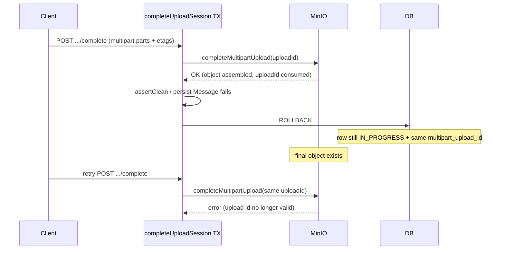
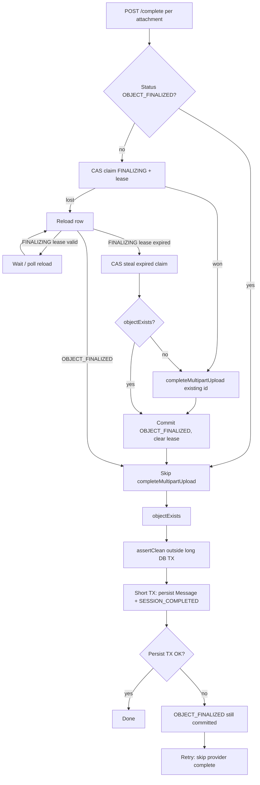

# Multipart Complete vs DB Transaction Compensation

## Current Problem

`MediaUploadSessionService.completeUploadSession` runs as one `@Transactional` method. For multipart attachments, `finalizeAndVerifyUploadedObject` calls `provider.completeMultipartUpload(...)` **inside** that transaction, then continues with `malwareScanService.assertClean`, message persistence, and status updates.

```text
validate → completeMultipartUpload (MinIO/S3) → objectExists → assertClean
        → set UPLOAD_COMPLETED → persist Message → UPLOAD_SESSION_COMPLETED → commit
```

`completeMultipartUpload` is an **irreversible provider side effect**:

- Parts are assembled into the final object.
- That `multipartUploadId` is **consumed** (a second complete with the same id typically fails with `NoSuchUpload` / invalid upload id).
- Spring transaction rollback **does not** undo MinIO/S3.

If anything after provider complete fails (scan, DB constraint, kick mid-flight, process crash before commit), the DB rolls back to a pre-complete looking row (e.g. still `UPLOAD_IN_PROGRESS` with the same `multipart_upload_id`), while storage already holds a finalized object.

A client **retry** of `/complete` then reuses the invalid multipart upload id → hard failure, even though the bytes may already be in the bucket. Orphan object without a `Message` is also possible.

Secondary smell in the same method: `malwareScanService.assertClean` also runs inside that long `@Transactional` boundary. Once real ClamAV I/O exists, holding a DB transaction open across download/scan is undesirable. That does **not** require a background scan job by itself (Feature 12 still treats malware as the synchronous publish gate); it does mean scan should run **outside** the long complete TX once we restructure finalize → checkpoint → persist. See [Malware scan placement](#malware-scan-placement-related) below.

Single-part is milder: the object was already PUT before `/complete`, so retry mainly re-verifies existence. Multipart **complete** is the dangerous step. Details:

- Single-part
  1. `/prepare` → backend returns a presigned **PUT** URL
  2. Browser **PUT**s the whole file to MinIO → object exists at `objectKey`
  3. `/complete` → backend mainly checks `objectExists`, runs scan, persists the message. So `/complete` does **not** assemble or create the object. A retry after a failed `/complete` can usually just re-check that the object is still there and finish DB work. The object was never tied to a one-shot “complete multipart” id.

- Multipart
  1. `/prepare` → strategy `MULTIPART`, no full-object PUT URL
  2. `/parts` + PUT each part → parts live under a `multipartUploadId`
  3. `/complete` → backend calls **`completeMultipartUpload`**, which **assembles** those parts into the final object and **consumes** that upload id. That’s the irreversible step. If the DB TX rolls back after it, retry cannot safely call `completeMultipartUpload` again with the same id — unlike single-part, where the object was already written in step 2.

Related code:

- `MediaUploadSessionService.completeUploadSession`
- `finalizeAndVerifyUploadedObject`
- `MalwareScanService.assertClean`
- `ObjectStorageProvider.completeMultipartUpload`
- `UploadSessionStatus` (`UPLOAD_COMPLETED` is set only after finalize in the same TX, so rollback erases it)

Related but different issues:

| Doc                                                                                                                                                                                                               | Issue                                                            | Why not the same                                                            |
| ----------------------------------------------------------------------------------------------------------------------------------------------------------------------------------------------------------------- | ---------------------------------------------------------------- | --------------------------------------------------------------------------- |
| [31](./31_MEDIA_MULTIPART_UPLOAD_ID_INIT_RACE.md)                                                                                                                                                                 | Concurrent first `/parts` claiming different provider upload ids | Init race on create; this doc is complete-time non-rollbackable side effect |
| [19](./19_MESSAGE_MODERATION_OPTIMISTIC_LOCKING.md) / [21](./21_LAST_MEMBER_LEAVE_CONCURRENT_JOIN.md) / [23](./23_MESSAGE_MODERATION_MEMBERSHIP_AUTH_RACE.md) / [24](./24_MEMBERSHIP_MUTATION_AUTH_LOCK_ORDER.md) | Same-row or auth TOCTOU                                          | DB concurrency; no consumed multipart id                                    |

Same family as “irreversible side effect inside a DB transaction” in `.cursor/rules/avoid-race-conditions.instructions.mdc` (side effects that outlive rollback).

## Possible Solutions

### 1. Persist a recoverable “object finalized” state, then skip provider complete on retry (chosen)

- How it works (per attachment on `/complete`):
  1. Reload the `media_uploads` row. If status is already `OBJECT_FINALIZED`, **skip** `completeMultipartUpload` (do not create a new multipart upload). Continue with `objectExists` → scan → persist.
  2. Otherwise **atomically claim** the attachment into a durable `FINALIZING` state **before** any provider complete. CAS, e.g. `UPDATE media_uploads SET status = FINALIZING, finalize_lease_until = now() + lease, finalize_owner = :token WHERE id = :id AND status = UPLOAD_IN_PROGRESS`. Commit this claim so concurrent `/complete` requests see it (same `REQUIRES_NEW` / `TransactionTemplate` idea as the later marker).
  3. **CAS updated = 1 (this request owns the claim):** call `completeMultipartUpload` with the **existing** `multipartUploadId`. Then commit a durable `OBJECT_FINALIZED` marker (must survive later scan/persist failure), clear the lease, continue.
  4. **CAS updated = 0 (lost the claim):** **do not** call the provider. Reload:
     - `OBJECT_FINALIZED` → same as step 1 (resume; no new multipart upload).
     - `FINALIZING` and lease still valid → **wait** (short backoff / poll reload) until `OBJECT_FINALIZED` or the lease expires. Do not start a second `completeMultipartUpload`.
     - `FINALIZING` and lease **expired** (crash / stuck owner) → **recover** with a second CAS that steals only an expired claim (`status = FINALIZING AND finalize_lease_until < now()`). After steal: `objectExists` first. If the object is already there, commit `OBJECT_FINALIZED` and **never** call `completeMultipartUpload` (upload id may already be consumed). If it is not, call `completeMultipartUpload` once with the stored id, then mark `OBJECT_FINALIZED`.
  5. Run `assertClean` **outside** any long-lived DB TX (still synchronous in the request — publish gate).
  6. Short TX: persist message → `UPLOAD_SESSION_COMPLETED`.
- How to make claim + marker survive outer rollback (pick one when implementing):
  - **A.** `REQUIRES_NEW` (or `TransactionTemplate`) for the `FINALIZING` claim **and** for `OBJECT_FINALIZED` after successful provider complete (or after steal + `objectExists`).
  - **B.** Split API phases (finalize-storage vs publish-message) — heavier API change; not needed if A is enough.
- Marker shape (TBD in implementation): `FINALIZING` and `OBJECT_FINALIZED` on `UploadSessionStatus`, plus a lease (`finalize_lease_until` and an owner token). Prefer statuses the complete flow already branches on. Do not treat in-TX `UPLOAD_COMPLETED` as the checkpoint — it rolls back with the outer TX.
- Pros: Two in-flight `/complete`s cannot both call `completeMultipartUpload`; retries after `OBJECT_FINALIZED` resume without a consumed or new multipart id; crash during finalize is recoverable via lease + `objectExists`; user bytes kept.
- Cons: Need committed steps around claim and provider complete; lease/steal rules must not blindly complete after a consumed upload id; orphan objects possible until a later complete succeeds or a cleanup job runs; multi-attachment sessions can be partly `FINALIZING` / partly `OBJECT_FINALIZED`.
- Recommendation for our problem: **Yes**.

Invariant: **only the holder of a live `FINALIZING` claim** may invoke `completeMultipartUpload`. After `OBJECT_FINALIZED`, never call it again and never `createMultipartUpload` for that attachment.

### 2. Compensate: delete finalized object if later steps fail

- How it works: After provider complete, if scan/persist fails, delete the object (and clear/fail the upload row). Client must start a **new** upload session (re-PUT / re-multipart).
- Pros: DB and storage stay aligned on failure; no “half finalized” resume path.
- Cons: Throws away successfully uploaded bytes on transient failures; multi-attachment sessions get awkward (delete only the failed attachment’s object? already-finalized siblings?); delete itself can fail → still need recovery; worse UX than resume.
- Recommendation for our problem: **No** as primary approach.
- When I’d use it: Hard fail paths (malware blocked) where the object must not remain readable, or as cleanup for abandoned finalized rows past TTL.

### 3. Move provider complete outside / after the main DB transaction

- How it works: Commit “intent to complete” (parts metadata stored) first; after commit, call `completeMultipartUpload`; then a second TX creates the message. Or invert: complete storage first in a non-TX service method, then open a TX only for DB writes (still need durable marker before returning success to the client if message persist can fail).
- Pros: Clear separation of storage vs DB.
- Cons: Easy to get wrong without a durable marker anyway; two-phase API or more complex orchestration; still needs retry/idempotency rules.
- Recommendation for our problem: **No** as a standalone fix (overlaps Solution 1’s nested commit). Acceptable as a refactor once markers exist.
- When I’d use it: If we split complete into explicit “finalize storage” and “publish message” endpoints for product reasons.

### 4. Accept status quo

- How it works: Document that `/complete` must not be retried after a 5xx once multipart finalize may have run; tell users to re-upload.
- Pros: Zero code.
- Cons: FE already retries; network blips and scan/DB failures leave broken sessions and orphan objects; review finding stands.
- Recommendation for our problem: **No**.

### 5. Pessimistic lock on `media_uploads` during complete only

- How it works: `SELECT … FOR UPDATE` so two concurrent `/complete` calls serialize.
- Pros: Reduces double-complete races between two in-flight requests.
- Cons: Does **not** fix rollback-after-provider-complete; loser/retry after rollback still hits a consumed multipart id. Holding `FOR UPDATE` across MinIO RTT is the same cost we avoided in [doc 31](./31_MEDIA_MULTIPART_UPLOAD_ID_INIT_RACE.md).
- Recommendation for our problem: **No** as the fix for this issue. Solution 1’s durable `FINALIZING` CAS claim is the concurrency control (serialize provider complete without a long row lock).
- When I’d use it: Only if we want DB wait-queues instead of wait/poll on `FINALIZING`, and we accept locking through storage RTT.

## High level Architecture/Design

### Failure mode today



### Target resume flow (Solution 1)



### Malware scan placement (related)

`assertClean` is a **later step after finalize**, not the multipart-id bug itself. Still fold its placement into this complete-flow redesign:

| Approach                                                                                                                 | Verdict                                                                                                                                                        |
| ------------------------------------------------------------------------------------------------------------------------ | -------------------------------------------------------------------------------------------------------------------------------------------------------------- |
| Keep real ClamAV inside one big `@Transactional completeUploadSession`                                                   | **No** — holds DB locks/connection across slow I/O; amplifies failure window after irreversible finalize                                                       |
| Run scan **synchronously** in `/complete`, but **outside** the long TX (after finalized marker, before short persist TX) | **Yes** for v1 — matches Feature 12 “malware is publish gate”                                                                                                  |
| Move scan to a **background job** and return success before scan finishes                                                | **Not required** for this issue — needs a visibility model (`SCAN_PENDING`, hide from recipients until pass). Defer to Feature 12 / media-processing scale-out |

So: “out of the transaction” ≠ “background job.” Doc 32 owns the former as part of complete restructuring. Persist-early + background scan is a separate product decision — see [33_MEDIA_SCAN_AND_COMPLETE_TX.md](./33_MEDIA_SCAN_AND_COMPLETE_TX.md).

### Multi-attachment sessions

One `/complete` may finalize several attachments. Each attachment should carry its own finalized marker. Retry must:

- Skip provider complete for attachments already `OBJECT_FINALIZED`.
- CAS-claim `FINALIZING` (then provider complete) only for attachments still `UPLOAD_IN_PROGRESS`.
- If another request holds a live `FINALIZING` lease, wait/reload — do not complete that attachment in parallel.
- Require the request to include every prepared attachment (existing rule).

### Hard failures vs retryable failures

| Outcome                             | Suggested behavior                                                                                            |
| ----------------------------------- | ------------------------------------------------------------------------------------------------------------- |
| Transient DB / crash after finalize | Resume via marker (Solution 1)                                                                                |
| Malware blocked                     | Do **not** publish message; compensate (delete object / mark `UPLOAD_FAILED`) so content is not left readable |
| Session expired                     | Existing expiry rules; cleanup job for leftover objects                                                       |

## Recommendation

1. Per attachment, CAS-claim durable `FINALIZING` (with a lease) **before** `completeMultipartUpload`. Losers reload, wait, or steal an **expired** claim; they must not both call the provider.
2. After a successful complete (or steal + object already exists), commit `OBJECT_FINALIZED` so later scan/persist failure is resumable (`REQUIRES_NEW` / `TransactionTemplate`).
3. Make finalize idempotent: `OBJECT_FINALIZED` → skip provider complete and **do not** create a new multipart upload. Expired-lease recovery uses `objectExists` before any second complete.
4. Restructure `/complete` roughly as: claim → finalize (+ checkpoint) → `assertClean` outside long TX → short TX for message persistence.
5. For malware block (and similar hard fails), prefer delete/quarantine compensation rather than leaving a readable orphan.
6. Add tests: two concurrent `/complete`s → one provider complete; persist throws after finalize → retry skips complete; expired `FINALIZING` + object exists → no second complete; expired `FINALIZING` + missing object → one complete with the stored id.
7. **Do not implement yet** — this doc is for design review. Update **Implementation details** after coding; do not rewrite **Recommendation**.

Open points for review:

- Exact statuses/columns: `FINALIZING` + `OBJECT_FINALIZED` vs flag + `finalize_lease_until` / owner token.
- Lease length vs worst-case `completeMultipartUpload` RTT; wait/poll vs 409 “finalize in progress” to the client.
- Marker TX: `REQUIRES_NEW` on a small helper vs explicit `TransactionTemplate`?
- Should single-part also take `FINALIZING` / `OBJECT_FINALIZED` for a uniform resume path?
- Interaction with future orphan-cleanup jobs (Feature 12 hardening).
- Confirm v1 keeps synchronous scan-as-publish-gate (out of TX only); defer background scan unless product wants `SCAN_PENDING` visibility.

## Implementation details

(Planned — not implemented yet.)

## Lesson (look back here)

Provider multipart complete is not covered by DB rollback. Anything after it must either **compensate** (delete) or **checkpoint** (durable finalized marker) so retries never reuse a consumed `multipartUploadId`. Setting `UPLOAD_COMPLETED` only in the same TX as finalize is not a recoverable checkpoint. Slow work such as malware scan should not sit inside that same long TX either — but moving it out of the TX is not the same as making it a background job.

## Future Higher-Scale Path

- Scheduled cleanup of `OBJECT_FINALIZED` rows that never reached `UPLOAD_SESSION_COMPLETED` (TTL).
- Metrics: complete retries that took the skip path; orphan finalize markers; malware-driven deletes.
- Optional split endpoints later if product wants explicit “finalize storage” vs “publish” UX.
