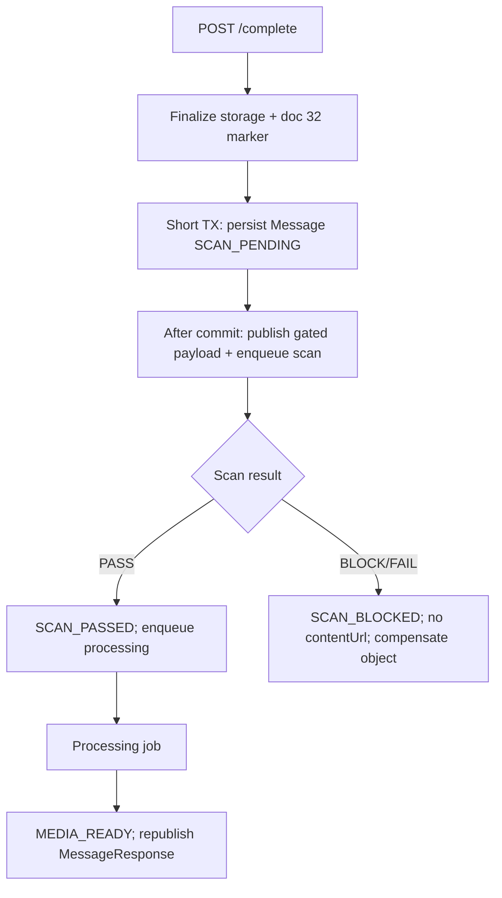

# Media Scan vs Complete Transaction (Persist Early)

## Current Problem

`MediaUploadSessionService.completeUploadSession` is one `@Transactional` method. After storage verify it calls `malwareScanService.assertClean` **inside that transaction**, then `persistFinalMessage`.

`NoOpMalwareScanService` currently sleeps ~1s per attachment to simulate ClamAV. For N images that holds a DB connection (and any row locks) for N seconds before the message is even inserted. Real scanning (download object + `clamd`) will be worse.

Two slow paths are mixed into `/complete` today:

| Work                                      | Where it runs now                        | What it should gate            |
| ----------------------------------------- | ---------------------------------------- | ------------------------------ |
| Malware scan                              | Inside complete TX (`assertClean`)       | Safe to expose bytes to others |
| Media processing (thumbnails / transcode) | **After commit** via `enqueueProcessing` | Better playback / derivatives  |

Feature 12 v1 planned **synchronous** scan as the publish gate: scan **before** creating the message. Doc 29 already persists the message first with `PROCESSING_PENDING`, then workers. Doc 32 only requires scan **out of the long TX**, and still assumed v1 sync-in-request scan.

This doc is the product/architecture choice: **shorten `/complete`**, persist the message early, run scan (and processing) as jobs, update media status when they finish. Do **not** wait for scan **and** processing before `persistFinalMessage`.

Related code:

- `MediaUploadSessionService.completeUploadSession` / `persistFinalMessage` / `toMessageMedia` (stamps `SCAN_PASSED` today)
- `NoOpMalwareScanService.assertClean`
- `MediaProcessingService.enqueueProcessing` (already after commit)

Related docs (do not merge this into them):

| Doc                                                 | Owns                                                  | Why not this issue                       |
| --------------------------------------------------- | ----------------------------------------------------- | ---------------------------------------- |
| [12](./12_MEDIA_CHAT_SUPPORT_DRAFT.md)              | Original media feature; sync scan-before-create       | Plan, not the TX/job redesign            |
| [29](./29_MEDIA_PROCESSING_SERVICE.md)              | Derivative workers after a message exists             | Assumes scan already passed              |
| [32](./32_MEDIA_MULTIPART_COMPLETE_COMPENSATION.md) | Irreversible `completeMultipartUpload` + retry marker | Background scan explicitly deferred here |

## Possible Solutions

### 1. Persist message in a short TX, enqueue scan (then processing) as background jobs (chosen)

- How it works:
  1. `/complete` validates, finalizes storage (multipart checkpoint per doc 32), then a **short TX**: `persistFinalMessage` + `UPLOAD_SESSION_COMPLETED`.
  2. Initial `message_media`: `scanStatus=SCAN_PENDING`; IMAGE/VIDEO `status=PROCESSING_PENDING` (or stay pending until scan passes).
  3. After commit: enqueue **malware scan** (not `assertClean` in the request TX).
  4. Scan callback: `SCAN_PASSED` → enqueue processing (existing doc 29 path); `SCAN_BLOCKED` / `SCAN_FAILED` → no usable `contentUrl` for others, compensate/quarantine object.
  5. Processing callback: `MEDIA_READY` + derivatives; backend republishes `MessageResponse` (already the processing-service shape).
  6. HTTP `/complete` returns the pending message the same way processing already does — sender placeholder; recipients must not get a signed read URL until `SCAN_PASSED`.
- Pros: Complete TX stays short; scan/processing scale like other workers; matches “message appears, media fills in”; does not block chat on transcode.
- Cons: Visibility rules are mandatory (hide/quarantine URLs while `SCAN_PENDING`); Feature 12 v1 “scan before create” is relaxed; FE must treat pending scan like pending processing.
- Recommendation for our problem: **Yes**.

Do **not** delay `persistFinalMessage` until processing finishes. Processing is independent of “is this a chat message.” Scan is the security gate on **bytes**, not on **row existence**.

### 2. Sync scan outside the TX, still before persist (doc 32 v1)

- How it works: finalize + checkpoint → `assertClean` in the HTTP thread with **no** open DB TX → short TX persist.
- Pros: Smallest change; still a hard publish gate; no `SCAN_PENDING` UX.
- Cons: `/complete` still blocks ~1s+ per file; ClamAV latency on the API thread; does not use the processing-service job pattern.
- Recommendation for our problem: **No** as the target once we accept background scan.
- When I’d use it: Interim step before scan workers exist (still better than scan-inside-TX).

### 3. Wait for scan **and** processing, then persist the message

- How it works: `/complete` only checkpoints storage; a worker runs scan + FFmpeg/OCR; only then insert `messages` / `message_media`.
- Pros: Recipients never see incomplete media; one “final” persist.
- Cons: `/complete` cannot return a real `Message` without waiting (or FE must poll); video transcode would delay the whole bubble; fights doc 29 and current FE `MessageResponse` on complete.
- Recommendation for our problem: **No**.

### 4. Keep `assertClean` inside `completeUploadSession` (status quo)

- How it works: Sleep/ClamAV in the same TX as persist.
- Pros: Zero design work; infected files never get a message row.
- Cons: Long TX; connection pool stall; demo 1s sleep already shows it; fails doc 32’s “don’t hold TX across I/O.”
- Recommendation for our problem: **No**.

## High level Architecture/Design

### Today

```text
POST /complete  [one TX]
  completeMultipartUpload? → assertClean (sleep/ClamAV) → persist Message (SCAN_PASSED)
  after commit: publish + enqueue processing
```

### Target



### Visibility (publish gate without blocking persist)

Feature 12 still applies: **do not expose uploaded media to other users until scan succeeds.** Persist-early does not mean “signed GET for everyone.”

- Sender: local placeholder + `/complete` response with `SCAN_PENDING` (same family as `PROCESSING_PENDING`).
- Recipients: message row may exist (so ordering/history works) but `contentUrl` / thumbnail omitted or non-downloadable until `SCAN_PASSED`.
- `toMessageMedia` must **not** stamp `SCAN_PASSED` before a real scan.

### Relation to `persistFinalMessage`

Keep the method as the short persist of `messages` + `message_media`. Refactor **callers and initial statuses**, not “call it after all jobs.”

Enqueue scan **after commit** (same `AfterCommit` rule as processing). Do not `@Async` while the complete TX is open.

## Recommendation

1. Remove `assertClean` from the `completeUploadSession` transaction.
2. Persist the message in a short TX with `SCAN_PENDING`; return that `MessageResponse` from `/complete`.
3. After commit, enqueue malware scan (dedicated queue/worker; later can live next to media-processing-service).
4. On scan pass, enqueue existing processing; on block/fail, compensate and never issue a serving URL.
5. FE: treat `SCAN_PENDING` like processing — no raw file for other users.
6. Doc 32 stays the multipart retry/marker design; this doc owns async scan vs persist-early. Doc 32’s “v1 sync scan” is superseded **for scan placement** by this recommendation.
7. **Do not implement yet** — design review first. Update **Implementation details** after coding; do not rewrite **Recommendation**.

Open points for review:

- Scan worker in `chat-app-backend` first vs jump straight to `media-processing-service`?
- Omit `contentUrl` vs quarantine prefix until `SCAN_PASSED`?
- Multi-image: one scan job per attachment vs one job for the session?
- AUDIO/FILE: still persist as `MEDIA_READY` only after scan, not after processing?

## Implementation details

(Planned — not implemented yet.)

## Lesson (look back here)

Slow I/O in `@Transactional completeUploadSession` is a connection-pool bug, not a security feature. Persist the chat **row** quickly; gate the **bytes** with `SCAN_PENDING` until a worker says pass. Do not wait for thumbnails/transcode before the message exists. Out of TX ≠ must be a background job, but once ClamAV is real work, a job is the right scale-out — same pattern as doc 29, with a stricter visibility rule.

## Future Higher-Scale Path

- Move scan orchestration into media-processing-service (Feature 12 already allowed this).
- Quarantine bucket/prefix until pass.
- Metrics: scan queue lag, complete TX duration, `SCAN_BLOCKED` rate.
