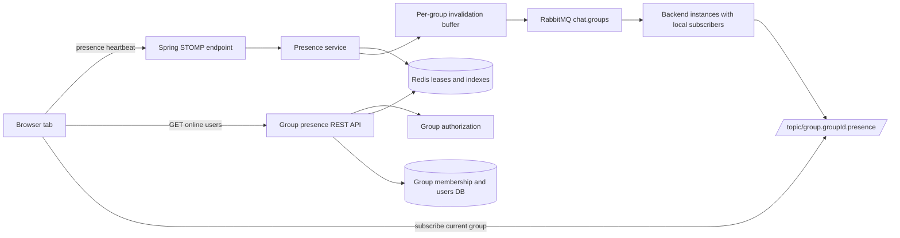
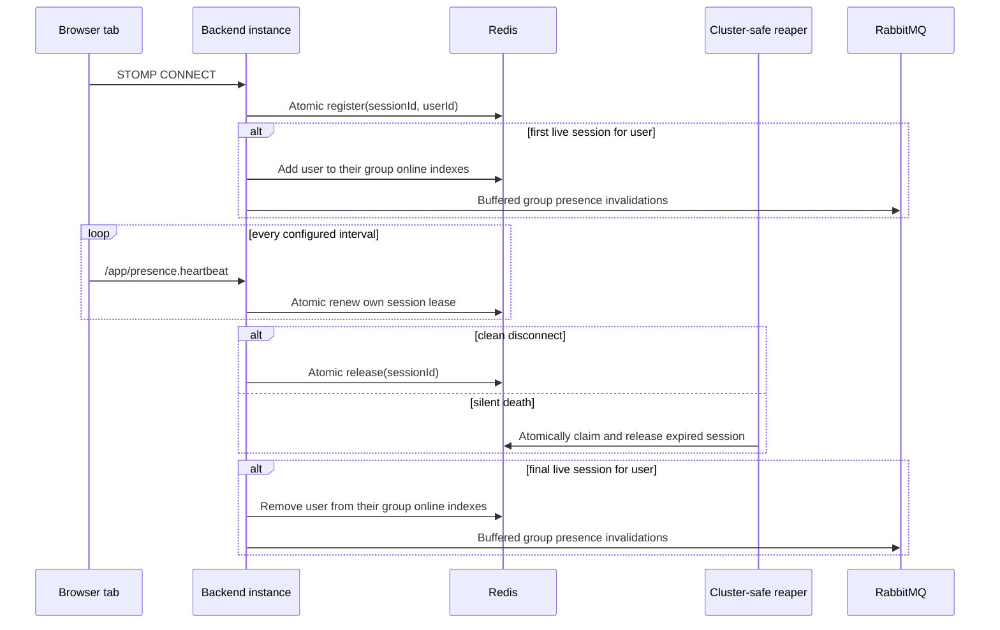
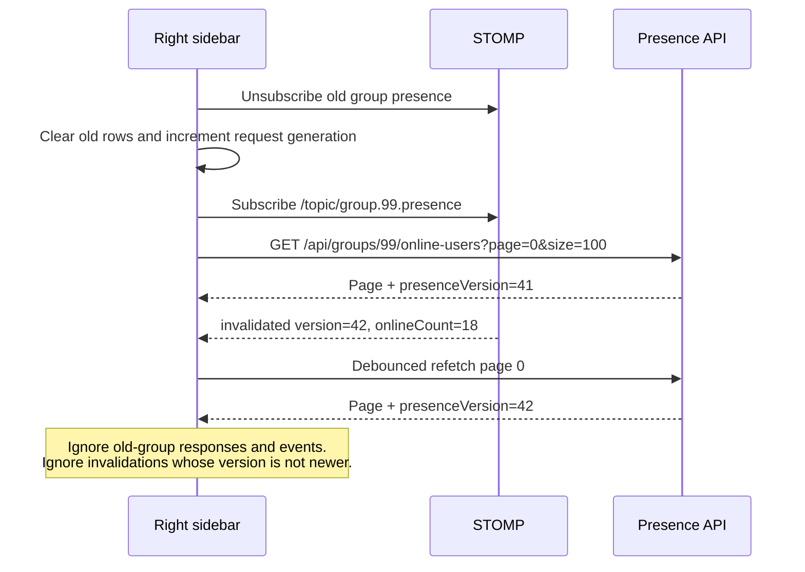

# Group Online Users Right Sidebar

## Intro

This feature adds a right-hand sidebar to the chat page that shows the online members of the currently selected group. The existing left sidebar remains the group list, and the center remains the active chat.

The recommended meaning of **online in group G** is:

> The user has at least one live application WebSocket session and is currently a member of group G.

The user does not need to be viewing group G. Selecting a group only changes which membership-scoped online list the current viewer sees. One user appears once even when that user has several tabs or devices open.

This is a planning document only. No part of this feature is implemented yet.

Related documents:

- [02_WEBSOCKET.md](./02_WEBSOCKET.md)
- [11_GROUP_SUMMARY_UPDATE_FANOUT_SCALING.md](./11_GROUP_SUMMARY_UPDATE_FANOUT_SCALING.md)
- [15_GROUP_ROLES_AND_PERMISSIONS.md](./15_GROUP_ROLES_AND_PERMISSIONS.md)
- [18_LOGOUT_WEBSOCKET_SESSION_LIFECYCLE.md](./18_LOGOUT_WEBSOCKET_SESSION_LIFECYCLE.md)
- [26_GROUP_MEMBER_LIMIT.md](./26_GROUP_MEMBER_LIMIT.md)
- [36_API_ERROR_RESPONSE.md](./36_API_ERROR_RESPONSE.md)

## Current State

- `ChatPage` has two columns: the left `Sidebar` and the center `ChatArea`.
- The full group roster is available in `GroupMemberList`, inside the group-details dialog.
- The roster endpoint already uses `page=0` and `size=100`, with a maximum page size of 100.
- The frontend maintains one SockJS/STOMP connection per browser tab.
- The active chat subscription changes between `/topic/public` and `/topic/group.{groupId}` when the user switches chats.
- Redis is already part of the application and is used for HTTP sessions and a cluster-wide `group-updates` subscription refcount.
- RabbitMQ already distributes group events between backend instances.
- There is no general online-presence model, online-users API, group-presence topic, or right sidebar.
- The STOMP client requests 4-second incoming and outgoing heartbeats, but the Spring simple broker does not currently configure server heartbeat values.
- `SessionDisconnectEvent` handles detected disconnects, but it cannot by itself guarantee prompt cleanup of a silent half-open TCP connection or an application instance crash.

## Functional Requirements

1. Show a right sidebar containing only online members of the currently selected private group.
2. Do not carry users from the previous group when the viewer switches groups.
3. Fetch the first page for the new group and subscribe to that group's presence invalidations on every group switch.
4. Paginate the list with:
   - zero-based pages;
   - default page size `100`;
   - maximum page size `100`;
   - the existing page response shape where practical.
5. A user with multiple live tabs or devices appears only once.
6. A user becomes offline only after their final live application WebSocket session ends or its lease expires.
7. Clean disconnects should update presence immediately.
8. Silent connection loss, browser/process crashes, and backend instance crashes should update presence after a bounded lease timeout.
9. Presence changes should reach viewers without requiring a manual page refresh.
10. Only current group members may read the online list or subscribe to that group's presence topic.
11. A user who leaves, is kicked, is banned, or otherwise loses group membership must disappear from that group's online list even if they remain online elsewhere.
12. The list must have loading, empty, error, reconnecting, and presence-unavailable states.
13. Fast group switching must cancel or ignore stale HTTP responses and old-topic events.
14. The current user should be included when online unless product requirements decide otherwise.
15. Public Chat should not expose a group member presence list.

## Non-Functional Requirements

- **Multi-instance correctness:** presence cannot depend only on a JVM-local `SimpUserRegistry` or in-memory map.
- **Bounded staleness:** with a proposed 15-second application heartbeat and 45-second lease, a silently dead session should normally disappear within 45–60 seconds. Exact values require load testing.
- **Race safety:** session registration, renewal, and removal must be idempotent. The visible user transition must happen only on `0 -> 1` and `1 -> 0` live-session transitions.
- **Privacy:** never expose a global online-user list. Group authorization must be checked for both REST and STOMP access.
- **Bounded payloads:** HTTP list responses contain at most 100 users. Realtime messages should be small invalidations or bounded batches, not complete group rosters.
- **Failure transparency:** Redis failure must not make every user appear offline. The API/sidebar should report presence as temporarily unavailable or serve a clearly identified short-lived cached result.
- **Eventual consistency:** presence is a UX signal, not an authorization source. Database membership remains authoritative.
- **Responsive UX:** the third desktop column must not make the center chat unusable on narrow screens.
- **Accessibility:** rows and sidebar controls must be keyboard accessible and expose meaningful labels.
- **Observability:** track live leases, online users, reaper lag, heartbeat rate, transition rate, invalidation batches, Redis failures, and snapshot refresh rate.
- **Load safety:** heartbeat writes and reconnect storms must be rate-limited by fixed intervals and handled without per-viewer application loops.

## Use Cases

### 1. Open a group

1. Alice opens group 42.
2. The frontend subscribes to `/topic/group.42.presence`.
3. The frontend requests page 0 of group 42's online users with `size=100`.
4. The right sidebar shows only online users who are current members of group 42.

### 2. Switch groups

1. Alice switches from group 42 to group 99.
2. The frontend unsubscribes from group 42 presence.
3. It clears the old list immediately, subscribes to group 99 presence, and loads group 99 page 0.
4. Any late group 42 response or event is ignored.

### 3. Multiple tabs

1. Bob has two tabs and one device open.
2. Redis tracks three independent WebSocket session leases for Bob.
3. Bob appears once in every group of which he is a member.
4. Closing one or two sessions does not emit an offline transition.
5. Closing or losing the final session emits one offline transition.

### 4. Silent connection death

1. Bob loses network connectivity without a clean WebSocket close.
2. His tab stops sending application presence heartbeats.
3. The session lease deadline passes.
4. A cluster-safe reaper atomically removes that session.
5. If it was Bob's final live session, Bob becomes offline and affected groups are invalidated.

### 5. Membership changes while online

- When an online user joins a group, add that user to the group's online index and invalidate the group.
- When an online user leaves, is kicked, or is banned, remove that user from the group's online index and invalidate the group.
- Group membership changes must not change the user's global online state.

### 6. Redis is unavailable

- Do not return a confidently empty list.
- Return the standard API error contract (normally `503 Service Unavailable`) or a documented short-lived cached snapshot.
- Keep chat messaging independent from the presence failure.
- Show “Online status unavailable” in the right sidebar.

## Possible Solutions

### 1. What Does “Online In A Group” Mean?

#### 1.1. Any Live App Connection Plus Current Group Membership

- How it works:
  - Track whether the user has at least one live application WebSocket session.
  - For group G, display the intersection of globally online users and current members of G.
- Pros:
  - Matches common chat-product expectations.
  - A user remains online while navigating between groups.
  - Directly supports the requirement that all tabs must close before the user becomes offline.
- Cons:
  - Requires maintaining or computing the online/member intersection.
  - Presence transitions can affect several groups.
- Recommendation for our problem: **Yes.**

#### 1.2. Online Only While Viewing The Group

- How it works: count a user as online in group G only while their client subscribes to G's chat or presence topic.
- Pros:
  - Group state follows active subscriptions naturally.
  - Updates affect only one selected group per tab.
- Cons:
  - This means “currently viewing this group,” not “online.”
  - A user can appear offline to group members while actively using another group.
  - Multiple tabs in different groups produce surprising semantics.
- Recommendation for our problem: **No**, unless the product label changes to “Viewing this group.”

#### 1.3. Active HTTP Session Plus Current Group Membership

- How it works: treat an unexpired Spring HTTP session as online.
- Pros:
  - Redis-backed HTTP sessions already exist.
- Cons:
  - A session may live for hours after all tabs close.
  - WebSocket heartbeats do not renew the HTTP session.
  - It does not provide useful near-realtime presence.
- Recommendation for our problem: **No.**

### 2. How Should Silent Disconnects Be Detected?

#### 2.1. WebSocket `onClose` / `SessionDisconnectEvent` Only

- How it works: remove a session when Spring reports a disconnect.
- Pros:
  - Simple and immediate for clean closes.
- Cons:
  - Half-open TCP connections may take minutes to be detected.
  - Browser, process, machine, and backend crashes may skip normal cleanup.
- Recommendation for our problem: **No** as the only mechanism. Keep it as a fast path.

#### 2.2. Server STOMP Heartbeats Only

- How it works: configure a Spring broker heartbeat scheduler so dead transports are closed.
- Pros:
  - Uses protocol-level liveness.
  - Improves general WebSocket cleanup.
- Cons:
  - Does not by itself repair leases after an application instance crashes.
  - Transport heartbeat handling is not a convenient cluster-visible presence store.
  - Timeout behavior can differ across SockJS transports, proxies, and load balancers.
- Recommendation for our problem: **Yes as defense in depth**, but not sufficient alone.

#### 2.3. Expiring Redis Session Leases Plus Application Heartbeats

- How it works:
  - Each authenticated WebSocket session registers a Redis lease.
  - The client sends a presence heartbeat, for example every 15 seconds.
  - The server renews only the authenticated session represented by that STOMP connection.
  - Clean disconnect calls the same idempotent release path immediately.
  - A cluster-safe reaper releases sessions whose deadlines have passed.
- Pros:
  - Bounded cleanup after silent transport or instance death.
  - Supports multiple tabs, devices, and backend instances.
  - The lease timeout is explicit and measurable.
- Cons:
  - Adds Redis writes while users are online.
  - Requires atomic scripts and a reliable reaper.
  - Very short TTLs cause flapping; long TTLs leave ghost users longer.
- Recommendation for our problem: **Yes.**

### 3. Where Should Presence State Live?

#### 3.1. JVM-Local Maps Or `SimpUserRegistry`

- Pros:
  - Fast and already available locally.
- Cons:
  - Instance A cannot see sessions on instance B.
  - State disappears on restart.
  - Incorrect behind a multi-instance load balancer.
- Recommendation for our problem: **No** as the source of truth. Local registries may still optimize delivery.

#### 3.2. Database Rows

- Pros:
  - Durable and queryable with group membership.
- Cons:
  - Presence is high-churn, ephemeral data.
  - Heartbeat writes create unnecessary database load and cleanup work.
  - Durable stale state is undesirable.
- Recommendation for our problem: **No.**

#### 3.3. Redis Leases And Group Online Indexes

- Pros:
  - Redis already exists in this application.
  - TTLs, sets/sorted sets, atomic Lua scripts, and pipelining fit presence workloads.
  - Shared across backend instances.
- Cons:
  - Redis becomes required for accurate presence.
  - Derived group indexes need repair/reconciliation.
- Recommendation for our problem: **Yes.**

### 4. How Should The Online List Be Paginated?

#### 4.1. Page All Members And Add An `online` Flag

- Pros:
  - Reuses the current member endpoint directly.
- Cons:
  - Does not satisfy “show a list of online users only.”
  - Filtering after pagination can return sparse or empty pages even when more online users exist.
  - It cannot provide a correct online total without scanning the full group.
- Recommendation for our problem: **No** for this sidebar.

#### 4.2. Dedicated Materialized Group Online Index

- How it works:
  - Maintain `presence:group:{groupId}:users` as a Redis sorted set.
  - Add/remove a user only on global online/offline transitions and membership changes, not on every heartbeat.
  - Page user IDs with `ZRANGE`, then load authorized display data from the database.
  - Return a stable page response and group presence version.
- Pros:
  - Bounded, correct online-only page reads.
  - `ZCARD` gives an inexpensive total online count.
  - No scan of every group member on each request.
- Cons:
  - The index is derived state and can briefly drift.
  - Presence transitions require updating indexes for the user's groups.
  - Offset pages can shift when users come online/offline.
- Recommendation for our problem: **Yes for the first implementation**, with reconciliation and client reset-on-invalidation.

#### 4.3. Compute The Redis/Database Intersection On Every Request

- How it works: read group members from the database and pipeline Redis checks until one online page is filled.
- Pros:
  - Less derived Redis state.
- Cons:
  - Deep pages and exact totals require scanning many or all members.
  - Latency grows with group size and offline ratio.
- Recommendation for our problem: **No** as the main path; acceptable as a repair or low-scale fallback.

### 5. How Should Realtime List Changes Be Delivered?

#### 5.1. One Full Snapshot Per Presence Change

- Cons: payload and work grow with group size; reconnect storms are expensive.
- Recommendation for our problem: **No.**

#### 5.2. Individual Online/Offline Deltas

- Pros:
  - Very small payloads.
  - No HTTP refresh for simple changes.
- Cons:
  - Exact offset pagination becomes difficult when rows enter or leave before the loaded page.
  - Clients need ordering, gap detection, deduplication, and periodic reconciliation.
- Recommendation for our problem: **Later**, if snapshot refresh load becomes a measured problem.

#### 5.3. Buffered Per-Group Invalidation

- How it works:
  - Online/offline and membership transitions increment a group presence version.
  - Coalesce changes for a short fixed interval, for example 250–500 ms.
  - Publish one small invalidation containing `groupId`, `version`, and `onlineCount`.
  - A viewer of that group resets and refetches page 0, with small random jitter.
- Pros:
  - Correct with changing pagination.
  - A burst of 1,000 transitions in one group becomes one or a few group invalidations, not 1,000 full roster payloads.
  - Reuses the existing buffered-update design style.
- Cons:
  - Causes HTTP refreshes for viewers.
  - Requires debouncing/jitter to avoid a thundering herd.
- Recommendation for our problem: **Yes for the first implementation.**

## High Level Architecture/Design

### Component Diagram



### Session Lifecycle



### Group Switch And Snapshot/Invalidation Race



## Recommended Presence Model

### Source State

The source state is the set of live WebSocket session leases:

| Key | Type | Purpose |
| --- | --- | --- |
| `presence:session:{sessionId}` | String/Hash with TTL | User ID, connection generation, and instance metadata |
| `presence:user:{userId}:sessions` | Set | Independent live session IDs across tabs/devices/instances |
| `presence:session-deadlines` | Sorted set | Reaper index ordered by expiry deadline |
| `presence:online-users` | Set or sorted set | Cluster-wide users with at least one live session |

The exact register, renew, and release mutations must be Lua scripts or another atomic Redis mechanism. Do not use a correctness-dependent `GET -> decide -> SET/DELETE` sequence.

### Derived Group State

| Key | Type | Purpose |
| --- | --- | --- |
| `presence:group:{groupId}:users` | Sorted set | Online member IDs, ordered by the chosen list order |
| `presence:group:{groupId}:version` | Integer | Monotonic invalidation/snapshot version |

Derived indexes are updated only when:

- a user transitions globally online (`0 -> 1` live sessions);
- a user transitions globally offline (`1 -> 0` live sessions);
- an online user's group membership is added or removed.

Heartbeats renew session leases but do not rewrite every group index.

### Reaper Requirements

Redis TTL alone is insufficient because expiry of a session key does not atomically remove that session from the user's session set or emit the final user transition.

The reaper should:

1. Read due session IDs from `presence:session-deadlines`.
2. Atomically claim a bounded batch so multiple backend instances cannot process the same expiry concurrently.
3. Verify that the deadline is still expired; a concurrent heartbeat may have renewed it.
4. Run the same idempotent release script used by clean disconnect.
5. Return whether this caused the user's `1 -> 0` transition.
6. Reconcile affected group indexes and publish invalidations.

Redis keyspace notifications alone are not recommended as the correctness path because they are configuration-dependent, at-most-once, and may be handled by multiple application instances. They can be an optimization, while the sorted-deadline reaper remains the repair path.

### Reconnect And Flapping

- A reconnect creates a new session ID before the old silent session necessarily expires.
- Both sessions temporarily coexist, so the user remains online without a false offline/online flicker.
- The old lease expires later and reduces the session set without causing a visible transition.
- Add a small offline grace period only if metrics show visible flapping; do not add it by default because the lease timeout already provides grace.

## Frontend Design

### Layout

Desktop layout:

```text
┌────────────────┬────────────────────────────┬──────────────────┐
│ Group sidebar  │ Active chat                │ Online members   │
│ existing       │ existing                   │ new              │
└────────────────┴────────────────────────────┴──────────────────┘
```

- Add a dedicated right-sidebar component after `ChatArea`.
- Pass only the selected `groupId` and connection state from `ChatPage`.
- Keep list, pagination, loading, error, and refresh state inside the online-users sidebar.
- Reuse the request-generation/cancellation and infinite-scroll patterns from `GroupMemberList`.
- Remount or reset the component on `groupId` change.
- Hide the sidebar for Public Chat.
- On narrow screens, use a collapsible drawer or explicit toggle instead of permanently rendering three narrow columns.

Suggested future component boundaries:

- `GroupOnlineUsersSidebar`
- `GroupOnlineUsersList`
- `GroupOnlineUserListItem`

### Realtime Refresh

1. Subscribe to the selected group's presence topic before requesting the initial snapshot.
2. Fetch page 0 with size 100.
3. Record `presenceVersion` from the response.
4. On a newer invalidation, debounce and refetch from page 0.
5. Clear previously appended pages on refresh so offset pagination remains correct.
6. Add a small random refresh jitter under burst load.
7. If WebSocket reconnects, resubscribe and refetch because invalidations may have been missed.

## Core Entities/Models

### PresenceSessionLease

Ephemeral service model:

- `sessionId`
- `userId`
- `username` only if needed for logs; user ID should be the stable key
- `instanceId`
- `connectedAt`
- `expiresAt`
- `generation` or transition token for fencing stale work

### OnlineGroupUserResponse

API DTO:

- `userId`
- `username`
- `fullname`
- `avatarUrl` if available
- `onlineSince` if product chooses to expose it

Role and moderation controls are not required in this read-only sidebar; the group-details member roster remains the management UI.

### OnlineGroupUserPageResponse

- `content`
- `page`
- `size`
- `totalElements`
- `totalPages`
- `hasNext`
- `presenceVersion`
- `observedAt`

### GroupPresenceInvalidated

- `type`: `GROUP_PRESENCE_INVALIDATED`
- `groupId`
- `presenceVersion`
- `onlineCount`
- `occurredAt`

## API Draft

### List Online Group Members

`GET /api/groups/{groupId}/online-users?page=0&size=100`

Authorization:

- The caller must be an active member of the group.
- Archived-group behavior should align with the existing permission policy.

Example response:

```json
{
  "content": [
    {
      "userId": 7,
      "username": "bob",
      "fullname": "Bob Nguyen",
      "avatarUrl": null,
      "onlineSince": "2026-09-07T14:58:00Z"
    }
  ],
  "page": 0,
  "size": 100,
  "totalElements": 1,
  "totalPages": 1,
  "hasNext": false,
  "presenceVersion": 42,
  "observedAt": "2026-09-07T15:00:00Z"
}
```

Validation:

- `page < 0`: reject using the standard API error contract.
- omitted `size`: use 100.
- `size < 1` or `size > 100`: reject or normalize consistently with `PageableUtil`; prefer the same behavior as the existing member endpoint.

Failure:

- `401`: not authenticated.
- `403`: not a current group member.
- `404`: group does not exist, according to the existing authorization/error policy.
- `503`: presence data is unavailable and no approved cache fallback exists.

### Presence Heartbeat

Client to server:

`SEND /app/presence.heartbeat`

No user ID or session ID should be trusted from the payload. The server derives both from the authenticated WebSocket session.

An empty body is sufficient unless future protocol versioning is needed.

### Group Presence Invalidation

Client subscription:

`SUBSCRIBE /topic/group.{groupId}.presence`

Example event:

```json
{
  "type": "GROUP_PRESENCE_INVALIDATED",
  "groupId": 42,
  "presenceVersion": 43,
  "onlineCount": 18,
  "occurredAt": "2026-09-07T15:00:00Z"
}
```

The inbound subscription interceptor must parse and authorize this destination explicitly. It must not accidentally treat `42.presence` as a numeric group ID.

## Fan-Out And Scaling Analysis

### Do We Broadcast Every Presence Change To Everyone?

No.

For user U's online/offline transition:

1. Find the current groups to which U belongs.
2. Update those groups' derived online indexes.
3. Increment their versions.
4. Buffer one invalidation per affected group.
5. Publish each group invalidation once.
6. RabbitMQ forwards it only to backend instances whose local clients currently subscribe to that group presence topic.
7. Spring's local broker fans out to those local subscribers.

The application must not loop through every member/viewer and publish to a personal destination.

### Complexity

Let:

- `G(u)` = groups the transitioning user belongs to;
- `I(g)` = backend instances with at least one local presence subscriber for group g;
- `V(g)` = viewers currently looking at group g.

Per user transition:

- membership/index work: `O(G(u))`;
- RabbitMQ publishes after buffering: at most `O(distinct affected groups)`;
- cross-instance deliveries: `O(I(g))`;
- local broker delivery: inherently `O(V(g))`.

The local `O(V(g))` socket delivery cannot be eliminated if every active viewer must learn that the group changed, but it should be performed by the broker rather than by an application-level per-user loop.

### 1,000 Users Coming Online Together

They do **not** require one million application publishes.

If all 1,000 users belong to the same group:

- there are 1,000 lease transitions and index additions;
- the group's invalidation buffer coalesces the burst into one or a few small events;
- each viewer refetches once after debounce/jitter, not once per transitioning user.

If users belong to many different groups, work scales with actual changed memberships. This is the unavoidable semantic cost of making those groups' lists correct. Pipelined Redis writes, bounded worker batches, and buffered invalidations keep it controlled.

### Remaining Scaling Risks

- **Heartbeat write amplification:** at 100,000 connected tabs and a 15-second interval, Redis receives roughly 6,667 renewals/second before other commands.
- **Reconnect storms:** a proxy restart can reconnect many tabs together. Add jitter/backoff and bound transition workers.
- **HTTP refresh herd:** invalidate-and-refetch needs client jitter, server caching keyed by group/version/page, and request coalescing if measured.
- **Users in very many groups:** one global transition touches many group indexes. Process group-index mutations in bounded, idempotent batches.
- **Slow consumers:** configure WebSocket send limits and monitor queued outbound messages.
- **Large online groups:** keep events bounded; never push full online snapshots over STOMP.

## Correctness And Difficult Edge Cases

### Initial Snapshot Versus Realtime Events

Subscribing after the HTTP response creates a gap. Subscribe first, then fetch a versioned snapshot. Ignore old invalidations and refetch when a newer version arrives.

### Membership And Presence Races

A user may go offline while being removed from a group. Both operations must be idempotent. The final group index must exclude the user, and duplicate invalidations are acceptable only if versions remain monotonic.

### Stale Transition Work

A final-session expiry can race with a reconnect. Use a user generation/transition token and re-check current global online state before applying delayed group-index work, so stale “offline” work cannot overwrite a newer “online” state.

### Backend Instance Crash

Local disconnect handlers will not run. The Redis deadline reaper must be sufficient to remove all leases previously owned by that instance.

### Logout And HTTP Session Expiry

The existing gap in [18_LOGOUT_WEBSOCKET_SESSION_LIFECYCLE.md](./18_LOGOUT_WEBSOCKET_SESSION_LIFECYCLE.md) affects this feature:

- HTTP logout should close or revoke all WebSocket sessions for that login.
- Presence leases must be released when those sockets are revoked.
- If the HTTP session expires while WebSocket auth remains usable, the user may still appear online.

Presence can launch as a UX feature with this limitation documented, but the logout/WebSocket lifecycle should be fixed before presence is treated as a security or compliance signal.

### Redis Restart Or Data Loss

Presence should rebuild naturally as clients heartbeat, but derived group indexes may be temporarily incomplete. A reconciliation job should compare live user/session state with group indexes and repair drift. The UI should show unavailable/recovering state during a known rebuild instead of a misleading empty list.

### Pagination Under Concurrent Changes

Offset pages shift while users enter or leave. On invalidation, reset to page 0 instead of trying to patch arbitrary loaded pages. Cursor pagination can be considered later if groups become large enough for frequent shifting to matter.

### Authorization Revocation

A client already subscribed to a group presence topic could remain subscribed after removal unless the server actively revokes it. At minimum:

- stop publishing private user details in presence events;
- send only invalidation metadata;
- make subsequent HTTP reads fail authorization;
- unsubscribe/navigate the normal client immediately.

Strict server-side subscription revocation is the higher-assurance path.

### Redis Failure Semantics

The existing group-summary subscription registry fails open because dropping chat summary updates is worse than doing extra work. Presence has different semantics: pretending all users are offline is misleading. Return “unknown/unavailable,” alert operationally, and recover when Redis returns.

## Recommendation

Use Redis for cluster-wide presence because this application is already multi-instance and Redis is already required.

Recommended first design:

1. Define online as **at least one live application WebSocket session**, intersected with current group membership.
2. Register one expiring lease per WebSocket session and renew it with an authenticated application heartbeat.
3. Use atomic Redis scripts plus a sorted-deadline reaper; use clean disconnect as the immediate fast path.
4. Maintain a derived Redis sorted set and monotonic version for each group's online users.
5. Expose a dedicated, authorized, paginated online-users endpoint with default/max size 100.
6. Subscribe only to the currently selected group's presence topic.
7. Publish buffered per-group invalidations through the existing RabbitMQ/Spring broker path; do not broadcast per user to every member.
8. On invalidation or reconnect, reset and refetch the paginated snapshot.
9. Treat presence as eventually consistent UX information, never as authorization.

## Product Clarifications Required Before Implementation

- **TODO — confirm online semantics:** Is “online” any live app connection (recommended), or only currently viewing that group?
- **TODO — Public Chat:** Hide the right sidebar entirely (recommended), or show a different global/public presence concept?
- **TODO — responsive behavior:** Use a collapsible drawer below a selected desktop breakpoint (recommended), or hide the feature on small screens?
- **TODO — ordering:** Sort by `onlineSince` descending (simpler for a Redis sorted set), alphabetically, or by role?
- **TODO — displayed fields:** Is avatar + display name + username sufficient? Should role be shown?
- **TODO — self visibility:** Include the current user (recommended) or exclude them?
- **TODO — freshness target:** Is a worst-case silent-offline delay around 45–60 seconds acceptable?
- **TODO — privacy:** May every current group member see presence, or is a dedicated permission needed?
- **TODO — status levels:** Is binary online/offline sufficient? “Away,” “idle,” and “last seen” are separate features and should not be inferred.
- **TODO — manual collapse:** Should desktop users be able to close the right sidebar and persist that preference?

## Implementation Details

_(Empty while planning. Fill this section only after implementation phases land.)_

## Future Higher-Scale Path

- Move heartbeat renewals to a dedicated presence service if presence traffic competes with chat APIs.
- Partition session deadlines and group indexes across Redis Cluster hash slots.
- Replace offset pagination with cursor pagination over a stable sort key.
- Publish bounded user-delta batches instead of invalidations if snapshot refresh load becomes dominant.
- Add a short-lived cache keyed by `(groupId, presenceVersion, page, size)` and request coalescing.
- Use an outbox/stream for idempotent group-index updates if large group-membership fan-out becomes unreliable.
- Add adaptive heartbeat intervals for background tabs, while keeping the server-side lease bound explicit.
- Consider a dedicated presence platform only after measured Redis, RabbitMQ, or application limits justify the operational cost.
