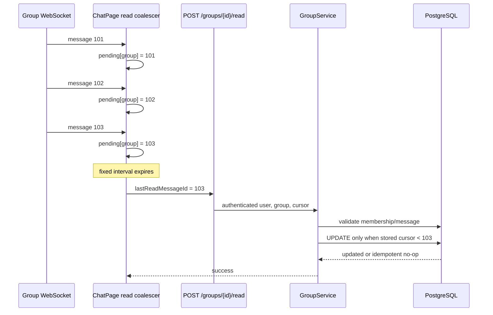
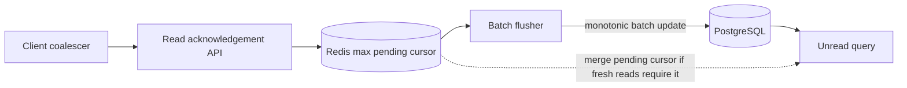

# Read Cursor Write Scaling

## Current Problem

The unread-message model stores one durable read cursor per user and group in
`group_participants.last_read_message_id`. This remains the correct source-of-truth model, as
described in [07_UNREAD_MESSAGES_NOTIFICATION_STRATEGY.md](./07_UNREAD_MESSAGES_NOTIFICATION_STRATEGY.md).

The current acknowledgement path does not coalesce cursor progress:

1. `ChatPage` receives or loads messages for the active group.
2. Whenever the latest message ID in React state changes, its effect calls
   `POST /api/groups/{groupId}/read`.
3. `GroupService.markGroupAsRead` verifies membership, verifies that the message belongs to the
   group, and saves the new cursor on the participant row.

The frontend prevents another request only after the previous request succeeds for the same
message ID. During a burst, several requests may therefore be in flight for one user and group.
Request completion order is not guaranteed.

The persistence operation is currently a load-and-save update with no monotonic database
condition. Two concurrent requests can arrive or commit out of order and move a cursor backward:

```text
request A: lastReadMessageId = 102
request B: lastReadMessageId = 101

A commits, then B commits -> stored cursor regresses from 102 to 101
```

This produces both a correctness risk and avoidable load:

- one HTTP request per observed tail message for every active viewer;
- repeated authentication, membership, and message-validation queries;
- repeated updates to `group_participants`;
- PostgreSQL heap, index, and WAL churn;
- increased connection-pool and transaction pressure;
- temporary unread-count regressions if an older request wins.

The existing index
`idx_group_participants_user_last_read(user_id, group_id, last_read_message_id)` also contains the
frequently changed cursor column, so every cursor change can require index maintenance.

This document optimizes read acknowledgements only. It does not replace the existing cursor model
and does not implement per-message read receipts visible to other users.

Related documents:

- [07_UNREAD_MESSAGES_NOTIFICATION_STRATEGY.md](./07_UNREAD_MESSAGES_NOTIFICATION_STRATEGY.md)
- [11_GROUP_SUMMARY_UPDATE_FANOUT_SCALING.md](./11_GROUP_SUMMARY_UPDATE_FANOUT_SCALING.md)
- [24_MEMBERSHIP_MUTATION_AUTH_LOCK_ORDER.md](./24_MEMBERSHIP_MUTATION_AUTH_LOCK_ORDER.md)
- [02_WEBSOCKET.md](./02_WEBSOCKET.md)

## Examples (Status Quo — Before The Fix)

### 1. Busy group

Assume:

- 5,000 group members;
- 1,000 users currently viewing that group;
- 20 new messages per second.

If each viewer acknowledges each message separately, the upper-bound acknowledgement rate is:

```text
1,000 viewers × 20 messages/second = 20,000 read requests/second
```

React/browser scheduling may coalesce some rendering work, so this is not a guaranteed measured
rate. It is still the correct capacity-planning upper bound for the present design.

The 4,000 offline or non-viewing members do not generate read writes. The dominant variables are
the number of active viewers and the message rate, not total group membership by itself.

### 2. Requests complete out of order

1. The client receives message 101 and sends a read request.
2. It receives message 102 before the first request completes and sends another request.
3. The request for 102 commits first.
4. The request for 101 commits later.
5. The stored read cursor becomes 101 even though the user has already observed 102.

### 3. Continuous traffic with pure debounce

If the client uses only a trailing-edge debounce, a group that never becomes quiet may never
persist read progress. Any client-side solution therefore needs a maximum flush interval, not only
"wait until messages stop."

## Goals

- Preserve `last_read_message_id` as the durable correctness source.
- Ensure a read cursor can only move forward.
- Coalesce bursty progress into bounded-rate acknowledgements.
- Preserve read progress across group switches and normal page lifecycle events where practical.
- Keep the first optimization simple and compatible with the existing REST API.
- Remain correct with multiple tabs, devices, and backend instances.
- Make retries and duplicate acknowledgements safe and inexpensive.
- Add enough metrics and load tests to decide whether Redis buffering is actually necessary.

## Non-Goals

- Showing per-message read receipts to senders.
- Tracking exactly which pixels were visible.
- Treating WebSocket connectivity as proof that a message was read.
- Updating all 5,000 participant rows when a message is sent.
- Replacing PostgreSQL as the durable source of unread state in the first phases.

## Possible Solutions

### 1. Client-Side Fixed-Interval Coalescing

- How it works:
  - Maintain the highest pending message ID per group in a ref.
  - For the active readable group, send at most one request per fixed interval, initially proposed
    as 2 seconds.
  - Each request carries only the highest pending cursor.
  - Do not start parallel read requests for the same group. If newer progress arrives while a
    request is in flight, send the newest cursor after the request completes or at the next
    interval.
  - Attempt an immediate best-effort flush when switching groups, on `visibilitychange` to hidden,
    and during `pagehide`.
- Pros:
  - Large reduction in HTTP and database traffic.
  - Small frontend change.
  - No infrastructure dependency.
  - Preserves the existing API contract.
- Cons:
  - Progress may be stale by up to the configured interval.
  - Browser shutdown cannot guarantee delivery.
  - Client throttling cannot enforce correctness against old clients, retries, or multiple devices.
- Recommendation for our problem: Yes, as Phase 1 together with a monotonic database update.

Use a fixed-interval throttle/coalescer rather than a pure trailing debounce. Under sustained
traffic, the fixed interval keeps making progress while placing an upper bound on request rate.

For 1,000 active viewers and a 2-second interval, the sustained upper bound becomes approximately:

```text
1,000 viewers / 2 seconds = 500 read requests/second
```

This is independent of message rate once the group is busy enough to keep every interval dirty.

### 2. Atomic Monotonic PostgreSQL Update

- How it works:
  - Keep the existing membership and message/group validation behavior.
  - Replace entity load-and-save for the cursor with a conditional update:

```sql
UPDATE group_participants
SET last_read_message_id = :incomingMessageId
WHERE group_id = :groupId
  AND user_id = :userId
  AND (
    last_read_message_id IS NULL
    OR last_read_message_id < :incomingMessageId
  );
```

  - Treat an equal or older valid cursor as an idempotent no-op.
- Pros:
  - Prevents cursor regression across overlapping requests, tabs, devices, and backend instances.
  - Avoids a read-modify-write race.
  - Duplicate and retry requests do not rewrite the row.
  - PostgreSQL remains the single source of truth.
- Cons:
  - Validation and update may still require more than one query if existing API error semantics are
    preserved.
  - Does not by itself reduce the number of incoming HTTP requests.
- Recommendation for our problem: Yes, mandatory in Phase 1.

The monotonic condition belongs in SQL. An in-memory comparison or Java lock is not sufficient
because requests can run on different application instances.

### 3. Send Read Progress Over The Existing WebSocket

- How it works:
  - Replace or supplement the REST call with a STOMP application message carrying group ID and
    latest read message ID.
  - Apply the same server-side validation and monotonic database update.
- Pros:
  - Avoids repeated HTTP request overhead while the socket is connected.
  - Natural fit for frequent, small client progress signals.
- Cons:
  - Does not reduce PostgreSQL writes unless combined with coalescing.
  - Requires reconnect/fallback behavior.
  - Delivery acknowledgement and error handling are less straightforward than the existing REST
    endpoint.
- Recommendation for our problem: No for the first optimization.
- When I would use it: after measuring HTTP overhead as significant, or when consolidating other
  ephemeral chat-state signals over WebSocket.

Changing transport alone is not a database-scaling solution.

### 4. Redis Latest-Cursor Buffer With Asynchronous PostgreSQL Flush

- How it works:
  - Atomically keep the maximum pending cursor for each `(userId, groupId)` in Redis.
  - Mark the key as dirty.
  - One or more workers periodically claim dirty keys and batch monotonic updates to PostgreSQL.
  - Duplicate worker delivery is safe because PostgreSQL still applies the cursor only when it
    moves forward.
  - Reads that require the freshest state either merge Redis pending state with PostgreSQL or
    accept a documented bounded delay.
- Pros:
  - Removes most read-cursor writes from synchronous request latency.
  - Coalesces progress across tabs, devices, and backend instances.
  - Supports batched PostgreSQL writes.
  - Handles very hot groups better than client-only throttling.
- Cons:
  - Adds Redis key lifecycle, atomic-max logic, dirty-key claiming, retries, and recovery.
  - Creates a temporary difference between Redis and PostgreSQL.
  - Requires careful shutdown, failure, and observability design.
  - Redis numeric comparison must preserve the full identifier range; do not silently compare
    64-bit IDs through an unsafe floating-point representation.
- Recommendation for our problem: Not initially. Consider only after Phase 1 measurements show
  PostgreSQL write pressure is still unacceptable.

Redis is already used by the application, but that alone is not enough reason to put durable read
progress behind an asynchronous pipeline.

### 5. RabbitMQ Read Events With A Coalescing Consumer

- How it works:
  - Publish read-progress events.
  - Consumers partition or aggregate by `(userId, groupId)`, retain the highest cursor, and
    periodically update PostgreSQL.
- Pros:
  - Durable delivery and retry infrastructure.
  - Removes writes from the request thread.
- Cons:
  - A normal queue does not automatically coalesce messages.
  - Correct per-key ordering and batching are more complex across consumers.
  - Backlogs make unread state stale.
  - More machinery than Redis for "keep only the maximum value."
- Recommendation for our problem: No for the current scope.
- When I would use it: when read-progress events must feed several durable downstream consumers or
  become part of a broader event-sourced pipeline.

### 6. Group-Local Message Sequence For O(1) Unread Counts

- How it works:
  - Assign a contiguous, monotonic sequence number within each group.
  - Store `latest_message_sequence` on the group and `last_read_sequence` on the participant.
  - For semantics where every sequence contributes one unread item:

```text
unreadCount = latestMessageSequence - lastReadSequence
```

- Pros:
  - Constant-time unread-count calculation.
  - Read cursor remains compact and monotonic.
  - Avoids counting message rows for every sidebar load.
- Cons:
  - Assigning a per-group sequence safely adds write contention on hot groups.
  - Requires schema migration and backfill.
  - Delete, moderation, system-message, and "which messages count as unread" semantics must be
    defined before subtraction is correct.
  - Current global message IDs cannot be subtracted because IDs from other groups create gaps.
- Recommendation for our problem: No for the first write optimization. Treat this as a separate
  higher-scale unread-read-path project.

### 7. Maintain A Mutable Unread Counter Per Participant

- How it works:
  - Increment unread counters for recipients on every message and clear or adjust them on read.
- Pros:
  - Very fast unread reads.
- Cons:
  - Reintroduces write fan-out: one message can update thousands of participant rows.
  - Requires retry, reconciliation, and race handling.
  - Performs poorly for exactly the large-group scenario motivating this document.
- Recommendation for our problem: No.

## High Level Architecture/Design

### Recommended First Stage



### Optional Higher-Scale Stage



## API Contract

Keep the existing endpoint for the first phases:

```http
POST /api/groups/{groupId}/read
Content-Type: application/json

{
  "lastReadMessageId": 103
}
```

Recommended semantics:

- The cursor means "the authenticated user has read through this message in this group."
- A newer valid cursor advances durable progress.
- The same cursor is an idempotent success.
- An older valid cursor is an idempotent success and never moves state backward.
- A message ID that does not belong to the group remains a client error.
- A non-member remains unauthorized for the operation.
- The endpoint does not promise that another device will receive an immediate read-state push in
  the first phase.

No batch API is required initially because each client normally has only one actively viewed group.
If future UI allows several simultaneously visible conversations, a bounded batch endpoint may be
considered.

## Recommendation

Implement and evaluate the improvement in independently reviewable phases.

### Phase 1 — Correctness And Client Coalescing

- Make the PostgreSQL cursor update atomic and monotonic.
- Coalesce frontend read progress at a fixed maximum interval, initially proposed as 2 seconds.
- Allow only one in-flight request per group and retain the highest pending cursor.
- Best-effort flush on group switch, `visibilitychange`, and `pagehide`.
- Preserve the existing REST endpoint and durable cursor schema.
- Add unit/integration tests for duplicate, older, concurrent, and out-of-order acknowledgements.
- Add frontend tests using fake timers for sustained traffic, in-flight progress, group switching,
  and cleanup.

Expected result: bounded request/write rate and no cursor regression, without new infrastructure.

### Phase 2 — Query And Index Measurement

- Add metrics for acknowledgement request rate, actual row-update rate, latency, errors, and
  no-op/older-cursor rate.
- Load test hot-group scenarios before and after Phase 1.
- Run `EXPLAIN (ANALYZE, BUFFERS)` for unread-count queries at realistic history sizes.
- Review whether an index such as `messages(group_id, id)` improves the current
  `group_id + id > last_read_message_id` predicate. The existing
  `(group_id, timestamp DESC, id DESC)` index is optimized for message pagination, not necessarily
  this count predicate.
- Review whether including `last_read_message_id` in
  `idx_group_participants_user_last_read` creates unnecessary write amplification for the actual
  query plans.

Expected result: evidence for the next optimization rather than adding Redis preemptively.

### Phase 3 — Optional Redis Write-Behind

Proceed only if Phase 2 shows that bounded client writes still exceed PostgreSQL or application
latency targets.

- Define an atomic max-cursor representation that safely supports the ID range.
- Define dirty-key claiming, retries, worker concurrency, and shutdown behavior.
- Batch monotonic PostgreSQL updates.
- Decide whether unread APIs merge pending Redis cursors or expose bounded staleness.
- Add reconciliation and failure-injection tests.

Expected result: substantially lower synchronous PostgreSQL write volume with controlled
eventual consistency.

### Phase 4 — Optional O(1) Unread Model

Treat this as a separate migration if unread-count queries, rather than read-cursor writes, become
the bottleneck.

- Specify exactly which message types contribute to unread count.
- Design a race-safe group-local sequence allocator.
- Backfill message and participant sequences.
- Dual-read or dual-write during migration and verify parity.
- Remove count-over-message-history queries only after reconciliation succeeds.

## Acceptance Criteria

### Correctness

- Stored read progress never decreases.
- Duplicate and older valid acknowledgements succeed without rewriting the participant row.
- A cursor for another group is rejected.
- Concurrent acknowledgements from multiple tabs/devices converge to the highest valid cursor.
- Switching groups cannot cause a stale completion from the previous group to alter the new
  group's client state.

### Performance

- During sustained traffic, each client sends at most one normal acknowledgement per configured
  interval for its active group.
- Message bursts retain only the highest pending cursor.
- There is no unbounded in-memory queue of individual message IDs.
- Load tests record database update throughput, WAL volume, connection-pool saturation, and
  endpoint latency.

### Reliability

- Failed acknowledgements retain pending progress for a bounded retry policy.
- Retries use the monotonic/idempotent endpoint semantics.
- Best-effort lifecycle flushing does not block navigation indefinitely.
- Redis failure, if Phase 3 is adopted, has an explicit degradation and recovery policy.

## Open Decisions / TODOs Before Implementation

- TODO: Confirm read semantics. The current code marks the latest loaded message as read even when
  the tab is hidden or the user has scrolled away from the bottom. Decide whether Phase 1 preserves
  this behavior or requires focus/visibility/at-bottom checks.
- TODO: Confirm the initial coalescing interval. Two seconds is the proposed starting value and
  should be configurable or easy to tune after load testing.
- TODO: Define retry backoff and maximum retry duration when the endpoint is unavailable.
- TODO: Decide whether immediate lifecycle flushes may exceed the normal fixed-interval rate.
- TODO: Confirm whether multi-device read progress needs a realtime push to other connected
  devices. Monotonic persistence alone guarantees eventual correctness on refresh.
- TODO: Set measurable capacity targets before deciding on Phase 3, including acceptable
  acknowledgement latency, PostgreSQL writes/second, and maximum unread-state staleness.

## Examples (After Phase 1)

### 1. Burst within one interval

Messages 201 through 240 arrive during one 2-second interval. The client sends one request carrying
240. PostgreSQL advances directly to 240.

### 2. Sustained traffic

Messages continue without a quiet period. The fixed-interval coalescer sends the newest cursor
approximately every 2 seconds rather than waiting forever for a trailing debounce.

### 3. Two devices

Device A acknowledges 310 while device B later sends stale cursor 305. The conditional SQL update
treats 305 as a successful no-op, and durable progress remains 310.

### 4. Retry

The response for cursor 420 is lost after PostgreSQL commits. The client retries 420. The endpoint
returns success without rewriting the row.

## Lesson (Look Back Here)

The durable read cursor is not the scalability problem by itself. The avoidable cost comes from
persisting every intermediate cursor and from allowing non-monotonic updates. Coalescing removes
intermediate work; a conditional database update preserves correctness.

## Future Higher-Scale Path

Adopt higher-scale components only after metrics identify the limiting resource:

- If HTTP overhead is dominant, consider WebSocket transport while retaining coalescing.
- If PostgreSQL cursor writes are dominant, consider Redis max-cursor write-behind.
- If unread count queries are dominant, optimize indexes first, then consider group-local
  sequences.
- If multi-device immediacy becomes a product requirement, publish a small user-scoped
  read-progress event after durable advancement.
