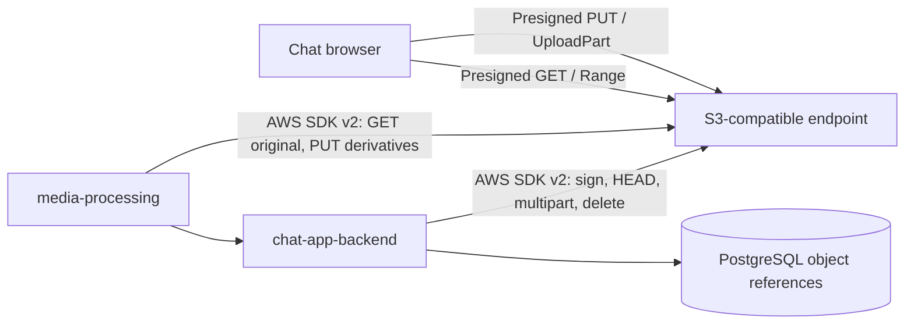

# Object Storage Replacement for Chat Media

## Current Problem

As of **2026-10-01**, the `minio/minio` and `minio/mc` repositories are no longer
available from Docker Hub. More importantly, the open-source MinIO repository is
archived and explicitly says that it is no longer maintained. Historical images
may still be available from Quay, but they are frozen and will not receive
security fixes.

This affects the current local stack directly because
`chat-app-backend/docker-compose.yml` uses `minio/minio:latest`. A cached image
can hide the problem, while a fresh developer machine or CI runner fails to pull
it.

Changing only the image name is not enough for a durable solution:

- `chat-app-backend` uses the MinIO Java SDK for bucket creation, presigned
  `PUT`/`GET`, `HEAD`, delete, and the complete multipart lifecycle.
- `media-processing` uses the MinIO Java SDK to download originals and upload
  video derivatives.
- Browser uploads need CORS and SigV4 presigned URLs.
- Videos need reliable range reads for seeking and playback.
- Large videos, currently allowed up to 200 MB, need multipart
  create/upload/complete/abort behavior.
- The replacement must preserve object keys and database references during
  migration.

This document evaluates replacements. It does **not** change the running storage
service yet.

## Recommendation

Use a two-track decision:

1. **Local development and CI: pilot RustFS 1.0 behind the standard S3 API.**
   It is the closest operational replacement for the current one-container
   MinIO setup, is Apache-2.0 licensed, supports the required presigned and
   multipart operations, and documents compatibility with MinIO clients.
2. **Production: prefer a managed S3 service if policy and budget allow it.**
   AWS S3 has the lowest API-compatibility risk. Cloudflare R2 or Backblaze B2
   are candidates when media egress cost is more important, after passing the
   same contract tests.
3. **If production must be self-hosted: evaluate SeaweedFS first and Garage
   second.** SeaweedFS has the longer project history and broad S3 coverage;
   Garage is attractive for a small geo-distributed cluster but uses roughly
   3x replication and has a smaller S3 feature surface.

Do **not** make RustFS the production default solely because it is the easiest
Docker Compose swap. RustFS reached 1.0 GA only in September 2026, and its
official materials currently give mixed maturity signals: the GA announcement
calls the core production-ready, while its repository still labels distributed
mode as under testing. It is a strong pilot candidate, not yet an automatic
durability decision.

### Immediate build-recovery option

If fresh environments are blocked before the replacement is ready, temporarily
pin the last historical Quay image by immutable tag and preferably mirror it
into a registry controlled by the project. Do not use `latest`.

This is only a short bridge:

- the image is unmaintained and unpatched;
- continued availability is not guaranteed;
- it does not resolve the production support and security risk.

## Application-Specific Acceptance Criteria

A candidate is acceptable only if an automated test proves all of the
following against the exact pinned server release:

| Area                | Required behavior                                                                                                     |
| ------------------- | --------------------------------------------------------------------------------------------------------------------- |
| Authentication      | AWS Signature V4 with static service credentials                                                                      |
| Addressing          | Path-style access; region handling compatible with current config                                                     |
| Bucket              | Create-if-missing and bucket existence check                                                                          |
| Single-part upload  | Browser `PUT` through a presigned URL, including CORS                                                                 |
| Multipart upload    | Create, presign every part, upload, complete with ETags, abort, and clean incomplete uploads                          |
| Object verification | `HEAD` returns size, ETag, and content type                                                                           |
| Reads               | Presigned `GET`, full worker download, and HTTP range requests for video                                              |
| Writes              | Worker-side streaming `PUT` for poster and transcoded video objects                                                   |
| Cleanup             | Idempotent object delete and not-found behavior                                                                       |
| Consistency         | A successful complete/put is immediately visible to `HEAD` and `GET`                                                  |
| Failure safety      | Restart during upload, full disk, unavailable node, and interrupted multipart completion do not acknowledge lost data |
| Operations          | Health check, metrics, backup/restore, upgrade, disk replacement, and documented recovery                             |

Advanced S3 features such as object lock, bucket versioning, replication APIs,
and object tags are not currently used by the chat application. They should not
outweigh correctness of the smaller contract above.

## Candidate Summary

| Candidate                 | Current chat API fit                                    | Operational weight                               | Maturity concern                                                         | Best fit here                                  |
| ------------------------- | ------------------------------------------------------- | ------------------------------------------------ | ------------------------------------------------------------------------ | ---------------------------------------------- |
| **RustFS 1.0**            | High on documented core operations                      | Low for one node; higher for 4-node production   | Very young GA; distributed maturity must be proven                       | **Recommended local/CI pilot**                 |
| **SeaweedFS**             | High; broad S3 matrix                                   | Medium; more components and concepts             | Mature project, but production data-protection/support tiers need review | **First self-hosted production PoC**           |
| **Garage**                | High for this app's core subset                         | Low to medium; minimum 3-node production cluster | Narrower S3 surface; no erasure coding                                   | Self-hosted, small geo-distributed deployments |
| **Ceph RGW**              | High                                                    | Very high unless Ceph already exists             | Mature, but operationally complex                                        | Existing Ceph/platform team                    |
| **Managed S3-compatible** | Highest with AWS S3; high but vendor-specific elsewhere | Lowest infrastructure burden                     | Cost, egress, residency, and vendor dependency                           | **Recommended production path if allowed**     |
| **Zenko CloudServer**     | Potentially high                                        | Medium to high                                   | Better aligned to multi-cloud gateway use cases                          | Existing Scality/Zenko architecture            |
| **Apache Ozone**          | Core API is plausible                                   | Very high                                        | Hadoop-oriented architecture; presign details still evolving             | Large data platform, not this chat stack       |

The summary is deliberately qualitative. Storage durability should not be
selected from benchmark numbers or GitHub stars without failure and restore
testing on the intended topology.

## Possible Solutions

### 1. RustFS

RustFS is a Rust-based S3-compatible object store under Apache-2.0. Its
compatibility matrix lists presigned `GET`/`PUT`, common object operations, and
multipart create/upload/complete/abort as tested. Its documentation recommends
standard AWS SDKs, although it also claims MinIO SDK compatibility.

**Pros**

- Closest shape to the current MinIO developer experience.
- Single-node mode works well for a local Docker Compose pilot.
- Permissive Apache-2.0 license.
- Documented support for the exact core operations used by this application.
- Reed-Solomon erasure coding is available for distributed storage.
- MinIO-style environment-variable aliases can ease an initial experiment.
- Active project with published images and a recent 1.0 GA release.

**Cons**

- 1.0 GA is only weeks old as of this decision.
- Limited public long-duration evidence for node failure, healing, upgrades,
  network partitions, and large production clusters.
- Production multi-node/multi-disk guidance starts at four servers, which is
  much heavier than the current single-container setup.
- Official pages currently conflict on how ready distributed mode is.
- “Compatible with MinIO SDK” does not prove compatibility with every method
  currently called by `MinioAsyncClient`; our multipart tests remain mandatory.

**Recommendation for our problem:** **Yes for local development and CI, after a
contract-test spike. Conditional for production after a multi-node soak and
restore exercise.**

### 2. SeaweedFS

SeaweedFS is an Apache-2.0 distributed storage system started in 2014. It
exposes an S3 gateway and supports presigned URLs, object operations, range
reads, CORS, and the full multipart lifecycle.

**Pros**

- Much longer operating and project history than RustFS.
- Broad, explicit S3 operation matrix.
- Designed for large numbers of files and horizontally scalable blob storage.
- Supports replication for hot data and erasure coding for warm data.
- Can expose S3, filesystem, and other interfaces if future workloads need
  them.
- Permissive Apache-2.0 license for the open-source project.

**Cons**

- More moving parts than MinIO/RustFS: master, volume servers, filer, and S3
  gateway concepts must be understood and operated.
- A small installation can be easy to start but production topology, repair,
  backup, and metadata recovery are more involved.
- Some advanced recovery, self-healing, and customizable erasure-coding
  capabilities are advertised in the Enterprise edition; the exact open-source
  production guarantees and support terms must be confirmed.
- Its flexibility is unnecessary overhead if the only need is one S3 bucket.
- Presigned URL behavior has had path-style/content-type nuances, so browser
  upload tests are essential.

**Recommendation for our problem:** **Yes as the first self-hosted production
PoC, especially if a four-node RustFS deployment is undesirable. Not the
simplest local-development replacement.**

### 3. Garage

Garage is an AGPL-3.0, lightweight, masterless S3-compatible object store
designed for clusters spread across locations with modest hardware and network
links. It supports SigV4, presigned URLs, CORS, range reads, lifecycle rules,
and the multipart operations needed by this app.

**Pros**

- Low CPU and memory requirements.
- Straightforward three-node production recommendation.
- Designed for geo-distributed and heterogeneous hardware.
- Read-after-write consistency is available in the default consistent mode.
- Built-in block checksums, deduplication, and compression.
- Good match for a small team that intentionally wants multi-site self-hosting.

**Cons**

- Uses replication rather than erasure coding; the recommended factor of three
  costs roughly 3x raw storage, material for videos.
- Does not support bucket versioning, object lock, tagging, AWS-style policies,
  or S3 replication endpoints. These are not current blockers but reduce future
  flexibility.
- The S3 API endpoint needs a reverse proxy for TLS.
- Metadata snapshots and filesystem choices require care; Garage documents
  unclean-shutdown concerns for its default LMDB metadata engine.
- AGPL-3.0 requires legal review, especially if the service is modified and
  offered over a network.

**Recommendation for our problem:** **Conditional. Choose it when lightweight
geo-distribution matters more than storage efficiency and broad S3 parity.**

### 4. Ceph Object Gateway (RGW)

Ceph RGW exposes an S3-compatible API backed by a Ceph cluster. It supports the
core object operations, multipart uploads, CORS, presigned URLs, and range
reads.

**Pros**

- Mature, widely deployed distributed storage platform.
- Strong durability, erasure coding, replication, scrubbing, healing, and
  multi-site capabilities.
- Broad S3 support and established operational tooling.
- Scales far beyond the foreseeable media volume of a small chat application.
- Good choice when the organization already runs Ceph.

**Cons**

- Considerably more complex to deploy, monitor, upgrade, repair, and capacity
  plan than the application currently needs.
- A proper highly available deployment involves multiple storage and gateway
  daemons plus ingress/load balancing.
- High memory, disk, network, and operator-skill cost compared with the other
  candidates.
- Running Ceph only for this chat application's media is disproportionate.

**Recommendation for our problem:** **No for a standalone chat deployment. Yes
only if Ceph is already a supported platform service.**

### 5. Managed S3 and S3-Compatible Services

This category includes AWS S3 and compatible services such as Cloudflare R2,
Backblaze B2, and Wasabi.

**Pros**

- Removes disk repair, cluster quorum, upgrades, and storage-node monitoring
  from the application team.
- AWS S3 is the reference behavior for SigV4, presigned URLs, multipart, range
  reads, lifecycle rules, and SDKs.
- Built-in durability, encryption, lifecycle, metrics, and access controls.
- R2 can be attractive for frequently viewed chat video because of its egress
  model; B2 and Wasabi can have lower storage pricing than AWS.
- Easy future CDN integration.

**Cons**

- Ongoing storage, request, and network/egress charges.
- Requires network access and introduces an external dependency.
- Data residency, privacy, compliance, and account-level outage policy must be
  reviewed.
- “S3-compatible” providers have differences: for example, R2 and B2 do not
  support presigned browser `POST`, though this app uses presigned `PUT`.
- Does not replace the need for a convenient offline/local developer service.
- Migrating providers later can incur egress and operational cost.

**Recommendation for our problem:** **Yes for production if managed services
are allowed. Use AWS S3 for minimum compatibility risk; benchmark total cost
and validate R2/B2 if video delivery cost is dominant.**

### 6. Zenko CloudServer

Zenko CloudServer is an active Apache-2.0 S3-compatible server/gateway that can
front multiple storage backends. Its documented API includes CORS, object
operations, and multipart upload.

**Pros**

- Active project with a long release history.
- Broad S3 feature set and permissive license.
- Useful when one S3 endpoint must route to several clouds or backend systems.
- Backed by Scality's storage ecosystem.

**Cons**

- Multi-cloud gateway capability is not a current requirement.
- More architecture and configuration than a direct object store.
- Current authoritative documentation for this app's exact presigned
  multipart/browser flow is less clear than RustFS, SeaweedFS, or Garage.
- Adds another abstraction layer without solving a demonstrated need.

**Recommendation for our problem:** **No as the default. Reconsider only for a
future multi-cloud storage strategy.**

### 7. Apache Ozone

Apache Ozone is a distributed object store from the Hadoop ecosystem. A
separate stateless S3 Gateway maps S3 calls onto Ozone metadata and DataNodes.

**Pros**

- Apache project and Apache-2.0 license.
- Scalable architecture for very large data platforms.
- Supports core object operations and multipart upload through its S3 Gateway.
- Multiple stateless gateways can sit behind a load balancer.

**Cons**

- Requires the Ozone control plane and DataNodes in addition to the S3 Gateway.
- Operational scale and Hadoop-oriented architecture are excessive here.
- Presigned upload coverage has been evolving and needs release-specific
  validation.
- Larger security and deployment surface than every shortlisted option.

**Recommendation for our problem:** **No. It fits a large existing Ozone/Hadoop
platform, not a chat application's media service.**

## Candidates Not Shortlisted

- **OpenMaxIO / MinIO forks:** potentially preserve familiar behavior, but they
  currently have less independent production history than the shortlisted
  projects. Track them; do not move durable chat media to a fork solely to keep
  the old console.
- **VersityGW:** an S3 gateway over filesystem or other backends, not by itself
  the full distributed storage replacement being selected here.
- **JuiceFS:** a distributed filesystem that commonly uses object storage as a
  backend; it does not remove the need to choose durable object storage.
- **OpenStack Swift:** mature, but S3 access is an adapter and operating
  OpenStack infrastructure for this application alone is not justified.
- **LocalStack:** useful for API tests, not a production object store.
- **NFS/local disk served through an HTTP API:** simple initially, but recreates
  multipart, signing, range delivery, replication, repair, and failover in the
  application team. Do not build this.

## High-Level Architecture

Keep the application speaking a standard S3 contract, independent of the
selected server:

The target adapter should use the AWS SDK v2 `S3Client` and `S3Presigner` for
standard operations. The storage server should be selected by endpoint,
credentials, region, and path-style configuration rather than by importing its
vendor SDK.

Keeping a `MINIO` provider name while pointing it at RustFS or SeaweedFS would
work as a short spike but would preserve the wrong abstraction. A generic
`S3_COMPATIBLE` implementation makes later movement among RustFS, SeaweedFS,
Garage, Ceph, and managed providers substantially safer.

## Migration Plan

### Phase 0 - Restore reproducible builds

- Replace `minio/minio:latest` temporarily with an immutable historical Quay
  tag/digest or internal mirror.
- Record the image digest and verify a cold pull in CI.
- Do not expose the frozen service publicly.

### Phase 1 - Add an executable storage contract suite

- Run the acceptance criteria in this document against a disposable container.
- Include an actual browser-CORS test, not only SDK calls.
- Upload a file above the multipart threshold and verify ETag handling.
- Verify video `Range` requests return `206 Partial Content`.
- Restart the storage process between multipart parts and after completion.
- Verify object count, total bytes, content hash, and metadata.

### Phase 2 - Remove MinIO SDK coupling

- Implement standard S3 operations with AWS SDK v2 in both Java services.
- Complete the currently placeholder `S3ObjectStorageProvider`.
- Introduce provider-neutral `S3_COMPATIBLE` configuration.
- Keep object keys, bucket name, database schema, and external API unchanged.
- Run existing media tests plus the new contract suite against current MinIO
  and the candidate to detect semantic differences.

### Phase 3 - Pilot RustFS for local development and CI

- Pin an exact RustFS 1.0.x image digest; do not use `latest`.
- Add explicit CORS, health checks, non-default credentials, and a persistent
  volume.
- Exercise single-part images and multipart videos end to end.
- Keep the temporary MinIO Compose profile available for one release as a
  rollback comparison.

### Phase 4 - Select the production path

- **Managed allowed:** run the contract suite against AWS S3 and the selected
  lower-cost alternative; include monthly storage/request/egress estimates.
- **Self-host required:** run at least a SeaweedFS and Garage PoC. Include node
  loss, disk loss, restore, rolling upgrade, and capacity expansion.
- Consider RustFS production only after its intended multi-node topology passes
  the same tests and an agreed soak period.

### Phase 5 - Migrate existing objects

- Take an inventory by bucket, object count, bytes, and object-key prefix.
- Copy S3-to-S3 with a resumable tool such as `rclone`; preserve content type
  and other required metadata.
- Validate every object by key and size, with checksums where available.
- Use a short write freeze for final delta sync and endpoint cutover. Avoid
  long-lived application dual-write unless zero downtime is a hard requirement;
  dual-write creates partial-failure and reconciliation problems.
- Keep the old store read-only through the rollback window.
- Test rollback before deleting the source data.

## Operational Concerns

- Object storage redundancy is not a backup. Maintain a separately recoverable
  copy and test restore.
- Pin server images by version and digest and monitor security advisories.
- Configure lifecycle cleanup for abandoned multipart uploads.
- Alert on disk capacity, failed healing/repair, request error rate, latency,
  and incomplete multipart growth.
- Keep presigned URL TTLs short and credentials out of browser-visible config.
- Put TLS in front of every non-local S3 endpoint.
- Estimate video egress separately from storage; playback can dominate cost.
- Test upgrades with old objects and in-progress multipart uploads.

## Open Questions / Required Decisions

These answers can change the production recommendation:

- TODO: Confirm whether this replacement is only for local Docker Compose or
  also for production.
- TODO: Confirm whether a managed cloud object store is allowed and in which
  region/provider.
- TODO: Record current and 12-month estimates for stored bytes, object count,
  peak uploads, peak reads, and monthly video egress.
- TODO: Define the production hardware/topology and number of independent
  failure domains available for a self-hosted cluster.
- TODO: Confirm acceptable maintenance downtime and migration downtime.
- TODO: Confirm backup retention, data residency, encryption/KMS, and disaster
  recovery requirements.
- TODO: Confirm whether AGPL-3.0 is acceptable for infrastructure components.
- TODO: Inventory existing MinIO data that must be migrated versus disposable
  local-development data.

Until those questions are answered, the safe decision is **RustFS for a
reversible local/CI pilot, not a final production commitment**.

## Sources

Accessed 2026-10-01:

- [MinIO repository and maintenance status](https://github.com/minio/minio)
- [Docker Hub image removal and temporary Quay fallback](https://www.stablebuild.com/blog/minio-images-disappeared-from-docker-hub)
- [RustFS S3 compatibility matrix](https://docs.rustfs.com/en/reference/s3-compatibility)
- [RustFS multi-node production guidance](https://docs.rustfs.com/en/installation/linux/multiple-node-multiple-disk)
- [RustFS 1.0 GA announcement](https://rustfs.com/blog/announcing-rustfs-1-0-0-ga/)
- [RustFS repository feature status](https://github.com/RustFS/RustFS)
- [SeaweedFS S3 API matrix](https://github.com/seaweedfs/seaweedfs/wiki/Amazon-S3-API)
- [SeaweedFS repository](https://github.com/seaweedfs/seaweedfs)
- [SeaweedFS Enterprise feature boundary](https://seaweedfs.com/)
- [Garage introduction and license](https://garagehq.deuxfleurs.fr/intro.html)
- [Garage S3 compatibility](https://deuxfleurs-org-garage-38.mintlify.app/api/s3-compatibility)
- [Garage production deployment guidance](https://garagehq.deuxfleurs.fr/documentation/cookbook/real-world/)
- [Ceph RGW S3 compliance](https://docs.ceph.com/en/squid/dev/radosgw/s3_compliance/)
- [Ceph RGW deployment](https://docs.ceph.com/en/squid/cephadm/services/rgw/)
- [Apache Ozone S3 interface](https://ozone.apache.org/docs/2.0.0/interface/s3.html)
- [Zenko CloudServer repository](https://github.com/scality/cloudserver)
- [AWS S3 presigned URLs](https://docs.aws.amazon.com/AmazonS3/latest/userguide/using-presigned-url.html)
- [Cloudflare R2 presigned URLs](https://developers.cloudflare.com/r2/api/s3/presigned-urls/)
- [Backblaze B2 S3-compatible API](https://www.backblaze.com/docs/cloud-storage-s3-compatible-api)
