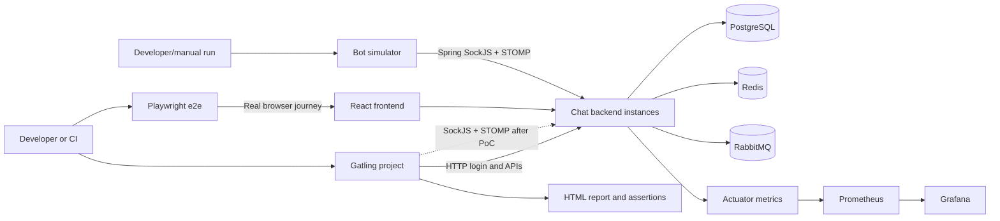

# Gatling Performance Testing Plan

## Intro

The chat app already has three useful test layers:

- backend and frontend unit/integration tests for isolated correctness;
- Playwright tests in `e2e/` for real-browser user journeys;
- `bot-simulator/` for sustained concurrent STOMP/SockJS message traffic.

What is missing is a repeatable performance test suite with controlled workload
models, response-time measurements, pass/fail assertions, and reports that can
be archived by CI. Gatling is a good fit because the team can write and review
the tests as Java code and run them through Maven.

This document is a plan only. It does not add Gatling or change the application.

## Recommendation

Add a standalone Maven project at `gatling/` in this repository. Do **not** add
Gatling dependencies or simulations to `chat-app-backend`.

Use Gatling Community Edition first for:

1. HTTP session and REST API performance tests.
2. WebSocket connection-capacity tests.
3. A time-boxed proof of concept for the app's actual SockJS + STOMP message
   flow.
4. Repeatable smoke, load, stress, spike, and soak profiles with assertions and
   HTML reports.

Keep `bot-simulator/`. It already uses Spring's real `SockJsClient` and
`WebSocketStompClient`, so it is currently a more faithful protocol client than
Gatling for this application. Gatling and the simulator should share seed data
and scenario assumptions, but they solve different problems.

Do not replace Playwright with Gatling. Playwright answers whether the product
works in a browser; Gatling answers how the backend behaves under controlled
load.

### Important protocol constraint

Gatling supports HTTP and raw WebSocket, but it does not provide first-class
STOMP or SockJS support.

The backend currently registers `/ws` with `.withSockJS()`, and the existing
simulator deliberately uses both `SockJsClient` and `WebSocketStompClient`.
Therefore, a Gatling chat scenario would need to implement:

- the SockJS connection URL and framing;
- STOMP `CONNECT`, `SUBSCRIBE`, `SEND`, heartbeat, and `DISCONNECT` frames;
- matching inbound broadcasts in the presence of unrelated messages;
- session-cookie propagation from HTTP login to the WebSocket handshake.

This is feasible with Gatling's raw WebSocket API, but it is custom test
infrastructure and must be proven before committing to it. Do not add a
test-only native WebSocket endpoint to the backend merely to make Gatling
easier; that would test a different transport from the frontend and the current
bot simulator.

## Functional Requirements

The future Gatling project should:

- log in as seeded users through `/api/auth/login` and retain each user's
  `CHATAPP_SESSION` cookie;
- exercise representative read APIs:
  - list groups;
  - read a group;
  - read group and public message history;
  - check the authenticated session;
- measure WebSocket/SockJS connection establishment if the proof of concept
  succeeds;
- model authenticated STOMP subscribe, send, and receive behavior if the proof
  of concept succeeds;
- distribute users and messages across multiple groups rather than creating one
  accidental database hot spot;
- use unique test-run and message correlation IDs;
- support environment-driven base URLs, credentials, group IDs, load level,
  duration, and pauses;
- provide deterministic workload profiles and reproducible commands;
- validate responses and received messages, not merely generate traffic;
- fail the process when agreed performance assertions are violated;
- generate an HTML report and retain the raw run log as CI artifacts;
- avoid production by default and require an explicit opt-in for any
  non-local target;
- document seed, cleanup, monitoring, and test-environment prerequisites.

## Non-Functional Requirements

- Tests must be version-controlled Java code with no GUI-only configuration.
- Load generation must run outside the backend JVM and preferably outside the
  system-under-test hosts.
- Test data must be isolated by run ID and safe to delete.
- Secrets must come from environment variables or CI secrets, never source
  control.
- Normal pauses and randomized think time should model users; zero-pause loops
  should be reserved for explicitly named stress scenarios.
- The suite must distinguish load-generator saturation from application
  saturation by monitoring both sides.
- Results are comparable only when the environment, seed volume, application
  version, Gatling version, and workload profile are recorded.
- Destructive stress, spike, soak, and resilience tests must not run
  automatically against a shared environment.

## What Kinds of Performance Testing Should We Have?

### 1. Smoke test

A very small workload that proves the simulation, credentials, seed data,
checks, and report generation work.

- Run: pull requests or before a larger test.
- Duration: short.
- Result: functional checks pass and there are no unexpected failed requests.
- Purpose: test the test suite, not establish capacity.

### 2. Baseline test

A fixed, modest workload used to establish normal latency and throughput on a
known environment.

- Run: after meaningful backend changes or on a schedule.
- Compare: current results against an intentionally selected baseline.
- Purpose: detect performance regressions.

Community Edition produces separate static reports, so trend comparison is
manual or requires a separate metrics pipeline. Gatling Enterprise adds
centralized run comparison.

### 3. Load test

The expected normal and peak production workload, held long enough to reach a
steady state.

- HTTP model: use an open model when requests continue to arrive regardless of
  server slowdown.
- Connected-chat model: use a closed model when the requirement is a fixed
  number of simultaneously connected users.
- Purpose: verify service-level objectives under expected demand.

### 4. Stress and breakpoint test

Increase load in controlled steps until an assertion fails or the system
reaches a resource limit.

- Observe the first limiting component: app CPU, JVM, database pool, PostgreSQL,
  Redis, RabbitMQ, network, or load generator.
- Reduce load after the peak to verify recovery.
- Purpose: discover capacity and failure behavior, not produce a passing build.

### 5. Spike test

Apply a sudden burst of logins, WebSocket connections, or messages.

- Useful chat cases: reconnect storm after a short outage, many users opening
  the app together, or a message burst in popular groups.
- Purpose: verify queueing, recovery, and absence of cascading failure.

### 6. Soak test

Hold realistic load for hours.

- Watch heap, threads, connection counts, database sessions, Redis memory,
  RabbitMQ queues, and latency drift.
- Purpose: find leaks, unbounded buffers, stale sessions, and gradual
  degradation that short tests miss.

### 7. Scalability test

Repeat the same workload against one and multiple backend instances.

- Purpose: measure whether throughput scales and whether cross-instance
  RabbitMQ fanout changes latency or error rate.
- Keep database, Redis, and RabbitMQ capacity explicit so the result is not
  misattributed to the backend instance count.

### 8. Resilience test

Run steady load while an operator deliberately restarts or degrades one
dependency or backend instance.

- Gatling generates and measures traffic; it is not the failure-injection tool.
- Purpose: measure errors, reconnect behavior, message loss/duplication, and
  recovery time.
- Run manually in an isolated environment.

## Proposed Test Scenarios

### Phase-one HTTP scenarios

Start here because Gatling supports these flows directly:

1. **Login and bootstrap**
   - log in;
   - check session;
   - load group summaries;
   - load initial public or group history.
2. **History readers**
   - select seeded groups;
   - paginate message history;
   - include realistic pauses between pages.
3. **Mixed REST traffic**
   - mostly reads;
   - a smaller number of safe mutations such as mark-read;
   - group-management and media operations kept in separate scenarios.
4. **Media API control plane**
   - test prepare/complete metadata APIs separately;
   - do not include large object upload bytes until storage cost, cleanup, and
     test-environment capacity are agreed.

### Phase-two connection scenario

After the SockJS proof of concept:

1. log in over HTTP;
2. establish the SockJS WebSocket transport with the same session cookie;
3. complete STOMP `CONNECT`;
4. subscribe to one group and the user's update destination;
5. remain connected for a configured period;
6. disconnect cleanly.

This scenario measures connection setup failures and sustainable concurrent
connections without message-send complexity.

### Phase-three chat scenario

After the connection scenario is reliable:

1. sender and receiver users join pre-seeded groups;
2. clients connect and subscribe;
3. send messages carrying a run ID and correlation ID;
4. match the corresponding inbound broadcast;
5. measure send-to-receive latency and detect missing or duplicate messages;
6. vary group sizes to measure fanout cost.

Use at least three group-size classes:

- small group;
- medium group;
- large/fanout-heavy group.

Exact sizes must come from production expectations rather than arbitrary
numbers.

### Phase-four mixed workload

Run multiple populations in parallel:

- users logging in and loading history;
- mostly idle connected users;
- active senders;
- subscribers receiving group and sidebar updates.

This is the most production-like scenario, but it should be added only after
the smaller scenarios can identify failures independently.

## Measurements and Assertions

### Client-side measurements

- HTTP request rate, failure rate, and response-time percentiles;
- login and bootstrap journey duration;
- WebSocket/SockJS connection success and setup time;
- active connected users;
- STOMP send count;
- correlated send-to-receive latency;
- missing, duplicate, malformed, or unexpected frames;
- disconnects and reconnects.

### Server-side measurements

Use the existing Spring Boot Actuator, Prometheus, and Grafana stack to observe:

- HTTP request rate, latency, and errors;
- JVM CPU, heap, GC pauses, live threads, and process limits;
- WebSocket sessions and subscriptions;
- database connection-pool saturation and slow queries;
- PostgreSQL CPU, locks, I/O, and row growth;
- Redis latency, memory, and session count;
- RabbitMQ publish/delivery rate, queue depth, consumers, and redeliveries;
- each backend instance separately during scaling tests.

### Pass/fail policy

Do not invent final thresholds from one developer laptop. Establish them from
product SLOs and a stable test environment.

Initial assertion categories should include:

- maximum failed-request percentage;
- p95 and p99 latency for each important HTTP request group;
- maximum login/bootstrap journey time;
- maximum failed connection percentage;
- p95 and p99 send-to-receive latency;
- zero unexpected missing or duplicate messages for correctness-focused runs.

TODO: Product/engineering must provide expected concurrent users, message rate,
group-size distribution, target percentiles, allowed error rate, and required
test duration before numeric assertions are committed.

## Gatling vs. the Existing Bot Simulator

| Area | Gatling | `bot-simulator/` |
| --- | --- | --- |
| Primary purpose | Repeatable performance tests with assertions and reports | Generate realistic ongoing STOMP chat traffic |
| Protocol fit | Native HTTP/raw WebSocket; custom SockJS/STOMP needed | Native Spring SockJS/STOMP client, matching this app |
| Workload models | Built-in ramps, rates, concurrency levels, and profiles | Bot count, startup spread, interval, and jitter |
| Validation | HTTP/WebSocket checks and global pass/fail assertions | Primarily connection/send counters |
| Latency reporting | Percentiles and HTML reports | No per-operation latency report today |
| Message correctness | Can be designed around correlation checks | Does not currently verify received broadcasts |
| CI regression gate | Strong fit for small stable scenarios | Weak until deterministic assertions/reporting are added |
| Long-running traffic while observing the app | Possible, but not its unique strength | Strong and simple for the current protocol |
| Maintenance | Scenario code plus custom SockJS/STOMP adapter | Existing Spring client code |

The tools overlap in traffic generation, but the planned Gatling suite is not a
rewrite of the simulator. The simulator is valuable for manual demonstrations,
long-running traffic, reconnection behavior, and protocol fidelity. Gatling is
valuable for controlled experiments, measurements, assertions, and CI reports.

The two tools should share:

- seeded user naming and credentials;
- target group fixtures;
- definitions of small/medium/large groups;
- message correlation format;
- named load profiles and expected rates.

They should not share runtime code initially. Coupling Gatling to the Spring
Boot simulator would make the performance project heavier and blur which
client behavior is being measured.

## Gatling vs. Playwright in `e2e/`

| Area | Gatling | Playwright `e2e/` |
| --- | --- | --- |
| Main question | How fast and how much load can the backend handle? | Can a user complete the feature in a real browser? |
| Client | Protocol-level virtual users | Chromium browser contexts |
| Scale | Hundreds or thousands, subject to generator capacity | Small numbers; browsers are resource-heavy |
| UI rendering | No | Yes |
| Frontend JavaScript and MUI | Not exercised | Exercised |
| HTTP/WebSocket timing | Detailed load-oriented metrics | Functional timing, traces, screenshots |
| Assertions | Performance thresholds and protocol checks | Visible UI and user-flow correctness |
| Best CI use | Small performance smoke; scheduled baseline | Functional regression on pull requests |

Do not use Gatling to prove that sidebar navigation, message rendering, routing,
or browser session behavior works. Do not use Playwright to discover backend
capacity. A useful cross-layer check is:

1. Playwright proves one or two users can complete the chat journey.
2. Gatling proves the backend sustains the required protocol workload.
3. The bot simulator provides faithful sustained STOMP/SockJS traffic during
   manual observation.

## Where Should Gatling Live?

### Option A: standalone `gatling/` Maven project in this repository

- How it works: add a sibling project with its own Maven wrapper, `pom.xml`,
  simulations, resources/feeders, configuration, and README.
- Pros:
  - load generator is isolated from backend dependencies and lifecycle;
  - can target local, test, staging, or a deployed release;
  - reports and test dependencies do not enlarge the production application;
  - consistent with the existing standalone `e2e/` and `bot-simulator/`
    projects;
  - remains easy for Java developers to run and review.
- Cons:
  - one more project and dependency set to maintain;
  - DTOs or endpoint details may drift unless contract helpers stay small.
- Recommendation for this project: **Yes**.

This means a new project folder, not a new Git repository.

### Option B: add Gatling to `chat-app-backend`

- How it works: add the Gatling plugin, dependencies, resources, and simulation
  source set to the backend Maven build.
- Pros:
  - one Maven project;
  - easy access to backend classes.
- Cons:
  - couples black-box performance tests to application internals;
  - risks running load tests through normal `verify`;
  - complicates the existing Surefire/Failsafe test split;
  - mixes load-generator dependencies and reports with the deployable service;
  - encourages in-process shortcuts that do not represent network clients.
- Recommendation for this project: **No**.

### Option C: separate Git repository

- Pros:
  - independent ownership, access, release cadence, and large test artifacts;
  - useful when one suite tests many services or a dedicated performance team
    owns it.
- Cons:
  - version drift from application changes;
  - harder code review and local onboarding;
  - unnecessary operational overhead for the current repository.
- Recommendation for this project: **Not yet**.

## Alternatives to Gatling

### 1. Extend `bot-simulator/`

- Pros:
  - best current SockJS/STOMP fidelity;
  - already authenticates and targets group chats;
  - Java/Spring knowledge transfers directly;
  - full control over reconnect and message semantics.
- Cons:
  - would require building workload models, latency histograms, assertions,
    reports, feeders, and CI integration that Gatling already provides;
  - current successful-send count means the client handed off a frame, not that
    the server processed and broadcast it;
  - easy to create a traffic generator without creating a reliable benchmark.
- Best use: keep it as the protocol-faithful simulator and improve it only when
  a simulator-specific requirement appears.

### 2. Apache JMeter

- Pros:
  - mature and widely known;
  - broad protocol and plugin ecosystem;
  - GUI is useful for exploratory setup;
  - CLI mode can run in CI.
- Cons:
  - test plans are XML and GUI-driven unless the team adds another abstraction;
  - code review and refactoring are less natural than Java source;
  - WebSocket typically relies on plugins;
  - STOMP/SockJS still requires plugin evaluation or manual framing;
  - load-generator resource use can be higher for comparable scenarios.
- Fit here: reasonable if an approved plugin proves SockJS/STOMP support better
  than Gatling, but otherwise it does not remove the central protocol problem.

The preference for coding and version-controlled reviews is a legitimate reason
to prefer Gatling over JMeter, but it should not be presented as JMeter having
native support for this app's complete SockJS/STOMP flow without a proof.

### 3. Grafana k6

- Pros:
  - concise JavaScript/TypeScript tests;
  - strong CLI, thresholds, CI integration, and Prometheus/Grafana ecosystem;
  - efficient load generator;
  - official WebSocket support.
- Cons:
  - no first-class STOMP/SockJS support;
  - STOMP extensions are third-party and require a custom k6 binary;
  - introduces Go-based extension tooling when using `xk6`;
  - less aligned with a Java-focused team.
- Fit here: strongest general alternative if the team prefers
  JavaScript/TypeScript and validates the protocol extension risk.

### 4. Artillery

- Pros:
  - quick YAML scenarios with JavaScript/TypeScript extension points;
  - good HTTP and WebSocket developer experience;
  - easy to begin small.
- Cons:
  - raw WebSocket does not solve SockJS/STOMP automatically;
  - complex chat behavior moves from YAML into custom code;
  - adds another Node.js test project alongside Playwright.
- Fit here: useful for simpler HTTP/raw-WebSocket services, but no clear
  advantage over Gatling for the current Java team.

### 5. Locust

- Pros:
  - Python code, flexible user behavior, and an approachable live UI;
  - distributed execution is available in the open-source tool.
- Cons:
  - HTTP is the main path; WebSocket/STOMP needs custom client integration;
  - custom protocol metrics and connection lifecycle require more engineering;
  - introduces Python tooling not otherwise used by this repository.
- Fit here: good for a Python-oriented team, not the default recommendation.

## High-Level Architecture/Design



### Proposed project shape

```text
gatling/
├── mvnw
├── mvnw.cmd
├── pom.xml
├── README.md
└── src/test/
    ├── java/com/hello/chatapp/performance/
    │   ├── simulation/
    │   ├── scenario/
    │   ├── protocol/
    │   └── support/
    └── resources/
        ├── feeders/
        └── gatling.conf
```

Keep simulation classes small. Put reusable login, HTTP, workload-profile, and
eventually SockJS/STOMP framing logic in focused helpers. Do not depend on
backend implementation classes.

## Environment and Test Data

Use the existing `UserSeeder` and `GroupSeeder` initially, as both Playwright
and the bot simulator already depend on them. Before trusting benchmark
results, add a documented performance fixture that records:

- number of users;
- number of groups;
- participants per group;
- existing messages per group;
- distribution of group sizes;
- credentials and group IDs available to each scenario.

Large tests should not create all fixture data during the timed section.
Prepare data before the run, verify it in a smoke step, and clean only data
tagged with the current run ID.

Recommended environments:

- local: script development and smoke only;
- stable dedicated performance environment: baselines, load, stress, and soak;
- production: no load test unless owners explicitly approve scope, rate,
  timing, safeguards, and cleanup.

## CI and Execution Strategy

1. **Pull request**
   - compile simulations;
   - optionally run a tiny HTTP smoke test in an ephemeral environment;
   - archive the report on failure and success.
2. **Scheduled**
   - run the baseline profile against a stable environment;
   - store application commit, environment description, and report artifact.
3. **Manual**
   - run load, stress, spike, soak, scalability, and resilience profiles;
   - require an operator to watch Gatling plus Grafana.

Do not bind substantial load tests to the default backend Maven lifecycle.

## Implementation Details

### Phase 0 - Agree on the performance contract

- Define expected concurrency, arrival rates, message rates, group-size
  distribution, SLOs, environment, and test ownership.
- Record the hardware and dependency topology of the baseline environment.

### Phase 1 - Standalone Gatling scaffold and HTTP smoke

- Create the Java/Maven project, configuration model, login flow, feeders,
  smoke profile, assertions, README, and report-artifact instructions.

### Phase 2 - HTTP baseline and load scenarios

- Add bootstrap, history, and mixed REST scenarios.
- Correlate Gatling results with Prometheus/Grafana.

### Phase 3 - SockJS/STOMP feasibility proof

- Implement the minimum connection and STOMP handshake.
- Verify cookies, heartbeats, subscription, one correlated send/receive, and
  clean disconnect.
- Compare behavior with browser traffic and `bot-simulator/`.
- Stop and reassess Gatling for chat traffic if protocol fidelity or
  maintainability is poor.

### Phase 4 - Connection and messaging profiles

- Add connection capacity, group fanout, mixed traffic, stress, and spike
  simulations.
- Add correctness checks for missing and duplicate correlated messages.

### Phase 5 - Baseline automation

- Add scheduled CI execution on a stable environment, artifact retention, run
  metadata, and an agreed regression-review process.

### Phase 6 - Soak, resilience, and scaling

- Add manual runbooks for long tests, controlled failures, multi-instance
  comparisons, cleanup, and result interpretation.

## Open Questions Before Implementation

These questions do not block creation of the project scaffold, but they do
block meaningful load levels and pass/fail thresholds:

1. What are the expected average and peak concurrently connected users?
2. What are the expected average and peak messages per second?
3. What do small, medium, and large groups look like in production?
4. Which latency percentiles and error rates has the business promised?
5. Is there a dedicated staging/performance environment, and what is its
   topology relative to production?
6. Should CI run only smoke tests, or is a stable scheduled baseline
   environment available?
7. How long must the soak test run?
8. Is Gatling Community Edition sufficient, or is there budget/need for
   Enterprise distributed load generation and centralized trend comparison?
9. Are media upload/download workloads in scope, and what storage cost and
   cleanup limits apply?
10. Is SockJS still a product requirement, or is a future migration to native
    WebSocket already planned for real clients?

TODO: Answer these questions with the product owner, backend owner, and
operations owner before assigning numeric targets.

## Decision Criteria After the SockJS/STOMP Proof of Concept

Continue with Gatling for chat messaging only if:

- its client follows the same SockJS transport path as the frontend;
- STOMP heartbeat and framing behavior are correct;
- inbound messages can be correlated under fanout without excessive buffering;
- client-side resource use is measured and leaves sufficient generator
  headroom;
- the adapter remains small, tested, and understandable to the team.

If those criteria fail, use Gatling for HTTP/API performance and retain or
enhance `bot-simulator/` for SockJS/STOMP measurements. A mixed-tool strategy is
better than reporting precise-looking results from an unrealistic client.

## Future Higher-Scale Path

- Move heavy load generation to dedicated hosts.
- Use Gatling Enterprise if distributed generation, geographic load,
  centralized history, and collaborative reports justify the cost.
- Export run metadata and application metrics to a durable performance
  dashboard.
- Add capacity models per backend instance and per dependency tier.
- Split media and chat-message tests when their resource profiles interfere.
- Re-evaluate k6 or a specialized client if protocol requirements move away
  from the JVM or if SockJS/STOMP support becomes stronger elsewhere.

## References

- [Gatling Java/JVM installation guide](https://docs.gatling.io/tutorials/test-as-code/java-jvm/installation-guide/)
- [Gatling WebSocket reference](https://docs.gatling.io/reference/script/websocket/)
- [Gatling assertions](https://docs.gatling.io/concepts/assertions/)
- [Gatling injection profiles](https://docs.gatling.io/concepts/injection/)
- [Gatling workload models](https://docs.gatling.io/testing-concepts/workload-models/)
- [Gatling Maven plugin](https://docs.gatling.io/integrations/build-tools/maven-plugin/)
- [Gatling Community static reports](https://docs.gatling.io/reference/stats/reports/oss/)
- [Gatling licenses](https://docs.gatling.io/project/licenses/project-licenses/)
- [Grafana k6 WebSocket documentation](https://grafana.com/docs/k6/latest/using-k6/protocols/websockets/)
- Existing project docs:
  [Bot Simulator](08_BOT_SIMULATOR.md),
  [Playwright E2E](09_E2E_PLAYWRIGHT.md), and
  [Monitoring](04_MONITORING.md)
