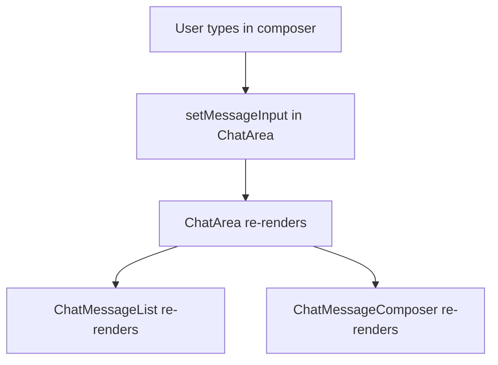

# Implement theme switcher in React

I’ll wire a multi-palette system with persistence, then add a simple selector in the chat UI so users can switch themes from settings-like controls.

Users can choose from multiple palettes at runtime, and the choice is saved in localStorage and restored on reload.

What was added:

- Theme preset system with 3 palettes (Forest, Amethyst, Ocean) in tokens.js
- Runtime CSS variable application and dynamic MUI theme generation in App.js
- Theme selector dropdown in the sidebar UI in Sidebar.js
- Prop wiring for selector state from app to chat page in ChatPage.js

How it works now:

1. App loads selected theme ID from localStorage.
2. It resolves that palette into:
   - MUI palette tokens for createTheme
   - Full CSS variable map for your existing CSS files
3. It applies CSS variables to :root at runtime.
4. User can switch theme from the sidebar Theme dropdown.

# Implement animation for group reordering in sidebar

I added a FLIP-style animation so groups animate smoothly when reordered.

What I changed

- Sidebar.js
  - Added refs for each `ListItemButton`.
  - Added a `useLayoutEffect` that measures previous and current DOM positions and applies a translateY transform + transition to animate each item into its new place (FLIP technique).
  - Replaced the wrapping `Badge` usage earlier with the CSS-based badge (as we discussed).

- No changes to your CSS were required for the animation itself; layout stays controlled by Sidebar.css.

How it works (short)

- On each render the code records the bounding rects of items.
- When order changes, it computes the vertical offset (previousTop - newTop), applies an immediate inverse translate so the item appears at its old spot, then animates transform back to 0 — producing a smooth move-to-position animation.

Tuning

- Animation speed/easing lives in the JS transition: currently `transform 300ms cubic-bezier(.2,.8,.2,1)`. I can change this to a different duration or easing, or pull it into CSS if you prefer.

Notes / caveats

- The FLIP code animates items that exist in both previous and current lists. New items (inserted) and removed items will appear/disappear without a stagger; we can add enter/exit animations if you want.
- This approach uses inline styles temporarily; cleanup is performed on transition end.
- Please test in your app (dev server). Large lists with many simultaneous moves may make many transitions start at once — we can throttle or stagger if needed.

Want me to:

- Change duration/easing?
- Add an enter/exit fade for newly created/removed groups?
- Cap badge counts like `99+` (UX suggestion)?

Ref: GPT-5 mini

# Fix unnecessary `group-updates` topic unsubscribe/subscribe on chat switch

Fixed with new solution in

- [`WebSocketProvider.tsx`](../chat-app-frontend/src/context/WebSocketProvider.tsx):
- [06_REALTIME_GROUP_SIDEBAR_UPDATE_STRATEGY.md](06_REALTIME_GROUP_SIDEBAR_UPDATE_STRATEGY.md#frontend)

## My manual testing

What to test

1. Reload frontend.
2. Switch group A -> group B several times.
3. Check network STOMP frames:
   - Expected: chat topic still unsub/sub (`/topic/group.x`) on switch.
   - Expected: personal topic `/topic/user.vegeta.group-updates` should no longer flap on each switch.

When user switches groups, websocket messages before:

```
["UNSUBSCRIBE\nid:sub-3\n\n\u0000"]
["UNSUBSCRIBE\nid:sub-2\n\n\u0000"]
["SUBSCRIBE\nid:sub-4\ndestination:/topic/user.vegeta.group-updates\n\n\u0000"]
["SUBSCRIBE\nid:sub-5\ndestination:/topic/group.100\n\n\u0000"]
```

- We unsubscribe from `/topic/group.1` and subscribe to `/topic/group.100` as expected.
- We also see an unnecessary unsubscribe from `/topic/user.vegeta.group-updates` followed by a resubscribe, which is what we want to eliminate.

When user switches groups, websocket messages after:

```
["UNSUBSCRIBE\nid:sub-5\n\n\u0000"]
["SUBSCRIBE\nid:sub-6\ndestination:/topic/group.10\n\n\u0000"]
```

- We still see the expected unsubscribe/subscribe for the group topic.
- We no longer see any unsubscribe/subscribe for the personal topic, which means the fix is working as intended.

# Fix unnecessary re-renders in `ChatMessageList`

`ChatMessageList` re-renders on every keystroke because **its parent `ChatArea` re-renders**, not because the message list data changed.

## The chain of events

1. **Typing updates state in `ChatArea`**

```js
// 29:29:chat-app-frontend/src/components/ChatArea.js
const [messageInput, setMessageInput] = useState("");
```

```js
// 433:436:chat-app-frontend/src/components/ChatArea.js
<ChatMessageComposer
  messageInput={messageInput}
  onChange={(event) => setMessageInput(event.target.value)}
  onKeyPress={handleKeyPress}
```

Each keystroke calls `setMessageInput`, which triggers a `ChatArea` re-render.

2. **React re-renders all children by default**

`ChatMessageList` and `ChatMessageComposer` are siblings inside `ChatArea`. When `ChatArea` re-renders, both children re-render unless you opt out.

3. **`ChatMessageList` is not memoized**

It’s a plain function component with no `React.memo`, so it always re-renders when `ChatArea` does.

## Visual flow



## Is this a problem?

Usually **no** for a typical chat — React reconciles the DOM and only updates what changed. It becomes a problem if you have hundreds of messages, heavy media, or expensive per-message work (your `formatMessage` runs for every message on each render).

## How to fix it (if you want to)

### **Option A — Keep input state local to the composer (simplest, selected)**

Move `messageInput` into `ChatMessageComposer`. Only call `onSend` with the final text. Typing then won’t re-render `ChatArea` or `ChatMessageList`.

### **Option B — Memoize the list**

```js
const ChatMessageList = React.memo(function ChatMessageList({ ... }) { ... });
```

Also wrap handlers in `useCallback` in `ChatArea`, or the memo won’t help much.

### **Option C — Split the layout**

Extract a `ChatAreaMessages` wrapper that only receives message-related props, keeping composer state in a sibling subtree.

Option A is usually the cleanest: the input field’s state belongs in the composer, not in the parent that owns the message list.
