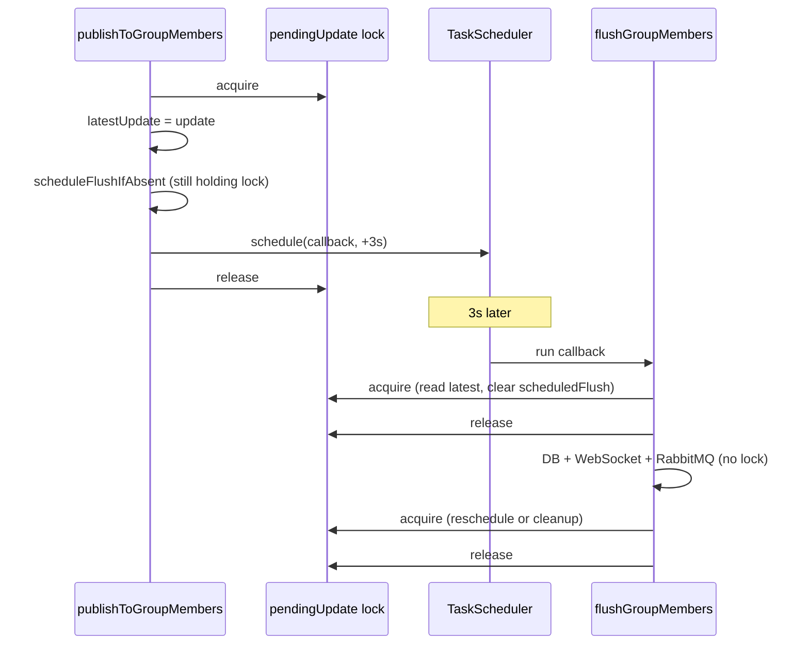

## How Spring converts JSON to Message

Here is a method in a controller:

```java
@MessageMapping("/chat.send")
@SendTo("/topic/public")
@NonNull
public Message sendMessage(@Payload @NonNull Message message) {
    // Save message to database
    return messageRepository.save(message);
}
```

Explain annotations:

- `@MessageMapping("/chat.send")`: Maps WebSocket messages sent to `/app/chat.send` to this method. The `/app` prefix comes from the [WebSocket configuration](./src/main/java/com/hello/chatapp/config/WebSocketConfig.java)
- `@SendTo("/topic/public")`: Broadcasts the return value to all subscribers of `/topic/public`. All connected clients receive the message
- `@Payload @NonNull Message message`
  - `@Payload`: extracts the message body from the WebSocket frame, then convert it from JSON to the specified type (`Message`), then inject it as the method parameter
  - `@NonNull`: ensures the parameter is not null

When a message arrives at `@MessageMapping("/chat.send")`, Spring:

1. Extracts the JSON payload (via `@Payload`)
2. Uses `Jackson` to deserialize the JSON string into a `Message` object
3. Matches JSON fields to `Message` fields (sender, content, timestamp)

## ~~Explaining `#{@publicTopicQueue}`~~

It's Spring Expression Language (SpEL) used to reference a Spring bean.

- `#{}` — SpEL expression delimiter
- `@` — bean reference operator in SpEL
- `publicTopicQueue` — bean name (from the `@Bean` method in [`RabbitMQConfig`](./src/main/java/com/hello/chatapp/config/RabbitMQConfig.java))

Sao lại dùng nó?

- Method `publicTopicQueue` sẽ return dynamic queue name, có thể là `ws.instance-1.public`, `ws.instance-123.public`, tuỳ theo giá trị của instance mỗi khi run app
- Bên RabbitMQ listener, mỗi 1 instance khi run sẽ lắng nghe 1 queue riêng biệt, e.g. `ws.instance-1.public`, `ws.instance-123.public`
- Ta không thể hardcode `@RabbitListener(queues = "ws.instance-1.public")` như này được, vì mỗi 1 instance sẽ có instanceId riêng.
- Ta có thể dùng dynamic bean name: `@RabbitListener(queues = "#{@publicTopicQueue}")`

Update: Cái này đã bị xoá bỏ, vì không dùng queue `ws.instance-id.public` nữa. Thay vào đó ta dùng queue `ws.instance-id.session-id.public`

- `ws.instance-id.public`: chỉ dynamic với `instance-id`, sau khi instance start thì KHÔNG thay đổi nữa
- `ws.instance-id.session-id.public`: dynamic với `instance-id` và websocket session của user, mỗi khi user connect/disconnect 1 websocket thì 1 queue sẽ được tạo/xoá

## STOMP protocol

STOMP is a simple text-oriented messaging protocol used by our UI Client (browser) to connect to enterprise message brokers.

Clients can use the `SEND` or `SUBSCRIBE` commands to **send or subscribe for messages** along with a **"destination" header** that describes what the message is about and who should receive it.

It defines **a protocol for clients and servers to communicate with messaging semantics**. It does not define any implementation details, but rather addresses an easy-to-implement wire protocol for messaging integrations.

The protocol is **similar to HTTP**, and **works over TCP using the following commands**:

```
CONNECT
SEND
SUBSCRIBE
UNSUBSCRIBE
BEGIN
COMMIT
ABORT
ACK
NACK
DISCONNECT
```

When using **Spring's STOMP support**, the Spring WebSocket application acts as the **STOMP broker** to clients. Messages are routed to `@Controller` message-handling methods or to a simple, in-memory broker that keeps track of subscriptions and broadcasts messages to subscribed users.

You can also configure Spring to work with a dedicated STOMP broker (e.g. RabbitMQ, ActiveMQ, etc.) for the actual broadcasting of messages. In that case, Spring maintains TCP connections to the broker, relays messages to it, and also passes messages from it down to connected WebSocket clients.

Ref: https://dzone.com/articles/build-a-chat-application-using-spring-boot-websock

## WebSocket Authentication

**How it works:**

1. **During WebSocket handshake** (`WebSocketHandshakeInterceptor`):
   - Extracts username from the HTTP session (set during login)
   - Stores it in WebSocket session attributes

2. **On each WebSocket message** (`WebSocketSecurityChannelInterceptor`):
   - Validates that username exists in WebSocket session attributes
   - Rejects message if not authenticated

3. **In message handlers** (`WebSocketController`):
   - Uses the authenticated username from WebSocket session
   - Prevents spoofing (client can't fake the sender)

## How the In-Memory Message Broker Handles Group Messages

### 1. Topic-based routing

Spring's simple in-memory broker uses topic-based routing. Topics are string destinations like:

- `/topic/public` - for public chat messages
- `/topic/group.1` - for group 1 messages
- `/topic/group.2` - for group 2 messages
- etc.

### 2. Subscription model

When a client connects and wants to receive messages from a group:

```javascript
// Frontend subscribes to a specific group topic
stompClient.subscribe(`/topic/group.${chatId}`, function (message) {
  showMessage(JSON.parse(message.body));
});
```

The broker maintains an internal subscription map:

```
Subscription Registry:
├── /topic/public
│   ├── Client A (WebSocket session)
│   ├── Client B (WebSocket session)
│   └── Client C (WebSocket session)
├── /topic/group.1
│   ├── Client A (member of group 1)
│   └── Client D (member of group 1)
└── /topic/group.2
    ├── Client B (member of group 2)
    └── Client E (member of group 2)
```

### 3. Message flow when a user sends to group1

Step-by-step:

1. User (FE) sends message:

   ```javascript
   // Frontend sends to /app/group.send
   chatMessage.groupId = 1;
   stompClient.send("/app/group.send", {}, JSON.stringify(chatMessage));
   ```

   - Note: FE send message, không hiển thị message đó luôn, mà phải chờ message được gửi tới BE, rồi BE gửi lại message đó thì FE mới hiển thị

2. Backend receives and processes:

   ```java
   // Controller chỉ save message vào DB, còn broadcast nó cho user khác là việc của broker.
   // Do đó controller sẽ gửi message tới broker để nó forward message tới người nhận.
   // Với lệnh sau, controller sẽ gửi message tới broker (nếu dùng in-memory broker thì nó chính là STOMP broker đó)
   messagingTemplate.convertAndSend("/topic/group.1", response);
   ```

3. Broker routes the message:
   - The broker receives a message with destination `/topic/group.1`
   - It looks up all subscribers to `/topic/group.1`
   - It forwards the message to all subscribed clients

### 4. How the broker knows which users to forward to

The broker does not know about users or groups. It only knows:

- Topic destinations (e.g., `/topic/group.1`)
- Which WebSocket sessions are subscribed to each topic

The broker forwards messages to all subscribers of a topic. It does NOT:

- Check if a user is a member of the group: do đó khi 1 user subscribe 1 destination, ta phải check xem nó có là member của group đó không: [WebSocketSecurityChannelInterceptor.java::validateSubscription()](./src/main/java/com/hello/chatapp/config/WebSocketSecurityChannelInterceptor.java)
- Query the database
- Know about user relationships

### 5. Important points

1. Subscription happens on the client side:
   - When a user opens a group chat, the frontend subscribes to that group's topic
   - The backend does not automatically subscribe users

2. Security consideration:
   - The broker forwards to all subscribers of a topic
   - **Without authorization, any user could subscribe to any group topic and receive messages**
   - Therefore, authorization must be enforced at multiple levels:
     - When subscribing to topics (prevents unauthorized subscription)
     - When loading messages (prevents unauthorized message retrieval)
     - When sending messages (prevents unauthorized message sending)

3. Current implementation:
   - ✅ Authorization when subscribing: `WebSocketSecurityChannelInterceptor.validateSubscription()` prevents unauthorized subscriptions
   - ✅ Authorization when loading messages: `MessageController.getGroupMessages()` checks membership
   - ✅ Authorization when sending messages: `WebSocketController.sendGroupMessage()` verifies membership before sending

### 6. Visual flow diagram

```
User A (member of group 1) sends message:
┌─────────────┐
│  Frontend   │ → sends to /app/group.send (groupId=1)
└─────────────┘
       ↓
┌─────────────────────┐
│ WebSocketController │ → validates, saves to DB
└─────────────────────┘
       ↓
┌─────────────────────┐
│ messagingTemplate   │ → convertAndSend("/topic/group.1", message)
└─────────────────────┘
       ↓
┌─────────────────────┐
│  Message Broker     │ → looks up subscribers of "/topic/group.1"
│  (SimpleBroker)     │
└─────────────────────┘
           ↓
    ┌──────┴──────┐
    ↓             ↓
┌─────────┐  ┌─────────┐
│Client A │  │Client D │  (both subscribed to /topic/group.1)
└─────────┘  └─────────┘
```

## Environment Variables

Key environment variables (can be set in `.env` file):

| Variable            | Description         | Default      |
| ------------------- | ------------------- | ------------ |
| `POSTGRES_PASSWORD` | PostgreSQL password | `5555`       |
| `REDIS_PASSWORD`    | Redis password      | `redis123`   |
| `RABBITMQ_USER`     | RabbitMQ username   | `guest`      |
| `RABBITMQ_PASSWORD` | RabbitMQ password   | `guest`      |
| `INSTANCE_ID`       | App instance ID     | `instance-1` |
| `LOG_LEVEL`         | Logging level       | `INFO`       |
| `JPA_SHOW_SQL`      | Show SQL queries    | `false`      |

## How Spring Boot Maps Environment Variables

Spring Boot automatically converts environment variable names to property paths using these rules:

1. Convert to lowercase
2. Replace underscores (`_`) with dots (`.`)
3. Map to the corresponding YAML property

### Example: `SPRING_APPLICATION_INSTANCE_ID`

```
Environment Variable:  SPRING_APPLICATION_INSTANCE_ID
                          ↓
Spring Boot converts:  spring.application.instance-id
                          ↓
Maps to YAML:          spring:
                         application:
                           instance-id: <value>
```

More Examples

| Environment Variable             | Spring Property                  | YAML Path                        |
| -------------------------------- | -------------------------------- | -------------------------------- |
| `SPRING_DATASOURCE_URL`          | `spring.datasource.url`          | `spring.datasource.url`          |
| `SPRING_DATA_REDIS_HOST`         | `spring.data.redis.host`         | `spring.data.redis.host`         |
| `SERVER_PORT`                    | `server.port`                    | `server.port`                    |
| `SPRING_APPLICATION_INSTANCE_ID` | `spring.application.instance-id` | `spring.application.instance-id` |

### Priority Order

Spring Boot reads configuration in this order (highest to lowest priority):

1. Environment variables (highest) ← Docker sets these
2. Command-line arguments
3. `application-{profile}.yaml`
4. `application.yaml` (lowest)

## Using `.env` file for running spring boot app

Example command in Makefile: `@export $$(cat .env 2>/dev/null | grep -v '^#' | xargs) && ./mvnw spring-boot:run`

**Breakdown:**

- `@` - Makefile syntax to suppress echoing the command
- `export` - Sets environment variables for the current shell session
- `$$(...)` - Double `$$` in Makefile becomes single `$` for command substitution
- `cat .env 2>/dev/null` - Reads .env file, suppressing errors if it doesn't exist
- `grep -v '^#'` - Filters out comment lines (starting with `#`)
- `xargs` - Converts the output into space-separated arguments for export
- `&&` - Only runs the next command if the previous succeeds
- `./mvnw spring-boot:run` - Executes the Maven wrapper to start Spring Boot

**Example:**

If .env contains:

```
# Database config
DB_HOST=localhost
DB_PORT=5432
```

The command effectively runs:

```bash
export DB_HOST=localhost DB_PORT=5432 && ./mvnw spring-boot:run
```

This makes those variables available to the Spring Boot application at runtime.

## Why use ScheduledExecutorService instead of a raw thread?

You’re asking why `SimulationOrchestrator.java` uses a single-thread scheduled executor instead of just starting one raw thread:

- `Executors.newSingleThreadScheduledExecutor()` creates a scheduler backed by one worker thread at `SimulationOrchestrator.java`.
- It runs `reportStats()` periodically via `scheduleAtFixedRate(...)` at `SimulationOrchestrator.java`.

Why not `new Thread()`?

- `new Thread()` is one-shot by default. For periodic work, you must manually write a loop + sleep + interruption handling.
- `ScheduledExecutorService` gives precise periodic scheduling (`fixedRate`) out of the box.
- Shutdown is cleaner and explicit (`shutdownNow()`) in your lifecycle at `SimulationOrchestrator.java`.
- It is easier to evolve later (multiple scheduled tasks, different frequencies) without rewriting threading logic.

So: your intuition is right that it’s a single thread, but the executor is chosen for scheduling/lifecycle correctness and maintainability, **NOT for parallelism**.

## LazyInitializationException: Could not initialize proxy - no session

Error code:

```java
List<GroupParticipant> participants = groupParticipantRepository.findByGroup(group);
for (GroupParticipant participant : participants) {
   String username = participant.getUser().getUsername();
   // ...
}
```

Error:

```log
2026-06-06T11:06:46.390+07:00 ERROR 10133 --- [chat-app] [boundChannel-31] .WebSocketAnnotationMethodMessageHandler : Unhandled exception from message handler method

org.hibernate.LazyInitializationException: Could not initialize proxy [com.hello.chatapp.entity.User#1] - no session
   at org.hibernate.proxy.AbstractLazyInitializer.initialize(AbstractLazyInitializer.java:174) ~[hibernate-core-6.6.33.Final.jar:6.6.33.Final]
   at org.hibernate.proxy.AbstractLazyInitializer.getImplementation(AbstractLazyInitializer.java:328) ~[hibernate-core-6.6.33.Final.jar:6.6.33.Final]
   at org.hibernate.proxy.pojo.bytebuddy.ByteBuddyInterceptor.intercept(ByteBuddyInterceptor.java:44) ~[hibernate-core-6.6.33.Final.jar:6.6.33.Final]
   at org.hibernate.proxy.ProxyConfiguration$InterceptorDispatcher.intercept(ProxyConfiguration.java:102) ~[hibernate-core-6.6.33.Final.jar:6.6.33.Final]
   at com.hello.chatapp.entity.User$HibernateProxy.getUsername(Unknown Source) ~[classes/:na]
   at com.hello.chatapp.controller.WebSocketController.pushGroupSummaryUpdate(WebSocketController.java:136) ~[classes/:na]
   at com.hello.chatapp.controller.WebSocketController.sendGroupMessage(WebSocketController.java:114) ~[classes/:na]
   at java.base/jdk.internal.reflect.DirectMethodHandleAccessor.invoke(DirectMethodHandleAccessor.java:104) ~[na:na]
   at java.base/java.lang.reflect.Method.invoke(Method.java:565) ~[na:na]
   ...
```

Root cause: `findByGroup` returns `GroupParticipant` entities with lazy `User` relation, and `pushGroupSummaryUpdate` accesses `participant.user.username` after the transaction from `saveGroupMessage` has ended.

Solution: query usernames directly from the repository (no lazy proxy dereference).

Fixed code:

```java
List<String> usernames = groupParticipantRepository.findParticipantUsernamesByGroupId(groupId);
for (String username : usernames) {
   // access username directly without loading User entities...
}
```

### Another example of LazyInitializationException

This happens when we update group name or description.

`PATCH` name/description now records system events via `recordGroupEvent` → `saveGroupSystemMessage` → `updateLatestMessageIfNewer`. That update is:

```java
// chat-app-backend/src/main/java/com/hello/chatapp/repository/GroupRepository.java
@Modifying(clearAutomatically = true, flushAutomatically = true)
```

`clearAutomatically = true` clears the persistence context after the bulk update. `createdBy` was never fetched (auth loads the group without `JOIN FETCH createdBy`), so the proxy is uninitialized and detached → `LazyInitializationException`.

Before that phase, update returned the still-managed group and lazy load worked.

**Fix**

Same pattern as `createGroup`: re-fetch with `findByIdWithCreator` before building the response.

## The difference between Throttle/Buffering vs. Debounce

Suppose `window_time` = 1.5 seconds.

- **Throttling / Buffering:** _"I don't care how much you talk, I will take a snapshot and update the sidebar exactly every 1.5 seconds."_ It guarantees a steady, predictable heartbeat of updates.
- **Debouncing:** _"I will wait until you **stop** talking for 1.5 seconds before I update the sidebar."_ Every time a new message arrives, the 1.5-second timer **resets**.

## Explain why we lock `latestUpdate` in [`GroupSummaryUpdatePublisher.java`](../chat-app-backend/src/main/java/com/hello/chatapp/service/GroupSummaryUpdatePublisher.java)

### Why `synchronized (pendingUpdate)`?

`ConcurrentHashMap` only protects **map** operations (`computeIfAbsent`, `remove`). Each `PendingGroupSummaryUpdate` holds mutable, non-volatile fields:

```java
private static final class PendingGroupSummaryUpdate {
   private GroupSummaryUpdate latestUpdate;
   private ScheduledFuture<?> scheduledFlush;
}
```

Those fields are touched from **different threads**:

| Thread                | What it does                                                                        |
| --------------------- | ----------------------------------------------------------------------------------- |
| Request/async threads | `publishToGroupMembers` — writes `latestUpdate`, may schedule a flush               |
| Scheduler thread      | `flushGroupMembers` — reads `latestUpdate`, clears `scheduledFlush`, may reschedule |

Without synchronization you get:

1. **Visibility** — writes on one thread might not be seen on another (no `volatile`, no happens-before).
2. **Lost or torn updates** — two publishes for the same group can interleave on `latestUpdate`.
3. **Double scheduling** — two threads can both see `scheduledFlush == null` in `scheduleFlushIfAbsent` and schedule two flushes for the same buffer window.
4. **Inconsistent flush/cleanup** — e.g. flush clears `scheduledFlush` while another thread is still scheduling, or cleanup removes the entry while a new update is being buffered.

Using `pendingUpdate` as the lock gives **per-group** serialization:

- different groups run in parallel
- only the same `groupId` is serialized

**Note:** `groupSummaryUpdateScheduler.schedule(...)` runs the **callback** later on another thread. Only the assignment to `scheduledFlush` happens under the lock. The actual `flushGroupMembers` work runs outside the lock (by design — you don’t want to hold the lock during DB/RabbitMQ I/O), and re-enters the lock only for the short read/cleanup sections at the start and in `finally`.



## Test isolation problem

Run a single test passes, but run all tests fails:

```sh
# Pass
./mvnw test -Dtest=GroupServiceIntegrationTest

# Fail
./mvnw test
```

Why? The failure was a **test isolation** problem, not a bug in `GroupServiceIntegrationTest` itself.

### Root cause

All Spring tests were using the same in-memory H2 database from `src/test/resources/application.yaml`:

```yaml
spring:
  datasource:
    url: jdbc:h2:mem:testdb;DB_CLOSE_DELAY=-1;DB_CLOSE_ON_EXIT=false;LOCK_TIMEOUT=15000
  flyway:
    enabled: false
  jpa:
    hibernate:
      ddl-auto: create-drop
```

With `ddl-auto: create-drop`, when one Spring context shuts down (for example after `@DirtiesContext` on `MessageServiceIntegrationTest` or `GroupServiceIntegrationTest`), Hibernate **drops all tables** in that shared `testdb`. Another test class can still be using a cached context that points at the same database — so inserts fail with `Table "USERS" not found (this database is empty)`.

Running a single test works because only one context starts and stops in isolation.

### Fix

Each test class now gets its own H2 database via `@DynamicPropertySource` and a small helper:

- `IsolatedH2DataSourceSupport` — registers `jdbc:h2:mem:<TestClassName>` per class
- Applied to `GroupServiceIntegrationTest`, `GroupServiceMarkReadValidationTest`, `MessageServiceIntegrationTest`, and `ChatAppApplicationTests`

## Why we use `TaskScheduler` instead of `@Scheduled` in `GroupSummaryUpdatePublisher.java`

- `groupSummaryUpdateScheduler.schedule(...)` is **dynamic, one-shot scheduling**: you register a task at runtime to run once at a specific time (`now + 3s`). Nothing runs until a group actually gets an update.
- `@Scheduled` is **static, repeating scheduling**: Spring registers a method at startup and invokes it on a fixed cron / fixed rate / fixed delay forever, whether or not there is work.

For debounced/buffered group fan-out, dynamic scheduling fits; `@Scheduled` does not.

### What this class is really doing

It is not “one scheduler per group.” It uses **one shared** `ThreadPoolTaskScheduler` bean (pool size 4 in `AsyncConfig`) and schedules **individual flush tasks** per group when needed:

```java
private void scheduleFlushIfAbsent(Long groupId, PendingGroupSummaryUpdate pendingUpdate) {
   if (pendingUpdate.scheduledFlush != null || pendingUpdate.latestUpdate == null) {
      return;
   }

   // Relative to this group's first update in the current burst, not a global tick.
   Instant flushAt = Objects.requireNonNull(Instant.now().plus(GROUP_SUMMARY_BUFFER_INTERVAL));
   pendingUpdate.scheduledFlush = groupSummaryUpdateScheduler.schedule(
            () -> flushGroupMembers(groupId, pendingUpdate),
            flushAt);
}
```

Flow:

1. **Message arrives** → `publishToGroupMembers` buffers `latestUpdate`.
2. **First update in a burst** → schedule one flush in 3s (`scheduleFlushIfAbsent`).
3. **More messages before flush** → only update `latestUpdate`; no new schedule (debounce).
4. **Flush runs** → fan-out once with the latest summary.
5. **No more pending updates** → remove from `pendingUpdates`; **no timer left for that group**.

So idle groups cost nothing: no thread wake-ups, no DB lookups, no empty iterations.

### Why `@Scheduled` would be a poor fit

If you used something like `@Scheduled(fixedRate = 3000)`:

| Concern            | `@Scheduled` (global tick)                                 | `TaskScheduler` (event-driven)                        |
| ------------------ | ---------------------------------------------------------- | ----------------------------------------------------- |
| Runs when idle?    | Yes, every 3s forever                                      | No                                                    |
| Per-group debounce | Hard — global clock, not “3s after first message in burst” | Natural — `flushAt = now + 3s` per group              |
| Coalescing bursts  | You’d poll `pendingUpdates` on every tick anyway           | Built in via `latestUpdate` + `scheduleFlushIfAbsent` |
| Per-group timing   | All groups aligned to same tick                            | Group A at 10:01:04, group B at 10:01:07, etc.        |

A polling `@Scheduled` approach could work in theory (“every 3s, scan all pending groups and flush if `now >= deadline`”), but it would:

- Wake up constantly even when **zero** groups have pending updates.
- Still need the same `pendingUpdates` map and deadline logic you already have.
- Be less precise and less efficient than scheduling exactly when each group’s debounce window ends.

## Enqueue async work only after transaction commit

**Problem:** Calling `@Async` (or publishing to a queue) inside a `@Transactional` method runs the worker on another thread before the transaction commits. Under `READ COMMITTED`, that thread cannot see uncommitted rows, so `findById` may return empty and processing fails permanently (no retry).

Sample code:

```java
@Transactional
public MessageResponse completeUploadSession() {
   // Persist message + upload rows (not committed yet)
   MessageResponse response = mapper.toResponse(message);

   // BAD if called here: STOMP/RabbitMQ clients can see a message that later rolls back
   // publishFinalMessage(response, message);

   // BAD if enqueue runs before commit: async worker may not see the new row under READ COMMITTED
   // enqueueAsyncProcessingIfNeeded(message);
}
```

**Fix used in this project:** Snapshot the response (and group id) and register `AfterCommit` callbacks for both realtime publish and media-processing enqueue — see `MediaUploadSessionService.schedulePublishFinalMessageAfterCommit()` and `scheduleAsyncProcessingAfterCommit()`.

**Other options:** `@TransactionalEventListener(phase = AFTER_COMMIT)` with an application event; split persist into a `REQUIRES_NEW` transaction so commit happens first; retry `NotFoundException` in the worker as a safety net only.

Other solutions:

1. Split transactions: Persist in a `REQUIRES_NEW` method so it commits first, then enqueue in the outer flow. Works, but easier to get wrong than `afterCommit`.
2. Retry on `NotFoundException` in the async worker.

## A sample request flow in Spring Boot

Request flow for `http://localhost:9010/join/123`:

- `SecurityConfig` does **not** redirect `/join/123` to `index.html`. It only allows that URL without login.
- The SPA fallback is in `WebMvcConfig`, which **forwards** (not redirects) to `/index.html`.

Note (by Google AI):

- In Spring MVC, a forward is a purely internal server-side operation that keeps the browser's original URL unchanged
- A redirect sends an HTTP response telling the browser to issue a completely new request to a different URL

For `/join/123` specifically

- Request is allowed anonymously. Security then steps aside; it does not rewrite or serve HTML.
- `/join/123` matches `/join/{path:[^\\.]*}` (`123` has no `.`), so Spring **internally forwards** to `/index.html` (same request, URL stays `/join/123`). That file comes from `classpath:/static/index.html`.

Summary:

1. Security: `/join/**` → `permitAll` → continue
2. MVC: view controller matches → `forward:/index.html`
3. Static resource resolver serves `static/index.html`
4. Browser loads JS; React Router reads `/join/123` and shows `JoinGroupPage`

**Redirect vs forward:** no `302` to `/index.html`. The browser address bar stays `/join/123`, which is what BrowserRouter needs.

## Explain a JPA query

Code:

```java
// chat-app-backend/src/main/java/com/hello/chatapp/repository/MessageRepository.java
@EntityGraph(attributePaths = {"user", "updatedBy", "deletedBy", "attachments"})
Optional<Message> findTopByGroup_IdOrderByTimestampDescIdDesc(Long groupId);
```

Inferred from the method name + `@EntityGraph`:

```sql
SELECT
  m.*,
  u.*,
  ub.*,
  db.*,
  mm.*
FROM messages m
LEFT JOIN users u  ON m.user_id = u.id
LEFT JOIN users ub ON m.updated_by = ub.id
LEFT JOIN users db ON m.deleted_by = db.id
LEFT JOIN message_media mm ON mm.message_id = m.id
WHERE m.group_id = :groupId
ORDER BY m.timestamp DESC, m.id DESC
LIMIT 1
```

Breakdown:

| Method part                                                 | SQL                                        |
| ----------------------------------------------------------- | ------------------------------------------ |
| `findTop`                                                   | `LIMIT 1`                                  |
| `ByGroup_Id`                                                | `WHERE m.group_id = ?`                     |
| `OrderByTimestampDescIdDesc`                                | `ORDER BY m.timestamp DESC, m.id DESC`     |
| `@EntityGraph(... user, updatedBy, deletedBy, attachments)` | eager `LEFT JOIN`s onto those associations |

Notes:

- `group` is **not** in the entity graph here (unlike `findWithMediaById`), so `groups` is not joined — only the FK `group_id` is filtered.
- Hibernate may emit aliases/`DISTINCT` and, for the `attachments` bag, sometimes a **second** select instead of one join (to avoid cartesian product with `LIMIT 1`). The SQL above is the logical equivalent, not a guaranteed single Hibernate plan.
